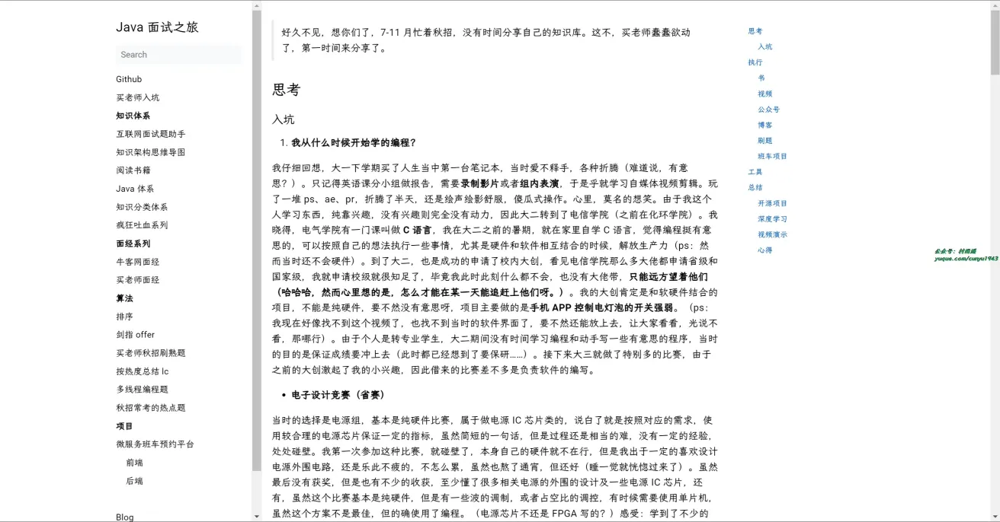

# 好物周刊#55：

> 作者：[村雨遥](https://github.com/cunyu1943)
>
> 不要哀求，学会争取，若是如此，终有所获
>
> 原文：

## 一、项目

## 二、软件

## 三、网站

## 四、插件

## 五、资料

### 1. [Java-Interview-Tutorial](https://github.com/Java-Edge/Java-Interview-Tutorial)

涵盖互联网大厂数据库、缓存、`DDD`、设计模式、微服务架构、主流中间件框架原理及真实业务最佳实践。

### 2. [java-notes](https://github.com/DreamCats/java-notes)

要内容包括个人秋招经历、牛客面经问题按照频率总结、`Java` 一系列知识、数据库、分布式、微服务、前端、技术面试、每日文章等。

## ✍️ 说明

周刊专栏相关信息：

- **项目地址**：[Github](https://github.com/cunyu1943/weekly)，觉得不错麻烦给我一个**Star**，感谢 ❤️
- **浏览地址**：公众号 | [电子书](https://cunyu1943.github.io/weekly) | [语雀](https://yuque.com/cunyu1943/weekly)

如果你阅读到这里，说明我的工作没有白费。如果你想推荐项目/网站/软件/资源，欢迎提交 **[issue](https://github.com/cunyu1943/weekly/issues)** 或者添加我 **个人微信：coder_cunYu** 与我交流。

## ⏳ 联系

想解锁更多知识？不妨关注我的微信公众号：**村雨遥（id：JavaPark）**。

扫一扫，探索另一个全新的世界。

