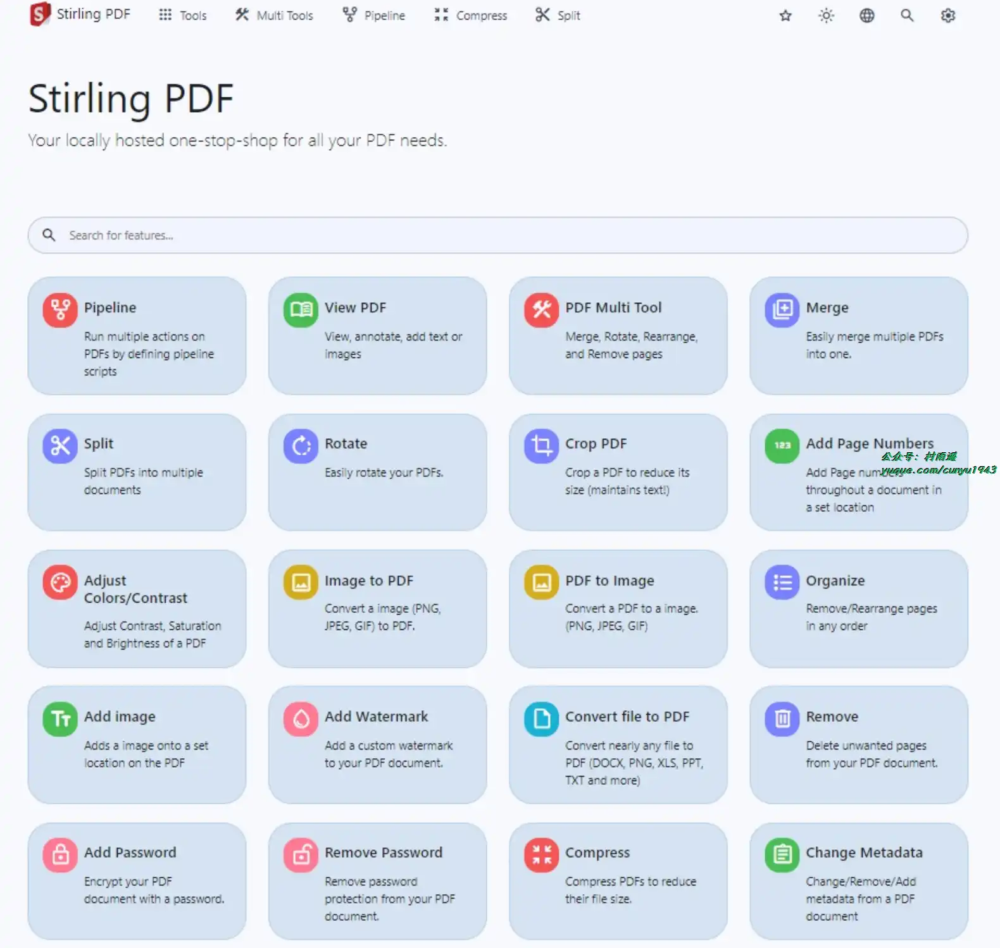
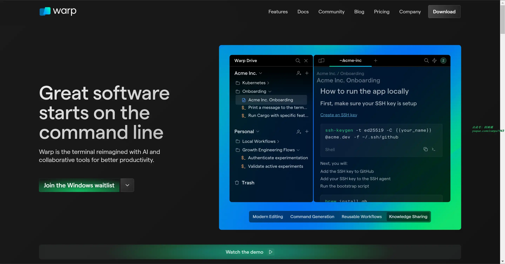
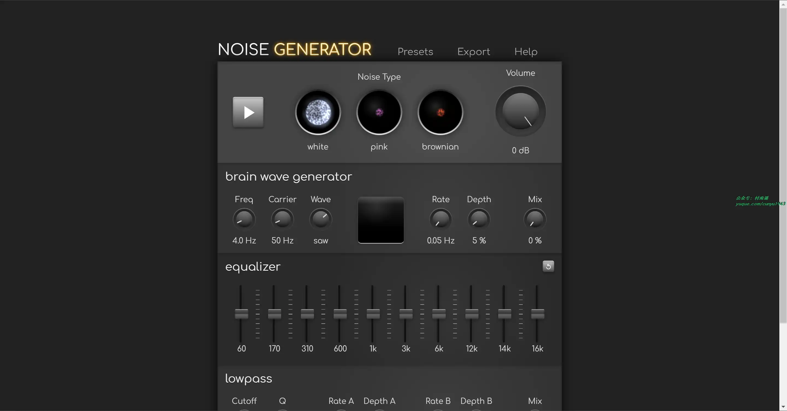

# 好物周刊#58：反向面试

> 作者：[村雨遥](https://github.com/cunyu1943)
> 
> 不要哀求，学会争取，若是如此，终有所获
> 
> 原文：

## 一、项目

### 1. [goploy](https://github.com/zhenorzz/goploy)

流畅 、易用的代码部署工具。支持各种 Web、PHP、Python、Java、Golang 等代码的发布、回滚。完整的安装指引，上手成本低。

### 2. [Stirling-PDF](https://github.com/Stirling-Tools/Stirling-PDF)

一个强大的、本地托管的基于 Web 的 PDF 操作工具。它使您能够对 PDF 文件执行各种操作，包括拆分、合并、转换、重新组织、添加图像、旋转、压缩等。这个本地托管的 Web 应用程序已经发展到包含一套全面的功能，可以满足您的所有 PDF 需求。

### 3. [在线考试系统](https://github.com/YXJ2018/SpringBoot-Vue-OnlineExam)

一个前后端分离，后端使用 SpringBoot，前端使用 VUE 和 Element-UI 组件库配合完成开发的在线考试系统。

## 二、软件

### 1. [RunFlow](https://myrest.top/)

一家专注于开发生产力工具的软件公司出品的类似于 Wox 和 Alfred 的效率工具，使命是帮助大家更轻松高效地完成工作。

### 2. [Warp](https://www.warp.dev/)

一个通过人工智能和协作工具重新设计的终端，能够有效提高生产效率。

### 3. [Zed](https://github.com/zed-industries/zed)

基于 Atom 和 Tree-sitter 开发的高性能多人协同代码编辑器，其口号是“以所想的速度编码”，主打一个快，支持 Windows、macOS、Linux 三端。

## 三、网站

### 1. [健身百科](https://musclewiki.com/)

健身百科拥有一个全面的练习库，其中包括 2000 多种练习的视频和书面说明。通过简单直观的身体结构图，可引导您针对特定肌肉进行锻炼，从而简化您的锻炼过程，并提供适合初学者、中级和高级健身爱好者的锻炼方法。

### 2. [噪音生成器](https://29a.ch/noise-generator/)

一个在线工具，用于生成和塑造噪声。它可用于屏蔽干扰噪音（噪音掩蔽），提高注意力。

### 3. [今日热榜](https://tophub.today/)

今日热榜提供各站热榜聚合：微信、今日头条、百度、知乎、V2EX、微博、贴吧、豆瓣、天涯、虎扑、Github、抖音...追踪全网热点、简单高效阅读。

## 四、插件

### 1. [Chrome 版 Todoist](https://chromewebstore.google.com/detail/jldhpllghnbhlbpcmnajkpdmadaolakh)

浏览器版 Todoist，通过使用它，可以用来：

- 添加网页为任务
- 一天计划
- Chrome 中完成任务

保持桌面端和移动端同步，让你的工作生活井井有条。

### 2. [EnableCopy](https://chromewebstore.google.com/detail/imblndhbdddibjabnddopiehagbkipkj)

一键启用复制，启用右键，启用选择，启用粘贴，破解复制，破解右键，破解选择，破解粘贴，破解禁止复制，破解禁用右键。

- 在禁止复制的网站上，重新启用复制功能。
- 在禁止选择的网站上，重新启用选择功能。
- 在禁止右键的网站上，重新启用右键功能。

### 3. [书签检查器](https://chromewebstore.google.com/detail/eeckiajfclogcacnhgigljkcgabfcmco)

用于检查你的收藏夹中的书签是否已经失效，无需再手动去打开一个个链接是不是可用，提高效率。

## 五、资料

### 1. [前端语音社群](https://github.com/febobo/web-interview)

语音打卡社群 (JS 每日一题) 维护的前端面试题库，包含不限于 Vue 面试题，React 面试题，JS 面试题，HTTP 面试题，工程化面试题，CSS 面试题，算法面试题，大厂面试题，高频面试题。

### 2. [Python 面试题](https://github.com/taizilongxu/interview_python)

Python 相关面试题，主要包括 Python 语言特性、操作系统、数据库、计算机网络、数据结构、常见编程题等多方面内容。

### 3. [反向面试](https://github.com/yifeikong/reverse-interview-zh)

技术面试后，如何应对面试官的“你有什么想问的么？”。从指责、技术、团队、同事、公司、商业等多方面去反向面试你的面试官，让你掌握主动。

## ✍️ 说明

周刊专栏相关信息：

- **项目地址**：[Github](https://github.com/cunyu1943/weekly)，觉得不错麻烦给我一个**Star**，感谢 ❤️
- **浏览地址**：公众号 | [电子书](https://cunyu1943.github.io/weekly) | [语雀](https://yuque.com/cunyu1943/weekly)

如果你阅读到这里，说明我的工作没有白费。如果你想推荐项目/网站/软件/资源，欢迎提交 **[issue](https://github.com/cunyu1943/weekly/issues)** 或者添加我 **个人微信：coder_cunYu** 与我交流。

---

## ⏳ 联系

想解锁更多知识？不妨关注我的微信公众号：**村雨遥（id：JavaPark）**。

扫一扫，探索另一个全新的世界。

