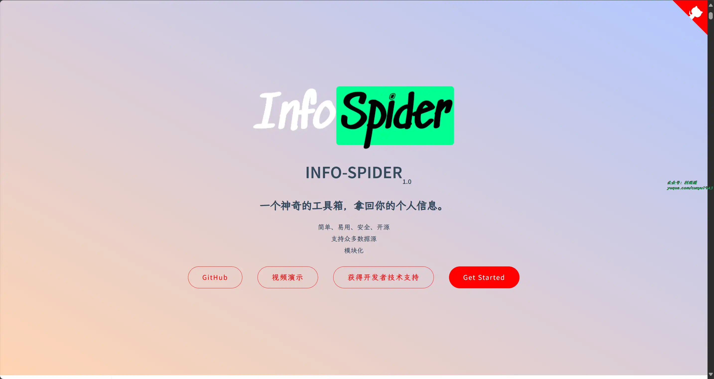
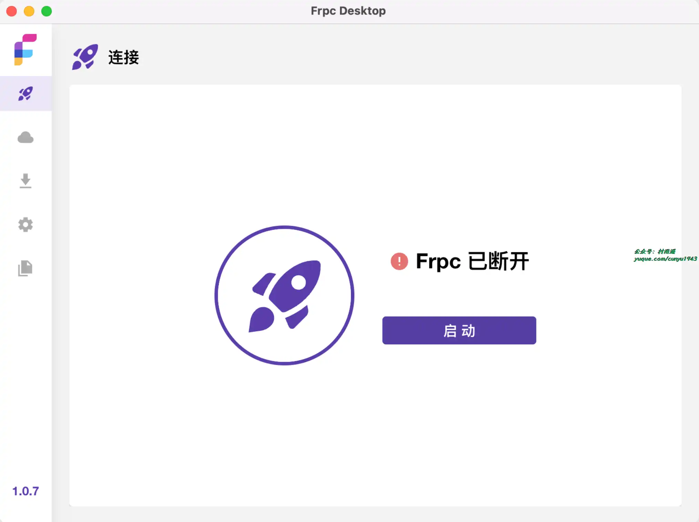
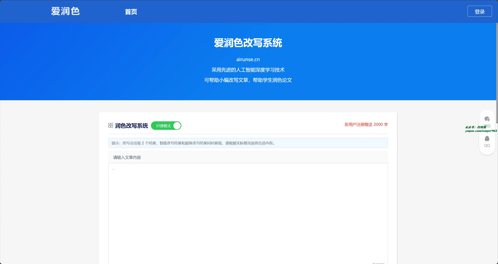
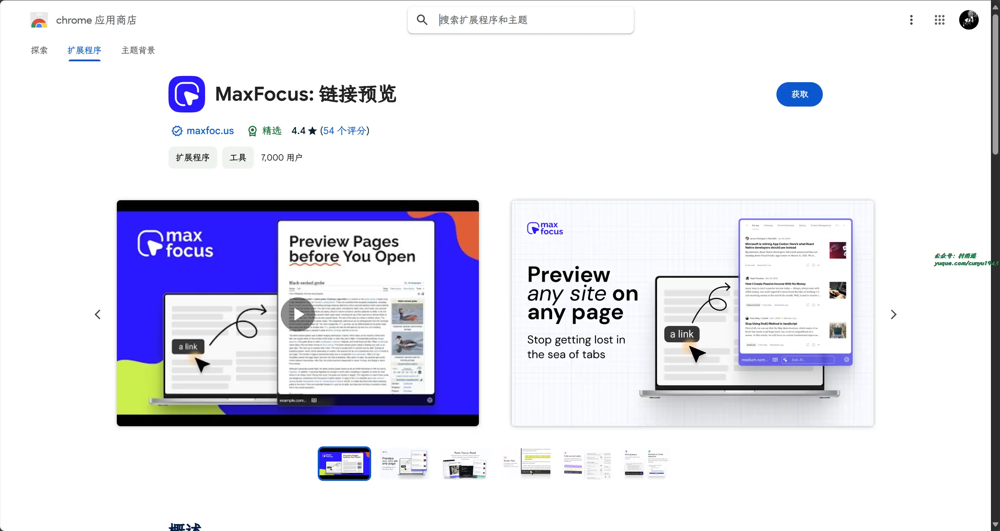
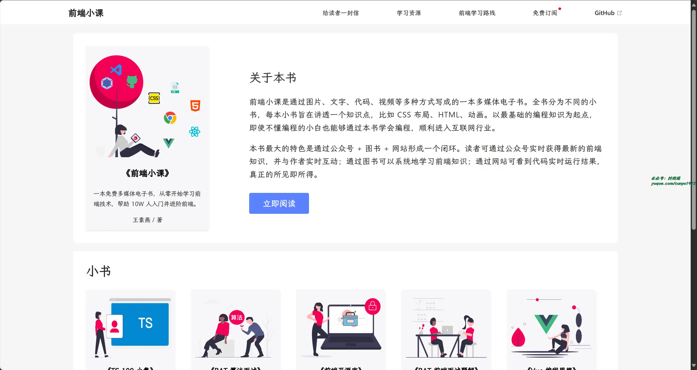

# 好物周刊#70：前端小课

> 作者：[村雨遥](https://github.com/cunyu1943)
> 
> 不要哀求，学会争取，若是如此，终有所获
> 
> 原文：

## 一、项目

### 1. [拾壹博客](https://gitee.com/quequnlong/shiyi-blog)

一款 Vue + SpringBoot 前后端分离的博客系统，博客后台管理系统使用了 Vue+Elmentui 开发，后端使用 Sa-Token 进行权限管理，支持动态菜单权限，动态定时任务，文件支持本地和七牛云上传，使用 ElasticSearch 作为全文检索服务，支持 QQ、微信公众号扫码、码云、GitHub 登录。

### 2. [InfoSpider](https://github.com/kangvcar/InfoSpider)

一个集众多数据源于一身的爬虫工具箱，旨在安全快捷的帮助用户拿回自己的数据，工具代码开源，流程透明。并提供数据分析功能，基于用户数据生成图表文件，使得用户更直观、深入了解自己的信息。 目前支持数据源包括 GitHub、QQ 邮箱、网易邮箱、阿里邮箱、新浪邮箱、Hotmail 邮箱、Outlook 邮箱、京东、淘宝、支付宝、中国移动、中国联通、中国电信、知乎、哔哩哔哩、网易云音乐、QQ 好友、QQ 群、生成朋友圈相册、浏览器浏览历史、12306、博客园、CSDN 博客、开源中国博客、简书。

### 3. [YouDub](https://github.com/liuzhao1225/YouDub)

一个开源工具，旨在自动化地将优质的 YouTube 视频进行翻译和配音，以便将其搬运到中文互联网上。该工具使用了 AI 语音识别技术将音频转换为文本，然后通过大语言模型将文本翻译成中文，最后通过 AI 声音克隆技术将中文转换为音频。这样，我们就可以创建出具有原始 YouTuber 音色的中文配音视频。

## 二、软件

### 1. [Sequel Pro](https://sequelpro.com)

开源 MySQL 数据库管理工具，仅支持 macOS。界面简洁直观，管理高效便捷。

### 2. [Monit](https://github.com/fzf404/Monit)

用于展示各种信息的桌面小组件，支持开机自启、更新检查、主题切换、通知发送、系统调用等功能。

### 3. [Frpc-Desktop](https://github.com/luckjiawei/frpc-desktop)

FRP 跨平台桌面客户端，可视化配置，轻松实现内网穿透！支持所有 frp 版本/开机自启/可视化配置/免费开源。

## 三、网站

### 1. [fly-cut](https://github.com/x007xyz/fly-cut)

基于 Webcodecs + Vue3 实现的 Web 端剪辑工具，类似剪映 Web 版。

### 2. [Logoly.Pro](https://www.logoly.pro)

用于定制拼色 Logo 的在线生成工具。

### 3. [爱润色](https://aiwyc.com/)

采用先进的人工智能深度学习技术，既可帮助小编改写文章，也能帮助学生润色论文。

## 四、插件

### 1. [codebox](https://chromewebstore.google.com/detail/acnnhjllgegbndgknlliobjlekgilbdf)

实现无需登录一键复制代码，支持选中代码，或者代码右上角按钮的一键复制，解除关注博主即可阅读全文提示，去除登录弹窗，去除跳转 APP 弹窗，页面自定义样式。

### 2. [Bardeen](https://chromewebstore.google.com/detail/ihhkmalpkhkoedlmcnilbbhhbhnicjga)

一键自动化你的手动工作！链接超过 30 个 apps，抓取网页信息，提高你的生产力，是最受欢迎的生产力、自动化和网络数据的扩展应用之一。

### 3. [MaxFocus](https://chromewebstore.google.com/detail/bnacincmbaknlbegecpioobkfgejlojp?hl=zh-CN)

在不离开当前标签的情况下预览网站，保持你的浏览专注！仅需将鼠标悬停在链接并等待一会儿，就能进行预览链接的网页内容了。

## 五、资料

### 1. [前端小课](https://github.com/lefex/FE)

前端 100 天，帮助 10W 人入门并进阶前端。通过图片、文字、代码、视频等多种方式写成的一本多媒体电子书。全书分为不同的小书，每本小书旨在讲透一个知识点。比如 CSS 布局、JavaScript 基础、动画。以最基础的编程知识为起点，即使不懂编程的小白也能够通过本书学会编程，顺利进入互联网行业。

### 2. [all of frontend](https://github.com/KieSun/all-of-frontend)

真全栈项目，适合前端进阶及转方向使用。项目包括前端、后端、Web3 最新技术栈，大杂烩，技术一锅端，你想知道的前端内容都在这！

### 3. [Leo-JavaScript](https://github.com/pingan8787/Leo-JavaScript)

仓库包含丰富的前端学习资料，包括 JavaScript、前端框架、HTTP、GraphQL、TS、Vue、React、Webpack 等内容。

## 

## ✍️ 说明

周刊专栏相关信息：

- **项目地址**：[Github](https://github.com/cunyu1943/weekly)，觉得不错麻烦给我一个**Star**，感谢 ❤️
- **浏览地址**：公众号 | [电子书](https://cunyu1943.github.io/weekly) | [语雀](https://yuque.com/cunyu1943/weekly)

如果你阅读到这里，说明我的工作没有白费。如果你想推荐项目/网站/软件/资源，欢迎提交 **[issue](https://github.com/cunyu1943/weekly/issues)** 或者添加我 **个人微信：coder_cunYu** 与我交流。

---

## ⏳ 联系

想解锁更多知识？不妨关注我的微信公众号：**村雨遥（id：JavaPark）**。

扫一扫，探索另一个全新的世界。

