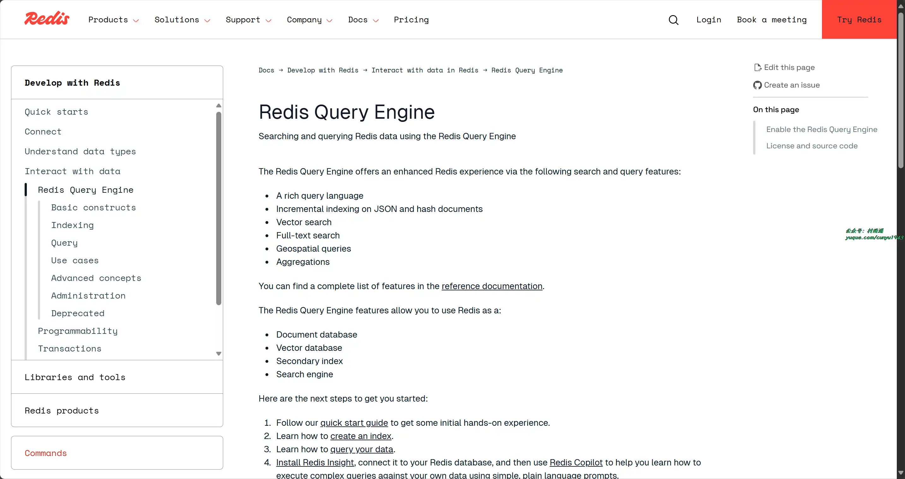
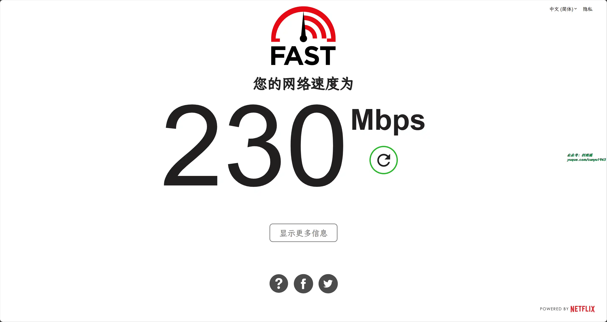
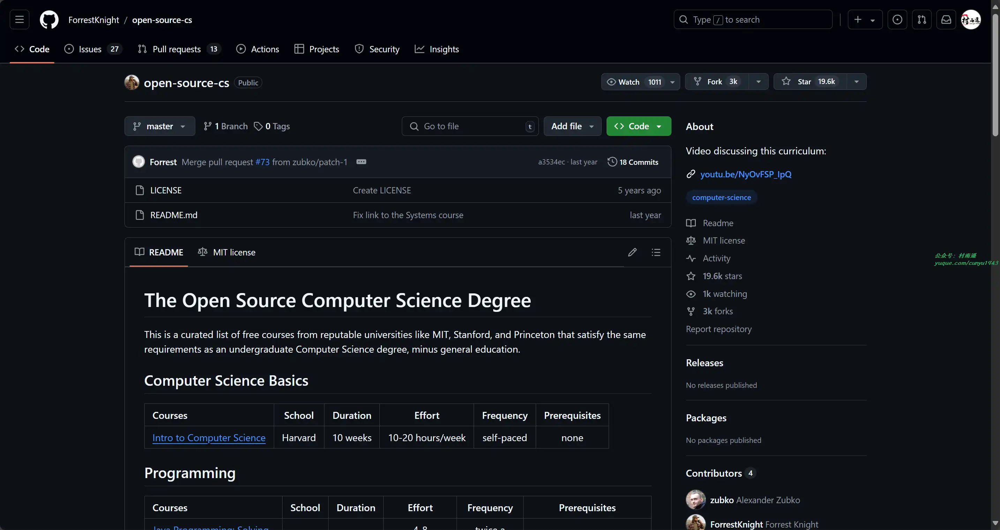

# 好物周刊#77：藏经阁

> 作者：[村雨遥](https://github.com/cunyu1943)
> 
> 不要哀求，学会争取，若是如此，终有所获
> 
> 原文：

## 一、项目

### 1. [Go Ldap Admin](https://github.com/eryajf/go-ldap-admin)

基于 Go + Vue 实现的 openLDAP 后台管理项目，旨在为 openLDAP 服务端提供一个简单易用，清晰美观的现代化管理后台。

### 2. [Solitude](https://github.com/everfu/hexo-theme-solitude)

一款设计师风格的 Hexo 主题，支持懒加载、PWA、Latex 以及多种评论系统。

### 3. [RedisSearch](https://github.com/RediSearch/RediSearch)

Redis 查询和索引引擎，提供二级索引，全文搜索，向量相似度搜索和聚合。

## 二、软件

### 1. [AidLux](https://github.com/aidlearning/AidLearning-FrameWork)

创新性的 Android / 鸿蒙 + Linux 融合架构与 AI 工具链，构建下一代 AIoT 解决方案，服务开发者探索新未来。

### 2. [PeaZip](https://peazip.github.io/)

文件管理器及压缩程序，除了支持自己原生的 PEA 压缩格式外，还有支持其他的主流压缩格式，支持三端使用。

### 3. [Etcher](https://github.com/balena-io/etcher)

一款功能强大的操作系统镜像刻录程序，采用网络技术确保 SD 卡或 USB 设备刻录安全，确保写入数据的正确。

## 三、网站

### 1. [w2solo](https://w2solo.com)

独立开发者社区，连接每一个独立开发者。

### 2. [Internet Speed Test](https://fast.com)

Netflx 出品的在线测速网站，连接网络后，打开此网站即可测试您当前的网速。

### 3. [今日三句半](https://www.threenhalf.com/)

订阅免费邮件，接收每日热点科技新闻总结！

## 四、插件

### 1. [ResumeGPT](https://chromewebstore.google.com/detail/resumegpt/jlbkfkcopgimfccacnelllnkohhpdpgo)

利用人工智能的力量，在 10 分钟内打造完美简历。通过创新的人工智能功能，为每个求职申请量身定制简历，ResumeGPT 将求职提升到一个新的水平，确保您的申请每次都能脱颖而出。

### 2. [Checker Plus for Gmail](https://chromewebstore.google.com/detail/checker-plus-for-gmail/oeopbcgkkoapgobdbedcemjljbihmemj)

无需打开 Gmail 或 Inbox，即可收到桌面邮件通知，方便地查看、收听或删除邮件，并且同时支持多账户。

### 3. [AHA Music](https://chromewebstore.google.com/detail/aha-music-浏览器中的音乐雷达/dpacanjfikmhoddligfbehkpomnbgblf)

浏览器上的下一代歌曲搜索器。它允许你通过检测音频在任何网站上找到音乐，你也可以在流行的社交媒体平台上找到歌曲，或者简单地在浏览器上搜索艺术家和歌曲标题。

## 五、资料

### 1. [The Open Source Computer Science Degree](https://github.com/ForrestKnight/open-source-cs)

仓库列出了对应欧美大学的计算机科学开放课程，只要你把它们学完，就相当于学完了计算机学位的相关课程。

### 2. [开发者藏经阁](https://developer.aliyun.com/ebook)

汇聚阿里巴巴技术实践精华，涵盖云原生、物联网、大数据、AI 等技术领域，深度分享阿里工程师实战经验，顶级技术内容一手掌握。

### 3. [大规模语言模型：从理论到实践](https://intro-llm.github.io)

本书介绍了大语言模型的基础理论包括语言模型、分布式模型训练以及强化学习，并以 Deepspeed-Chat 框架为例介绍实现大语言模型和类 ChatGPT 系统的实践。

## ✍️ 说明

周刊专栏相关信息：

- **项目地址**：[Github](https://github.com/cunyu1943/weekly)，觉得不错麻烦给我一个**Star**，感谢 ❤️
- **浏览地址**：公众号 | [电子书](https://cunyu1943.github.io/weekly) | [语雀](https://yuque.com/cunyu1943/weekly)

如果你阅读到这里，说明我的工作没有白费。如果你想推荐项目/网站/软件/资源，欢迎提交 **[issue](https://github.com/cunyu1943/weekly/issues)** 或者添加我 **个人微信：coder_cunYu** 与我交流。

---

## ⏳ 联系

想解锁更多知识？不妨关注我的微信公众号：**村雨遥（id：JavaPark）**。

扫一扫，探索另一个全新的世界。

