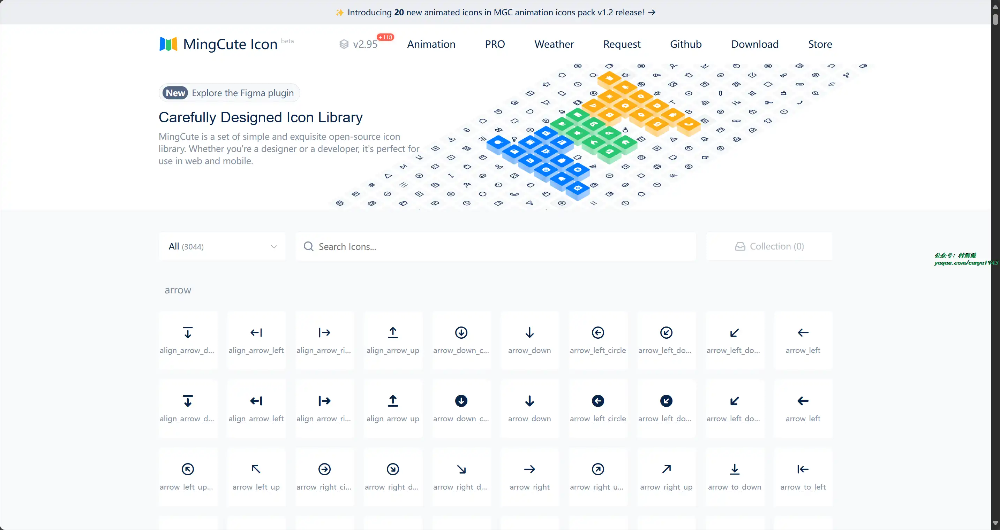
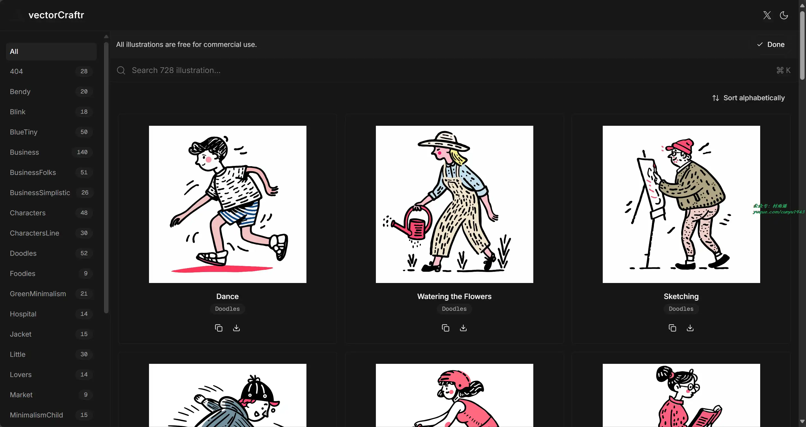
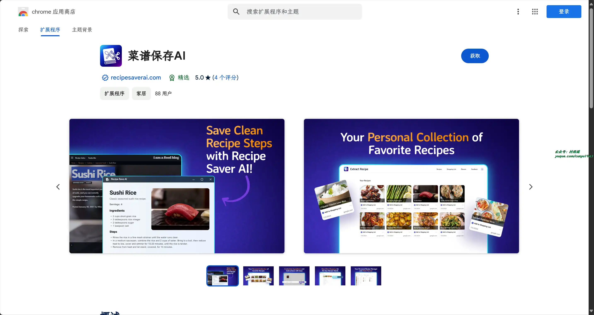
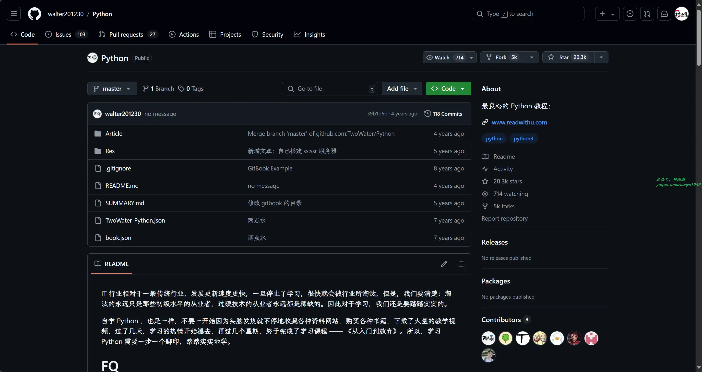
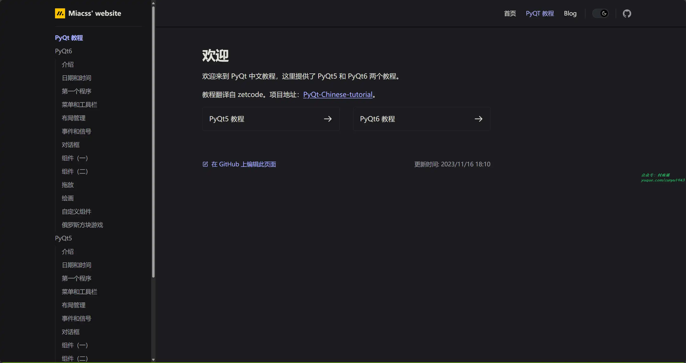

# 好物周刊#：

> 作者：[村雨遥](https://github.com/cunyu1943)
> 
> 不要哀求，学会争取，若是如此，终有所获
> 
> 原文：

## 一、项目

### 1. [Diboot](https://github.com/dibo-software/diboot)

为开发人员打造的低代码开发平台。Mybatis-Plus 关联查询，关联无 SQL，性能高 10 倍，前后端代码本地可视化生成，flowable 工作流，Spring Cloud 微服务等全方位赋能！

### 2. [VirtualWife](https://github.com/yakami129/VirtualWife)

一个虚拟数字人项目，支持 B 站直播，支持 Openai、ollama。具有以下特点：

- 支持一键通过 Docker 快速部署
- 支持在 Linux/Windows/MacOS 系统进行部署
- 支持自定义角色设定
- 支持更换角色模型，可从 VRM 模型市场 Vroid 下载
- 支持长短期记忆功能
- 支持多 LLM 模型切换，并且支持私有化模型（ollama），具体使用说明请查阅 FAQ
- 支持文字驱动表情，文字驱动动作
- 支持 B 站进行直播，具体使用说明请查阅 FAQ
- 支持通过中文进行语音对话
- 支持 Edge（微软）、Bert-VITS2 语音切换
- 流式传输数据，拥有更快的响应速度

### 3. [WeChat Bot](https://github.com/wangrongding/wechat-bot)

一个基于 WeChaty 结合 OpenAi ChatGPT / Kimi / 讯飞等 Ai 服务实现的微信机器人 ，可以用来帮助你自动回复微信消息，或者管理微信群 / 好友，检测僵尸粉等。

## 二、软件

### 1. [跃迁浏览器](https://jumpingbrowser.com/)

专注于效率与美，类似于 Arc 的竖排标签页浏览器。

### 2. [书立](https://slinote.com)

个体知识管理助手，一款本地优先的笔记软件，拥有原子双链和嵌套表格，编辑畅快且性能卓越。

### 3. [开拍](https://www.kaipai.com/)

美图公司在 2023 年推出的一款用 AI 制作口播视频的生产力工具，通过 AI 帮你写，AI 帮你拍，AI 帮你剪，帮助用户更加简单高效地制作营销带货、知识干货、新闻资讯等口播视频，让自媒体创作者起号更简单！

## 三、网站

### 1. [MingCute Icon](https://www.mingcute.com/)

一套简洁精致的开源图标库，无论您是设计师还是开发人员，它都非常适合在网页和移动设备中使用。

### 2. [Applore](https://app.uiboy.com/)

一个发现、探索和分析各种类别和颜色的应用程序图标的平台。浏览、搜索并深入了解应用程序图标设计。

### 3. [Vectorcraftr](https://vectorcraftr.com)

一个免费可商用的插画库，风格多样，可以根据自己的需要取用。

## 四、插件

### 1. [ARIA DevTools](https://chromewebstore.google.com/detail/aria-devtools/dneemiigcbbgbdjlcdjjnianlikimpck)

支持将网站转换为屏幕阅读器模式，方便开发者检查其可访问性元素。

### 2. [VertiTab](https://chromewebstore.google.com/detail/vertitab-侧边栏垂直标签页/chejfhdknideagdnddjpgamkchefjhoi)

在侧面板管理浏览器标签页，具有可配置、美化和许多其他功能，如：

- 标签管理
- 定制化界面布局
- 个性化选项
- 搜索
- 画中画模式
- 播放进度条
- 快照
- 阅读进度条
- 导入/导出
- ……

### 3. [菜谱保存](https://chromewebstore.google.com/detail/菜谱保存ai/niagagbececbghcccjndaimpjecckdif)

轻松保存任何网页上的食谱，只需一击就能保存任何网站的食谱，并只查看最重要的部分。

## 五、资料

### 1. [Python](https://github.com/walter201230/Python)

自称最良心的 Python 教程。

### 2. [NLP-Beginner](https://github.com/FudanNLP/nlp-beginner)

自然语言处理入门练习，分为 5 个主要任务。

- 基于机器学习的文本分类
- 基于深度学习的文本分类
- 基于注意力机制的文本匹配
- 基于 LSTM+CRF 的序列标注
- 基于神经网络的语言模型

### 3. [PyQt 中文教程](https://github.com/maicss/PyQt-Chinese-tutorial)

PyQt 中文教程，提供了 PyQt5 和 PyQt6 两个教程，翻译自 zetcode。

## ✍️ 说明

周刊专栏相关信息：

- **项目地址**：[Github](https://github.com/cunyu1943/weekly)，觉得不错麻烦给我一个**Star**，感谢 ❤️
- **浏览地址**：公众号 | [电子书](https://cunyu1943.github.io/weekly) | [语雀](https://yuque.com/cunyu1943/weekly)

如果你阅读到这里，说明我的工作没有白费。如果你想推荐项目/网站/软件/资源，欢迎提交 **[issue](https://github.com/cunyu1943/weekly/issues)** 或者添加我 **个人微信：coder_cunYu** 与我交流。

---

## ⏳ 联系

想解锁更多知识？不妨关注我的微信公众号：**村雨遥（id：JavaPark）**。

扫一扫，探索另一个全新的世界。

