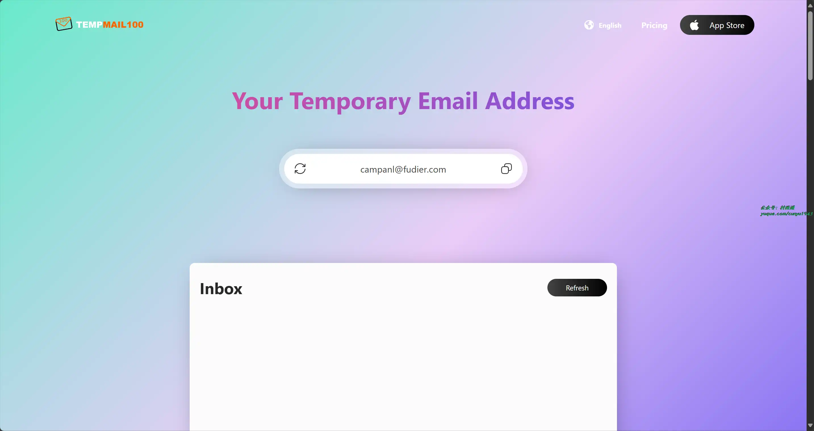

# 好物周刊#90：浏览器书签整理

> 作者：[村雨遥](https://github.com/cunyu1943)
> 
> 不要哀求，学会争取，若是如此，终有所获
> 
> 原文：https://mp.weixin.qq.com/s/qTeoAnqay1i8Fz1tdkKFmg

## 🎈 号外 

最近，公众号之外，建立了微信交流群，不定期会在群里分享各种资源（影视、IT 编程、考试提升……）&知识。如果有需要，可以**扫码或者后台添加小编微信备注入群**。进群后**优先看群公告**，**呼叫群中【资源分享小助手】**，还能免费帮找资源哦～

 

## 一、项目

### 1. [花折](https://github.com/CassInfra/KubeDoor)

一个使用 Python + Vue 开发，基于 K8S 准入控制机制的微服务资源管控平台。专注微服务每日高峰时段的资源视角，实现了微服务的资源分析统计与强管控，确保微服务资源的资源申请率和真实使用率一致。

### 2. [WX-DUMP-4J](https://github.com/xuchengsheng/wx-dump-4j)

一款基于 Java 开发的微信数据分析工具。它准确显示好友数、群聊数和当日消息总量，提供过去 15 天每日消息统计，了解社交活跃度。识别展示最近一个月内互动频繁的前 10 位联系人。支持导出聊天记录、联系人、群聊信息，及查看超过三天限制的朋友圈历史记录和找回微信好友。

### 3. [冰淇淋内容管理系统](https://github.com/Thecosy/IceCMS)

实现 MacWK 资源站，社区图片视频圈子 CMS，支持网页端移动端小程序。适合用于搭建资讯商城，社区论坛，聊天交友社区，博客，圈子，论坛，图片，视频，社交网站等。

## 二、软件

### 1. [MarkEdit](https://github.com/MarkEdit-app/MarkEdit)

一款支持 macOS 的免费开源的 Markdown 编辑器，软件体积小，功能简单不复杂。

### 2. [File Pilot](https://filepilot.tech/)

第三方 Windows 文件管理器，号称能够取代官方，功能更加强大。

### 3. [FreeReNamer](https://github.com/cyhuajuan/FreeReNamer)

功能强大又易用的文件批量重命名软件，支持在线和本地客户端使用。

## 三、网站

### 1. [快点软件镜像站](https://mirrors.quickso.cn/)

由欢哥科技建立，提供提供开源软件国内镜像信息服务。

### 2. [QuickCDN](https://cdn.quickso.cn/)

稳定、快速、免费的前端开源项目 CDN 加速服务，截止目前已收录了 4265 个前端开源项目。

### 3. [TempMail100](https://tempmail100.com/)

无需注册即可获得临时邮箱地址！享受安全、匿名的通信，同时保护您的隐私并轻松消除垃圾邮件。

## 四、插件

### 1. [懒猫书签清理](https://chromewebstore.google.com/detail/懒猫书签清理/aeehapalakdoclgmfeondmephgiandef)

一键清理失效链接和空文件夹，让您的书签井井有条。支持 Chrome 和 Edge 浏览器，提供智能分析、隐私保护等功能。

### 2. [MarkMagic](https://chromewebstore.google.com/detail/markmagic-智能书签管理器/efpddbdnjokoakknlfljkcndcaonilpg)

浏览器的智能书签管理解决方案。享受无缝链接检查、内容合规性保障和智能排序。而且目前也在不断增加新功能，如重复链接检测和 AI 内容分析。

### 3. [Markoob](https://chromewebstore.google.com/detail/markoob-书签启动器/lnhnllkaacmnkffnjgcnokifakeckido)

一款书签启动器/新标签页，根据您的使用习惯推荐书签并支持完善的书签管理功能，为您的上网体验带来便利和高效。

## 五、资料

### 1. [Docker 入门教程](https://github.com/jaywcjlove/docker-tutorial)

Docker 入门学习笔记，涵盖了新旧版本安装、命令介绍、服务 & 镜像 & 容器管理、文件拷贝、私仓搭建等相关内容。

### 2. [新概念学习笔记](https://github.com/andylee1890/NewConceptEnglish)

记录了作者从第 2 册开始学习新概念英语的学习笔记，记录整理后进行分享，方便大家一起学习。

### 3. [JavaHome](https://github.com/whx123/JavaHome)

一份超级详细的 Java 面试题【大厂面试真题 + Java 学习指南 + 工作总结】。

## ✍️ 说明

周刊专栏相关信息：

- **项目地址**：[Github](https://github.com/cunyu1943/weekly)，觉得不错麻烦给我一个**Star**，感谢 ❤️
- **浏览地址**：公众号 | [电子书](https://cunyu1943.github.io/weekly) | [语雀](https://yuque.com/cunyu1943/weekly)

如果你阅读到这里，说明我的工作没有白费。如果你想推荐项目/网站/软件/资源，欢迎提交 **[issue](https://github.com/cunyu1943/weekly/issues)** 或者添加我 **个人微信：coder_cunYu** 与我交流。

---

## ⏳ 联系

想解锁更多知识？不妨关注我的微信公众号：**村雨遥（id：JavaPark）**。

扫一扫，探索另一个全新的世界。

