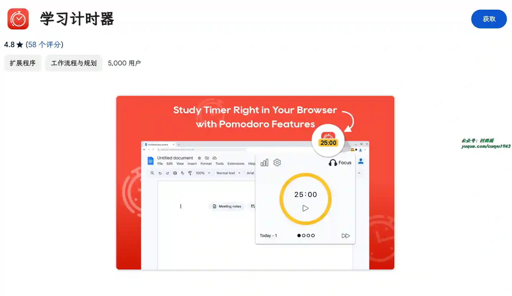

# 好物周刊#93：打打工，摸摸鱼

> 作者：[村雨遥](https://github.com/cunyu1943)
> 
> 不要哀求，学会争取，若是如此，终有所获
> 
> 原文：https://mp.weixin.qq.com/s/AU4ZsG1Lhr77sBz7qJz8UQ

## 🎈 号外 

最近，公众号之外，建立了微信交流群，不定期会在群里分享各种资源（影视、IT 编程、考试提升……）&知识。如果有需要，可以**扫码或者后台添加小编微信备注入群**。进群后**优先看群公告**，**呼叫群中【资源分享小助手】**，还能免费帮找资源哦～

 

## 一、项目

### 1. [Curve](https://github.com/imsyy/vitepress-theme-curve)

一个基于 VitePress 从零开发类似于 Heo 的博客主题。

### 2. [OCRmyPDF](https://github.com/ocrmypdf/OCRmyPDF)

支持 ocr 识别 PDF 文件内容，并允许复制粘贴和搜索识别出的结果信息。

### 3. [AI as Workspace](https://github.com/NitroRCr/AIaW)

精心设计的 AI (LLM) 客户端。 全功能，轻量级；支持多工作区、插件系统、跨平台、本地优先 + 实时云同步、Artifacts。

## 二、软件

### 1. [标记狮](https://www.marklion.cn)

支持私有云部署的 UI 设计一站式协作平台，支持生成 Figma、Sketch、Adobe xd 自动标注切图,支持源文件版本管理，支持免费多端多设备实时预览设计稿，标记狮一键私有云部署在企业自有局域网或公有云服务器，让 UI 设计与开发更轻松高效地协作。

### 2. [圆周旅迹](https://www.pitravel.cn/)

一款专注于智能旅行规划的应用程序，旨在帮助用户高效完成行程规划、记录旅行足迹，并通过多种创新功能提升旅行体验。

### 3. [Ghost Downloader](https://github.com/XiaoYouChR/Ghost-Downloader-3)

AI 赋能的新一代跨平台多线程下载器，特点是能像 IDM 一样智能分块但又不需要合并文件，以及 AI 智能加速。

## 三、网站

### 1. [羽燕招标](https://yuyan888.cn/)

提供全面的招标信息、中标公告、采购信息。每日更新超 2 万条标讯，涵盖全国各地区、各行业的招投标项目。

### 2. [松果 AI 写作](https://songguoai.com/)

专为写作设计的智能工具，帮助用户快速生成高质量的文本内容。无论是文章、报告还是创意文案，都能提供个性化的写作辅助，提升写作效率。

### 3. [摸摸鱼热榜](https://momoyu.cc/)

提供了各大热门网站的聚合信息、热榜、榜单，包括了知乎、微博、虎扑、V2EX、贴吧、抖音、今日头条等等，一分钟轻松了解全网最新资讯。

## 四、插件

### 1. [Chrome Capture](https://chromewebstore.google.com/detail/chrome-capture-屏幕截图和gif/ggaabchcecdbomdcnbahdfddfikjmphe)

使用 Chrome Capture 捕捉、编辑和分享视觉内容，一款帮助您提高效率和有效进行视觉沟通的 Chrome 扩展。

### 2. [Mailtrack 和邮件合并](https://chromewebstore.google.com/detail/gmail-的-mailtrack-和邮件合并/ndnaehgpjlnokgebbaldlmgkapkpjkkb?hl=zh-CN)

一款 Gmail 和 Inbox 电子邮件跟踪扩展程序，可是让你了解你发送的电子邮件是否为已读或未读。拥有超过 200 万活跃用户，免费且无限制。

### 3. [学习计时器](https://chromewebstore.google.com/detail/学习计时器/ihdnneiaaelmjhaajpajjkedfimcmpgj)

通过番茄工作法和任务计时器提升时间专注，实现最高生产力，旨在将您的学习和工作日常转变为高效和专注力的动力源。

## 五、资料

### 1. [One Small Step](https://github.com/karminski/one-small-step)

一个简单的技术科普教程项目，主要聚焦于解释一些有趣的，前沿的技术概念和原理，每篇文章都力求在 5 分钟内阅读完成。

### 2. [数据结构与算法译文集](https://github.com/apachecn/apachecn-algo-zh)

ApacheCN 数据结构与算法译文集，主要包括数据结构思维中文版、LeetCode C++/Java/JavaScript/Python、剑指 Offer Java 题解。

### 3. [前端九部入门者手册](https://www.yuque.com/fe9/basic)

前端入门者手册，主要包括前端入门、开发工具、前端构建、代码规范、代码调试、React 技术栈、Vue 技术栈、Augular、TypeScript 等方面的内容。

## ✍️ 说明

周刊专栏相关信息：

- **项目地址**：[Github](https://github.com/cunyu1943/weekly)，觉得不错麻烦给我一个**Star**，感谢 ❤️
- **浏览地址**：公众号 | [电子书](https://cunyu1943.github.io/weekly) | [语雀](https://yuque.com/cunyu1943/weekly)

如果你阅读到这里，说明我的工作没有白费。如果你想推荐项目/网站/软件/资源，欢迎提交 **[issue](https://github.com/cunyu1943/weekly/issues)** 或者添加我 **个人微信：coder_cunYu** 与我交流。

---

## ⏳ 联系

想解锁更多知识？不妨关注我的微信公众号：**村雨遥（id：JavaPark）**。

扫一扫，探索另一个全新的世界。

