# 好物周刊#94：硬核指南

> 作者：[村雨遥](https://github.com/cunyu1943)
> 
> 不要哀求，学会争取，若是如此，终有所获
> 
> 原文：https://mp.weixin.qq.com/s/ldXaorc5ptcAtCKaZcHMVQ

## 🎈 号外 

最近，公众号之外，建立了微信交流群，不定期会在群里分享各种资源（影视、IT 编程、考试提升……）&知识。如果有需要，可以**扫码或者后台添加小编微信备注入群**。进群后**优先看群公告**，**呼叫群中【资源分享小助手】**，还能免费帮找资源哦～

 

## 一、项目

### 1. [ChatWiki](https://github.com/zhimaAi/chatwiki)

一款开源的知识库 AI 问答系统。系统基于大语言模型（LLM ）和检索增强生成（RAG）技术构建，提供开箱即用的数据处理、模型调用等能力，可以帮助企业快速搭建自己的知识库 AI 问答系统。

### 2. [LiberSonora](https://github.com/LiberSonora/LiberSonora)

一个 AI 赋能的、强大的、开源有声书工具集，包含智能字幕提取、AI 标题生成、多语言翻译等功能，支持 GPU 加速、批量离线处理。

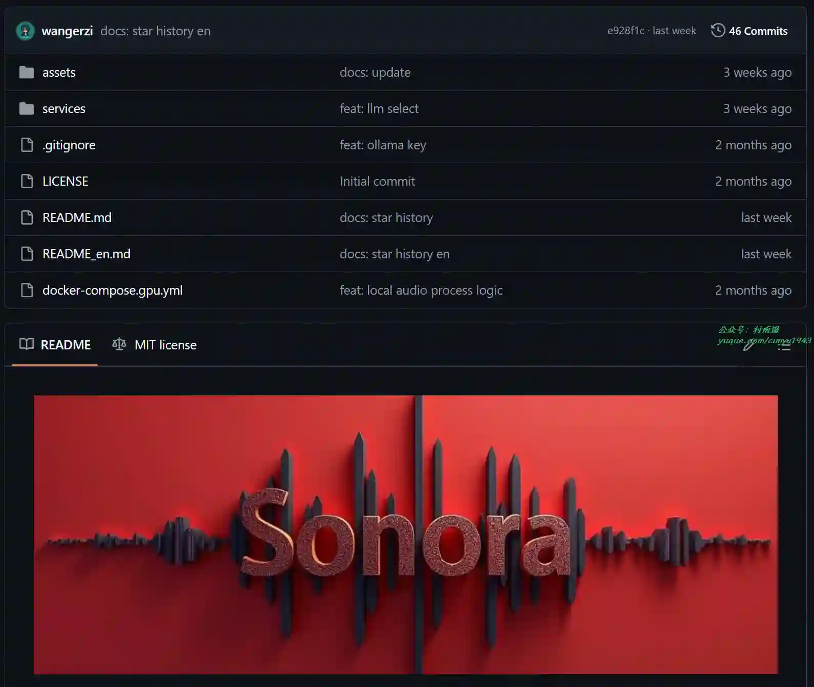

### 3. [Tale Book](https://github.com/talebook/talebook)

一个简洁但强大的私人书籍管理系统。它基于 calibre 项目构建，具备书籍管理、在线阅读与推送、用户管理、SSO 登录、从百度 / 豆瓣拉取书籍信息等功能。

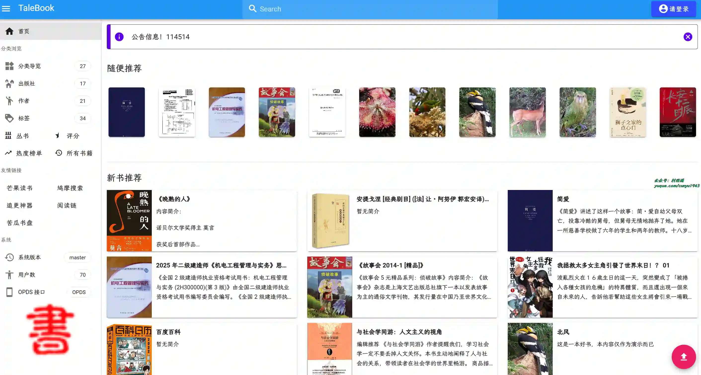

## 二、软件

### 1. [video-subtitle-master](https://github.com/buxuku/video-subtitle-master)

批量为视频或者音频生成字幕，并可批量将字幕翻译成其它语言。跨平台支持 macOS 和 Windows 系统，支持百度，火山，deeplx, openai, deepseek, ollama 等多个翻译服务。

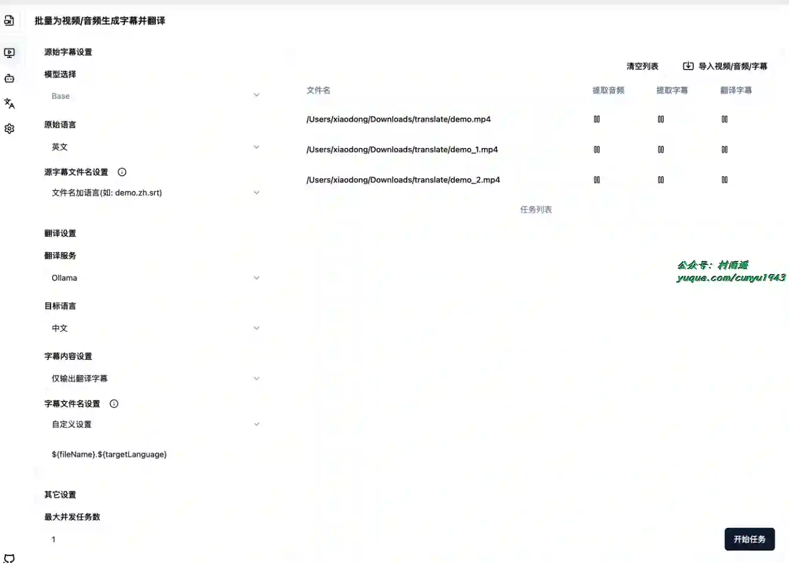

### 2. [MediaGo](https://github.com/caorushizi/mediago)

跨平台视频提取工具，支持流媒体下载、视频下载、m3u8 下载及 B 站视频下载，支持 Windows 和 macOS 双平台。

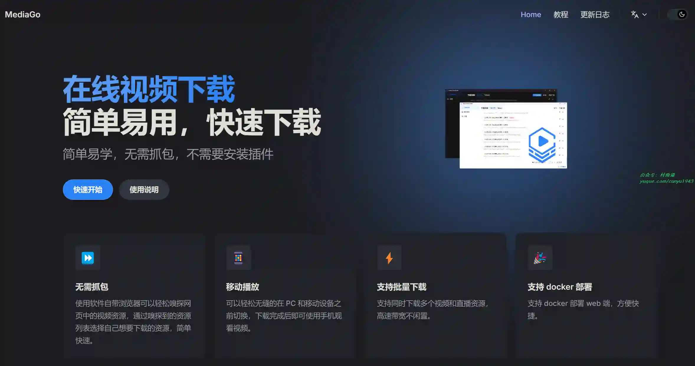

### 3. [Alook 浏览器](https://www.alookweb.com/)

支持视频 8 倍速，极简且强大的移动手机浏览器，目前支持 iOS 和安卓平台。

## 三、网站

### 1. [硬核指南](https://yinghezhinan.com/)

专注收录免费且优质的影音娱乐网站，精选全网高清电影、二次元、音乐、游戏、壁纸、电子书的免费网站和 APP，让你的娱乐生活「硬核」起来！硬核指南，够高清才是真硬核！

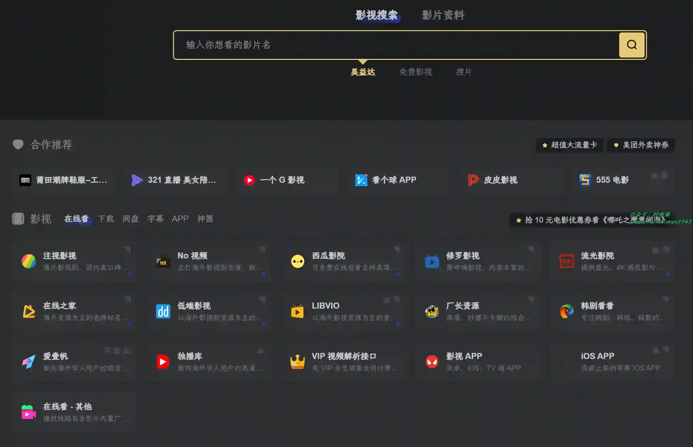

### 2. [家庭药房](https://apothecary.tips/zh)

探索传统中医疗法和天然健康解决方案。根据食谱即可在家轻松制作养生饮品，提升睡眠质量、血压、心脏健康和血糖管理。

### 3. [TopTimeline](https://toptimeline.net/zh)

发现世界最著名的流行歌手、运动员和历史人物的关键事件和个人里程碑。揭示塑造他们传奇的重要成就。

## 四、插件

### 1. [QuestionAI](https://chromewebstore.google.com/detail/questionai/hajphibbdloomfdkeoejchiikjggnaif?hl=zh-CN)

由 GPT 驱动，支持截图查询并协助写作、总结、翻译和语法检查，回答复杂问题并处理任何任务。

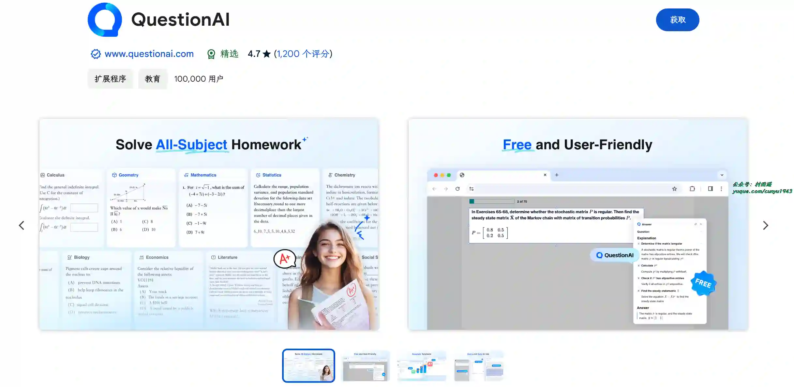

### 2. [XTranslate](https://chromewebstore.google.com/detail/xtranslate/gfgpkepllngchpmcippidfhmbhlljhoo)

轻松翻译网页上的文本，支持 100 多种语言。支持如下功能：

-   翻译 PDF 文件中的文本
-   听取所有支持的翻译供应商的文本到语音
-   调整翻译文本弹出窗口的独特设计
-   在设置中自定义获取翻译的方式和其他选项
-   在应用程序窗口中输入任何文本（默认为 Alt + X 热键）并获得带字典支持的句子或单词的翻译
-   将你喜欢的翻译作为快速书签保存到历史记录中
-   查看和编辑翻译历史

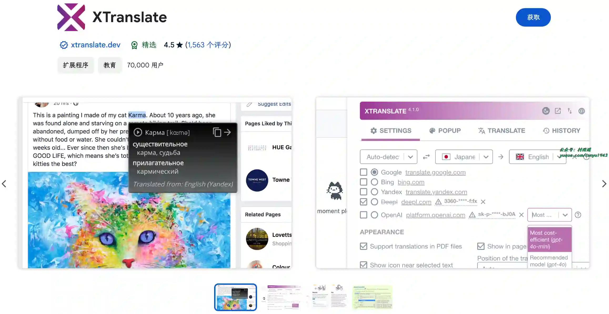

### 3. [Jump Cutter](https://chromewebstore.google.com/detail/jump-cutter/lmppdpldfpfdlipofacekcfleacbbncp)

通过缩短句子之间的停顿时间，加快语速，从而提高观看讲座的速度。

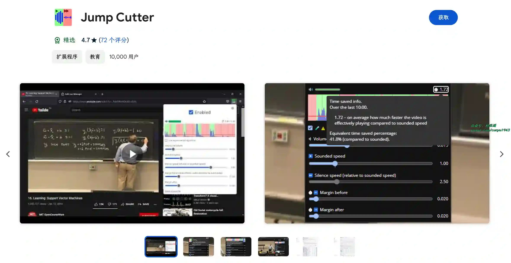

## 五、资料

### 1. [开源的中文量化百科](https://github.com/LLMQuant/quant-wiki)

仓库致力于打造一个免费开放、持续更新的 量化金融（quantitative finance） 知识分享平台。在这里，可以学习量化交易的核心知识、常用模型、算法设计，以及交易中的实战策略。同时也准备了丰富的资料，包括因子模型、事件驱动策略、执行成本优化等内容，帮助快速掌握量化投资领域的核心技能，迈向专业化道路。

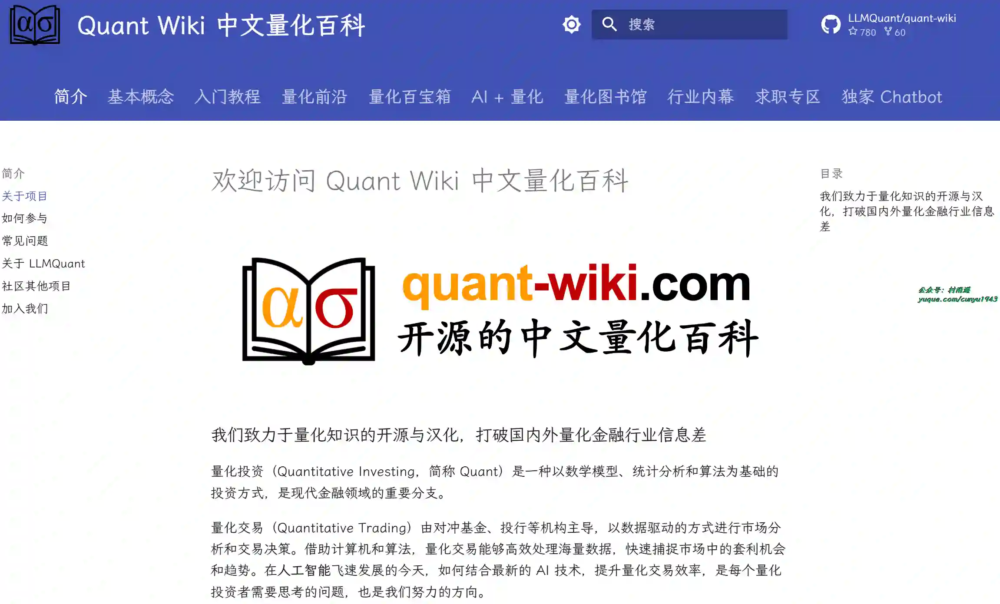

### 2. [王慧文的清华产品课笔记](https://nanqiang.feishu.cn/wiki/wikcncDyFTq1agB5UaEZnUGZD4g)

《王慧文清华产品课》的整理笔记笔记，保函战略、运营经营、需求、供需关系等多个方面的内容。

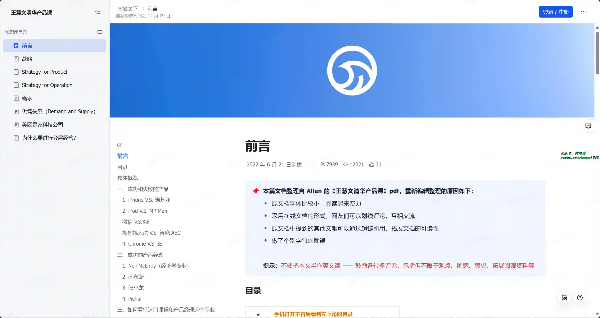

### 3. [Cursor 教程](https://www.lookai.top/cn/cursor/instruction/instruction)

从零开始学习 Cursor AI 编辑器，主要分为引言、基础教程、进阶教程、高阶教程、使用技巧等方面内容。

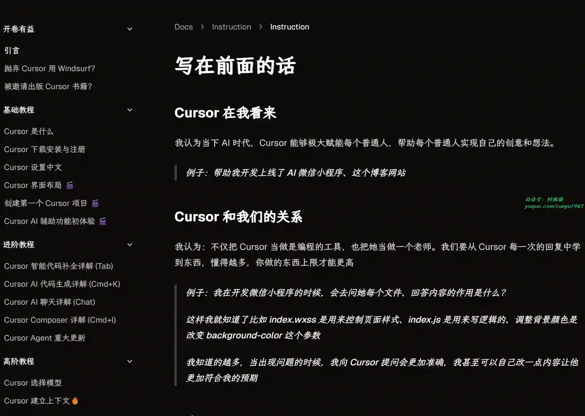

## ✍️ 说明

周刊专栏相关信息：

- **项目地址**：[Github](https://github.com/cunyu1943/weekly)，觉得不错麻烦给我一个**Star**，感谢 ❤️
- **浏览地址**：公众号 | [电子书](https://cunyu1943.github.io/weekly) | [语雀](https://yuque.com/cunyu1943/weekly)

如果你阅读到这里，说明我的工作没有白费。如果你想推荐项目/网站/软件/资源，欢迎提交 **[issue](https://github.com/cunyu1943/weekly/issues)** 或者添加我 **个人微信：coder_cunYu** 与我交流。

---

## ⏳ 联系

想解锁更多知识？不妨关注我的微信公众号：**村雨遥（id：JavaPark）**。

扫一扫，探索另一个全新的世界。

