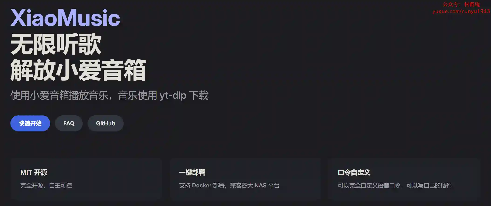
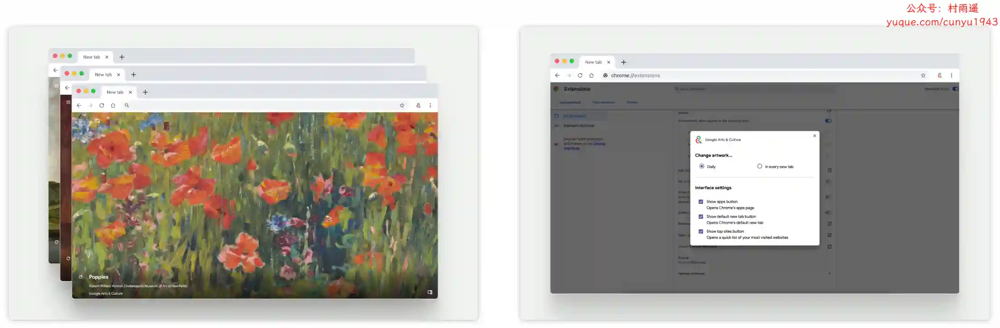
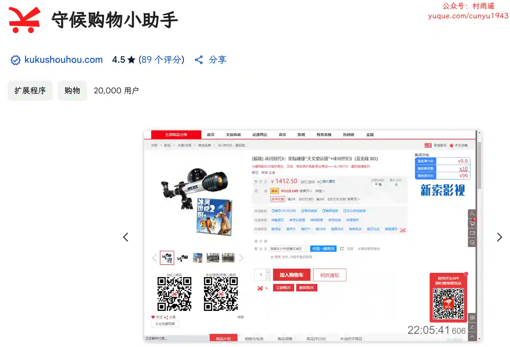
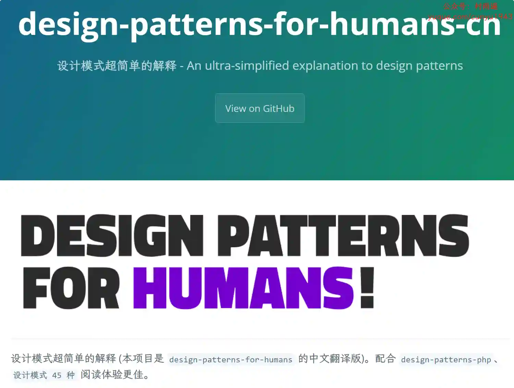
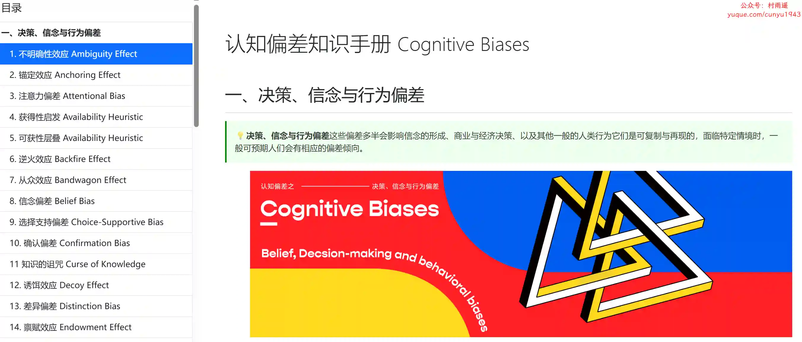

# 好物周刊#95：数字名片

> 作者：[村雨遥](https://github.com/cunyu1943)
> 
> 不要哀求，学会争取，若是如此，终有所获
> 
> 原文：https://mp.weixin.qq.com/s/gk_FkPGB2h1Qp8c0AB-Kcw

## 一、项目

### 1. [Azure TTS Importer](https://github.com/yy4382/tts-importer)

轻松将 Azure TTS 语音合成服务导入阅读软件。现支持阅读（legado）、爱阅记、服务器端阅读 (hectorqin/reader)、爱阅书香、源阅读、源阅。

### 2. [XiaoMusic](https://github.com/hanxi/xiaomusic)

解放小爱音箱，使用小爱音箱无限播放音乐，音乐使用 yt-dlp 下载。

### 3. [Valaxy](https://github.com/YunYouJun/valaxy)

下一代静态博客框架，支持页面/配置热重载。

## 二、软件

### 1. [讯飞绘镜](https://typemovie.art)

一款 AI 视频创作平台。输入创意，即可生成脚本和分镜图片，并将静态分镜化为动态视频。支持快速生成图片与视频，帮助创作者高效捕捉灵感，轻松实现创意表达。

### 2. [雀乐](https://www.indie.cn)

由一群喜欢并热爱独立音乐的人共同创建的，致力于传播来自世界各地的独立音乐。秉着音乐里独立自主的精神表达内核，希望把雀乐建设成为泛华语地区最好的独立音乐传播平台。

### 3. [ima](https://ima.qq.com)

一款以知识库为核心的智能工作台产品，已接入腾讯混元大模型和 DeepSeek R1 模型满血版。它是集搜、读、写一体的效率工具，旨在帮助有较强知识获取、信息处理、内容输出需求的用户，提升学习、办公效率。

## 三、网站

### 1. [MuseLink](https://muselink.cc/)

一个专为创作者打造的数字名片生成工具，一分钟即可制作一张极简潮酷的数字名片。一个链接，即可分享你所有的社交主页。

### 2. [链接树](https://linktree.cn/)

快速搭建一个创作者数字名片，通过一个链接，分享所有社交主页，并还拥有强大的数据分析功能，统计粉丝的行为导向，为数字营销助力。

### 3. [Link3](https://www.link3.cc)

仅需一个链接，就可以聚合、分享你的所有信息。一次注册，终身受益。

## 四、插件

### 1. [DeepSeek AI](https://chromewebstore.google.com/detail/deepseek-ai/npphdmcakmfhllhblkealgkeefamebih)

使用深度搜索 AI 助手，您可以轻松尝试深度搜索模型，以快速获取有关新中文 AI 的答案和创意。

### 2. [Google 艺术与文化](https://chromewebstore.google.com/detail/google-艺术与文化/akimgimeeoiognljlfchpbkpfbmeapkh)

在浏览器标签页中欣赏谷歌艺术与文化项目中“艺术”下的佳作。

### 3. [守候购物小助手](https://chromewebstore.google.com/detail/守候购物小助手/eafefjbddnbamfophdiiiemfkfocaahm)

插件提供了多项实用功能，包括快速搜索，快速跳转，快速复制、查库存，查地区价，查多种渠道价，查隐藏券、查隐藏促销、查生产日期、网页时钟、购买分析、价格走势、列表筛选、购物车增强、返利功能以及辅助评价等，支持京东、淘宝、天猫、苏宁、国美等购物平台。

## 五、资料

### 1. [design-patterns-for-humans-cn](https://github.com/guanguans/design-patterns-for-humans-cn)

design-patterns-for-humans 的中文翻译版，设计模式超简单的解释，搭配设计模式 45 种 design-patterns-php 和使用起来效果更好哦。

### 2. [eat_pytorch_in_20_days](https://github.com/lyhue1991/eat_pytorch_in_20_days)

一本对用户极其友善的 Pytorch 入门工具书，主要是在参考 Pytorch 官方文档和函数 doc 文档基础上整理写成的。面向的读者需要有一定的机器学习和深度学习基础，使用过 Keras 或 TensorFlow 或 Pytorch 搭建训练过简单的模型。

### 3. [认知偏差知识手册](https://imzl.com/cognitive-bias)

由字节跳动飞书设计团队推出，总结人在思考和决策时容易犯的 67 种行为偏差和示例解析，运用好这些知识，让你设计的产品在用户在使用时更好的决策。

## ✍️ 说明

周刊专栏相关信息：

- **项目地址**：[Github](https://github.com/cunyu1943/weekly)，觉得不错麻烦给我一个**Star**，感谢 ❤️
- **浏览地址**：公众号 | [电子书](https://cunyu1943.github.io/weekly) | [语雀](https://yuque.com/cunyu1943/weekly)

如果你阅读到这里，说明我的工作没有白费。如果你想推荐项目/网站/软件/资源，欢迎提交 **[issue](https://github.com/cunyu1943/weekly/issues)** 或者添加我 **个人微信：coder_cunYu** 与我交流。

---

## ⏳ 联系

想解锁更多知识？不妨关注我的微信公众号：**村雨遥（id：JavaPark）**。

扫一扫，探索另一个全新的世界。

