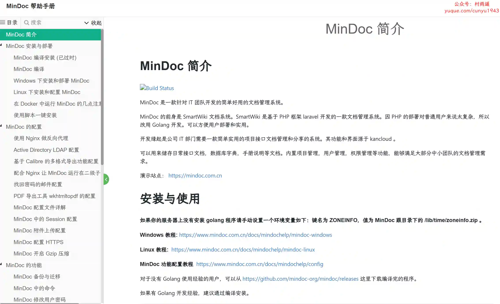
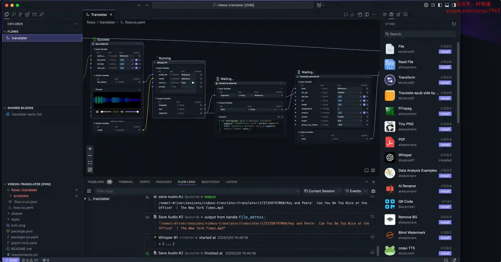
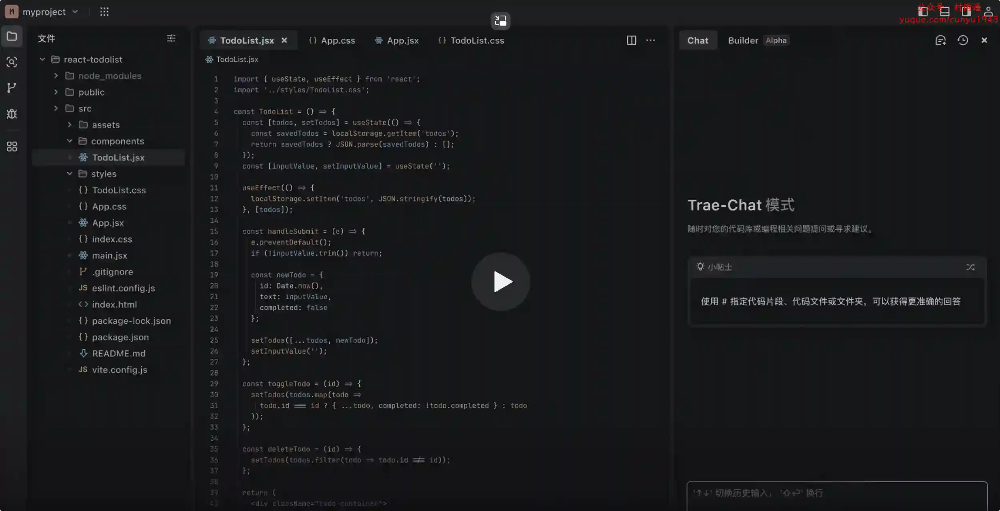
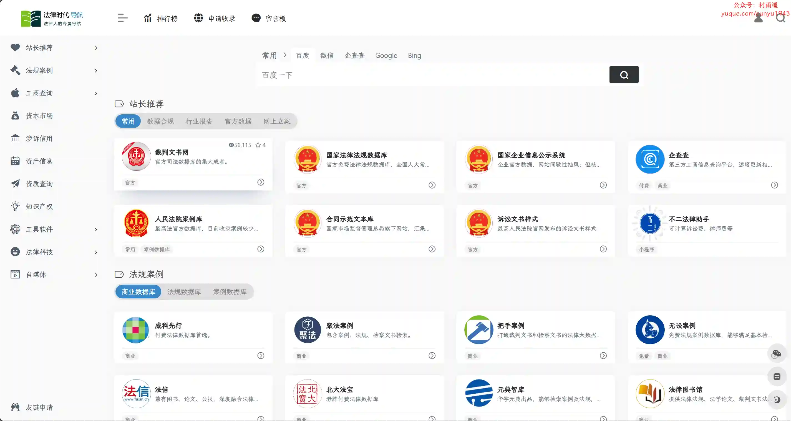
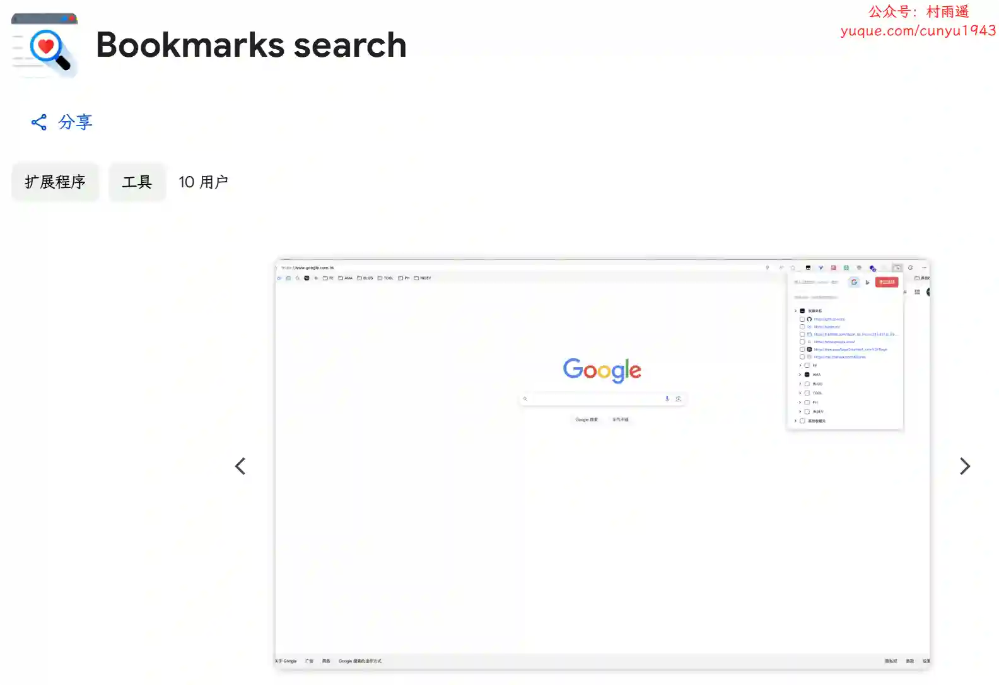
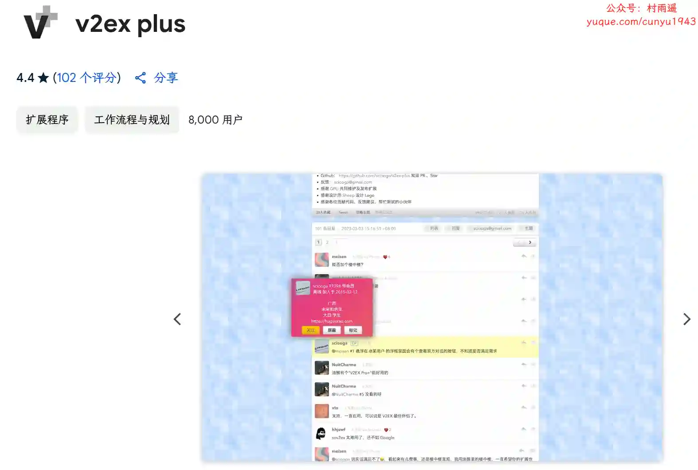
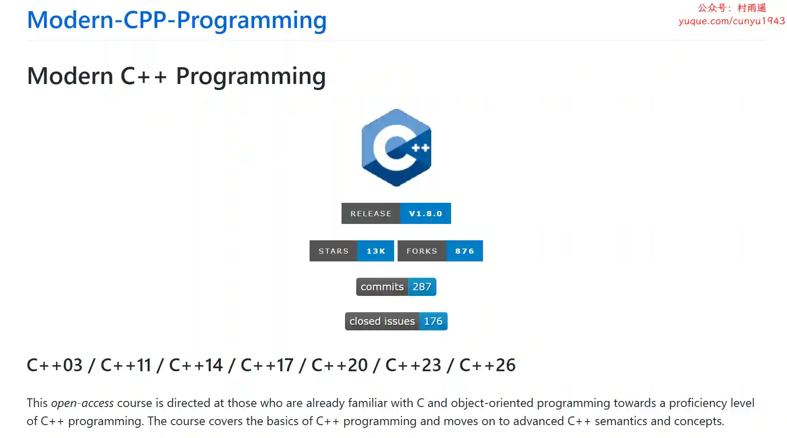
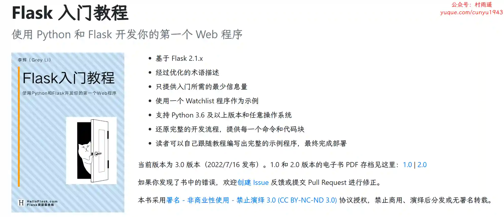
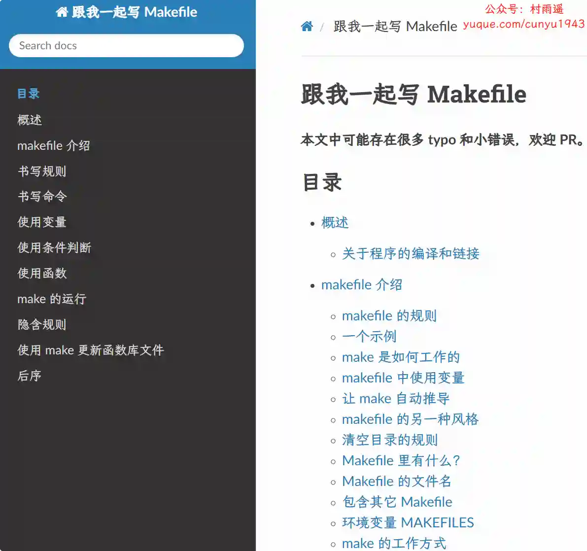

# 好物周刊#96：AI IDE

> 作者：[村雨遥](https://github.com/cunyu1943)
> 
> 不要哀求，学会争取，若是如此，终有所获
> 
> 原文：https://mp.weixin.qq.com/s/-phlN9Cx2kytrWxFBxOT0w

## 号外

最近，公众号之外，建立了微信交流群，不定期会在群里分享各种资源（影视、IT 编程、考试提升……）&知识。如果有需要，可以**扫码或者后台添加小编微信备注入群**。进群后**优先看群公告**，**呼叫群中【资源分享小助手】**，还能免费帮找资源哦～

 

## 一、项目

### 1. [MinDoc](https://github.com/mindoc-org/mindoc)

一款针对 IT 团队开发的简单好用的文档管理系统，前身是 SmartWiki 文档系统。SmartWiki 是基于 PHP 框架 laravel 开发的一款文档管理系统。因 PHP 的部署对普通用户来说太复杂，所以改用 Golang 开发，方便用户部署和实用。

### 2. [CloudMark](https://github.com/wesleyel/cloudmark)

你的通用书签管理器，一键保存和整理书签，随时随地访问，支持如下特性：

-   一键收藏
-   智能分类
-   随处访问
-   分享协作

### 3. [小雅全家桶部署](https://github.com/monlor/docker-xiaoya)

使用 Docker Compose 一键部署服务，兼容群晖，Linux，Windows，Mac，包含所有 X86 和 Arm 架构。部署 alist + 下载元数据 + 部署 emby 服务全流程自动，无需人工干预。

## 二、软件

### 1. [悟墨](https://oomol.com/zh-CN/)

通过直观的视觉交互轻松连接代码片段和 API 服务，帮助用户缩短从想法到产品的距离。

### 2. [X Studio](https://xstudio.music.163.com/)

网易和微软小冰联合出品的语音合成软件，为热爱音乐的你带来时刻在线的 AI 歌手伙伴。

### 3. [Trae](https://www.trae.com.cn)

国内首个 AI IDE，深度理解中文开发场景。AI 高度集成于 IDE 环境之中，为你带来比 AI 插件更加流畅、准确、优质的开发体验。

## 三、网站

### 1. [法律时代导航](https://yesen.cn/)

法律人的专属导航，一站式法律导航。

### 2. [唐韵诗词](https://www.chinesepoems.org/)

探索中国古典诗词之美，提供诗词，古书等内容的赏析、注释、翻译，在线学习中国传统诗词文化。

### 3. [答案之书](https://answerbook.org)

在这里，你可以找到生活中的答案。每一个答案都来自于宇宙的回响，为你指引方向。同时，AI 助手会帮助你解读这个答案，为你提供更深层的思考和建议。

## 四、插件

### 1. [酸柠檬新标签页](https://chromewebstore.google.com/detail/酸柠檬新标签页/ooghegmmicmicongpdbojbjmcpmghkjb?hl=zh-CN)

极简纯粹、云同步、可自定义的新标签页。为您带来简约的视觉体验，告别臃肿、繁琐的页面设计。支持自定义网站、自定义搜索引擎、页面个性化定制...更可通过云同步在所有浏览器、所有设备间畅快使用！

### 2. [Bookmarks search](https://chromewebstore.google.com/detail/bookmarks-search/pobcmdgggpihlbihebdeofjhkgmebndb?authuser=0&hl=zh-CN)

一个帮助你在浏览器收藏夹中快速搜索的浏览器插件。通过关键词，你可以在指定的网站范围内快速找到所查询的关键词。 

### 3. [v2ex plus](https://chromewebstore.google.com/detail/v2ex-plus/daeclijmnojoemooblcbfeeceopnkolo)

优雅便捷的 V2EX 扩展，支持如下功能：

-   通知功能：更新提醒、未读消息
-   登录态判断：未登录 icon 提醒
-   半小时自动签到
-   主题列表预览及忽略功能
-   新窗口浏览主题
-   ……

## 五、资料

### 1. [现代 C++ 编程](https://github.com/federico-busato/Modern-CPP-Programming)

开源 C++ 教程，课程针对那些已经熟悉 C 和面向对象编程的人，从而快速熟练掌握 C++ 编程。内容涵盖了 C++ 编程的基础知识，以及 C++ 高级语义和概念。

### 2. [Flask 入门教程](https://github.com/helloflask/flask-tutorial)

使用 Python 和 Flask 开发你的第一个 Web 程序，本书基于 Flask 2.1.x，支持 Python 3.6 及以上版本和全平台。

### 3. [跟我一起写 Makefile](https://seisman.github.io/how-to-write-makefile/)

陈皓发表在 CSDN 上的系列文章，翻译自《GNU Make Manual》 ，广受读者推荐。

## ✍️ 说明

周刊专栏相关信息：

- **项目地址**：[Github](https://github.com/cunyu1943/weekly)，觉得不错麻烦给我一个**Star**，感谢 ❤️
- **浏览地址**：公众号 | [电子书](https://cunyu1943.github.io/weekly) | [语雀](https://yuque.com/cunyu1943/weekly)

如果你阅读到这里，说明我的工作没有白费。如果你想推荐项目/网站/软件/资源，欢迎提交 **[issue](https://github.com/cunyu1943/weekly/issues)** 或者添加我 **个人微信：coder_cunYu** 与我交流。

---

## ⏳ 联系

想解锁更多知识？不妨关注我的微信公众号：**村雨遥（id：JavaPark）**。

扫一扫，探索另一个全新的世界。

