# 好物周刊#99：字体搬运工

> 作者：[村雨遥](https://github.com/cunyu1943)
> 
> 不要哀求，学会争取，若是如此，终有所获
> 
> 原文：https://mp.weixin.qq.com/s/kReIWacz-m6UWsGB_9cH_w

## 🎈 号外 

最近，公众号之外，建立了微信交流群，不定期会在群里分享各种资源（影视、IT 编程、考试提升……）&知识。如果有需要，可以**扫码或者后台添加小编微信备注入群**。进群后**优先看群公告**，**呼叫群中【资源分享小助手】**，还能免费帮找资源哦～

 

## 一、项目

### 1. [智能闲鱼客服机器人系统](https://github.com/shaxiu/XianyuAutoAgent)

专为闲鱼平台打造的 AI 值守解决方案，实现闲鱼平台 7×24 小时自动化值守，支持多专家协同决策、智能议价和上下文感知对话。

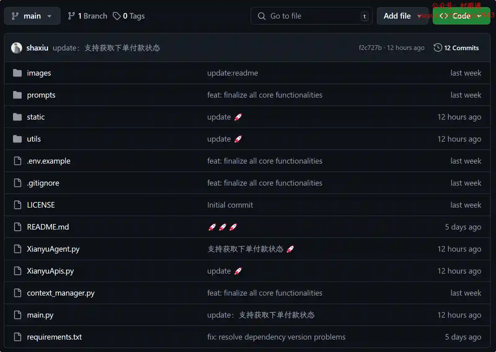

### 2. [vhAstro-Theme](https://github.com/uxiaohan/vhAstro-Theme)

一款基于 Astro 构建的优雅的响应式博客主题。

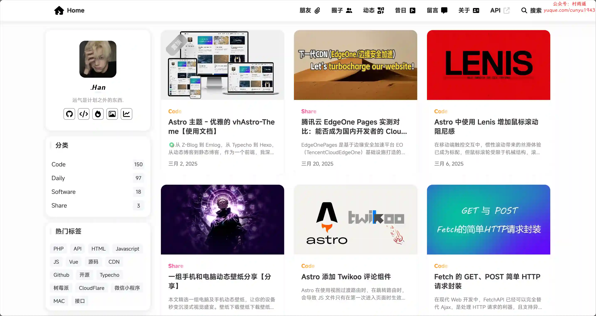

### 3. [WechatRealFriends](https://github.com/StrayMeteor3337/WechatRealFriends)

微信好友关系一键检测，基于微信 ipad 协议，看看有没有朋友偷偷删掉或者拉黑你。快速检测你的微信有没有单向好友，并自动将其添加到标签中 (之后可在电脑端一键清除这些人), 理论上可以支持检测上万的好友。

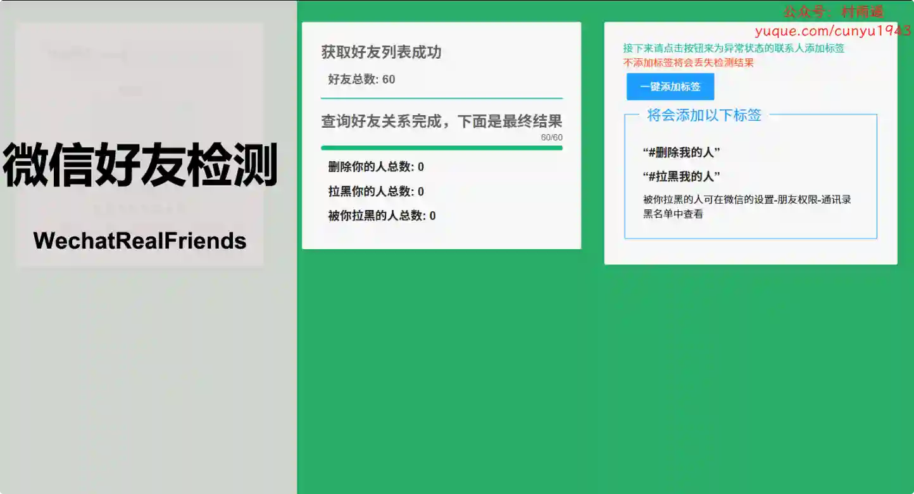

## 二、软件

### 1. [OfficeAI 助手](https://office-ai.cn/)

一款免费的智能 AI 办公工具软件，专为 Microsoft Office 和 WPS 用户打造。无论你是在寻找如何输入“打勾（√）符号”的方法，还是想知道“怎么在插入表格前添加文字”，或者“该用哪个公式”，它都能为你提供快速、准确的解决方案。通过简单的指令，ExcelAI 插件可以帮你自动完成复杂的公式计算、函数选择。WordAI 插件还具备整理周报、撰写会议纪要、总结内容、以及文案润色的强大功能。

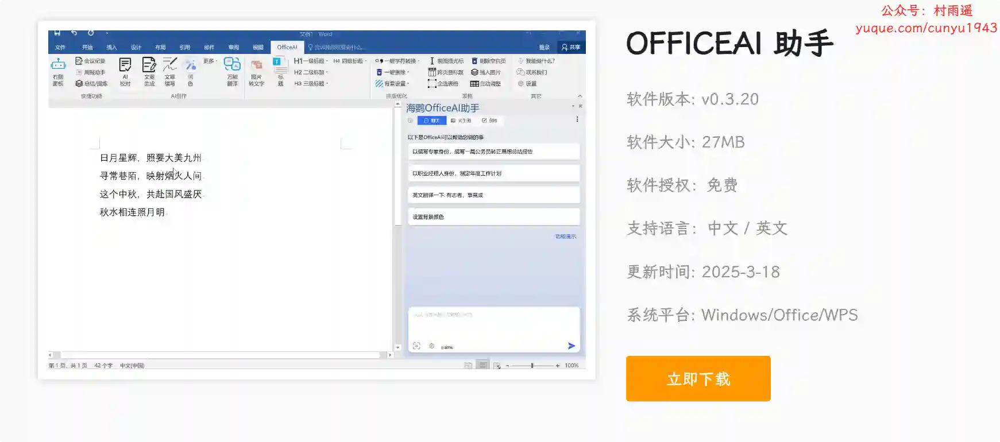

### 2. [TextSeek](https://www.textseek.net)

快速查找文件和文档内容的工具软件，Windows 和 macOS 系统均可使用。支持 PDF、Word、Excel、Powerpoint、WPS、OFD 等多种文档格式的搜索。

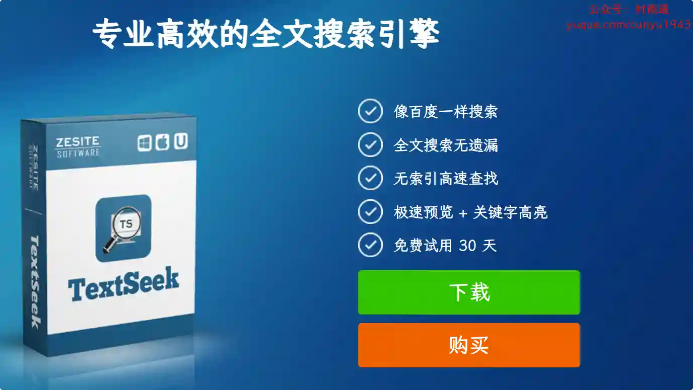

### 3. [Readest](https://github.com/readest/readest)

一款开源电子书阅读器，专为沉浸式和深度阅读体验而设计。基于 Foliate 重写构建，利用 Next. js 15 和 Tauri v2 进行开发，支持在 macOS、Windows、Linux、Android、iOS 和 Web 上提供流畅的跨平台体验。

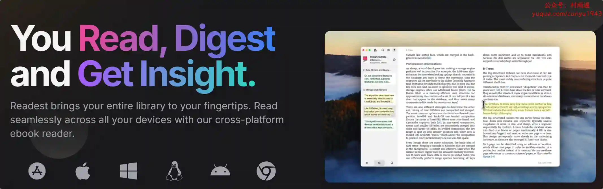

## 三、网站

### 1. [Ai Headshot Generator](https://ai-headshot-generator.net/)

免费创建惊艳的 AI 头像，尝试 AI 专业头像生成器，轻松获得工作室级别的效果！

### 2. [字体搬运工](https://font.sucai999.com)

一个免费公益性的字体网站，致力于收录可商用的免费字体。无需登录注册，随时随地都可以自由下载。

### 3. [发表情](https://fabiaoqing.com/)

最新最全的无水印表情包分享与制作平台，有海量热门表情、聊天表情、微信表情包、QQ表情包、金馆长表情包、蘑菇头表情包等各类表情。

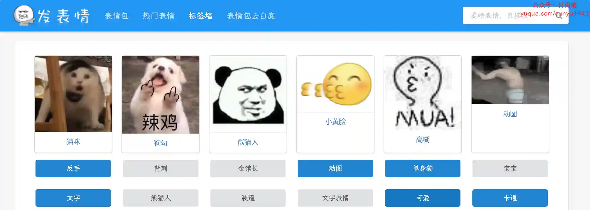

## 四、插件

### 1. [复制链接](https://chromewebstore.google.com/detail/复制链接/mjpbijfgaajfmabmfnabchojdlpfnbbi)

从上下文菜单中复制带有文本的链接和页面 URL。

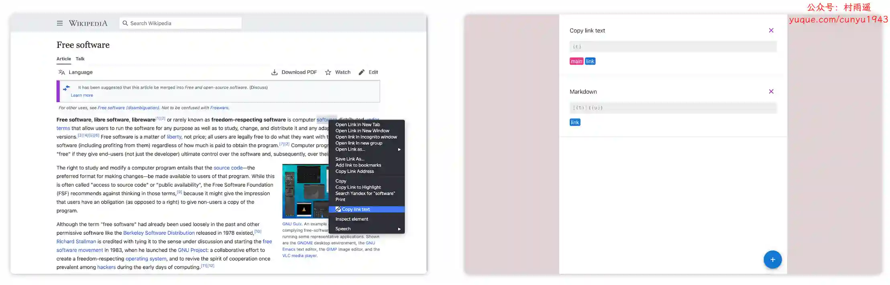

### 2. [复制历史](https://chromewebstore.google.com/detail/复制历史-+-最佳剪贴板历史工具/kjlbbjicboihbikbjbbmkimccoeccoon)

剪贴板历史，管理复制历史。特点是免费，简单，支持自动保存，存储，收集复制的文本。提高生产力，节省我们的时间。

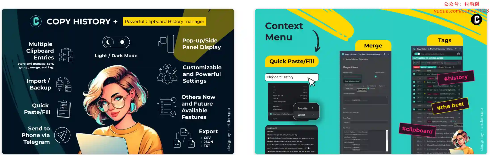

### 3. [从视频中复制文本](https://chromewebstore.google.com/detail/从视频中复制文本/djbbokpfbbipcdnodgadkidppckgajgp?hl=zh-CN)

用于从视频、图像和现场会议中复制文字的终极 OCR 工具，在几秒钟内复制讲座中的笔记、教程中的代码、社交媒体视频中的链接，甚至手写文本，支持超 100 种语言。

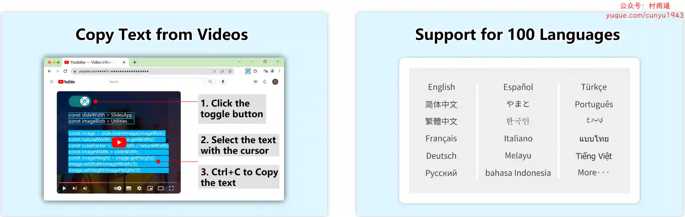

## 五、资料

### 1. [spring-boot-quick](https://github.com/vector4wang/spring-boot-quick)

基于 springboot 的快速学习示例，整合作者遇到的开源框架，如：rabbitmq (延迟队列)、Kafka、jpa、redies、oauth2、swagger、jsp、docker、k3s、k3d、k8s、mybatis 加解密插件、异常处理、日志输出、多模块开发、多环境打包、缓存 cache、爬虫、jwt、GraphQL、dubbo、zookeeper 和 Async 等等。

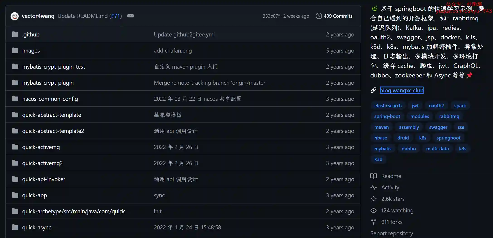

### 2. [博客 365](https://zgcrsd6xvj.feishu.cn/docx/IoOZdVNHXohjohxDiAkccq6Vnie)

探讨 2024 年众多播客节目的丰富内容，涵盖商业、文化、生活、科技等多个领域 。关键要点包括：

-   商业领域：主播探究竞业协议由来与边界；提及美图 2016 年港股上市；蜜雪冰城和古茗递表港交所。
-   文化领域：嘉宾探讨《桃花源记》《逍遥游》独特见解；28 家出版社编辑推荐 2024 新书；主播分享汉字演变知识。
-   生活领域：心理学家聊青少年厌学与心理健康；主播分享 Vision Pro 购买经历；介绍各地马拉松参赛体验。
-   **科技领域**：主播畅聊数十款 AI 工具；指出 AI 大模型在闭环场景应用快，To B 产品有优势 。

### 3. [前端面试宝典](https://github.com/rileycai/FontEndInterview)

2020 届硕士的秋招前端面试实战经验，是项目作者本人在 2019 年春招实习和秋招求职过程中积累的面试经验和复习材料。包括春招 / 秋招面试情况、前端最常见的面试题目、优秀的面试博客汇总以及一些优质的文章分享。

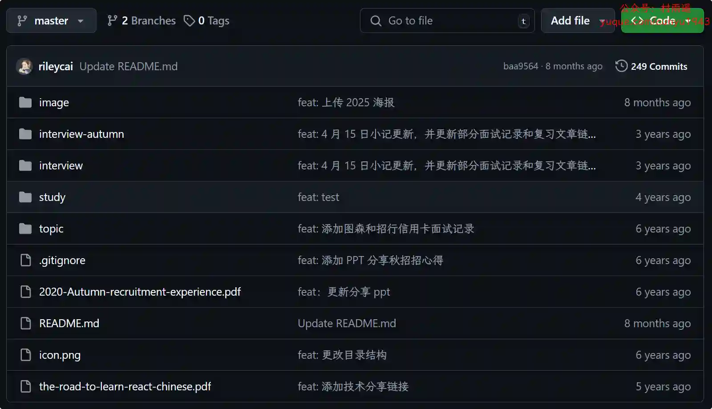

## ✍️ 说明

周刊专栏相关信息：

- **项目地址**：[Github](https://github.com/cunyu1943/weekly)，觉得不错麻烦给我一个**Star**，感谢 ❤️
- **浏览地址**：公众号 | [电子书](https://cunyu1943.github.io/weekly) | [语雀](https://yuque.com/cunyu1943/weekly)

如果你阅读到这里，说明我的工作没有白费。如果你想推荐项目/网站/软件/资源，欢迎提交 **[issue](https://github.com/cunyu1943/weekly/issues)** 或者添加我 **个人微信：coder_cunYu** 与我交流。

---

## ⏳ 联系

想解锁更多知识？不妨关注我的微信公众号：**村雨遥（id：JavaPark）**。

扫一扫，探索另一个全新的世界。

