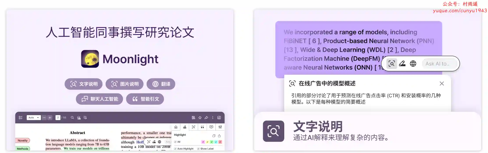
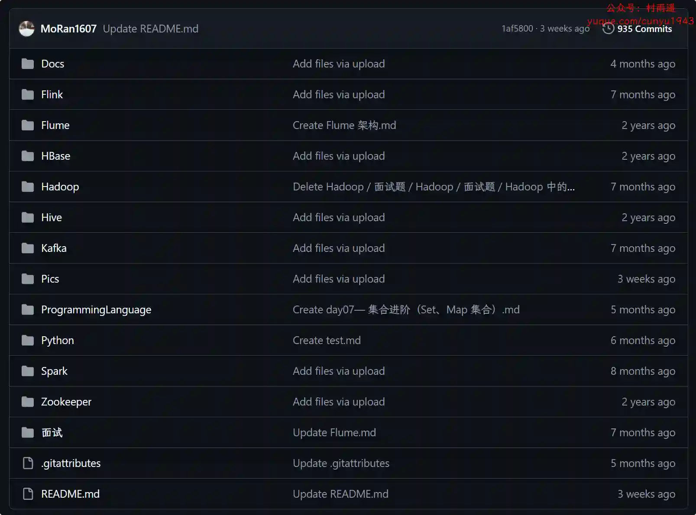
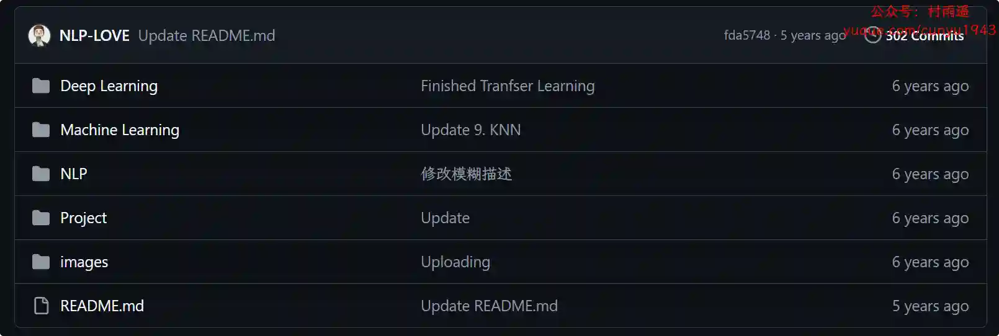
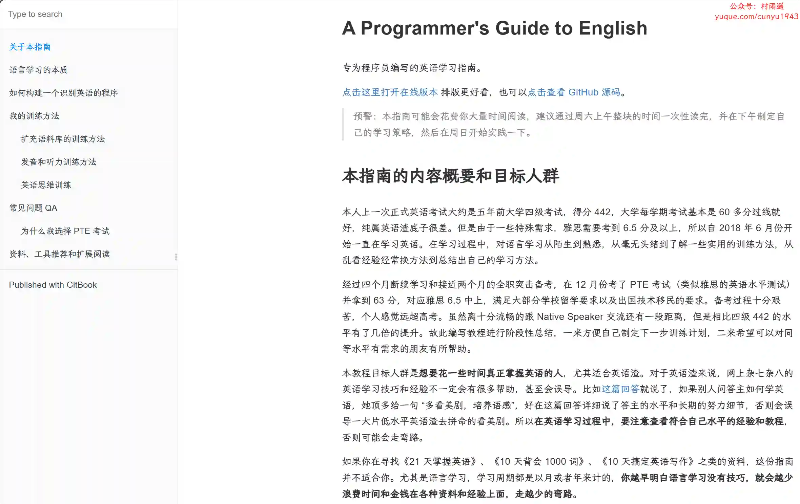

# 好物周刊#100：AI 小浣熊

> 作者：[村雨遥](https://github.com/cunyu1943)
> 
> 不要哀求，学会争取，若是如此，终有所获
> 
> 原文：https://mp.weixin.qq.com/s/npTcnMw79mM11envHpbbTA

## 号外

最近，公众号之外，建立了微信交流群，不定期会在群里分享各种资源（影视、IT 编程、考试提升……）&知识。如果有需要，可以**扫码或者后台添加小编微信备注入群**。进群后**优先看群公告**，**呼叫群中【资源分享小助手】**，还能免费帮找资源哦～

 

## 一、项目

### 1. [轻松阅读](https://github.com/Zealon159/light-reading-cloud)

一款图书阅读类 APP，基于 SpringCloud 生态开发的微服务实践项目，涉及 SpringCloud-Gateway、Nacos、Hystrix、OpenFeign、Jwt、ElasticSearch 等技术栈的应用。

### 2. [serverless-qrcode-hub](https://github.com/xxnuo/serverless-qrcode-hub)

苦于群聊二维码频繁变动，作者开发了这个能生成永久二维码的工具，无需服务器。基于 Cloudflare Workers 和 D1 实现。

### 3. [MoeMai](https://github.com/beilunyang/moemail)

一个基于 NextJS + Cloudflare 技术栈构建的可爱临时邮箱服务。

## 二、软件

### 1. [灵动桌面](https://www.wallpaperplay.cn)

打造你的精美桌面，海量精品壁纸，超清动态壁纸任意换，搭配桌面组件打造个性桌面。

### 2. [Windsurf AI IDE](https://windsurfai.org/)

一款由上下文引擎和多文件编辑驱动的创新代码编辑器，旨在提高开发人员的生产力。与 Cursor 和传统 IDE 相比，Windsurf 提供了更智能的 AI 自动完成、自定义模板支持和高效的自然语言交互。立即体验，解锁无限可能！

### 3. [小浣熊家族](https://www.xiaohuanxiong.com/)

基于商汤自研大语言模型的智能助手，包含代码助手、办公助手，满足用户代码编写、数据分析、编程学习等各类需求。

## 三、网站

### 1. [ChatExcel](https://www.chatexcel.com/#/home?invitation_id=BFCD226954963EC380C48472911B7704)

AI Excel 处理和数据分析，用户只需像和好友聊天一样操作，Chatexcel 会自动通过 AI 完成图表处理和分析，彻底改变了与表格数据的交互方式。将用户从繁琐的公式与运算中解放出来，无需编写复杂的公式和代码，让用户专注于文件数据和分析本身。

### 2. [Emoji 大全](https://www.emojiall.com/)

该网站提供了最新、完整的 Emoji 搜索和相关信息，包括表情符号含义、使用示例、Unicode 代码点、高分辨率图片、复制和粘贴，以及 Emoji 大数据排名、矢量图形和动态图表、智能算法情感分析和表情符号语言学研究。

### 3. [极速箱](https://jisuxiang.com)

提供高效开发工具集成平台，程序员必备在线工具箱，包含 JSON 处理、编码转换、加密解密、时间转换等提升编程效率的神器。

## 四、插件

### 1. [开发工具箱](https://chromewebstore.google.com/detail/开发工具箱/mflanociobpenleccopmoanpdbcjcanm)

常用开发小工具集合于一身，为我们的工作带来福音。

### 2. [在云端](https://chromewebstore.google.com/detail/在云端-ai-阅读助手/icdjfbhmnnheggmifcelflcdpnbdcnfm)

由阿里云开发者社区的一群开发者设计开发的一款多功能浏览器插件。新标签页美，体现了摄影美学、专注力以及先进云技术资讯。我们力求可以通过这项工作使得大家在这个快节奏信息爆炸的时代可以保持领先的同时获得内心的一份平静与祥和。AI 阅读助手采用通义前文大语言模型协助用户进行日常网页浏览，高效获取信息。

### 3. [Moonlight](https://hchromewebstore.google.com/detail/moonlight：科研论文的ai同伴/lhipdkibljepmfojllcfflfflhflcbgi)

与 AI 同伴 Moonlight 对话，快速深入理解论文。解读、摘要、翻译、聊天功能、参考文献搜索。论文阅读所需的一切功能，一应俱全。

## 五、资料

### 1. [大数据学习指南](https://github.com/MoRan1607/BigDataGuide)

大数据学习，从零开始学习大数据，包含大数据学习各阶段学习视频、面试资料。

### 2. [ML-NLP](https://github.com/NLP-LOVE/ML-NLP)

机器学习 (Machine Learning)、深度学习 (Deep Learning)、NLP 面试中常考到的知识点和代码实现，也是作为一个算法工程师必会的理论基础知识。

### 3. [A Programmer's Guide to English](https://github.com/yujiangshui/A-Programmers-Guide-to-English)

专为程序员编写的英语学习指南。指南会深挖语言学习的本质（主要用中文举例）并用程序员易于理解的方式去思考，并提供自己根据本质推演出来的训练方法和经验做参考。重中之重是你要根据本质自己设计适合自己的训练方法，同时可以甄别网上看到学习方法和资料，判断是否适合自己使用。

## ✍️ 说明

周刊专栏相关信息：

- **项目地址**：[Github](https://github.com/cunyu1943/weekly)，觉得不错麻烦给我一个**Star**，感谢 ❤️
- **浏览地址**：公众号 | [电子书](https://cunyu1943.github.io/weekly) | [语雀](https://yuque.com/cunyu1943/weekly)

如果你阅读到这里，说明我的工作没有白费。如果你想推荐项目/网站/软件/资源，欢迎提交 **[issue](https://github.com/cunyu1943/weekly/issues)** 或者添加我 **个人微信：coder_cunYu** 与我交流。

---

## ⏳ 联系

想解锁更多知识？不妨关注我的微信公众号：**村雨遥（id：JavaPark）**。

扫一扫，探索另一个全新的世界。

