# 好物周刊#102：医保政策导航

> 作者：[村雨遥](https://github.com/cunyu1943)
> 
> 不要哀求，学会争取，若是如此，终有所获
> 
> 原文：https://mp.weixin.qq.com/s/djp2MkMuN9wcjVHc_TJT1w

## 🎈 号外 

最近，公众号之外，建立了微信交流群，不定期会在群里分享各种资源（影视、IT 编程、考试提升……）&知识。如果有需要，可以**扫码或者后台添加小编微信备注入群**。进群后**优先看群公告**，**呼叫群中【资源分享小助手】**，还能免费帮找资源哦～

 

## 一、项目

### 1. [Luxirty Search](https://github.com/KoriIku/luxirty-search)

一个搜索引擎，基于 Google，屏蔽内容农场，无广告，无跟踪，干净，简洁，快。

### 2. [PDF Craft](https://github.com/oomol-lab/pdf-craft)

可以将 PDF 文件转化为各种其他格式，该项目将专注于扫描书籍的 PDF 文件的处理。本项目可将 PDF 一页一页读出，并使用 DocLayout-YOLO 混合我写的一个算法，将书页中的正文提取出来，并过滤掉页眉、页脚、脚注、页码等元素。在跨页过程中，会使用算法判断以妥善处理前后文跨页顺接问题，最终生成语义通顺的文本。书页会使用 OnnxOCR 进行文本识别，并使用 layoutreader 来确定符合人类习惯的阅读顺序。

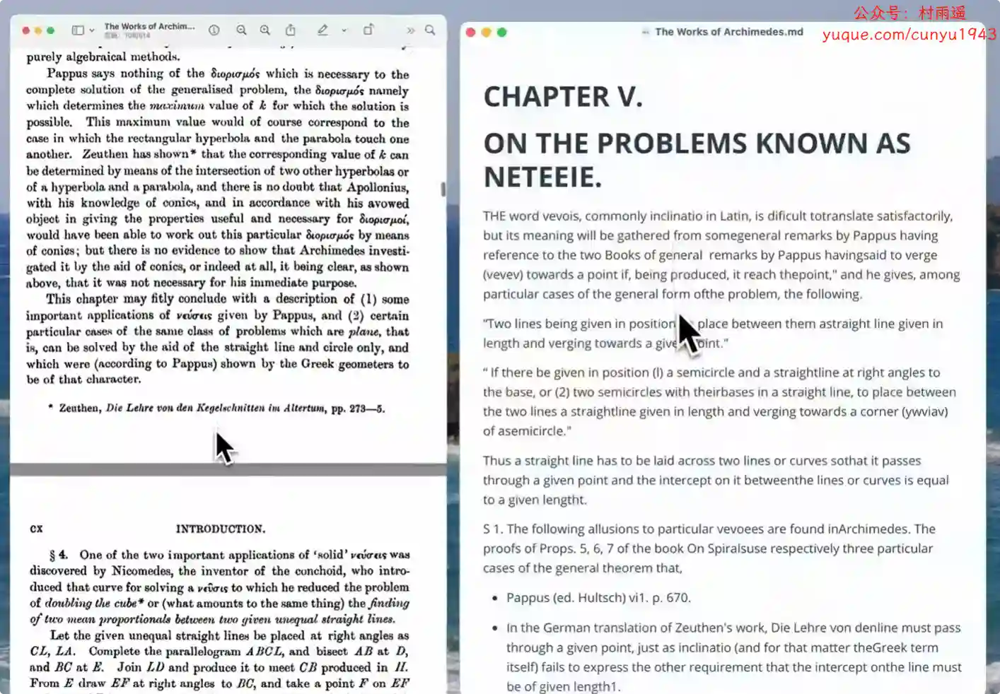

### 3. [微信公众号 Markdown 编辑器](https://github.com/jaywcjlove/wxmp)

公众号文章 Markdown 在线编辑器，使用 Markdown 语法创建一篇简介美观大方的微信公众号图文。

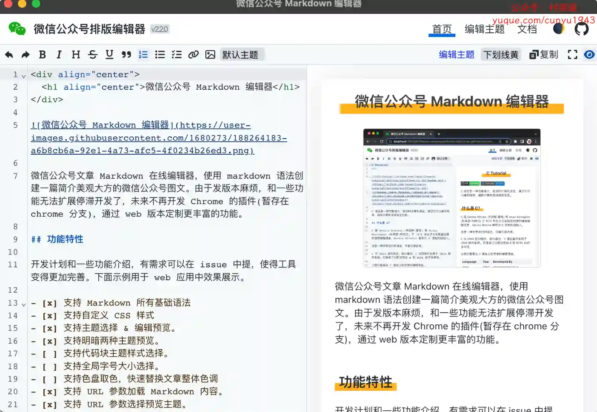

## 二、软件

### 1. [自动键鼠](https://www.autojs.com.cn)

一个 Windows 平台下的强大的自动化脚本工具。它非常的易于使用，无需任何编程知识就能创建一个功能强大的脚本。

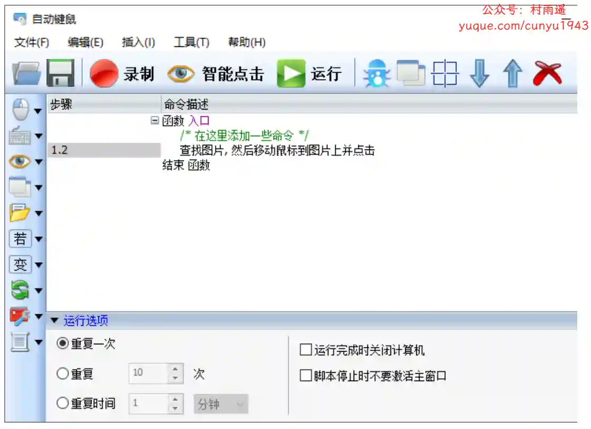

### 2. [萌艺卡片](https://www.moecard.app/)

有趣而强大的卡片创作工具，丝滑手势，精美字体、丰富表情，让你的创作充满趣味。

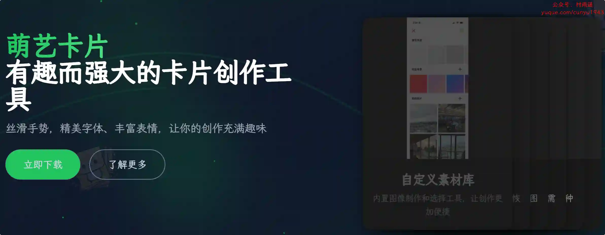

### 3. [WinTools One](https://wintools.one)

一款面向普通用户、高级用户及计算机工程师的 Windows 系统优化工具。支持 Windows 11/10/8.1/8/7/VISTA（32/64 位），下载大小仅 3 MB。其集成 12 大核心工具，涵盖软件卸载、磁盘清理、注册表优化、隐私清除、启动项管理、文件加密与粉碎、虚拟磁盘创建等功能，旨在提升系统性能、释放存储空间、修复系统错误并保护机密数据，同时提供灵活的系统参数调校选项。

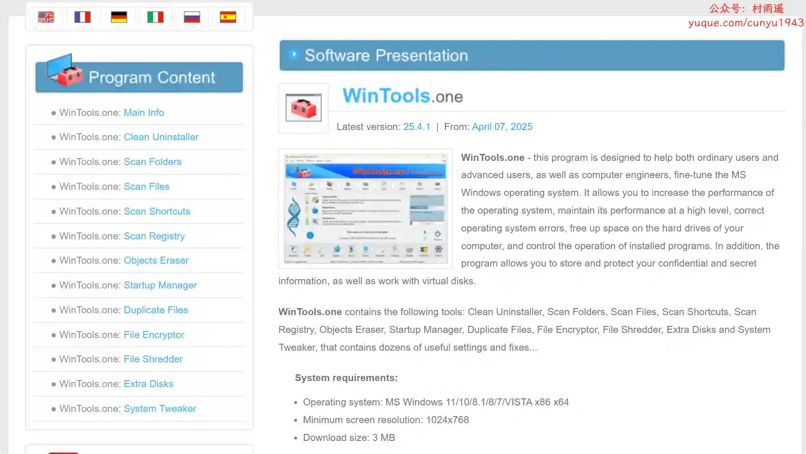

## 三、网站

### 1. [云鸽](https://yunge.in)

一款方便、快速、安全的文件传输助手。让您可以在不同设备之间轻松共享文件，它提供了简单直观的界面和高速稳定的传输速度，无需下载或登录，非常适合在日常生活和工作中共享文件。

### 2. [医保政策导航](https://yibao.233h.com/)

一个专注于提供全国医疗保险政策查询服务的平台。我们致力于为用户提供准确、及时、便捷的医保政策查询服务，帮助用户更好地了解和利用医保政策。

### 3. [咔片](https://www.cappt.cc/)

AI PPT 生成工具，工作总结/教学课件/商业提案 3 分钟搞定！10万+ 场景模板一键替换，AI 自动排版 + 多格式导出，支持在线编辑，基础功能永久免费使用！

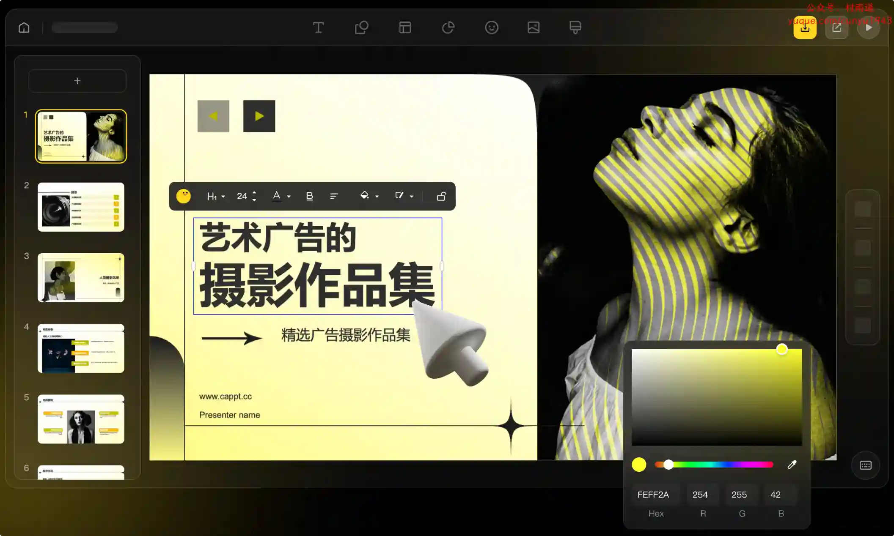

## 四、插件

### 1. [精准截图](https://chromewebstore.google.com/detail/精准截图-一键智能精准截图工具/mebflgmmheidlmggndpkkodonedongin?authuser=0&hl=zh-CN)

一款 Chrome 浏览器插件，旨在解决用户在网页截图时需要频繁调整截图区域比例的问题。该插件允许用户预先设定截图比例，然后进行连续截图操作，每次截图都会自动保持所选比例，大大提高截图效率。

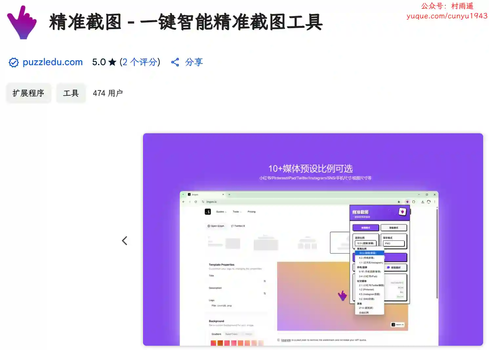

### 2. [Engage AI](https://chromewebstore.google.com/detail/engage-ai-社交网站智能评论/nelhhkchoapcbpcgpmmiahfkcdhgecaf)

使用 AI 撰写有见地的评论，通过吸引和增加与多个 LinkedIn 潜在客户的接触点来加快转化速度，从而节省您的时间。

### 3. [Privacy Test](https://chromewebstore.google.com/detail/privacy-test/pdabfienifkbhoihedcgeogidfmibmhp?hl=zh-CN)

这款应用程序核心功能包括清除浏览数据、历史记录、缓存、Cookie，帮助用户快速删除浏览器中存储的隐私数据，提升在线安全。

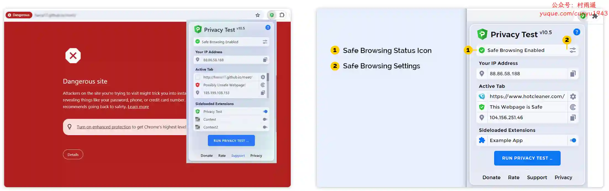

## 五、资料

### 1. [resources](https://github.com/BestDingSheng/resources)

知名互联网企业内推资料整理，目前已经维护五个微信群接近 3000 人。

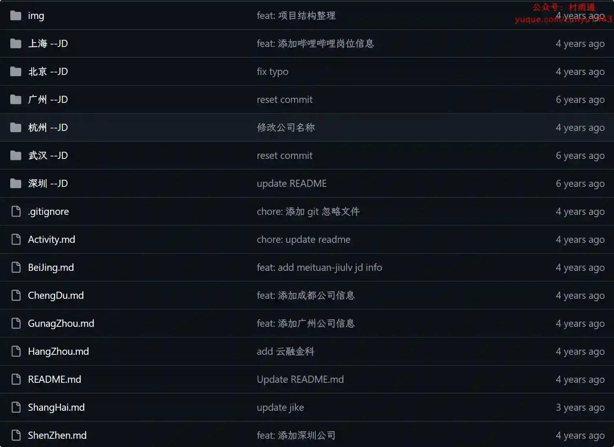

### 2. [SYSU_Notebook](https://github.com/ysyisyourbrother/SYSU_Notebook)

项目分享了中山大学计算机学院本科和研究生阶段的课程资料、笔记、期末考试卷和其他实用的相关资源。

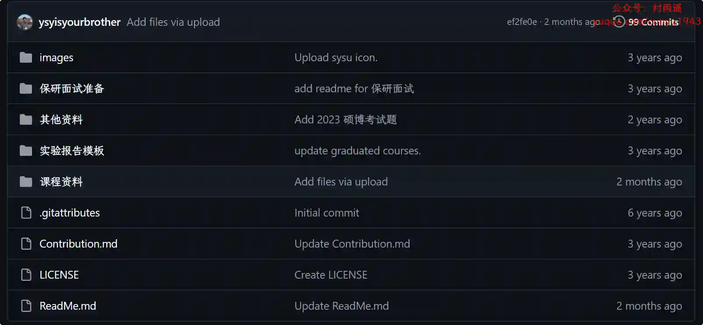

### 3. [前端开发博客](https://github.com/kujian/frontendDaily)

前端开发博客，分享互联网最精彩的前端技术。

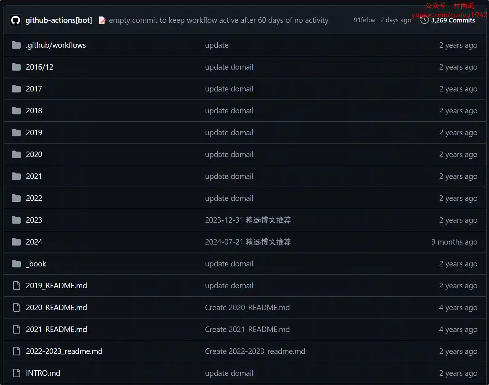

## ✍️ 说明

周刊专栏相关信息：

- **项目地址**：[Github](https://github.com/cunyu1943/weekly)，觉得不错麻烦给我一个**Star**，感谢 ❤️
- **浏览地址**：公众号 | [电子书](https://cunyu1943.github.io/weekly) | [语雀](https://yuque.com/cunyu1943/weekly)

如果你阅读到这里，说明我的工作没有白费。如果你想推荐项目/网站/软件/资源，欢迎提交 **[issue](https://github.com/cunyu1943/weekly/issues)** 或者添加我 **个人微信：coder_cunYu** 与我交流。

---

## ⏳ 联系

想解锁更多知识？不妨关注我的微信公众号：**村雨遥（id：JavaPark）**。

扫一扫，探索另一个全新的世界。

