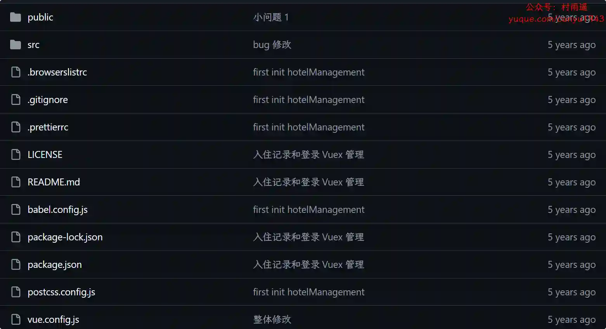
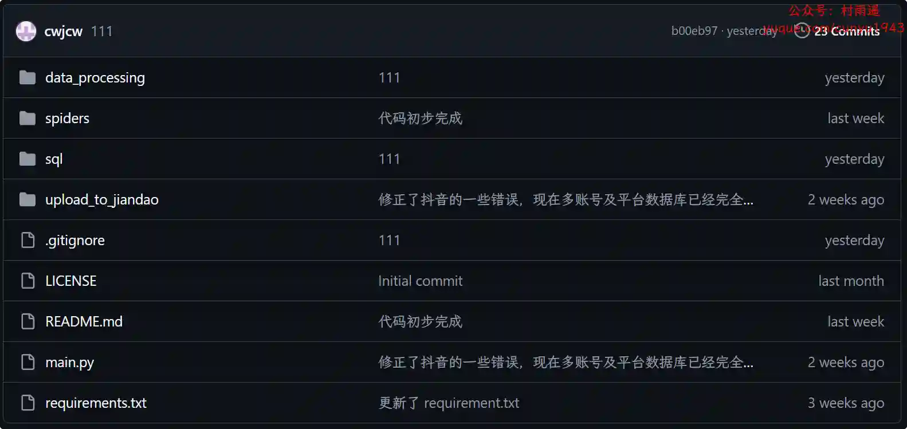
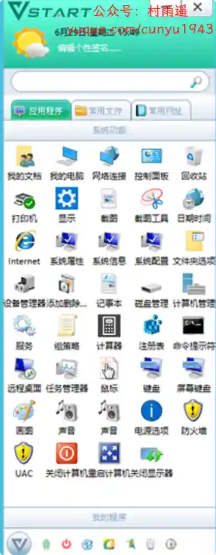
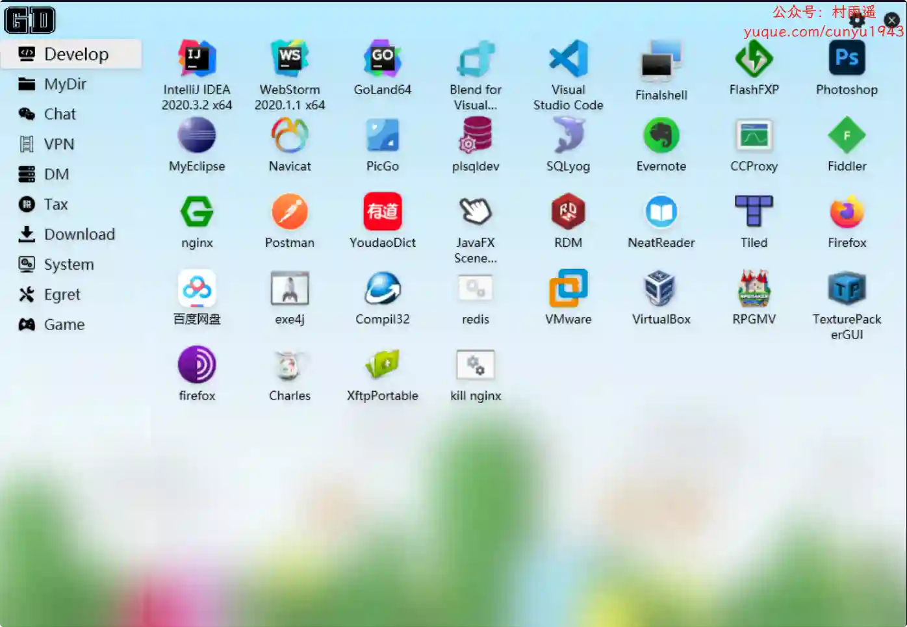
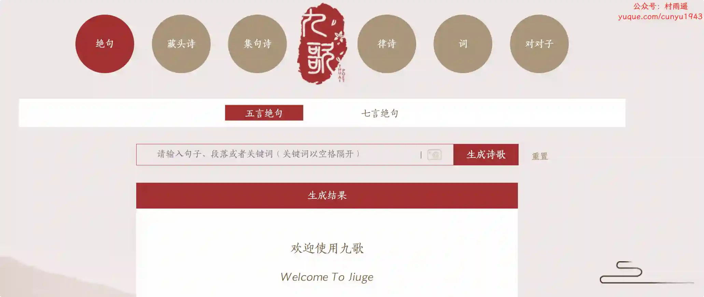
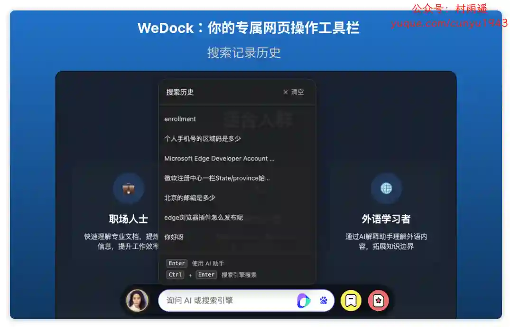
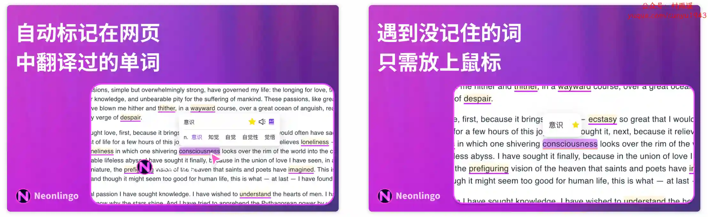
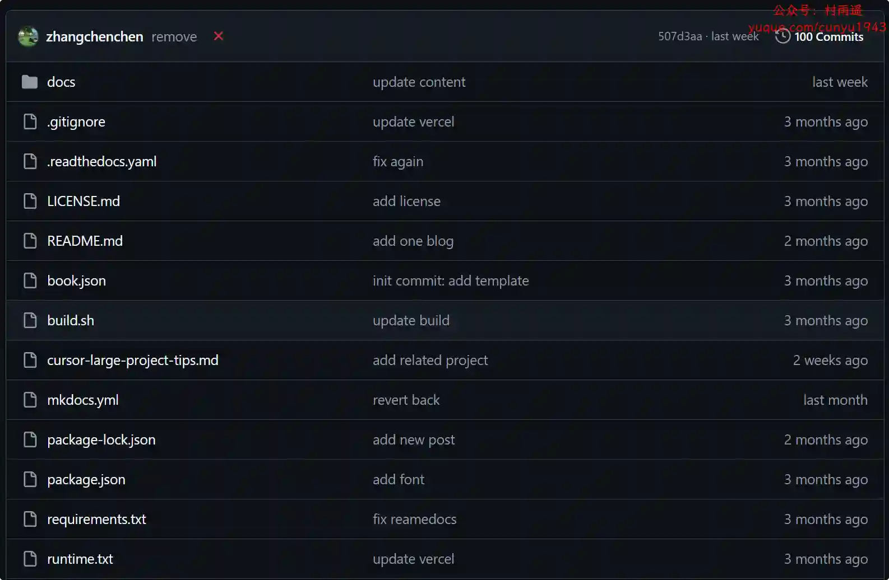

# 好物周刊#103：极客桌面

> 作者：[村雨遥](https://github.com/cunyu1943)
> 
> 不要哀求，学会争取，若是如此，终有所获
> 
> 原文：https://mp.weixin.qq.com/s/6XtL5o9O1ojk0F4nzsb9bA

## 🎈 号外 

最近，公众号之外，建立了微信交流群，不定期会在群里分享各种资源（影视、IT 编程、考试提升……）&知识。如果有需要，可以**扫码或者后台添加小编微信备注入群**。进群后**优先看群公告**，**呼叫群中【资源分享小助手】**，还能免费帮找资源哦～

 

## 一、项目

### 1. [hotelManegement](https://github.com/mynameisly/HotelManagement)

基于 Vue + Element UI 的酒店管理系统解决方案，方便开发快速简洁好看的组件。分离颜色样式，支持手动切换主题色，而且很方便使用自定义主题色。

### 2. [盘小子](https://github.com/towelong/panxiaozi)

一个一站式网盘资源搜索引擎，支持夸克网盘、百度网盘、阿里云盘等多平台，快速精准搜索，一键直达。

### 3. [douyin_video](https://github.com/cwjcw/xhs_douyin_content)

自动抓取抖音和小红书创作者中心里的每条视频的播放，完播，点击，2s 跳出，播放时长，点赞，分享，评论，收藏，主页访问，粉丝增量等数据。

## 二、软件

### 1. [音速启动](https://www.vstartapp.com)

一款桌面管理软件，采用 C++ 编写运行速度极快！以仿真 QQ 界面的形式结合桌面工具的特点，应用于软件文件夹网址的快捷操作，Windows 装机必备软件！支持软件文件夹网址快捷方式管理，内置常用的系统软件功能，收集集成了大部分装机必备软件。

### 2. [GeekDesk](https://github.com/BookerLiu/GeekDesk)

小巧、美观的桌面快速启动管理工具，同时集成了 Everything 搜索。

### 3. [远程看看](https://www.anyviewer.cn)

安全，快速，易于使用的远程控制软件，支持用户随时随地实现电脑远程控制和访问。

## 三、网站

### 1. [喵闪字库](https://www.miao3.cn)

一个专业的字体下载网站，收集并分享优秀的免费商用字体、免版权字体，提供所有字体的在线预览和免费字体下载服务。

### 2. [琅琅配音](https://www.lang123.top)

一款卓越的智能文本转语音工具，提供语音合成服务。拥有全网最受欢迎的 1100+ AI 主播，支持中文、英语、德语、法语等 80 多种语言，以及高兴、悲伤、兴奋等 10 多种情感风格。

### 3. [九歌](https://jiuge.thunlp.org)

清华大学自然语言处理与社会人文计算实验室研发的人工智能诗歌写作系统。该系统采用最新的深度学习技术，结合多个为诗歌生成专门设计的模型，基于超过 80 万首人类诗人创作的诗歌进行训练学习。区别于其他诗歌生成系统，九歌具有多模态输入、多体裁多风格、人机交互创作模式等特点。

## 四、插件

### 1. [WeDock 智能搜索](https://chromewebstore.google.com/detail/wedock智能搜索/bcempikghekhnhildnoacolmpgjbjhhp?authuser=1&hl=zh-CN)

智能搜索工具栏，提供便捷的搜索功能，包括豆包、deepseek、chatgpt等大模型，还包括诸多传统的搜索引擎。

### 2. [Tai Sentry](https://chromewebstore.google.com/detail/tai-sentry/fmjgafoilnpanbpgdkljkjfjgainboim)

专为 Windows Tai 应用提供的浏览器拓展，在使用 Tai 的浏览器统计功能时需要安装此拓展。

### 3. [英语学习与翻译](https://chromewebstore.google.com/detail/英语学习与翻译-neonlingo/ifhljpgdgoimmfacomakolapgnamfkbd)

一款网页 AI 外语学习、翻译插件，帮助你在快速浏览外文网页的同时记忆单词。

## 五、资料

### 1. [考途指南](https://pppw1my52v.feishu.cn/wiki/DGtMwJailirOwPk3OBIcTbTCnhg)

汇集教师、公务员、实验单位等考试资料，为考公路上的人提供一份指南。

### 2. [Quick Reference](https://github.com/jaywcjlove/reference)

为了方便开发人员查阅技术栈，作者分享了这份快速参考备忘清单【速查表】，旨在帮助大家更好地使用相关技术。

### 3. [自洽的程序员](https://github.com/zhangchenchen/self-consistent-coder)

本书既不是技术书籍，也不是职业规划书籍，其真正用意是想解决工作过程中碰到的焦虑、倦怠、迷茫、抑郁等情绪，聚焦于解决具体问题，通过改变认知将我们从负面情绪的泥淖中走出来，做到更坦然，真诚的面对自己的内心，成为一个自洽的程序员。

## 

## ✍️ 说明

周刊专栏相关信息：

- **项目地址**：[Github](https://github.com/cunyu1943/weekly)，觉得不错麻烦给我一个**Star**，感谢 ❤️
- **浏览地址**：公众号 | [电子书](https://cunyu1943.github.io/weekly) | [语雀](https://yuque.com/cunyu1943/weekly)

如果你阅读到这里，说明我的工作没有白费。如果你想推荐项目/网站/软件/资源，欢迎提交 **[issue](https://github.com/cunyu1943/weekly/issues)** 或者添加我 **个人微信：coder_cunYu** 与我交流。

---

## ⏳ 联系

想解锁更多知识？不妨关注我的微信公众号：**村雨遥（id：JavaPark）**。

扫一扫，探索另一个全新的世界。

