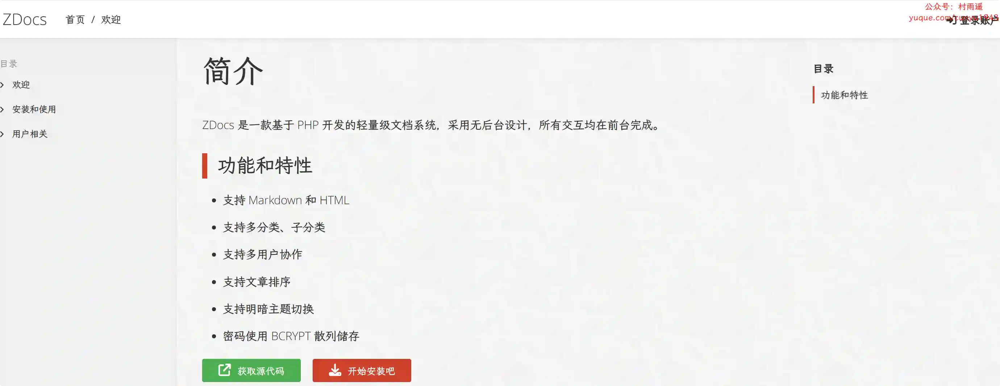
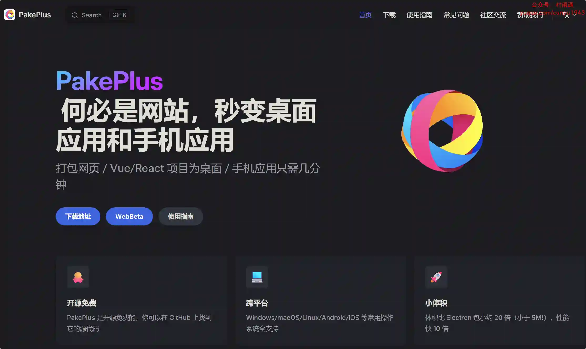
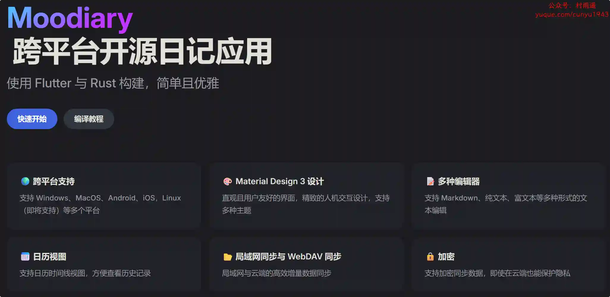
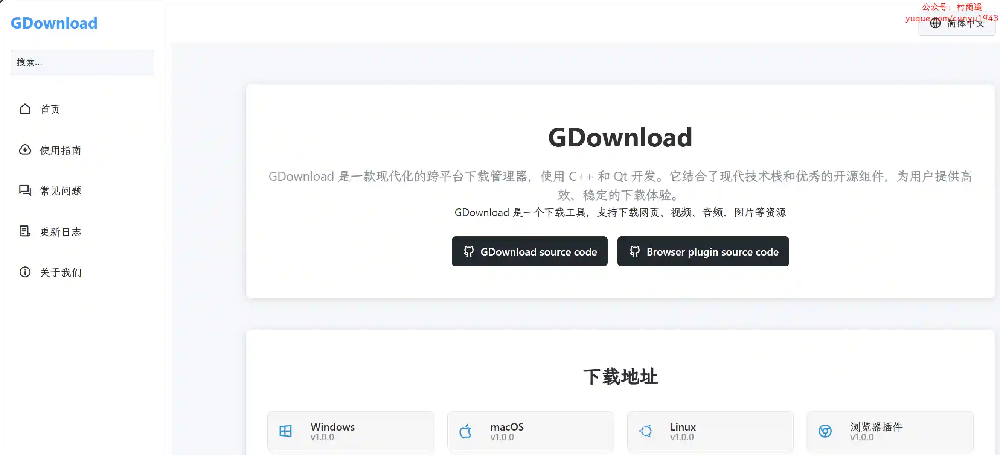
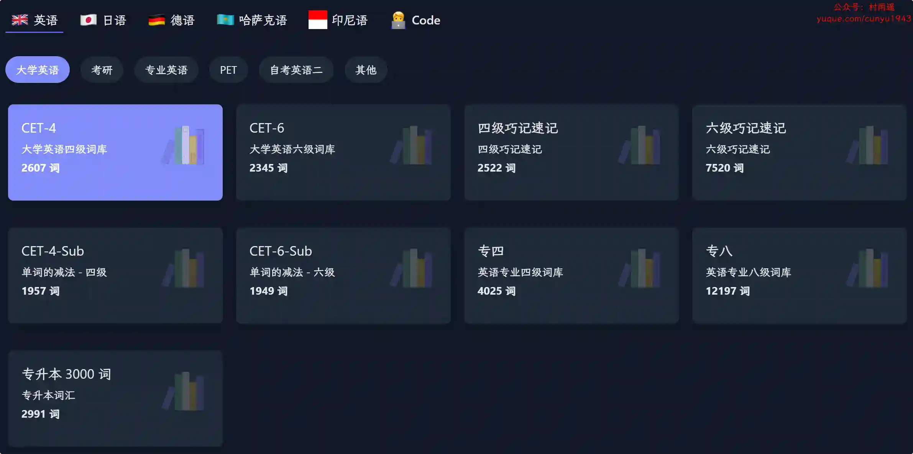
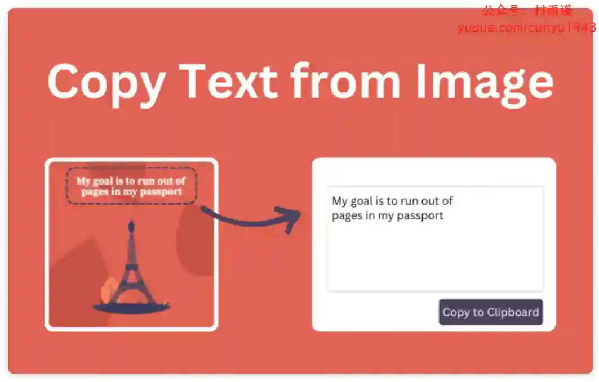
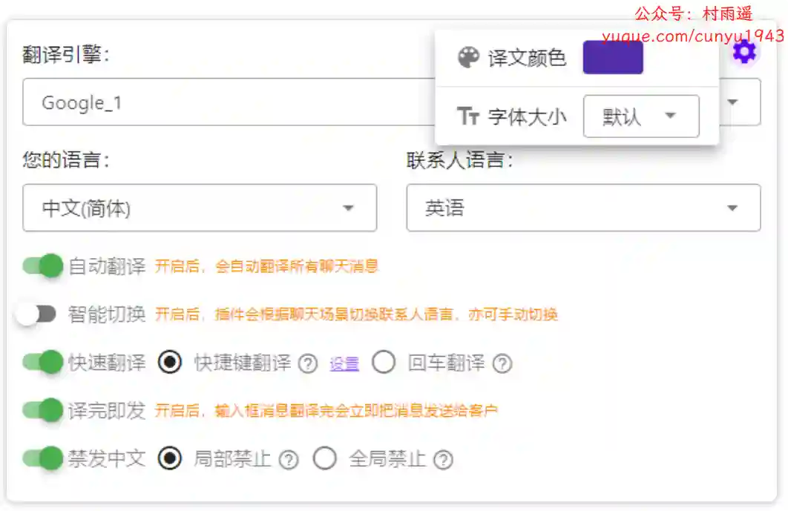
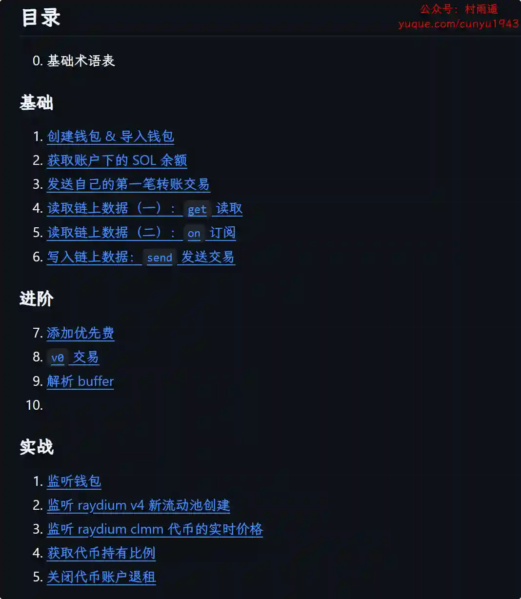
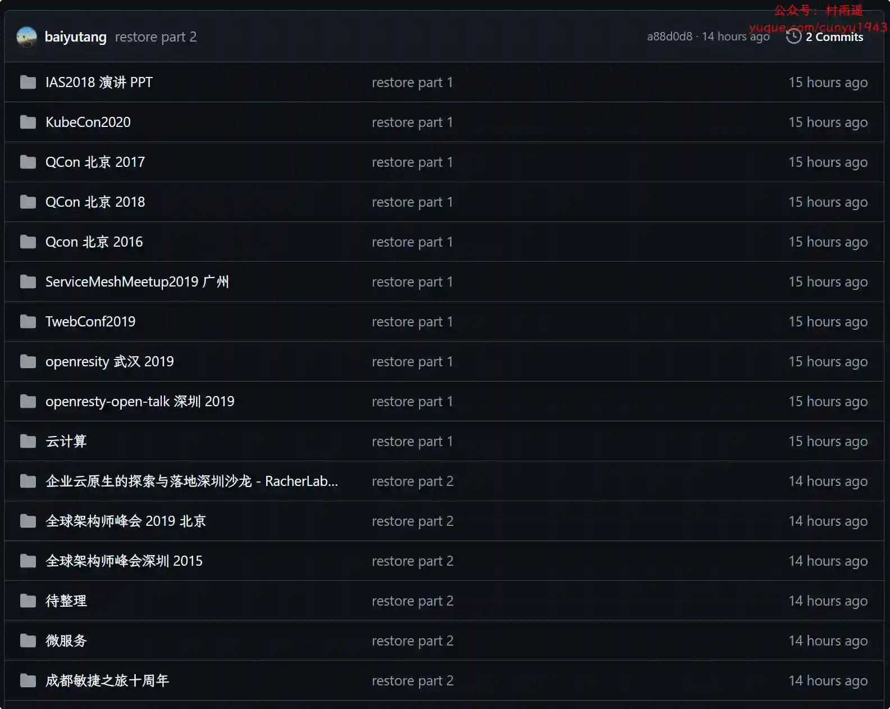

# 好物周刊#108：奥特曼打字

> 作者：[村雨遥](https://github.com/cunyu1943)
> 
> 不要哀求，学会争取，若是如此，终有所获
> 
> 原文：https://mp.weixin.qq.com/s/i8b05MypOwQE8zcm-1i3nA

## 🎈 号外 

最近，公众号之外，建立了微信交流群，不定期会在群里分享各种资源（影视、IT 编程、考试提升……）&知识。如果有需要，可以**扫码或者后台添加小编微信备注入群**。进群后**优先看群公告**，**呼叫群中【资源分享小助手】**，还能免费帮找资源哦～

 

## 一、项目

### 1. [ZDocs](https://github.com/ZeroDream-CN/ZDocs)

一款基于 PHP 开发的轻量级文档系统，采用无后台设计，所有交互均在前台完成。

### 2. [PakePlus](https://github.com/Sjj1024/PakePlus)

轻松将任意网站/Vue/React 等项目构建为轻量级多端桌面应用和手机应用，仅需几分钟即可搞定。

### 3. [SQLE](https://github.com/actiontech/sqle)

一个支持多种不同类型数据库，覆盖事前控制、事后监督、标准发布场景，帮助您建立质量规范的 SQL 全生命周期质量管理平台。

## 二、软件

### 1. [moodiary](https://github.com/ZhuJHua/moodiary)

一款基于 Flutter 与 Rust 构建的跨平台开源日记应用。

### 2. [易剪媒](https://www.xinmei7.com)

行业首创的对话式 AI 视频剪辑工具，支持批量自动视频处理，指令收藏等强大功能，多平台使用，免费无广告。

### 3. [GDownload](https://github.com/cool2528/GDownload)

一款现代化的跨平台下载管理器，使用 C++ 和 Qt 开发，支持下载网页、视频、音频、图片等资源。结合了现代技术栈和优秀的开源组件，为用户提供高效、稳定的下载体验。

## 三、网站

### 1. [发现 TV](https://faxiantv.com)

一个免费在线影视搜索与观看平台，支持多个影视源搜索与观看，无需注册即可使用。

### 2. [奥特曼.org](https://aoteman.org/)

为键盘工作者设计的单词记忆与英语肌肉记忆锻炼软件。

### 3. [注视影视](https://gaze.run)

流畅简洁的观影体验，高清热门剧、番剧、冷门电影免费在线观看，尽享优质影视内容。

## 四、插件

### 1. [图片转文字](https://chromewebstore.google.com/detail/图片转文字/pmeccjlemeohcobimhbphjnlokdmiilo)

一个为轻松精准地从图片和视频中提取文本而设计的 Chrome 扩展程序。无论是快速截图还是详细文档图像，我们的工具都使用先进的 OCR 技术，将图片中的文本转换为可编辑的文本，随时可以使用。

### 2. [TikTok Video Keeper](https://chromewebstore.google.com/detail/tiktok-video-keeper/ilcjgmjecbhpgpipmkfkibjopafpbcag)

TikTok 视频下载器，下载 TikTok 视频到 PC。支持单个和批量下载，同时无水印。

### 3. [WhatsApp™即时翻译](https://chromewebstore.google.com/detail/whatsapp即时翻译/gjaklccphhffeddbigoeknakacjacein)

强大的 WhatsApp 实时翻译插件，支持多翻译引擎，智能识别场景语言，直接回车键翻译并发送。

## 五、资料

### 1. [Solana Web3.js 教程](https://github.com/ChainBuff/solana-web3js)

一个用于与 Solana 区块链进行交互的 JavaScript 基础库。本教程旨在提供一些简单的例子，帮助你快速上手 Solana 区块链开发。

### 2. [信息系统项目管理师](https://github.com/xiaomabenten/ruankao_itpm)

目前全网最全面的 2025 年 信息系统项目管理师 （软考高级）备考资源库。

### 3. [技术会议、活动、分享](https://github.com/baiyutang/meetup)

互联网大厂技术分享 PPT，各大技术交流会、活动资料汇总，如全球运维技术大会、全球技术领导力峰会、大前端大会、架构师峰会等。

## ✍️ 说明

周刊专栏相关信息：

- **项目地址**：[Github](https://github.com/cunyu1943/weekly)，觉得不错麻烦给我一个**Star**，感谢 ❤️
- **浏览地址**：公众号 | [电子书](https://cunyu1943.github.io/weekly) | [语雀](https://yuque.com/cunyu1943/weekly)

如果你阅读到这里，说明我的工作没有白费。如果你想推荐项目/网站/软件/资源，欢迎提交 **[issue](https://github.com/cunyu1943/weekly/issues)** 或者添加我 **个人微信：coder_cunYu** 与我交流。

---

## ⏳ 联系

想解锁更多知识？不妨关注我的微信公众号：**村雨遥（id：JavaPark）**。

扫一扫，探索另一个全新的世界。

