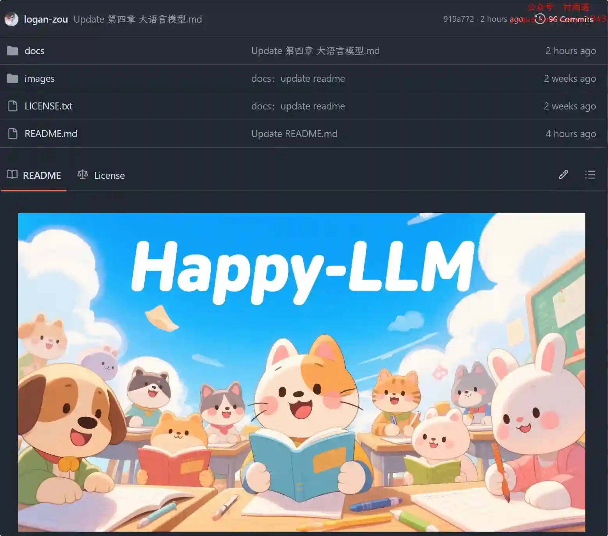

# 好物周刊#109：凹凸工坊

> 作者：[村雨遥](https://github.com/cunyu1943)
> 
> 不要哀求，学会争取，若是如此，终有所获
> 
> 原文：https://mp.weixin.qq.com/s/IkKwLQ6RqLAVNADozV21jg

## 🎈 号外 

最近，公众号之外，建立了微信交流群，不定期会在群里分享各种资源（影视、IT 编程、考试提升……）&知识。如果有需要，可以**扫码或者后台添加小编微信备注入群**。进群后**优先看群公告**，**呼叫群中【资源分享小助手】**，还能免费帮找资源哦～

 

## 一、项目

### 1. [DooTask](https://github.com/kuaifan/dootask)

一款开源在线项目任务管理工具，提供各类文档协作工具、在线思维导图、在线流程图、项目管理、任务分发、即时 IM，文件管理等工具；同时消息功能使用非对称加密技术让你的沟通更安全。

### 2. [pay-java-parent](https://github.com/egzosn/pay-java-parent)

全能第三方支付对接 Java 开发工具包。优雅的轻量级支付模块集成支付对接支付整合（微信，支付宝，银联，友店，富友，跨境支付 paypal，payoneer (P 卡派安盈) 易极付）app，扫码，网页支付刷卡付条码付刷脸付转账红包服务商模式，微信分账，合并支付、支持多种支付类型多支付账户，支付与业务完全剥离，简单几行代码即可实现支付，简单快速完成支付模块的开发，可轻松嵌入到任何系统。

### 3. [PokemonGo](https://github.com/hi-dhl/PokemonGo)

基于 Jetpack + MVVM + Repository 设计模式 + Data Mapper + Kotlin Flow 的实战项目。

## 二、软件

### 1. [knowledge-grab](https://github.com/alterem/knowledge-grab)

一个基于 Tauri 和 Vue 3 构建的桌面应用程序，方便用户从国家中小学智慧教育平台下载各类教育资源。

### 2. [比特彗星](https://www.bitcomet.com)

一款免费的 BT/HTTP/FTP 下载软件！功能强大速度快，操作简单的 BT 下载软件，BT 资源下载利器！

### 3. [VutronMusic](https://github.com/stark81/VutronMusic)

高颜值的第三方网易云播放器。支持流媒体音乐，如 navidrome、emby。支持本地音乐播放、离线歌单、逐字歌词、桌面歌词、Touch Bar 歌词、Mac 状态栏歌词显示、Linux-gnome 桌面状态栏歌词显示等功能。

## 三、网站

### 1. [凹凸工坊](https://www.autohanding.com)

一键生成手写文稿，制作自己笔迹的字体，打印出以假乱真的模拟手写文档，让打印出的字看上去像手写的软件。

### 2. [WithoutAD](https://withoutad.com)

免费无广告，致力于帮助同学们搞定“学起来痛苦但需要掌握”的知识，青少年专属的益智游戏与趣味学习平台。

### 3. [NoCode](https://nocode.cn)

美团推出的零代码应用生成平台，无需任何编码知识就能够实现各种页面。

## 四、插件

### 1. [X-Comfort-Browser](https://chromewebstore.google.com/detail/x-comfort-browser/okfbbbhfbomoeobfifgjnclkdhknccgn)

用于浏览内容平台（推特、知乎）时，模糊媒体资源，移除广告。专注信息获取，减少视觉干扰，获得互联网噪音下的注意力主动权，同时避免公共场合出现尴尬的场景。

### 2. [扇贝单词助手](https://chromewebstore.google.com/detail/扇贝单词助手v3/hgflmegfeennhajkhgdhcjdnhnkobpfn)

一款专为扇贝网用户打造的 Chrome 插件，旨在帮助您在任何网页上轻松高效地学习英语。

### 3. [Siphon 吸词](https://chromewebstore.google.com/detail/ellokeilepgocdknilnlljmgohncjllb?utm_source=item-share-cb)

双击单词快捷记录在线阅读中遇到的生词，以轻松愉快的方式复习记录的所有生词，一天 5 分钟，一年 1000 词。

## 五、资料

### 1. [Happy-LLM](https://github.com/datawhalechina/happy-llm)

从零开始的大语言模型原理与实践教程，一个系统性的 LLM 学习教程，将从 NLP 的基本研究方法出发，根据 LLM 的思路及原理逐层深入，依次为读者剖析 LLM 的架构基础和训练过程。

### 2. [1000 个中国独立开发者项目汇总](https://github.com/XiaomingX/1000-chinese-independent-developer-plus)

中国独立开发者项目列表，分享大家都在做什么。

### 3. [深入理解 Vue.js 实战](https://github.com/godbasin/vue-ebook)

介绍 Vue.js 框架的出现、设计和使用，结合实战让读者更深入理解 Vue.js 框架，掌握使用方法。

## ✍️ 说明

周刊专栏相关信息：

- **项目地址**：[Github](https://github.com/cunyu1943/weekly)，觉得不错麻烦给我一个**Star**，感谢 ❤️
- **浏览地址**：公众号 | [电子书](https://cunyu1943.github.io/weekly) | [语雀](https://yuque.com/cunyu1943/weekly)

如果你阅读到这里，说明我的工作没有白费。如果你想推荐项目/网站/软件/资源，欢迎提交 **[issue](https://github.com/cunyu1943/weekly/issues)** 或者添加我 **个人微信：coder_cunYu** 与我交流。

---

## ⏳ 联系

想解锁更多知识？不妨关注我的微信公众号：**村雨遥（id：JavaPark）**。

扫一扫，探索另一个全新的世界。

