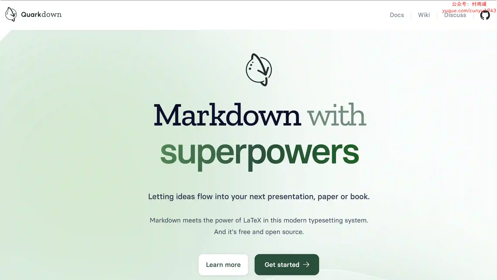
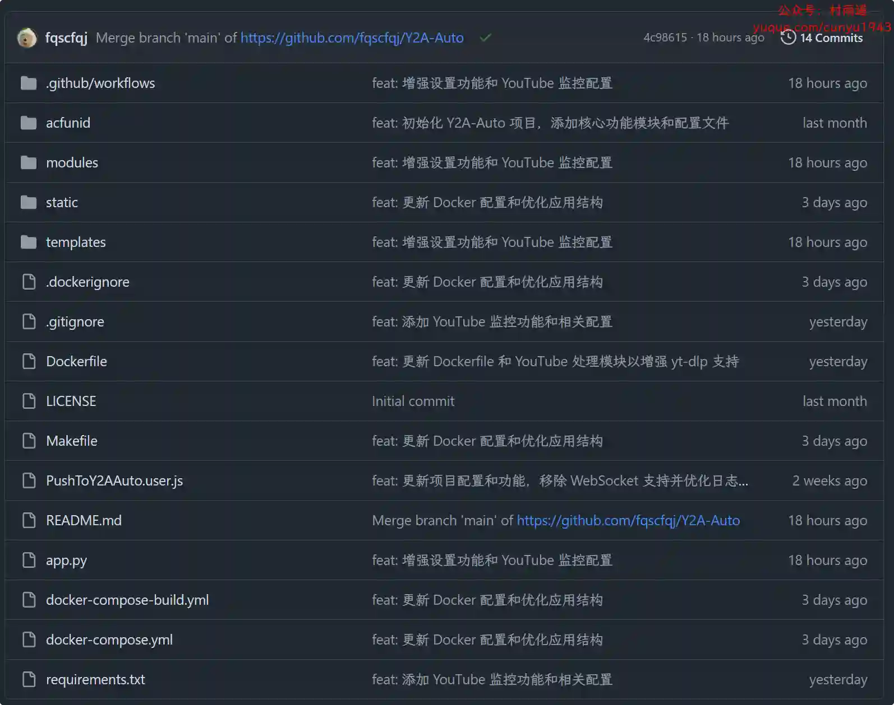
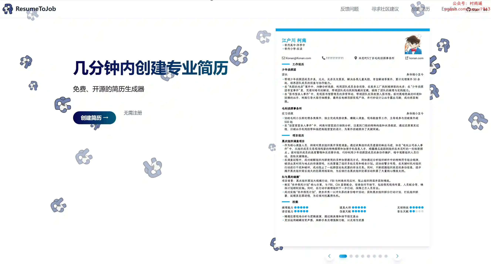
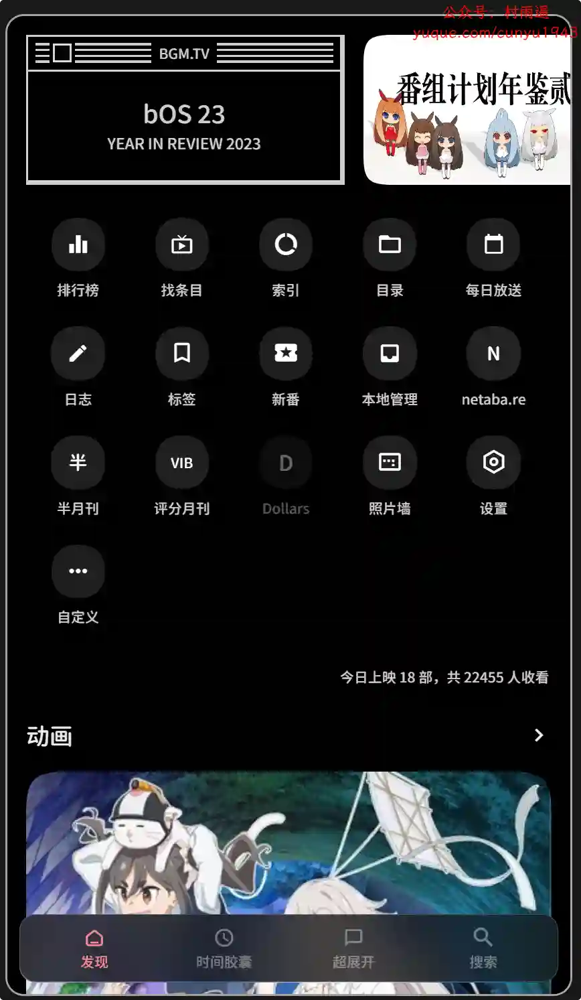
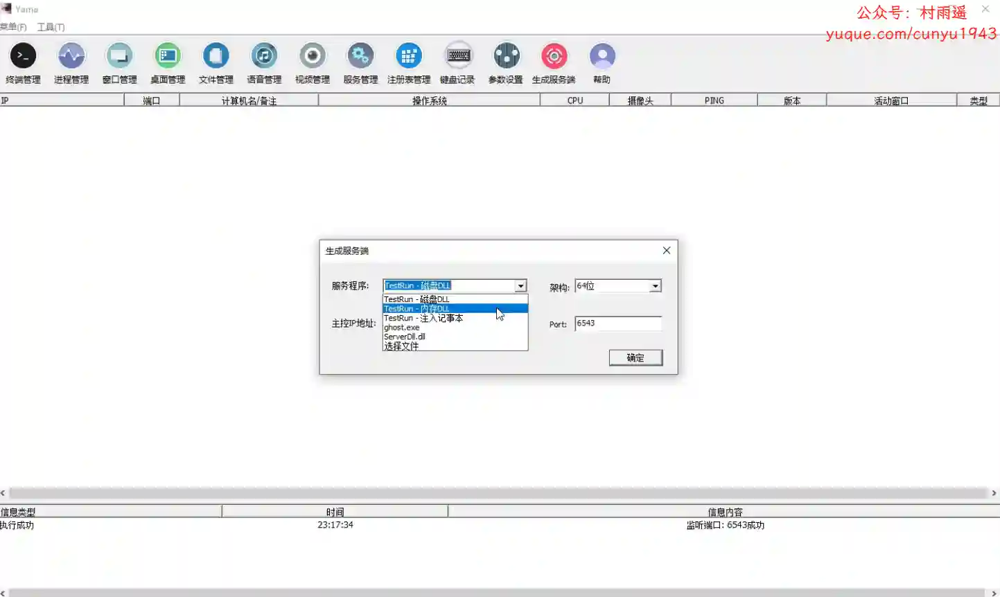
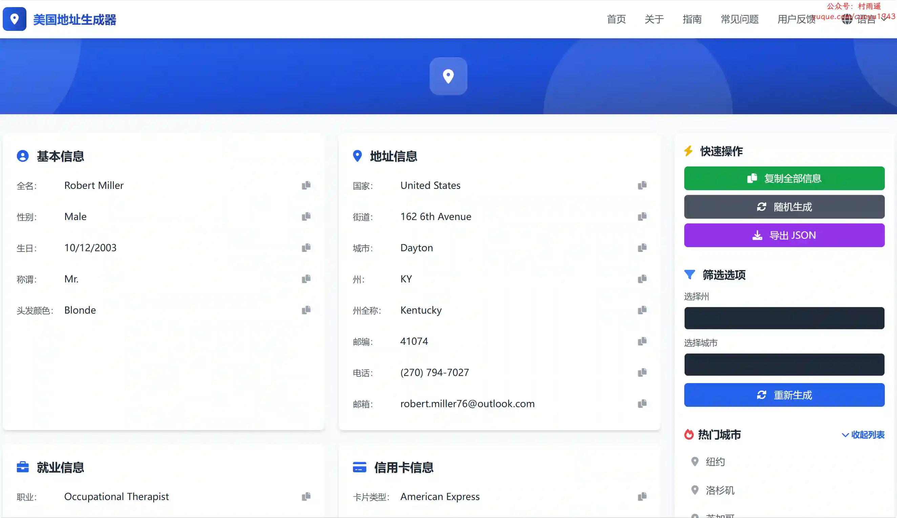
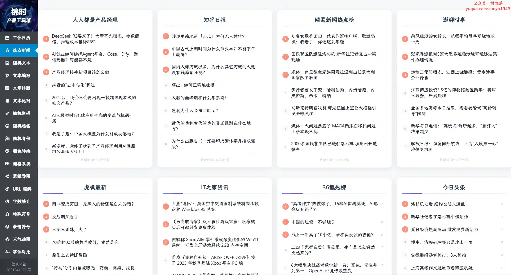
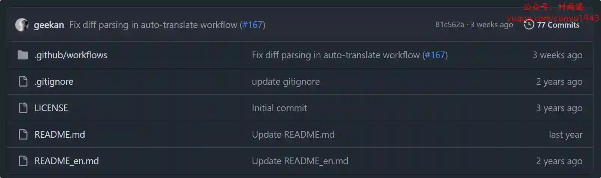

# 好物周刊#110：程序员延寿指南

> 作者：[村雨遥](https://github.com/cunyu1943)
> 
> 不要哀求，学会争取，若是如此，终有所获
> 
> 原文：https://mp.weixin.qq.com/s/GLC0klhWGsvwMWDfi7YPWQ

## 🎈 号外 

最近，公众号之外，建立了微信交流群，不定期会在群里分享各种资源（影视、IT 编程、考试提升……）&知识。如果有需要，可以**扫码或者后台添加小编微信备注入群**。进群后**优先看群公告**，**呼叫群中【资源分享小助手】**，还能免费帮找资源哦～

 

## 一、项目

### 1. [Quarkdown](https://github.com/iamgio/quarkdown)

一个基于 Markdown 的现代排版系统，围绕多功能性的关键概念设计，可以通过项目制作可打印的书籍或 PPT。

### 2. [Y2A-Auto](https://github.com/fqscfqj/Y2A-Auto)

YouTube 到 AcFun 自动化搬运工具，支持视频下载、AI 翻译、字幕处理、内容审核、智能监控和自动上传。

### 3. [ResumeToJob](https://github.com/ltlylfun/ResumeToJob)

一个免费开源的在线简历制作工具，帮助求职者快速创建专业、美观的简历。支持多种模板选择、实时编辑、PDF 导出等功能，同时保护您的隐私数据安全。

## 二、软件

### 1. [Bangumi](https://github.com/czy0729/Bangumi)

### 2. [SimpleRemoter](https://github.com/yuanyuanxiang/SimpleRemoter)

### 3. [EXCEL 必备工具箱](https://www.ahzll.top/)

最方便实用的 EXCEL 必备工具，自带免费多标签的 EXCEL 工具箱，同时支持 32 位及 64 位 office 和 WPS，新版现已接入 DeepSeek 功能，轻松实现表格的一键智能自动化处理。

## 三、网站

### 1. [通辽宇宙知识库](https://www.tongliaouniverse.cn)

一个关于世界上那些奇葩小国、硬核狠人与二次元谐音梗的互动知识平台。

### 2. [美国地址生成器](https://www.usaddrgen.com)

美国地址生成器，快速生成美国真实格式的个人身份信息、SSN 信息、地址信息、邮箱信息、工作就业信息、信用卡信息等。适用于开发、测试和学习目的，支持 50 个州的地址生成。

### 3. [锦时产品工具箱](https://www.y3pm.com)

探索产品的无限可能，为产品设计师提供包括假文生成、热点新闻、字数统计、虚构身份、URL 编解、特殊符号、表情符号、色值转换、栅格计算、动态天气、字体对比、Axure 组件下载等功能。

## 四、插件

### 1. [陪读蛙](https://chromewebstore.google.com/detail/modkelfkcfjpgbfmnbnllalkiogfofhb?utm_source=item-share-cb)

一款开放源代码的浏览器插件，旨在帮助您从任何网站深入学习语言。将你日常的网页阅读变成一场沉浸式的语言学习之旅！

### 2. [阿抖-抖音视频采集助手](https://chromewebstore.google.com/detail/kckmfllnpncljamnlfnaoplpmlbgjeal?utm_source=item-share-cb)

抖音网页版视频下载，播放记录批量下载，我喜欢的视频一键下载，博主所有视频一键下载。

### 3. [公众号阅读增强器](https://chromewebstore.google.com/detail/mbamjfdjbcdgpopfnkkmlohadbbnplhm?utm_source=item-share-cb)

旨在提升用户在电脑上阅读微信公众号文章的体验。该插件通过在页面侧边栏自动生成文章的结构化目录，帮助用户快速了解文章结构、导航到感兴趣的部分，并且在阅读长文时保持阅读位置的清晰感知。

## 五、资料

### 1. [创业大全](https://cy.urongda.com)

涵盖大学生创新创业、互联网+、挑战杯、SYB、中国国际大学生创新大赛等热门赛事，提供超 10000 份项目计划书成品。包含 word 与 ppt 双格式，可直接使用，也支持个性化编辑修改。80+ 丰富项目主题，全面覆盖期末作业、竞赛参赛需求，即拿即用，助力大学生轻松应对创新创业挑战。

### 2. [程序员延寿指南](https://github.com/geekan/HowToLiveLonger)

从术语、目标、关键结果、分析、行动、证据等 6 大方面列举，作为程序员，如何延长自己的寿命。

### 3. [云计算指南](https://github.com/huataihuang/cloud-atlas)

走着以一人之力实现完整的数据中心的构建和运维，实现 IaaS，PaaS，SaaS。结合自己的思考和实践，完整分享每个操作步骤，力求清晰、准确、可复现。

## ✍️ 说明

周刊专栏相关信息：

- **项目地址**：[Github](https://github.com/cunyu1943/weekly)，觉得不错麻烦给我一个**Star**，感谢 ❤️
- **浏览地址**：公众号 | [电子书](https://cunyu1943.github.io/weekly) | [语雀](https://yuque.com/cunyu1943/weekly)

如果你阅读到这里，说明我的工作没有白费。如果你想推荐项目/网站/软件/资源，欢迎提交 **[issue](https://github.com/cunyu1943/weekly/issues)** 或者添加我 **个人微信：coder_cunYu** 与我交流。

---

## ⏳ 联系

想解锁更多知识？不妨关注我的微信公众号：**村雨遥（id：JavaPark）**。

扫一扫，探索另一个全新的世界。

