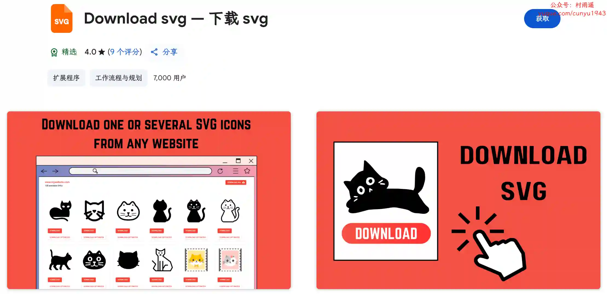

# 好物周刊#115：浏览器大作战

> 作者：[村雨遥](https://github.com/cunyu1943)
> 
> 不要哀求，学会争取，若是如此，终有所获
> 
> 原文：https://mp.weixin.qq.com/s/maYjVLal4yQaozvaSBMGhQ

## 🎈 号外 

最近，公众号之外，建立了微信交流群，不定期会在群里分享各种资源（影视、IT 编程、考试提升……）&知识。如果有需要，可以**扫码或者后台添加小编微信备注入群**。进群后**优先看群公告**，**呼叫群中【资源分享小助手】**，还能免费帮找资源哦～

## 一、项目

### 1. [OpenList](https://github.com/OpenListTeam/OpenList)

一个有韧性、长期治理、社区驱动的 AList 分支，旨在防御基于信任的开源攻击。

### 2. [RAGFLow](https://github.com/infiniflow/ragflow)

一款基于深度文档理解构建的开源 RAG（Retrieval-Augmented Generation）引擎。RAGFlow 可以为各种规模的企业及个人提供一套精简的 RAG 工作流程，结合大语言模型（LLM）针对用户各类不同的复杂格式数据提供可靠的问答以及有理有据的引用。

### 3. [wukong-robot](https://github.com/wzpan/wukong-robot)

一个简单、灵活、优雅的中文语音对话机器人 / 智能音箱项目，支持 ChatGPT 多轮对话能力，还可能是首个支持脑机交互的开源智能音箱项目。

## 二、软件

### 1. [Via 浏览器](https://viayoo.com)

崇尚速度与简约的手机浏览器，让你享用简洁清爽、快速高效的手机浏览器。充分发挥广告拦截、脚本等先进技术，达到简单、好用的设计初衷。

### 2. [星愿浏览器](https://www.twinkstar.com)

完美兼容 Chrome 插件，个性化界面，漫画阅读模式，漫画搜索，购物搜索，全网比价，视频下载，视频弹窗，鼠标手势，超级拖拽，多线程高速下载等等，是一款方便，可靠，简洁的浏览器。

### 3. [百分浏览器](https://www.centbrowser.cn)

一款以快速和实用为目标的 Chrome 增强版浏览器，它紧跟最新版 Chrome 内核，不断增强办公和娱乐相关的上网体验。

## 三、网站

### 1. [RedNote Video Downloader](https://www.xhs-download.org/)

小红书视频下载器，帮您轻松地保存小红书您想要下载的高质量视频。

### 2. [CZL 在线工具箱](https://onepage.czl.net)

提供各种免费好用的在线工具，包括视频播放器、文件处理、格式转换、开发工具等。

### 3. [EverydayNews](https://news.ravelloh.top)

在这里你能搜索到近 3 年的新闻历史记录的文字版内容。

## 四、插件

### 1. [Download svg](https://chromewebstore.google.com/detail/cggaenglmghpmhjcmogcacipdmfblobp?utm_source=item-share-cb)

从任何网站导出 SVG 文件的免费解决方案。

### 2. [网站下载器](https://chromewebstore.google.com/detail/iaaokenmfgahhlcfbdipjonlkeinadaa?utm_source=item-share-cb)

旨在帮助您轻松地获取网站内容以供离线使用。无论您是需要存储页面以进行归档、研究还是开发目的，这个强大的工具都可以让您轻松地复制网站内容，只需点击几下即可。

### 3. [Trello 到 Excel](https://chromewebstore.google.com/detail/bjpoifnmgopaldllcndnfnianebnfoke?utm_source=item-share-cb)

轻松将您的 Trello 板和卡片（包括已存档的板和卡片）直接导出到 Excel。只需单击几下，即可增强您的项目管理、绩效分析和数据驱动的决策能力。

## 五、资料

### 1. [一人公司](https://github.com/cyfyifanchen/one-person-company)

一人公司 AI 工具系列，有些工具是宝，有些工具是坑。本 Repo 致力于帮您踩坑，精准找宝。

### 2. [PDF 解析](https://github.com/zxyle/PDF-Explained)

《PDF Explained》的非官方中文翻译版，为程序员，高级用户提供了世界领先的页面描述语言 (pdf) 的动手实践。

### 3. [Rust 语言实战](https://github.com/sunface/rust-by-practice)

通过有挑战性的示例、练习题、实践项目来提升 Rust 水平，建立从入门学习到上手实战的直通桥梁。

## ✍️ 说明

周刊专栏相关信息：

- **项目地址**：[Github](https://github.com/cunyu1943/weekly)，觉得不错麻烦给我一个**Star**，感谢 ❤️
- **浏览地址**：公众号 | [电子书](https://cunyu1943.github.io/weekly) | [语雀](https://yuque.com/cunyu1943/weekly)

如果你阅读到这里，说明我的工作没有白费。如果你想推荐项目/网站/软件/资源，欢迎提交 **[issue](https://github.com/cunyu1943/weekly/issues)** 或者添加我 **个人微信：coder_cunYu** 与我交流。

---

## ⏳ 联系

想解锁更多知识？不妨关注我的微信公众号：**村雨遥（id：JavaPark）**。

扫一扫，探索另一个全新的世界。

