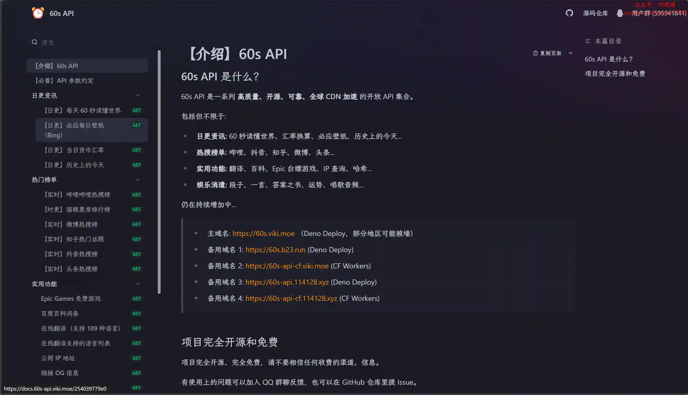
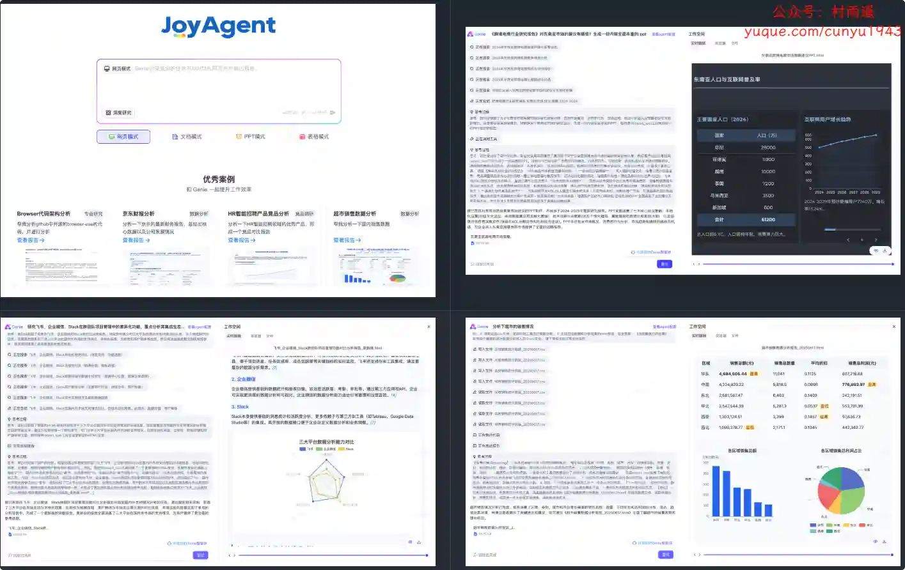
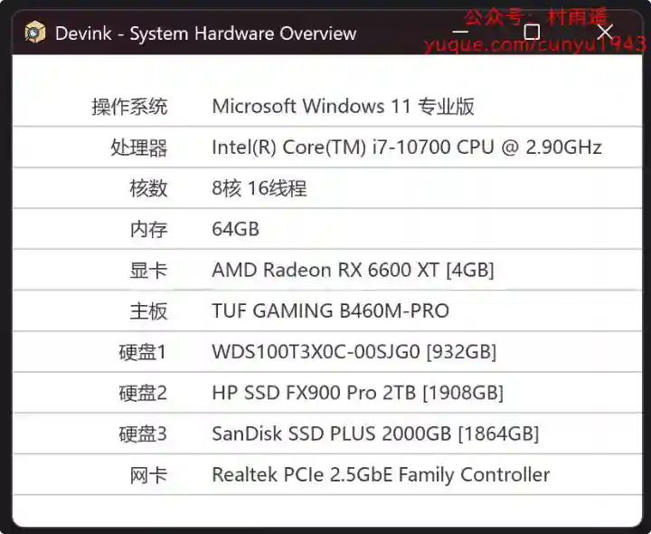
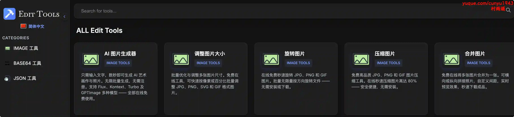
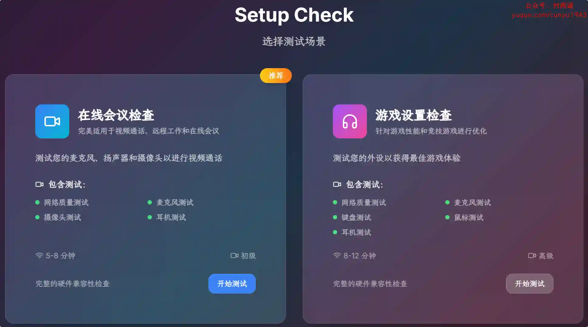
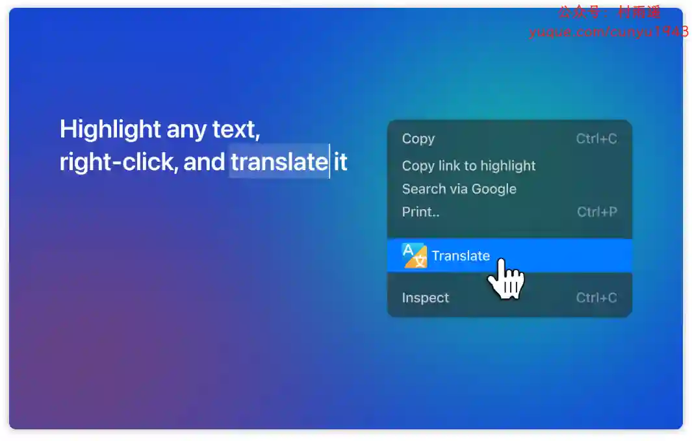
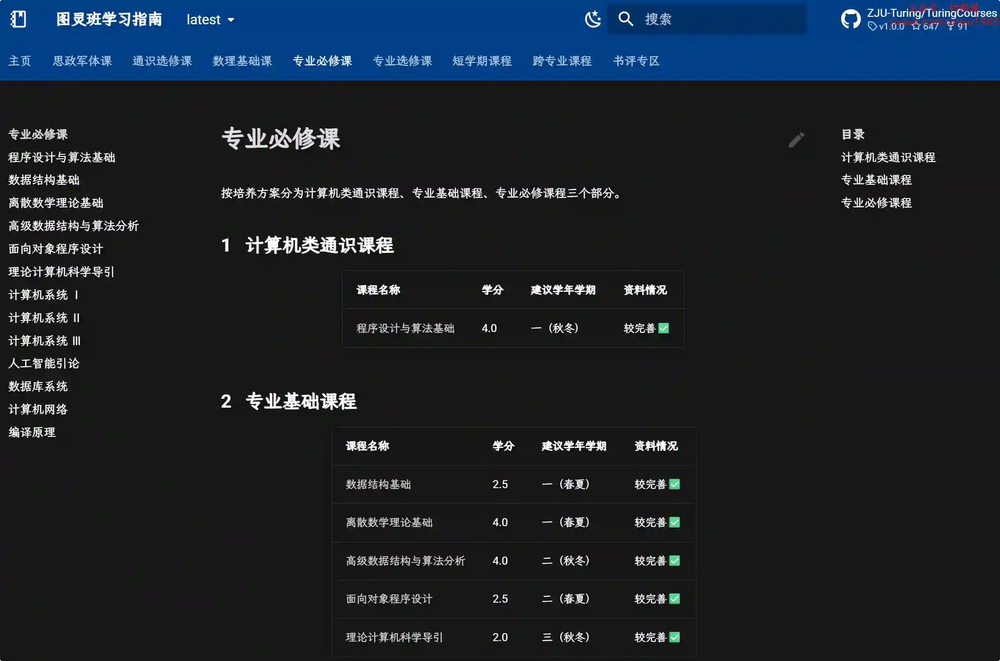

# 好物周刊#117：60s 看天下

> 作者：[村雨遥](https://github.com/cunyu1943)
> 
> 不要哀求，学会争取，若是如此，终有所获
> 
> 原文：https://mp.weixin.qq.com/s/P6C9O-8M7fagyARjlNAqcw

## 🎈 号外 

最近，公众号之外，建立了微信交流群，不定期会在群里分享各种资源（影视、IT 编程、考试提升……）&知识。如果有需要，可以**扫码或者后台添加小编微信备注入群**。进群后**优先看群公告**，**呼叫群中【资源分享小助手】**，还能免费帮找资源哦～

## 一、项目

### 1. [60s API](https://github.com/vikiboss/60s)

一系列高质量、开源、可靠、全球 CDN 加速的开放 API 集合，使用 Deno 构建，托管在 Deno Deploy 上，也支持 Docker、Cloudflare Workers、Bun 和 Node.js 部署。

### 2. [GPT-Load](https://github.com/tbphp/gpt-load)

基于 Go 1.23+ 开发的企业级 AI 接口代理服务，支持 OpenAI、Google Gemini、Anthropic Claude 等多种 AI 服务提供商。 提供智能密钥管理、负载均衡、高并发处理和完善的监控功能。

### 3. [joyagent-jdgenie](https://github.com/jd-opensource/joyagent-jdgenie)

一个通用的多智能体框架，对于用户需要定制的一些新场景功能，只需将相关的子智能体或者工具挂载到 JoyAgent-Genie 即可。

## 二、软件

### 1. [机查查](https://devink.techartlife.com)

系统硬件信息查看助手，一个免费的硬件信息查看小工具，仅 3MB，单文件。

### 2. [TraceTime 笔记](https://tracetime.xyz)

记录时刻，追踪生活。帮您轻松记录每一天的点滴，让美好瞬间永不遗忘。

### 3. [IObit Software Updater](https://www.iobit.com/en/iobit-software-updater.php)

一款更新软件工具的程序。帮助用户更新过时的程序，可一键扫描 Windows 系统，检测出过时的常用应用程序，并进行自动更新流程。

## 三、网站

### 1. [Edit Tools](https://edittools.org)

提供基础的图片和文本编辑功能，秒级编辑与转换 PDF、JPG、DOC、MP3、MP4、PNG，无需安装软件。裁剪、合并、压缩、水印一应俱全。 

### 2. [Setup Check](https://www.setupcheck.tech)

无广告的在线检测工具，可以用来测试网速、耳机、麦克风、鼠标键盘、摄像头等是否正常。

### 3. [爱悦读](https://www.iyd.wang)

一个免费的电子书分享平台，提供 kindle、epub、mobi、azw3、pdf、txt 等格式电子书，全集全本打包免费下载，一个值得电子书爱好者收藏的网站。

## 四、插件

### 1. [语鲸](https://chromewebstore.google.com/detail/knjfhjecbebplkalmikclbkgkmaggkci?utm_source=item-share-cb)

一款智能阅读辅助工具，帮你一键生成概述，快速纵览全文；提供多级展开式大纲，助你把握核心观点、定位原文信息；支持划线高亮、摘录，随时记录关键信息。

### 2. [马大哈翻译](https://chromewebstore.google.com/detail/ihipdlbkomhbfdoiiiabphiggkhmoibo?utm_source=item-share-cb)

中英夹杂，在语境中学习单词，在中文网页中夹杂英文，在中文网页中夹杂英文。

### 3. [即时翻译器](https://chromewebstore.google.com/detail/lojpdfjjionbhgplcangflkalmiadhfi?utm_source=item-share-cb)

一款功能强大的 Chrome 插件，可即时翻译任何文字或网页。透过简洁、使用者友善的界面，您无需离开目前标签即可翻译单字、短语或整个页面。快速、可靠，而且无需注册。

## 五、资料

### 1. [2025 最新校招面试题合集](https://github.com/0voice/Campus_recruitment_interview_questions)

2025 最新校招面试题合集， 面向 2026 届应届生，全网最全整理！收录 1000 + 道真实面试题以及面经，涵盖阿里、腾讯、字节、美团、百度、华为、小米、英伟达、微软、米哈游等百家大中小厂。每题配备视频解析 or 文字讲解。

### 2. [大语言模型](https://github.com/LLMBook-zh/LLMBook-zh.github.io)

本书关注为大模型初学者提供整体的技术讲解，在内容上进行了大范围的更新与重组，力图展现一个系统的大模型技术框架和路线图。适用于具有深度学习基础的读者阅读，可以作为一本基础的大模型参考书籍。

### 3. [图灵班学习指南](https://github.com/ZJU-Turing/TuringCourses)

浙江大学图灵班课程学习指南，涵盖专业必修课、短学期课程、跨专业课程、数理化基础课、通识选修课等方面内容。

## ✍️ 说明

周刊专栏相关信息：

- **项目地址**：[Github](https://github.com/cunyu1943/weekly)，觉得不错麻烦给我一个**Star**，感谢 ❤️
- **浏览地址**：公众号 | [电子书](https://cunyu1943.github.io/weekly) | [语雀](https://yuque.com/cunyu1943/weekly)

如果你阅读到这里，说明我的工作没有白费。如果你想推荐项目/网站/软件/资源，欢迎提交 **[issue](https://github.com/cunyu1943/weekly/issues)** 或者添加我 **个人微信：coder_cunYu** 与我交流。

---

## ⏳ 联系

想解锁更多知识？不妨关注我的微信公众号：**村雨遥（id：JavaPark）**。

扫一扫，探索另一个全新的世界。

