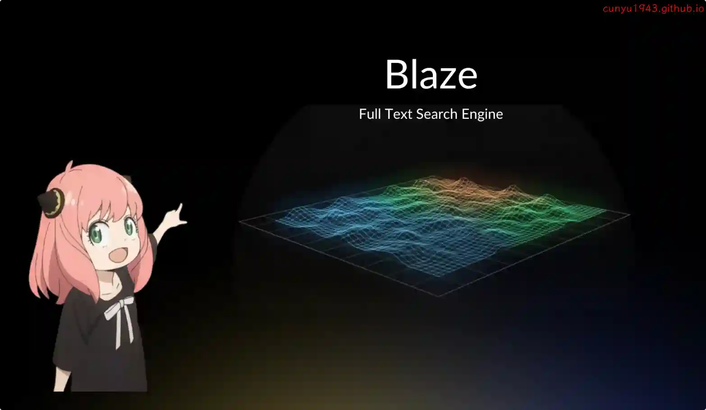
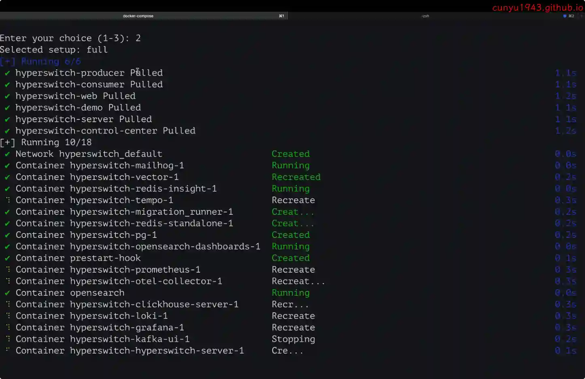
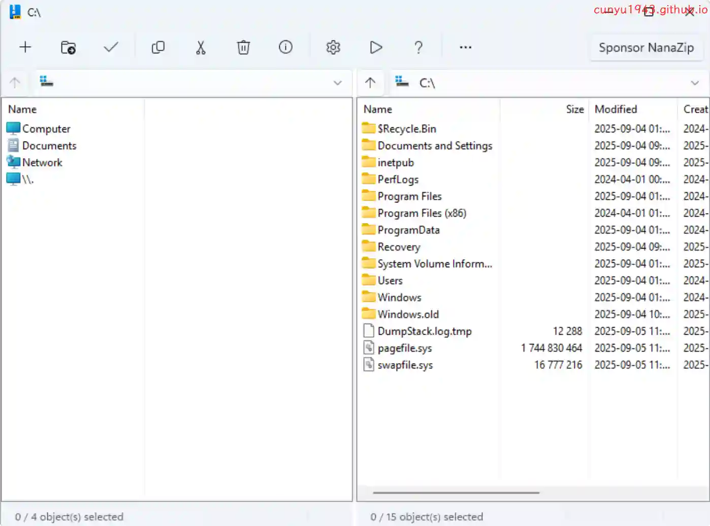
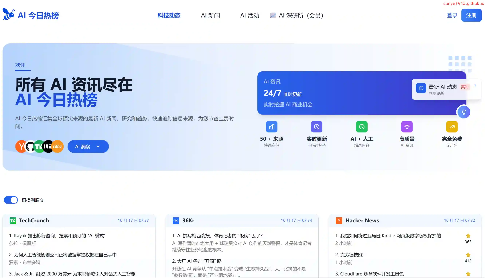
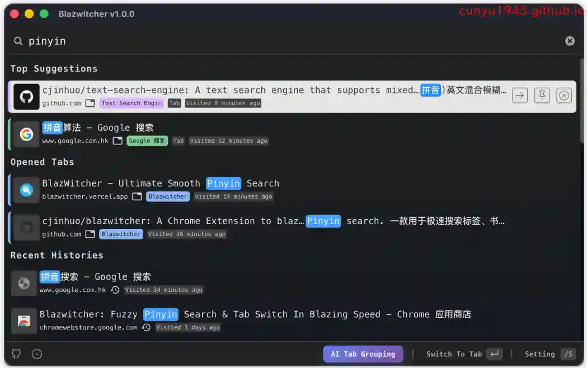
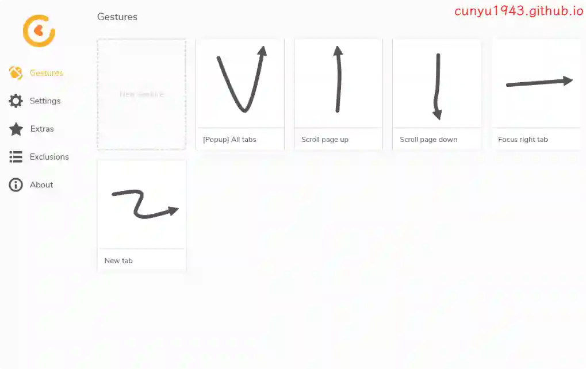
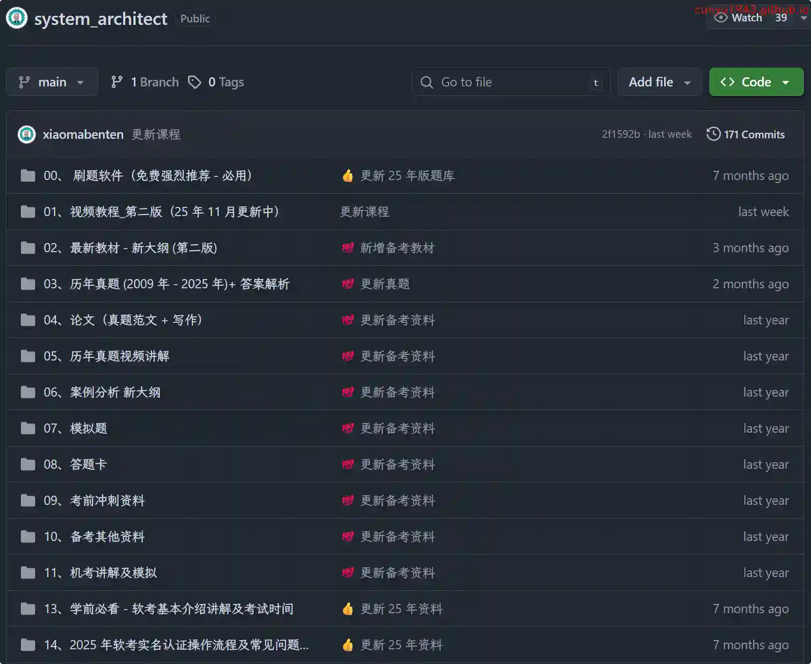
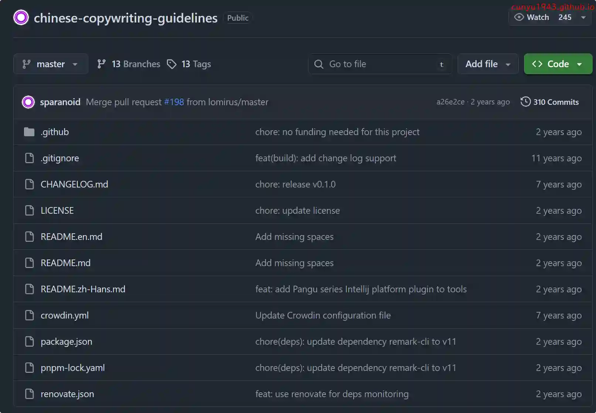

# 好物周刊#128：中文文案排版指北

> 作者：[村雨遥](https://github.com/cunyu1943)
> 
> 不要哀求，学会争取，若是如此，终有所获
> 
> 原文：https://mp.weixin.qq.com/s/IcxvuKlasEnZWRdfOEOhww

## 🎈 号外 

最近，公众号之外，建立了微信交流群，不定期会在群里分享各种资源（影视、IT 编程、考试提升……）&知识。如果有需要，可以**扫码或者后台添加小编微信备注入群**。进群后**优先看群公告**，**呼叫群中【资源分享小助手】**，还能免费帮找资源哦～

## 一、项目

### 1. [vue-renderer-markdown](https://github.com/Simon-He95/vue-markdown-renderer)

基于 Vue 3 开发的高速 Markdown 渲染器，针对大文档、流式内容和实时预览做了深度优化。

### 2. [Blaze](https://github.com/wizenheimer/blaze)

一个小的，可破解的全文搜索引擎，专为黑客而生。主要特性包括倒排索引、布尔查询、短语搜索、邻近查询和 BM25 排序。

### 3. [Hyperswitch](https://github.com/juspay/hyperswitch)

基于 Rust 编写的开源支付开关，可实现快速、可靠的支付操作，提供了一个统一的平台来管理各支付处理器之间的交易。

## 二、软件

### 1. [Paperlib](https://github.com/Future-Scholars/paperlib)

一个开源学术文献管理工具，通过导入一篇论文，就能尽可能准确地抓取其元数据，简单地组织论文库，并在写论文时将其导出。

### 2. [NanaZip](https://github.com/M2Team/NanaZip)

基于 7-zip 开发的解压软件，更适合 Windows 11，UI 更加现代化！

### 3. [FileNeatAI](https://fileneatai.com)

一款专业的 AI 文件整理工具，旨在简化计算机上文本文件的分类和整理流程。FileNeatAI 利用先进的 AI 功能，读取指定文件夹中每个文件的内容，并根据文件内容智能地将这些文件分类到不同的文件夹中。

## 三、网站

### 1. [AI 今日热榜](https://aihot.today)

汇集全球顶尖来源的最新 AI 新闻、研究和趋势，快速追踪信息来源，为您节省宝贵时间。

### 2. [超级简历](https://www.wondercv.com)

提供各行业中英文简历模板免费下载和真人大牛简历范文参考，是 HR 推荐的智能简历制作工具。还有专业简历案例库和智能简历优化建议，以及大量简历制作攻略和职场攻略。是免费制作名企、外企、500 强等高薪职位求职简历和留学简历必备的精英简历神器。

### 3. [发票提取助手](https://airegex.cn)

在线的免费的发票提取工具，支持电子发票一键批量提取到 Excel 表中。

## 四、插件

### 1. [Blazwitcher - 全局模糊搜索](https://chromewebstore.google.com/detail/fjgablnemienkegdnbihhemebmmonihg?utm_source=item-share-cb)

一个用于搜索标签，书签和历史，支持模糊拼音搜索和 AI 标签分组。对于那些打开多个选项卡并希望切换正确的选项卡或从历史记录或书签中快速创建新选项卡而不想通过手动寻找的人来说，这也是一个完美的解决方案。

### 2. [Cesturefy](https://chromewebstore.google.com/detail/cesturefy/bifgfhokfobhebifcogneljkpaaloonp)

Firefox 热门扩展 *Robbendebiene/Gesturefy* 的 Chromium 移植版，将同样流畅的手势控制带到 Chrome、Edge 等浏览器。

### 3. [TidyMark](https://chromewebstore.google.com/detail/tidymark/kfjmkmodmoabhcmgeojbnjbipgiknfkb?utm_source=item-share-cb)

一款轻量的书签整理与新标签页扩展，支持自动分类、AI 辅助、失效书签检测与导航。

## 五、资料

### 1. [系统架构设计师](https://github.com/xiaomabenten/system_architect)

2025 年 系统架构设计师（软考高级）备考资源库 + 配套免费刷题软件。

### 2. [Claude 指南](https://github.com/karminski/claude-code-guide-study)

指南提供了全面的智能框架，涵盖了高级开发工作流、多代理编排、认知增强模式和自主开发系统。内容从基础概念到高级协同实现逐步展开。

### 3. [中文文案排版指北](https://github.com/sparanoid/chinese-copywriting-guidelines)

统一中文文案、排版的相关用法，降低团队成员之间的沟通成本，增强网站气质。

## ✍️ 说明

周刊专栏相关信息：

- **项目地址**：[Github](https://github.com/cunyu1943/weekly)，觉得不错麻烦给我一个**Star**，感谢 ❤️
- **浏览地址**：公众号 | [电子书](https://cunyu1943.github.io/weekly) | [语雀](https://yuque.com/cunyu1943/weekly)

如果你阅读到这里，说明我的工作没有白费。如果你想推荐项目/网站/软件/资源，欢迎提交 **[issue](https://github.com/cunyu1943/weekly/issues)** 或者添加我 **个人微信：coder_cunYu** 与我交流。

---

## ⏳ 联系

想解锁更多知识？不妨关注我的微信公众号：**村雨遥（id：JavaPark）**。

扫一扫，探索另一个全新的世界。

