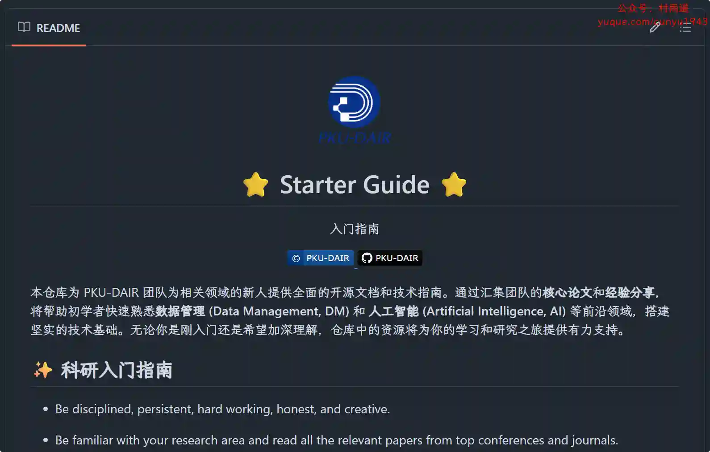

# 好物周刊#112：小云雀

> 作者：[村雨遥](https://github.com/cunyu1943)
> 
> 不要哀求，学会争取，若是如此，终有所获
> 
> 原文：https://mp.weixin.qq.com/s/5B9XSbZZ9hPTI5EDJW-LHA

## 🎈 号外

最近，公众号之外，还建立了微信交流群，不定期会在群里分享各种资源（影视、IT 编程、考试提升……）&知识。如果有需要，可以**扫码或者后台添加小编微信备注入群**。进群后**优先看群公告**，**呼叫群中【资源分享小助手】**，还能免费帮找资源哦～

 

## 一、项目

### 1. [Excel Spring Boot Starter](https://github.com/pig-mesh/excel-spring-boot-starter)

旨在为用户提供一个便捷的 Excel 导出解决方案。基于阿里巴巴的 EasyExcel、FastExcel 库，结合 Spring Boot 框架，封装并优化了 Excel 文件的导出流程，帮助开发者更高效地实现数据导出功能。

### 2. [BallonsTranslator](https://github.com/dmMaze/BallonsTranslator)

深度学习辅助漫画翻译工具，支持一键机翻和简单的图像/文本编辑。

### 3. [Chromium Style QR Code Generator](https://github.com/liuliangsir/chromium-style-qrcode-generator-with-wasm)

一款采用 Rust 和 WebAssembly 技术开发的高性能二维码生成器，该项目将 Rust 的效率与 WebAssembly 的跨平台能力相结合，为 Web 应用提供快速高效的二维码生成。

## 二、软件

### 1. [Billbook 记账](https://billbook.net.cn)

无广告、无后台、无理财，专业的生活记账 App，让记账成为一种习惯。

### 2. [影梭](https://github.com/ZCShou/GoGoGo)

一个基于 Android 调试 API + 百度地图及定位 SDK 实现的安卓定位修改工具，并且同时实现了一个可以自由控制移动的摇杆。使用影梭，不需要 ROOT 权限就可以随意修改自己的当前位置以及模拟移动。

### 3. [小云雀](https://xiaoyunque.jianying.com)

一句话打造一个爆款，一站式智能内容创作工具，覆盖视频、口播、海报、商品图。

## 三、网站

### 1. [MyRingtone](https://myringtone.app)

提供免费高品质铃声下载，包括闹钟铃声、手机铃声、mp3 铃声等。

### 2. [UP 云搜](https://www.upyunso.com)

聚合网盘搜索神器，提供阿里云盘、夸克网盘、百度网盘、蓝奏网盘、迅雷网盘、天翼网盘、彩和网盘 等网盘资源搜索。更新快、资源全、速度快、免费。

### 3. [PicDoc](https://www.picdoc.cn)

一款 AI 驱动的文本到视觉内容转换工具，它能够将文本内容自动转换为图表、流程图、信息图等视觉元素图像。致力于将用户的知识、想法和商业故事以可视化的方式表达出来。

## 四、插件

### 1. [Bilibili AI Skip](https://chromewebstore.google.com/detail/bilibili-ai-skip/lkhedimikicklpjmldabifgkhchnjjan)

通过 AI 识别并自动跳过 Bilibili 视频中植入的广告。它支持字幕和音频分析，能够精准定位广告的开始和结束时间，并提供手动或自动跳过广告的功能。用户可以通过设置 API 密钥和模型来自定义 AI 分析行为。

### 2. [速度测试互联网](https://chromewebstore.google.com/detail/negdhbfcofmoclhhkocljmbkomilkeej?utm_source=item-share-cb)

免费检查互联网下载/上传/ Ping 的速度，并查看互联网提供商是否存在问题。

### 3. [灵办 AI](https://chromewebstore.google.com/detail/kolfmbdanfjanjcfaefoenjhkfkjcekg?utm_source=item-share-cb)

您在任何页面上的个人 AI 助手，可以帮助你翻译各种网页，进行双语对照，为你提供创意灵感，在聊天对话中为你答疑解惑。

## 五、资料

### 1. [Starter Guide](https://github.com/PKU-DAIR/Starter-Guide)

PKU-DAIR 团队为相关领域的新人提供全面的开源文档和技术指南。通过汇集团队的核心论文和经验分享，将帮助初学者快速熟悉数据管理 (Data Management, DM) 和 人工智能 (Artificial Intelligence, AI) 等前沿领域，搭建坚实的技术基础。

### 2. [HumanSystemOptimization](https://github.com/zijie0/HumanSystemOptimization)

健康学习到 150 岁，人体系统调优不完全指南。

### 3. [NKUCS.ICU](https://github.com/NKUCS-ICU/NKUCS.ICU)

南开大学计网经验指北，主要包含经验分享、课程等内容。

## ✍️ 说明

周刊专栏相关信息：

- **项目地址**：[Github](https://github.com/cunyu1943/weekly)，觉得不错麻烦给我一个**Star**，感谢 ❤️
- **浏览地址**：公众号 | [电子书](https://cunyu1943.github.io/weekly) | [语雀](https://yuque.com/cunyu1943/weekly)

如果你阅读到这里，说明我的工作没有白费。如果你想推荐项目/网站/软件/资源，欢迎提交 **[issue](https://github.com/cunyu1943/weekly/issues)** 或者添加我 **个人微信：coder_cunYu** 与我交流。

---

## ⏳ 联系

想解锁更多知识？不妨关注我的微信公众号：**村雨遥（id：JavaPark）**。

扫一扫，探索另一个全新的世界。

