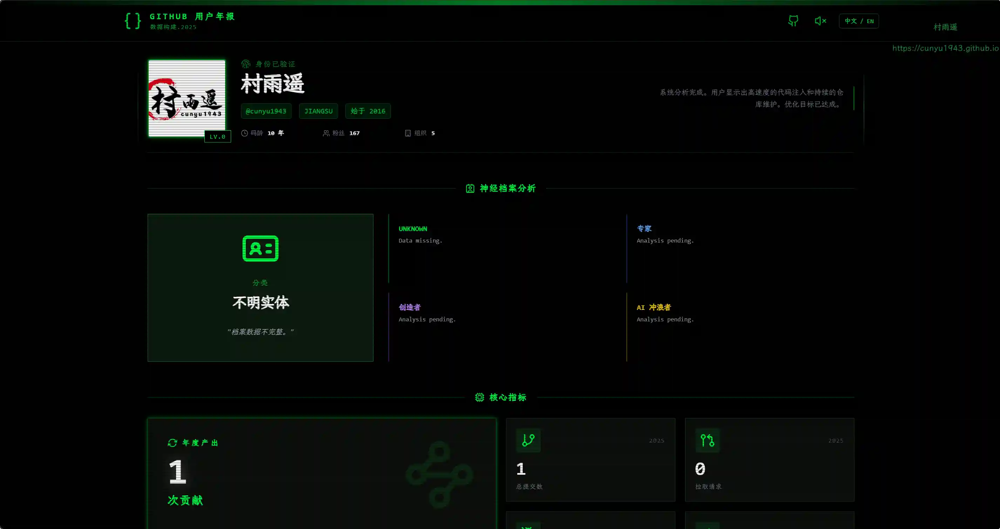
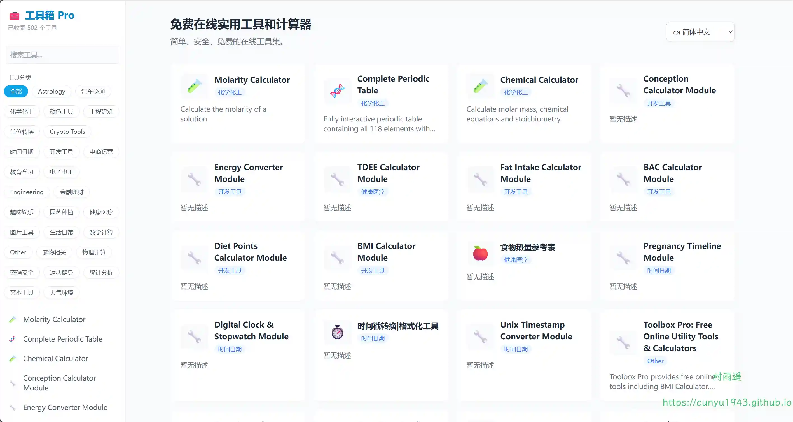
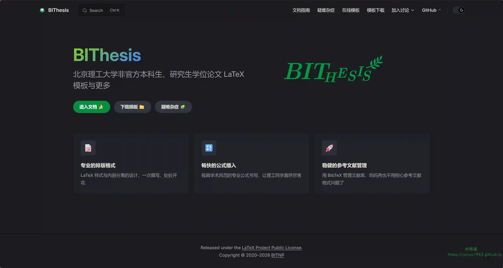
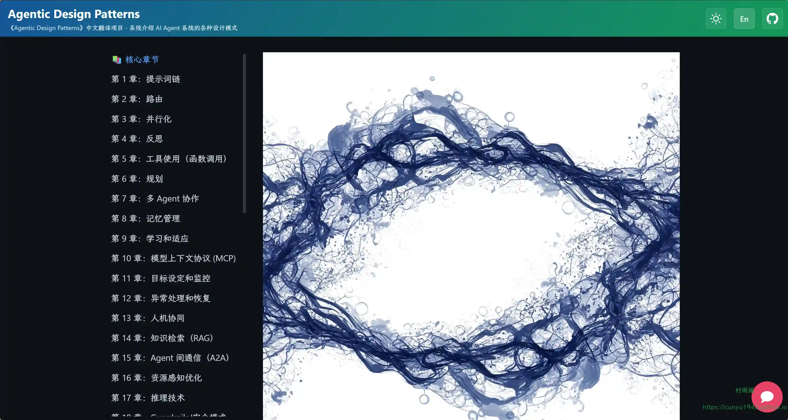

# 好物周刊#139：Github 年度总结

> 作者：[村雨遥](https://github.com/cunyu1943)
> 
> 不要哀求，学会争取，若是如此，终有所获
> 
> 原文：https://mp.weixin.qq.com/s/XiMAWLELF_M1mCqtkT7pWw

## 🎈 号外 

最近，公众号之外，建立了微信交流群，不定期会在群里分享各种资源（影视、IT 编程、考试提升……）&知识。如果有需要，可以**扫码或者后台添加小编微信备注入群**。进群后**优先看群公告**，**呼叫群中【资源分享小助手】**，还能免费帮找资源哦～

## 一、项目

### 1. [Green Wall](https://github.com/Codennnn/Green-Wall)

一个强大的 Web 工具，帮你更轻松地回顾自己在 GitHub 上多年来的贡献记录。它可以把你的贡献数据生成精美的图片，还能提供 AI 驱动的年度报告，方便保存与分享。

### 2. [GitHub 2025 年度总结](https://github.com/liu-ziting/github-year-in-code)

结合 AI 大模型深度解析你的 GitHub 年度数据，生成专属开发者的赛博灵魂名片与代码报告。

### 3. [CyberGit Report](https://github.com/Amery2010/cybergit)

一款沉浸式的、赛博朋克主题的 GitHub 用户年度报告生成器。它通过科幻终端界面可视化你的编程之旅，将原始的 GitHub GraphQL 数据转化为一份令人惊叹的 “网络行者（Netrunner）” 档案。

与标准报告不同，该系统利用 AI 对你的代码风格进行心理分析，根据你的语言使用、提交习惯和项目主题，为你分配独特的人格画像（如 “赛博架构师”、“重构大师”）。

## 二、软件

### 1. [开发速查](https://github.com/jqknono/reference-harmony)

一个将上游「速查表 / 备忘清单」Markdown 预处理为离线卡片数据，并在 HarmonyOS 上以更适合手机阅读的方式展示的应用。

### 2. [GithubNote](https://github.com/xs0521/GithubNote)

一款具有强大编辑功能的个人笔记软件，支持 Github 同步，macOS、Windows 均可使用。

### 3. [WebToApp](https://github.com/shiahonb777/web-to-app)

一款功能强大的 Android 原生应用，让你无需任何编程知识，即可将网站、图片、视频转换为独立的 App。支持直接构建 APK 安装包，真正做到「零门槛出包」。

## 三、网站

### 1. [Emulator Gamer](https://emulatorgamer.com)

免费在线经典模拟器游戏，在浏览器中直接游玩数千款复古经典游戏，无需下载，无需安装。

### 2. [灵猫](https://clearcat.lingxiangtools.top)

一键去除图片水印，支持多平台水印去除：Gemini（Nano Banana）、豆包、可灵、即梦等，AI 智能识别水印位置，无损画质处理，让您的图片焕然一新。

### 3. [工具箱 Pro](https://toolboxpro.top)

免费在线实用工具和计算器，简单、安全、免费的在线工具集。

## 四、插件

### 1. [触词翻译](https://chromewebstore.google.com/detail/tapword-translator-transl/bjcaamcpfbhldgngnfmnmcdkcmdmhebb?utm_source=item-share-cb)

一款为外语阅读者设计的智能划词翻译插件，通过将翻译结果展示在原文下方，提供沉浸式的网页阅读体验。

### 2. [一字幕](https://chromewebstore.google.com/detail/fjbegfkmkcjknjkkcebnejcpdchpadpc?utm_source=item-share-cb)

一款免费的支持多语种的双语的音频、视频字幕的语言学习辅助插件。可按单词，短语，整句翻译；支持(YouTube，Bilibili, 百度网盘 等平台)；亦可支持本地外挂字幕和内嵌字幕。可变速、重复播放、跟读、画面遮挡。

### 3. [XApi](https://chromewebstore.google.com/detail/xapi-http-client-api-test/ilcnglohbiokfdcokfceihebobkpeaij)

支持自动捕获当前页面的 Fetch 与 XHR 网络请求，还能改写 Cookie、Origin、Referer 等字段信息，开发调试神器。

## 五、资料

### 1. [算法通关手册](https://github.com/itcharge/AlgoNote)

从零开始的「算法与数据结构」学习教程，200 道「算法面试热门题目」，1000+ 道「LeetCode 题目解析」。

### 2. [BIThesis](https://github.com/BITNP/BIThesis)

针对北京理工大学本科生毕业设计论文、研究生学位论文的一个非官方的 LaTeX 模板，同时也包括其他本科学习中涉及到的文献综述、实验报告等的 LaTeX 模板。

### 3. [Agentic Design Patterns](https://github.com/xindoo/agentic-design-patterns)

谷歌新书 Agent 设计模式 (agentic design patterns) 中文版，书中系统介绍了 AI Agent 系统的各种设计模式，涵盖从基础到高级的 21 个核心模式，以及多个附录章节。

## ✍️ 说明

周刊专栏相关信息：

- **项目地址**：[Github](https://github.com/cunyu1943/weekly)，觉得不错麻烦给我一个**Star**，感谢 ❤️
- **浏览地址**：公众号 | [电子书](https://cunyu1943.github.io/weekly) | [语雀](https://yuque.com/cunyu1943/weekly)

如果你阅读到这里，说明我的工作没有白费。如果你想推荐项目/网站/软件/资源，欢迎提交 **[issue](https://github.com/cunyu1943/weekly/issues)** 或者添加我 **个人微信：coder_cunYu** 与我交流。

---

## ⏳ 联系

想解锁更多知识？不妨关注我的微信公众号：**村雨遥（id：JavaPark）**。

扫一扫，探索另一个全新的世界。

