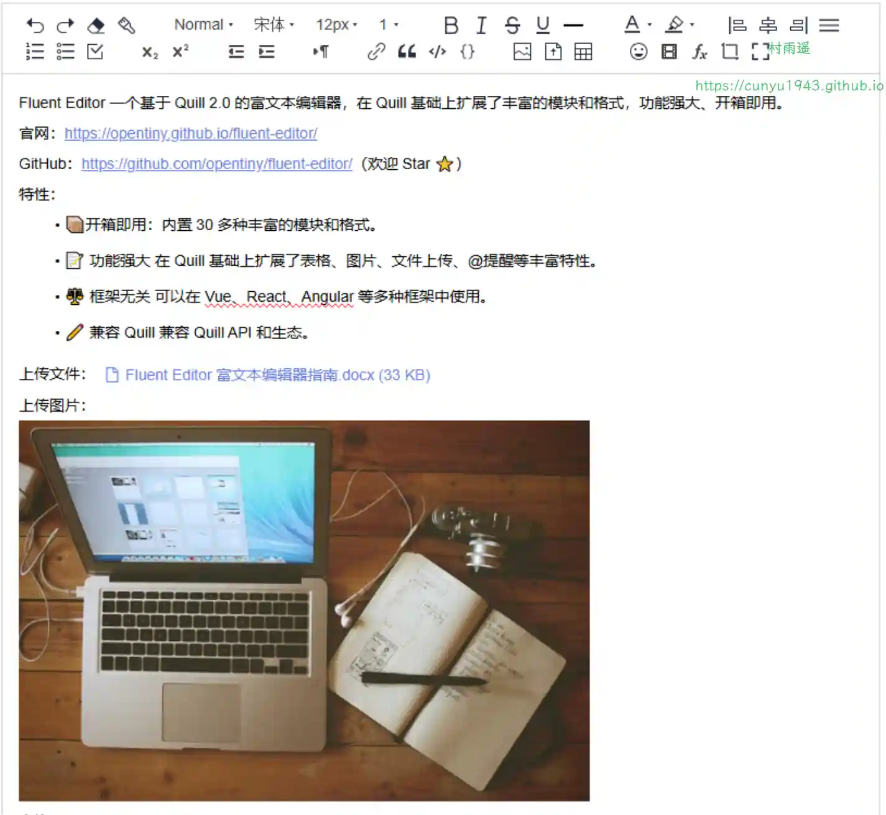
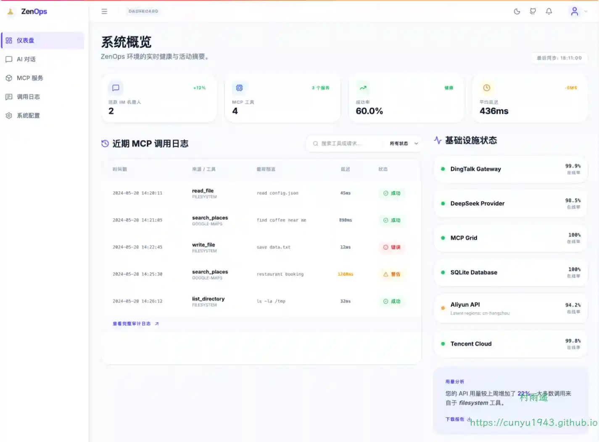
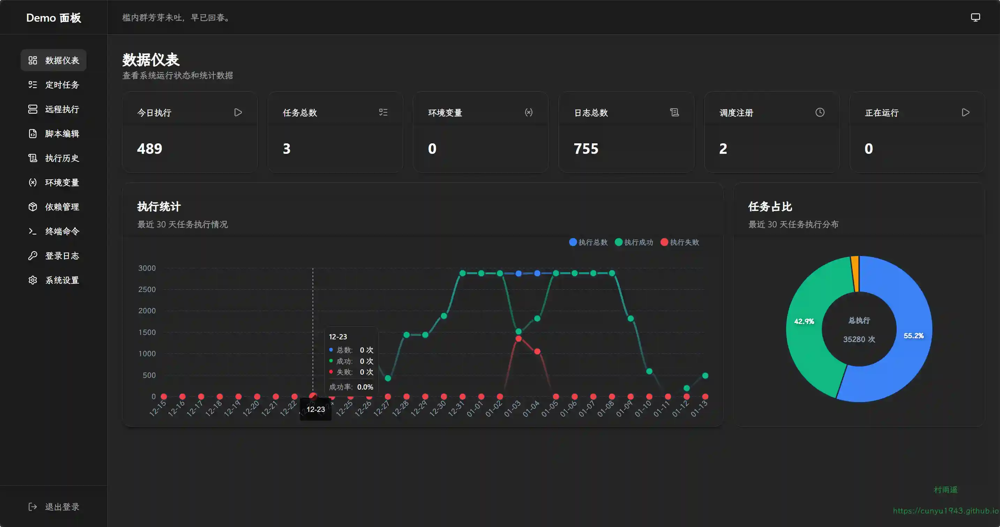
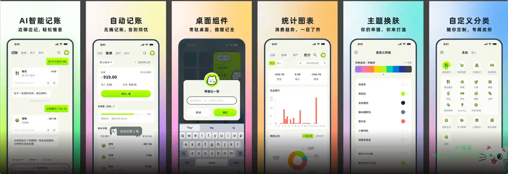
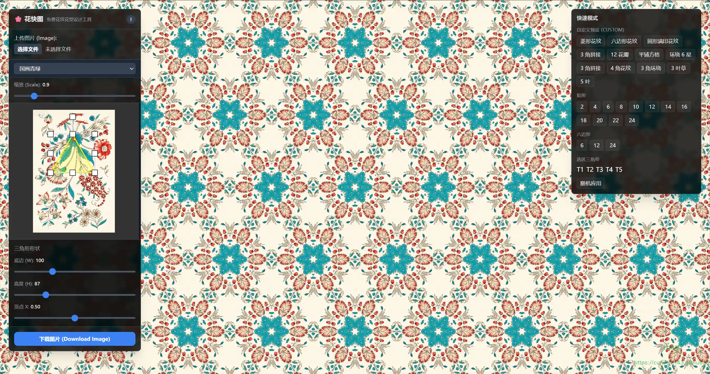
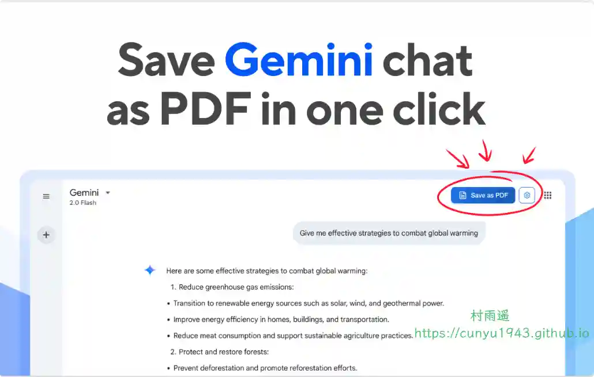
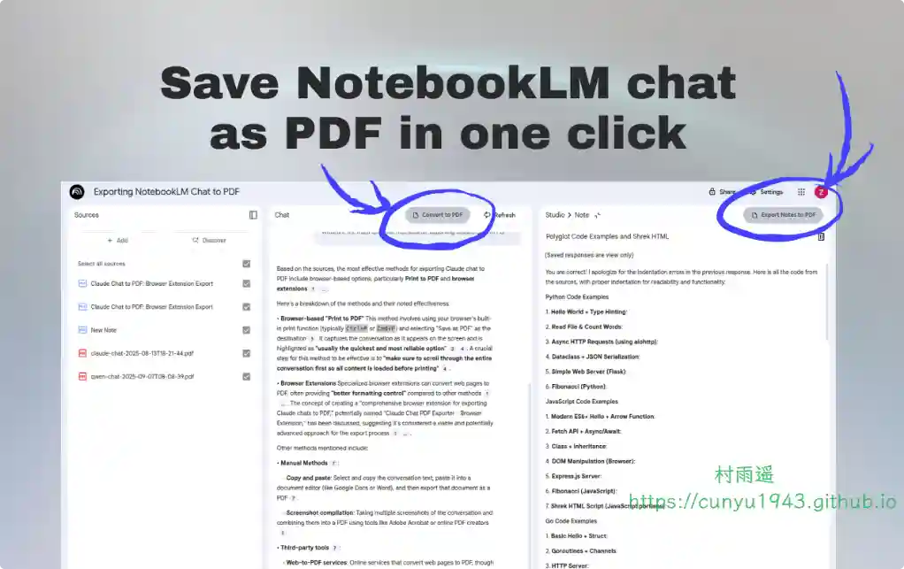
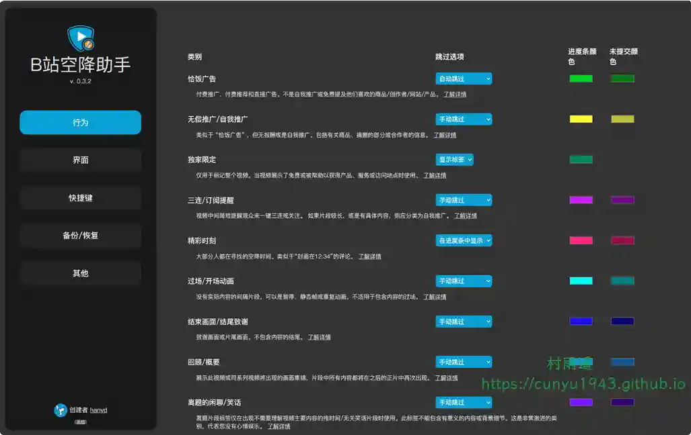
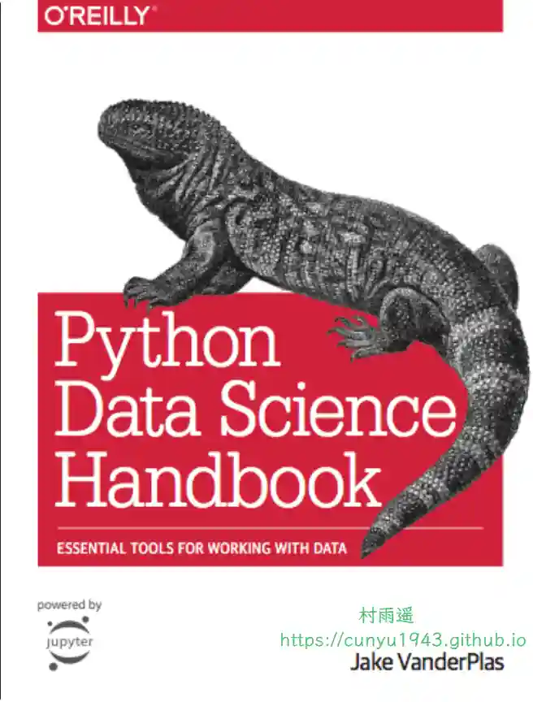

# 好物周刊#140：乖猫记账

> 作者：[村雨遥](https://github.com/cunyu1943)
> 
> 不要哀求，学会争取，若是如此，终有所获
> 
> 原文：https://mp.weixin.qq.com/s/-jnMgtTIU0B__7Iu402uDA

## 🎈 号外 

最近，公众号之外，建立了微信交流群，不定期会在群里分享各种资源（影视、IT 编程、考试提升……）&知识。如果有需要，可以**扫码或者后台添加小编微信备注入群**。进群后**优先看群公告**，**呼叫群中【资源分享小助手】**，还能免费帮找资源哦～

## 一、项目

### 1. [TinyEditor](https://github.com/opentiny/tiny-editor)

一个基于 Quill 2.0 的富文本编辑器，在 Quill 基础上扩展了表格、图片、超链接、复制粘贴、插入表情、文件上传、@提醒、斜杆菜单等丰富的模块和格式，框架无关、兼容 Quill API、兼容 Quill 模块生态。

### 2. [ZenOps](https://github.com/opsre/ZenOps)

一个面向运维领域的数据智能化查询工具，通过统一的接口抽象，支持多云平台 (阿里云、腾讯云等云资源)、CI / CD 工具 (Jenkins 等各种运维领域常见工具) 的资源查询，并通过 CLI、HTTP API 和 MCP 协议提供多种访问方式，同时集成钉钉、飞书、企微智能机器人实现对话式查询。

### 3. [白虎面板](https://github.com/engigu/baihu-panel)

一个轻量级定时任务管理系统，基于Go +Vue3 构建，docker或者docker-compose，内置python3、nodejs、bash环境，开箱即用。

## 二、软件

### 1. [乖猫记账](https://tushuoit.com/gmjz)

一款 AI 智能记账应用，提供聊天式记账、语音输入、自动分类、微信绑定等功能，让记账更轻松便捷，智能统计分析助您轻松掌握财务状况。注册输入邀请码: **GMUBK93Y，即可获得 30 天会员，同时购买会员，享受 9 折优惠哦～**

### 2. [VocoType](https://vocotype.com)

一款专为注重隐私和效率的专业人士打造的离线语音输入法。100% 本地运行，0.1 秒极速响应，支持中英混合精准识别。提供音视频转录、SRT 字幕导出、AI 润色和自定义词典功能。完全免费开源，您的声音数据绝不上传云端，是 Windows 和 macOS 用户的隐私安全首选工具。

### 3. [Fiime 浏览器](https://lite.fiime.cn)

更低内存占用、更优 CPU 调度、更顺滑的透明化窗口体验。支持 Chrome 书签导入、窗口置顶等桌面级能力。

## 三、网站

### 1. [哲风壁纸](https://haowallpaper.com)

4K 高清壁纸，电脑背景图片，支持免费下载。

### 2. [云幕同声](https://www.yunmuts.com)

原声级 Ai 视频翻译。

### 3. [花快图](https://hua.kuaitu.cc)

提供免费在线花型设计服务，支持快速生成四方连续纹样与万花筒图案，适用于纺织印花、面料设计与 3D 效果预览，无需下载软件即可完成设计。

## 四、插件

### 1. [Gemini to PDF](https://chromewebstore.google.com/detail/ai-chat-to-pdf/nlfkaldinolmacagmiddfpnfaeclfibn)

将你的 Gemini AI 对话转换为精美格式的 PDF，使用该工具来保存和分享宝贵的 Gemini 交互内容。无论是存档研究讨论、保存创意思维碰撞，还是记录技术解决方案，Gemini to PDF 都能每次都呈现完美结果！  

### 2. [NotebookLM 转为 PDF](https://chromewebstore.google.com/detail/notebooklm-to-pdf/micfpbhlllbdpgdkkgdimdpmpeefoamk)

使用 NotebookLM 聊天，并将将您的 NotebookLM AI 对话转换为格式优雅的 PDF 文档保存。

### 3. [小电视空降助手](https://chromewebstore.google.com/detail/eaoelafamejbnggahofapllmfhlhajdd?utm_source=item-share-cb)

带你精准空降到赞助广告结束或者高能时刻，自动跳过视频中的赞助广告、订阅提醒等片段。你也可以亲自标记视频中的广告并上传，所有人都会从您的贡献中受益。

## 五、资料

### 1. [Coding Interview University](https://github.com/jwasham/coding-interview-university)

面向广大程序员的刷题和面试学习计划。

### 

### 2. [The fastai book](https://github.com/fastai/fastbook)

包含了对深度学习，fastai，以及 PyTorch 的介绍，兼顾理论与实践。

### 3. [Python Data Science Handbook](https://github.com/jakevdp/PythonDataScienceHandbook)

Python 数据科学手册，包含 Numpy、Pandas、Matplotlib 等工具库的示例。

## ✍️ 说明

周刊专栏相关信息：

- **项目地址**：[Github](https://github.com/cunyu1943/weekly)，觉得不错麻烦给我一个**Star**，感谢 ❤️
- **浏览地址**：公众号 | [电子书](https://cunyu1943.github.io/weekly) | [语雀](https://yuque.com/cunyu1943/weekly)

如果你阅读到这里，说明我的工作没有白费。如果你想推荐项目/网站/软件/资源，欢迎提交 **[issue](https://github.com/cunyu1943/weekly/issues)** 或者添加我 **个人微信：coder_cunYu** 与我交流。

---

## ⏳ 联系

想解锁更多知识？不妨关注我的微信公众号：**村雨遥（id：JavaPark）**。

扫一扫，探索另一个全新的世界。

