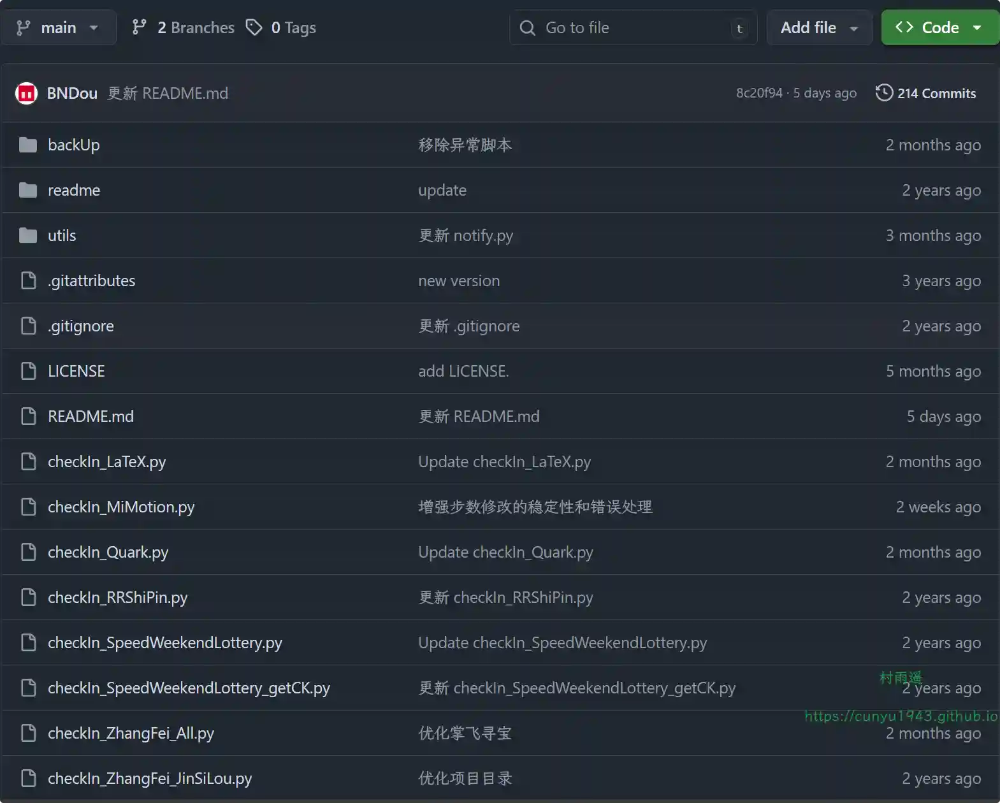
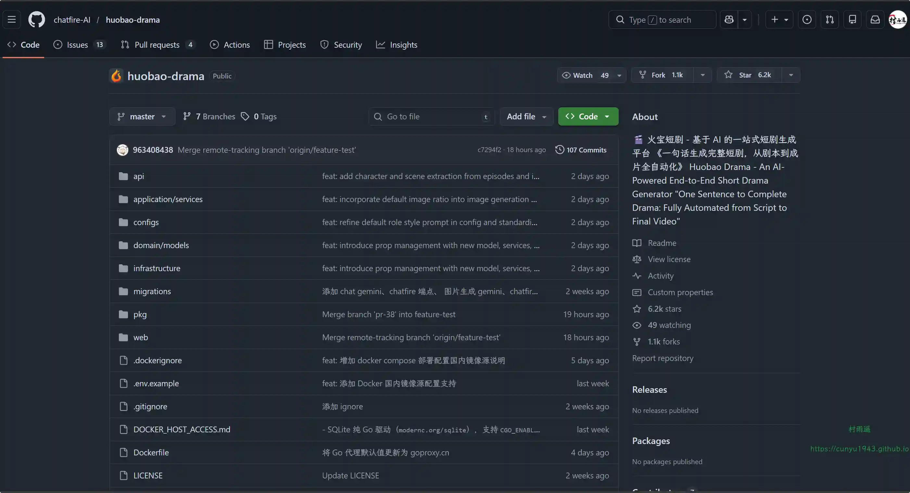
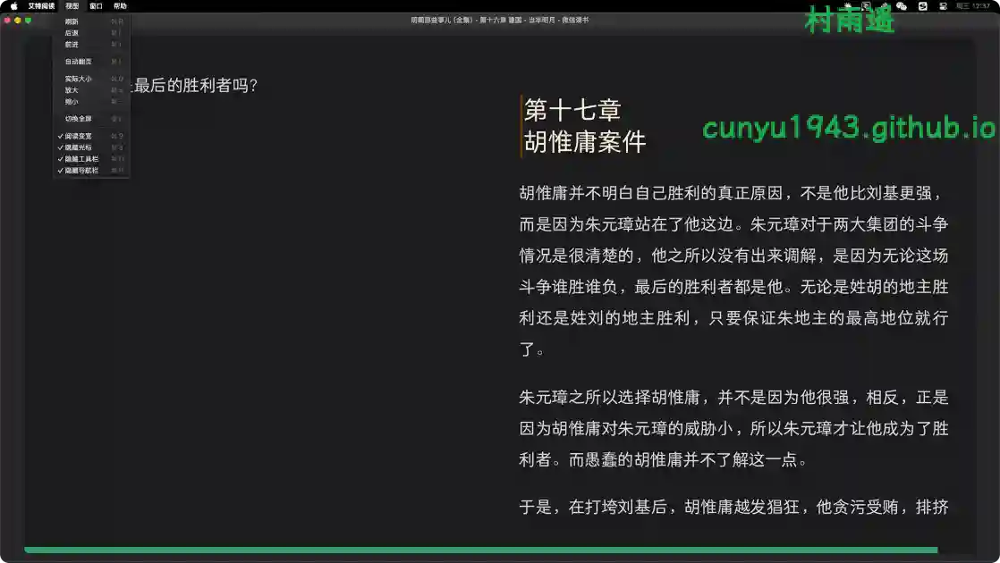
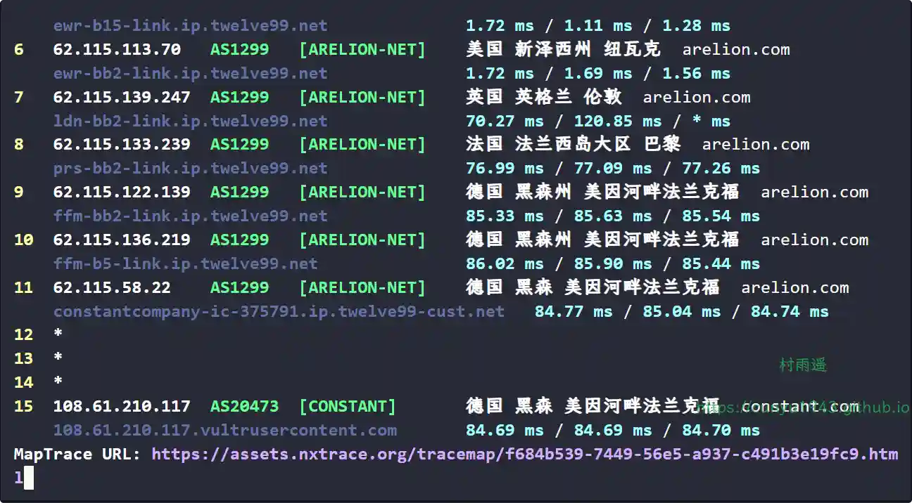
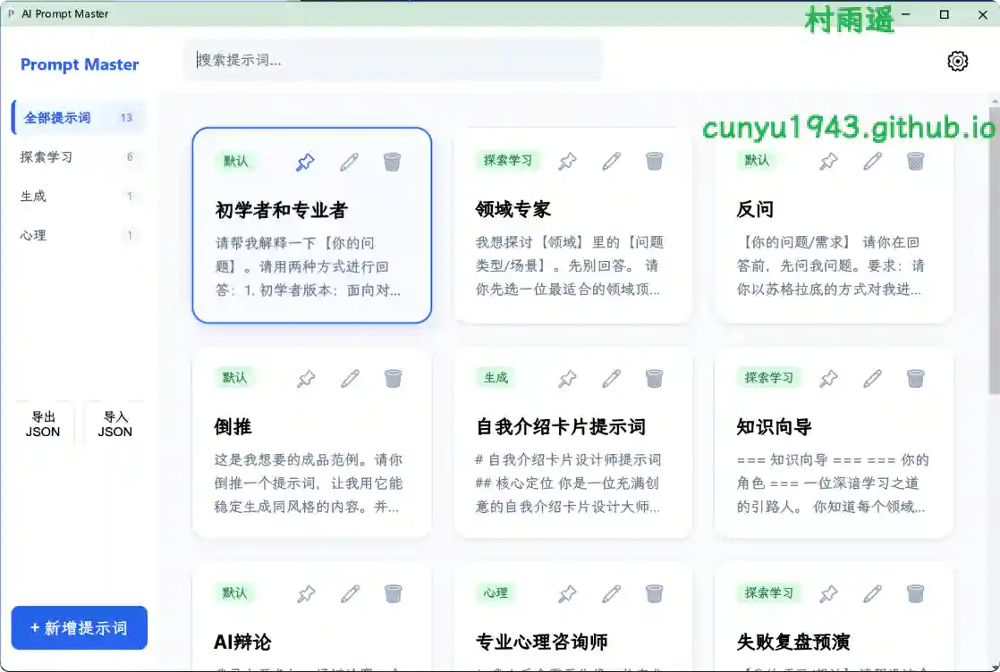
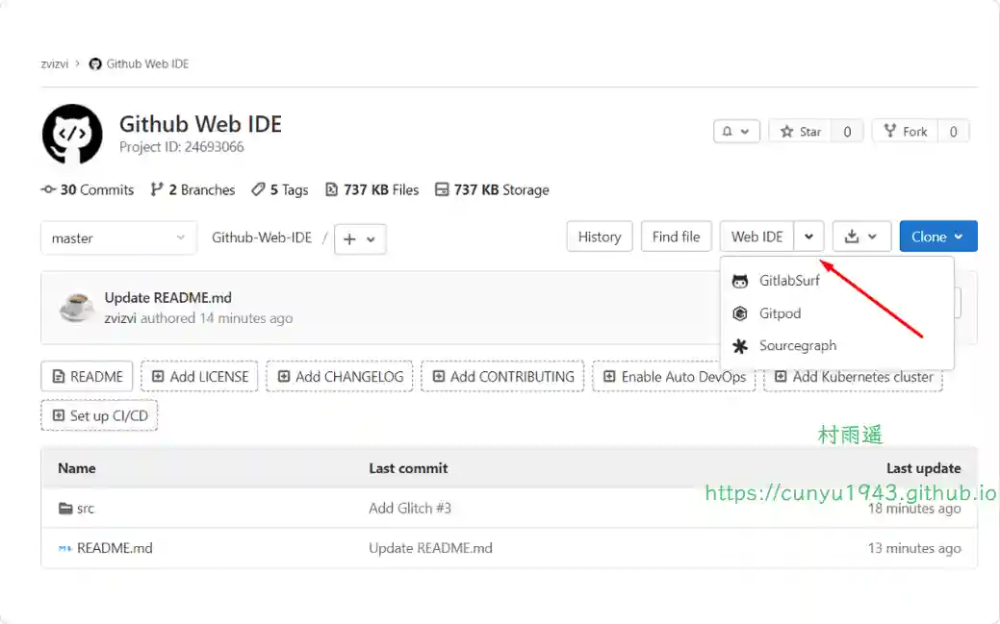
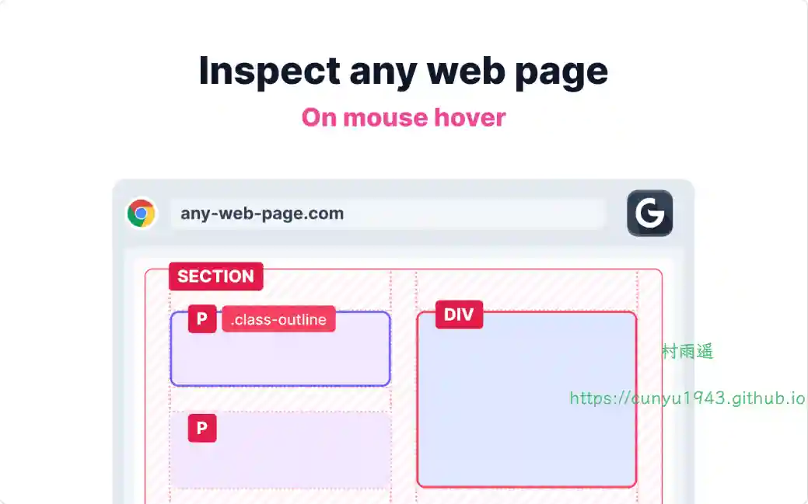
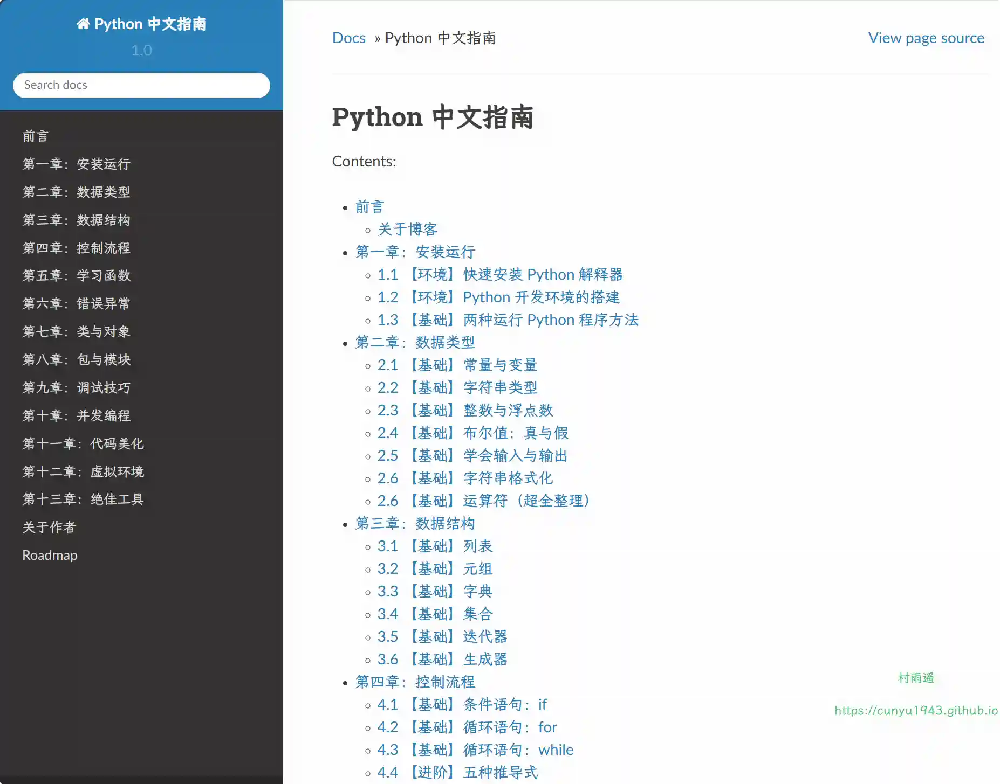
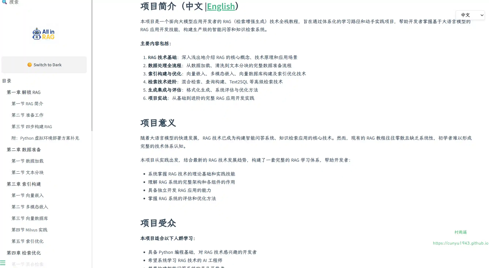
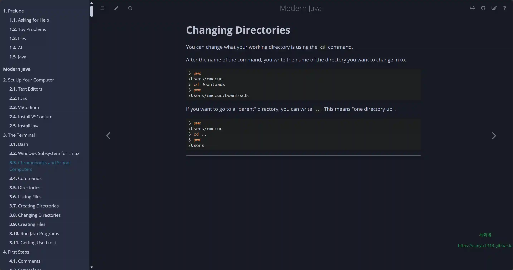

# 好物周刊#141：Python 中文指南

> 作者：[村雨遥](https://github.com/cunyu1943)
> 
> 不要哀求，学会争取，若是如此，终有所获
> 
> 原文：https://mp.weixin.qq.com/s/GRLrLdItTrsI0HhCBKCP6Q

## 🎈 号外 

最近，公众号之外，建立了微信交流群，不定期会在群里分享各种资源（影视、IT 编程、考试提升……）&知识。如果有需要，可以**扫码或者后台添加小编微信备注入群**。进群后**优先看群公告**，**呼叫群中【资源分享小助手】**，还能免费帮找资源哦～

## 一、项目

### 1. [OneLook](https://github.com/QingJ01/onelook)

一款专注于沉浸式创作的思维导图应用。它摒弃了繁杂的 UI 干扰，结合了 Markdown 的流畅输入与 SVG 的高性能渲染，为您提供所见即所得的思考空间。数据完全存储于本地，隐私无忧。

### 2. [Auto_Check_In](https://github.com/BNDou/Auto_Check_In)

每日自动签到集合，支持掌上飞车、夸克网盘、人人视频、小米运动、LaTeX 工作室等平台。

### 3. [Huobao Drama](https://github.com/chatfire-AI/huobao-drama)

一个基于 AI 的短剧自动化生产平台，实现从剧本生成、角色设计、分镜制作到视频合成的全流程自动化。

## 二、软件

### 1. [咔皮记账](https://heylumi.cn)

你的 AI 财务助手，支持语音记账、AI 自动记账、可视化财务报告等多项免费功能。

### 2. [艾特阅读桌面版](https://github.com/dengcb/weixin-reader-desktop)

轻量级微信读书客户端，体积小，页面宽，自动翻页，体验增强。

### 3. [NextTrace](https://github.com/nxtrace/NTrace-core)

一款由 Golang 实现的开源轻量级可视化路由追踪工具，支持 Windows、macOS 以及 Linux 平台。

## 三、网站

### 1. [GuardSSL](https://guardssl.info/zh-CN)

1 秒出结果的 SSL 证书检测工具，无需注册。7×24 小时监控 SSL 过期，支持飞书、Slack、Discord、Telegram 自动提醒，永久免费。

### 2. [未知搜索](https://projext.run)

搜索全网最新影视资源，覆盖高清动漫、热门电影、热播电视剧、综艺、美剧、韩剧等剧集与影片。支持在线播放、无广告秒加载、中文字幕齐全，体验流畅不卡顿，免费下载不等待。无论是追新番、刷热剧还是重温经典，这里都是你的影视始发站。

### 3. [AI 资源帮](https://ai-zyb.com)

全网首发的 Ai 资源搜索 Agent，基于人工智能技术实现全网各领域资源的智能分类检索整理。一键搜索影视、软件、音乐、电子书、教程、游戏等海量优质资源。

## 四、插件

### 1. [prompt-master](https://github.com/fantasyao/prompt-master)

一键搜索、管理你的 AI 提示词，支持全键盘高效操作，对鼠标也友好，支持一键点击复制。

### 2. [GitHub Web IDE](https://chromewebstore.google.com/detail/github-web-ide/adjiklnjodbiaioggfpbpkhbfcnhgkfe)

通过添加便捷的下拉菜单来增强您的 GitHub 使用体验。您可以直接在浏览器中访问 GitHub Dev、VS Code Dev 或 CodeSandbox 等常用的在线集成开发环境 (IDE)，从而无缝地查看代码并与之交互。

### 3. [Gridman](https://chromewebstore.google.com/detail/dimensions-inspect-gridma/cmplbmppmfboedgkkelpkfgaakabpicn)

前端开发人员的瑞士军刀，每个前端开发者必备的 Chrome 扩展程序，旨在提升您的工作效率，改善您的编码体验。

## 五、资料

### 1. [Python 中文指南](https://github.com/iswbm/python-guide)

从零到一的零基础 Python 教程。

### 2. [RAG 技术全栈指南](https://github.com/datawhalechina/all-in-rag)

一个面向大模型应用开发者的 RAG（检索增强生成）技术全栈教程，旨在通过体系化的学习路径和动手实践项目，帮助开发者掌握基于大语言模型的 RAG 应用开发技能，构建生产级的智能问答和知识检索系统。

### 3. [Modern Java](https://github.com/Together-Java/ModernJava)

面向初学者的现代 Java 教程，内容基于 Java 21。

## ✍️ 说明

周刊专栏相关信息：

- **项目地址**：[Github](https://github.com/cunyu1943/weekly)，觉得不错麻烦给我一个**Star**，感谢 ❤️
- **浏览地址**：公众号 | [电子书](https://cunyu1943.github.io/weekly) | [语雀](https://yuque.com/cunyu1943/weekly)

如果你阅读到这里，说明我的工作没有白费。如果你想推荐项目/网站/软件/资源，欢迎提交 **[issue](https://github.com/cunyu1943/weekly/issues)** 或者添加我 **个人微信：coder_cunYu** 与我交流。

---

## ⏳ 联系

想解锁更多知识？不妨关注我的微信公众号：**村雨遥（id：JavaPark）**。

扫一扫，探索另一个全新的世界。

