# 好物周刊#142：字体库

> 作者：[村雨遥](https://github.com/cunyu1943)
> 
> 不要哀求，学会争取，若是如此，终有所获
> 
> 原文：https://mp.weixin.qq.com/s/i69fQgZG8B-hCwpC5wfo3g

## 🎈 号外 

最近，公众号之外，建立了微信交流群，不定期会在群里分享各种资源（影视、IT 编程、考试提升……）&知识。如果有需要，可以**扫码或者后台添加小编微信备注入群**。进群后**优先看群公告**，**呼叫群中【资源分享小助手】**，还能免费帮找资源哦～

## 一、项目

### 1. [Anchor](https://github.com/zhfahim/anchor)

一个离线优先、支持自托管的跨端笔记应用仓库，主打隐私性、速度、简洁性和可靠性，覆盖网页端与移动端，核心特点是笔记本地存储、离线可编辑，联网时自动跨设备同步。

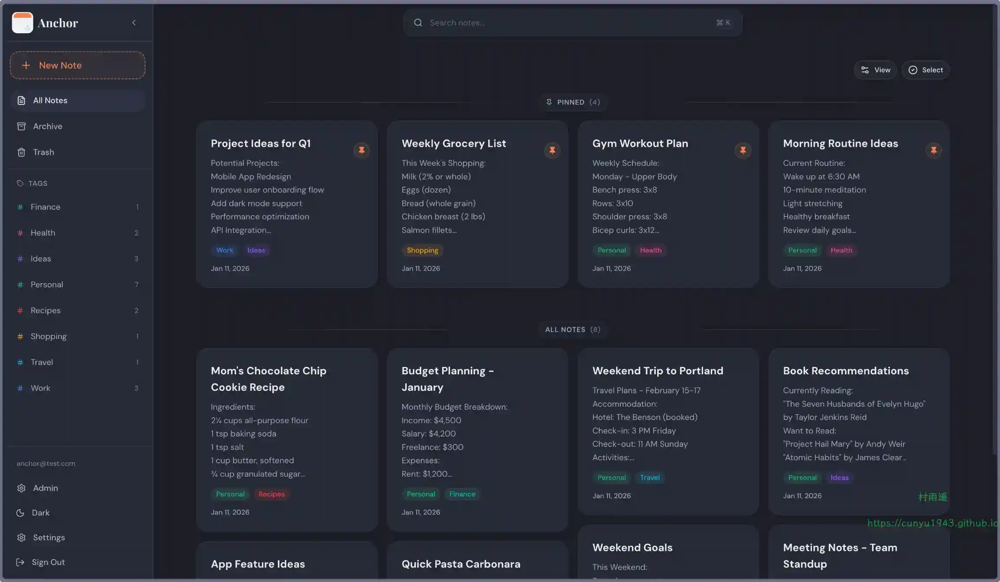

### 2. [Zotero PDF2zh](https://github.com/guaguastandup/zotero-pdf2zh)

一款面向 Zotero 文献管理器的开源 PDF 自动翻译插件，核心能力是在 Zotero 内一键将外文 PDF（以英文为主）翻译成中文，支持生成纯中文或中英双语对照版 PDF，同时保留原始排版、公式与图表，极大提升科研人员、学生阅读外文文献的效率。

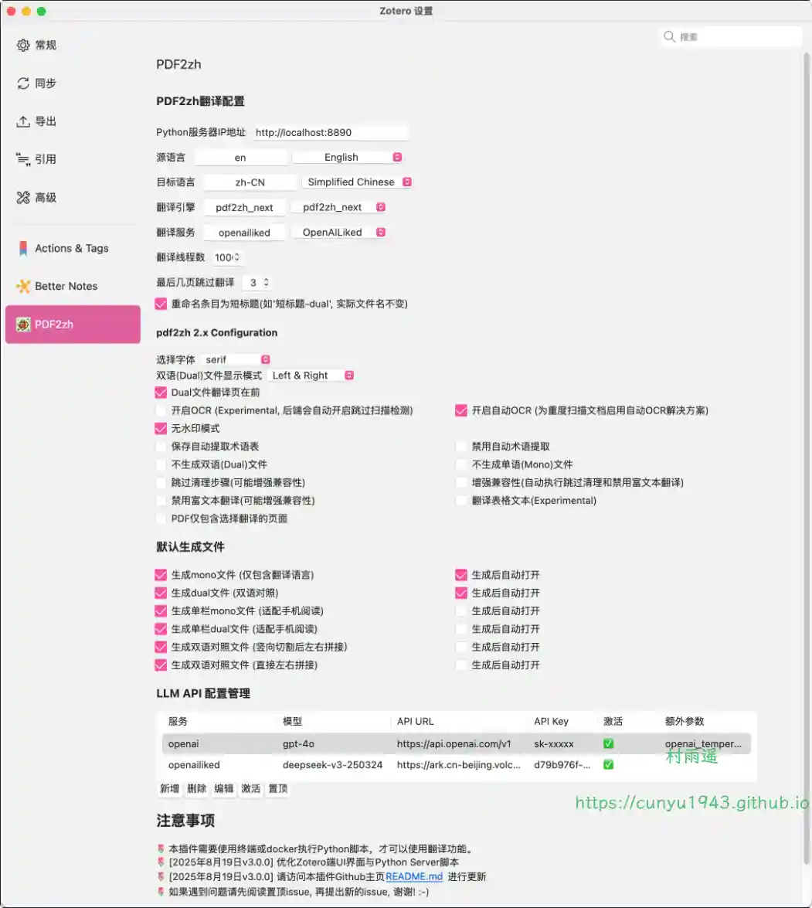

### 3. [MeiamSubtitles](https://github.com/91270/MeiamSubtitles)

一款专为 Emby 和 Jellyfin 媒体服务器打造的中文字幕下载插件。它集成了迅雷影音与射手网的强大搜索能力，支持精准的视频哈希（Hash）匹配，让您的媒体库自动补全高质量字幕。

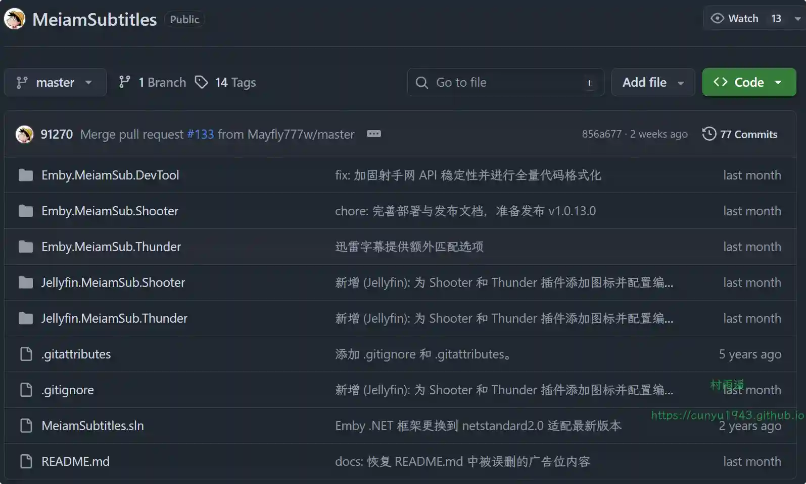

## 二、软件

### 1. [Espanso](https://github.com/espanso/espanso)

基于 Rust 开发，隐私优先的跨平台文本扩展工具。

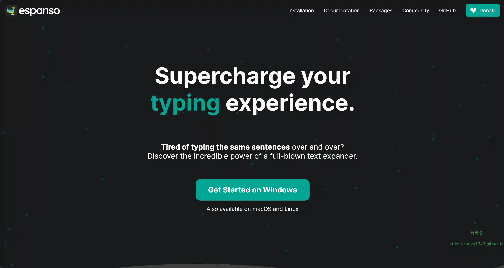

### 2. [Flow Launcher](https://github.com/Flow-Launcher/Flow.Launcher)

Windows 快速文件搜索和应用启动器，支持插件。

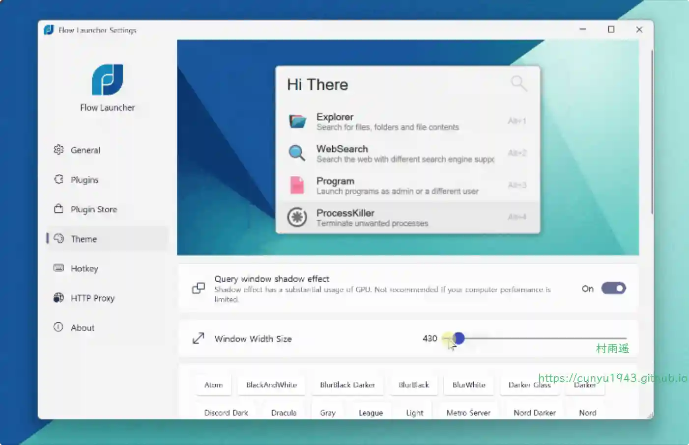

### 3. [ZenSSH](https://github.com/kisChang/ZenSSH)

一款基于 Tauri 构建的全平台 SSH 客户端，支持 SSH 连接与 SFTP 文件传输，支持跳板机，专注于提供简洁、稳定、易用的核心功能体验。

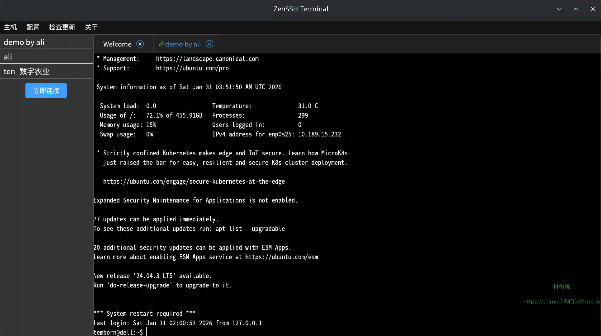

## 三、网站

### 1. [NewsNow](https://hot.ittools.cc)

实时新闻聚合阅读器，汇集全球热点新闻，提供优雅的阅读体验

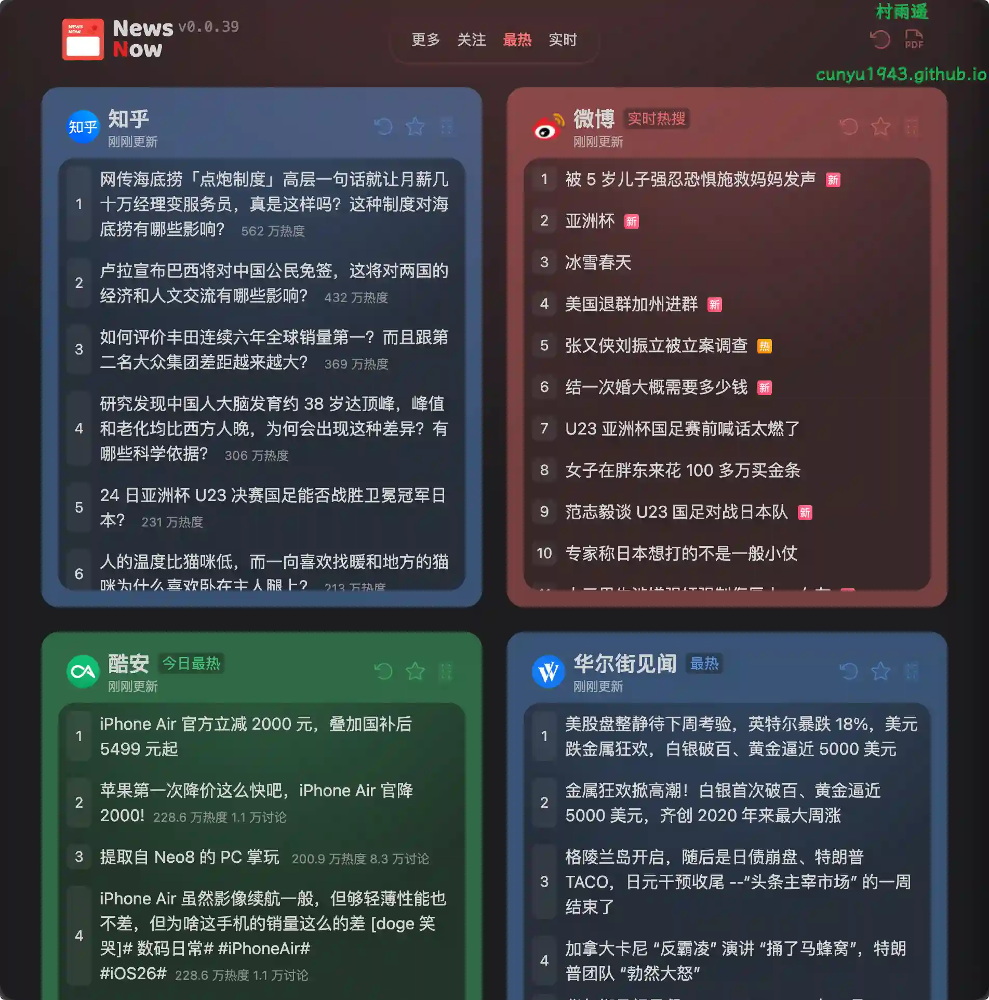

### 2. [字体库](https://zitiku.org)

高品质免费商用字体库，探索我们精心挑选的 1000 + 免费商用字体，适用于任何设计项目。

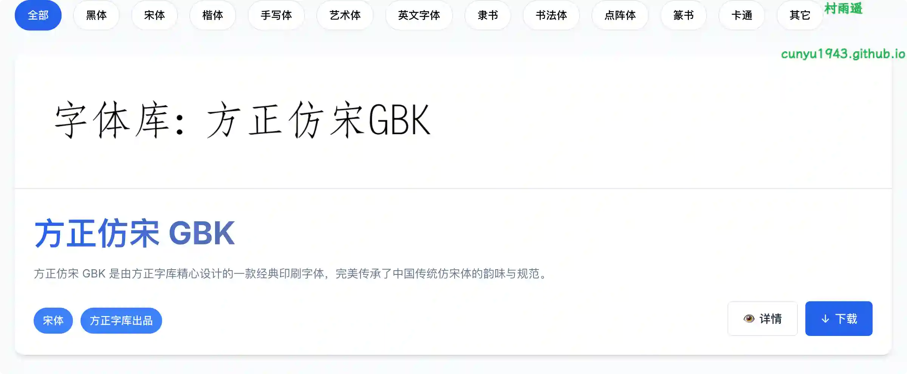

### 3. [ScreenshotSnap](https://screenshotsnap.com)

免费的网站截图 API 服务。使用我们的 website screenshot generator 在线捕获任何网页截图。支持 WebP/PNG 格式，全球 CDN 加速，毫秒级响应。

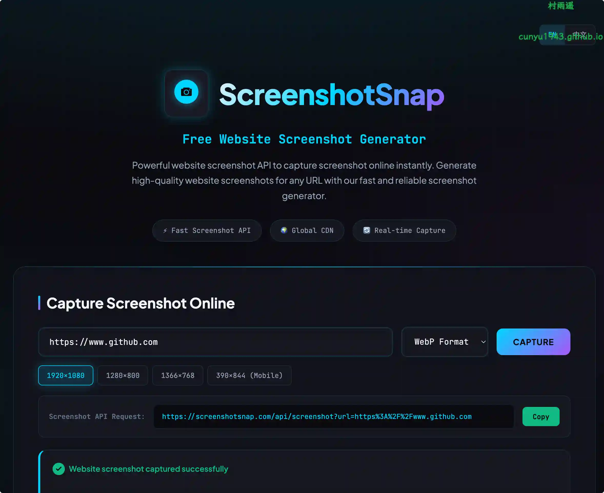

## 四、插件

### 1. [Ad Block Wonder](https://chromewebstore.google.com/detail/ad-block-wonder-stop-ads/fpkbnjejghdcncegfglnapabnljcimdc)

在您喜欢的网站上拦截广告和弹窗，告别疯狂的弹窗广告。

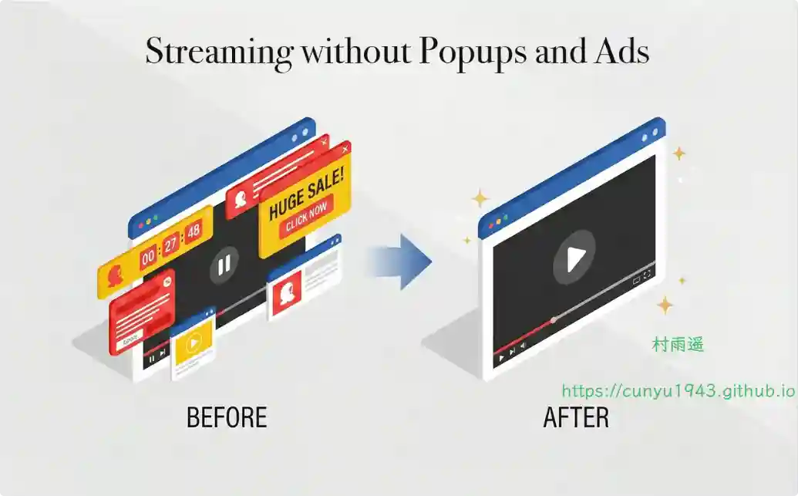

### 2. [U-Eyes：移动模拟器](https://chromewebstore.google.com/detail/u-eyes-mobile-simulator/pjldgnhfobpnhbdmfmofkfppdilefnjj)

为开发者、设计师、QA 测试人员和市场营销人员设计的终极移动模拟器，提供一体化的工具包，直接集成到您的 Chrome 浏览器中，以无与伦比的便捷和准确性测试、捕捉和分享您的响应式网页设计。

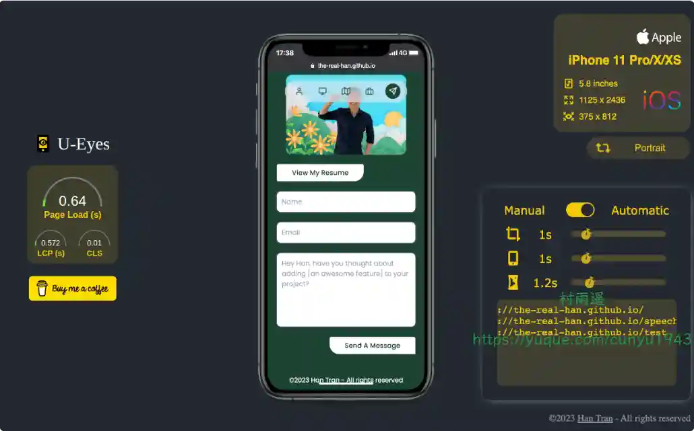

### 3. [心流鼠标手势](https://chromewebstore.google.com/detail/fnldhkfidchnjiokpoemdhoejmaojkgp?utm_source=item-share-cb)

一款追求极致流畅与隐私保护的开源 Chrome 鼠标手势扩展。通过自然的鼠标滑动，助您无缝操控浏览器，真正进入专注高效的“心流”状态。

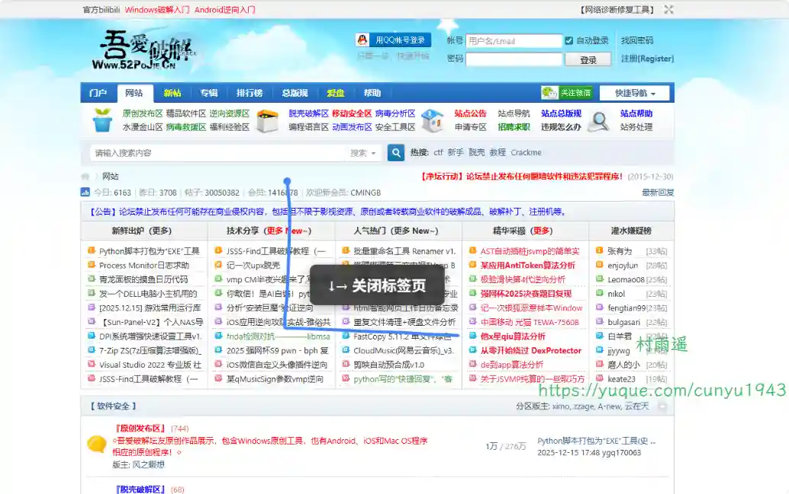

## 五、资料

### 1. [Vibe coding from 0 to 1](https://github.com/datawhalechina/easy-vibe)

把想法做成真正能上线的产品，首个交互式教程，零基础也能学会的 AI 编程实战。

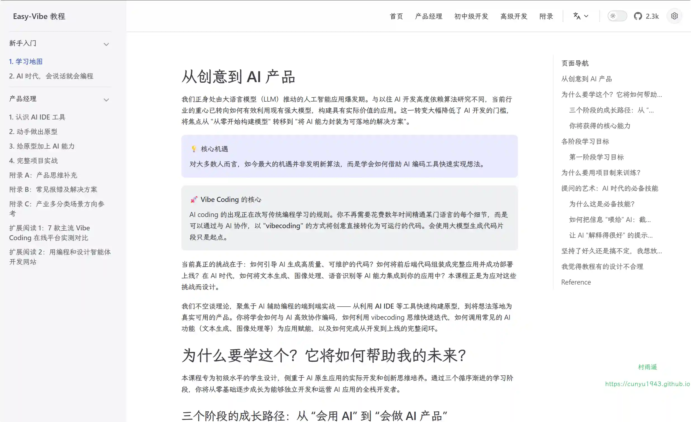

### 2. [Chrome 插件英雄榜](https://github.com/zhaoolee/ChromeAppHeroes)

为优秀的 Chrome 插件写一本中文说明书, 让 Chrome 插件英雄们造福人类。

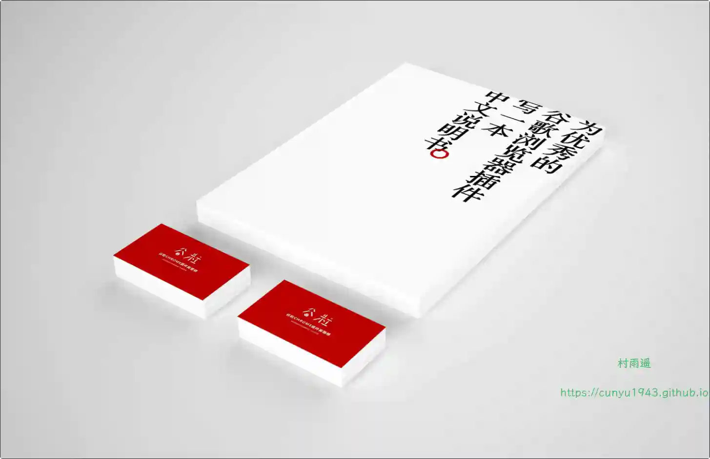

### 3. [最全中文诗歌古典文集数据库](https://github.com/chinese-poetry/chinese-poetry)

最全中华古诗词数据库，唐宋两朝近一万四千古诗人，接近 5.5 万首唐诗加 26 万宋诗，两宋时期 1564 位词人，21050 首词。

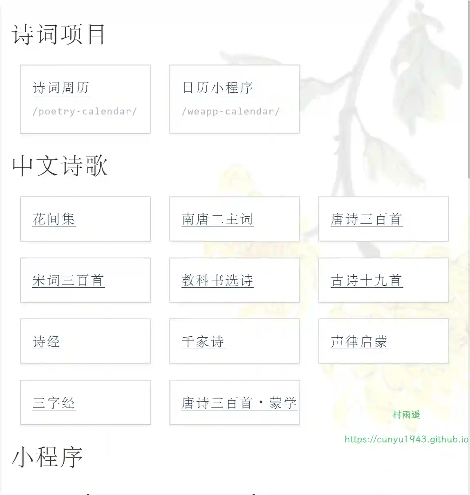

## ✍️ 说明

周刊专栏相关信息：

- **项目地址**：[Github](https://github.com/cunyu1943/weekly)，觉得不错麻烦给我一个**Star**，感谢 ❤️
- **浏览地址**：公众号 | [电子书](https://cunyu1943.github.io/weekly) | [语雀](https://yuque.com/cunyu1943/weekly)

如果你阅读到这里，说明我的工作没有白费。如果你想推荐项目/网站/软件/资源，欢迎提交 **[issue](https://github.com/cunyu1943/weekly/issues)** 或者添加我 **个人微信：coder_cunYu** 与我交流。

---

## ⏳ 联系

想解锁更多知识？不妨关注我的微信公众号：**村雨遥（id：JavaPark）**。

扫一扫，探索另一个全新的世界。

