# 好物周刊#143：小蜜蜂影视

> 作者：[村雨遥](https://github.com/cunyu1943)
> 
> 不要哀求，学会争取，若是如此，终有所获
> 
> 原文：https://mp.weixin.qq.com/s/PYJVa8K3Ef2zTTNpygksjQ

## 🎈 号外 

最近，公众号之外，建立了微信交流群，不定期会在群里分享各种资源（影视、IT 编程、考试提升……）&知识。如果有需要，可以**扫码或者后台添加小编微信备注入群**。进群后**优先看群公告**，**呼叫群中【资源分享小助手】**，还能免费帮找资源哦～

## 一、项目

### 1. [BookLore](https://github.com/booklore-app/booklore)

一款功能强大的自托管 Web 应用程序，旨在优雅轻松地组织和管理您的个人图书收藏。通过直观的界面、强大的元数据管理和无缝的多用户支持构建您的图书馆。

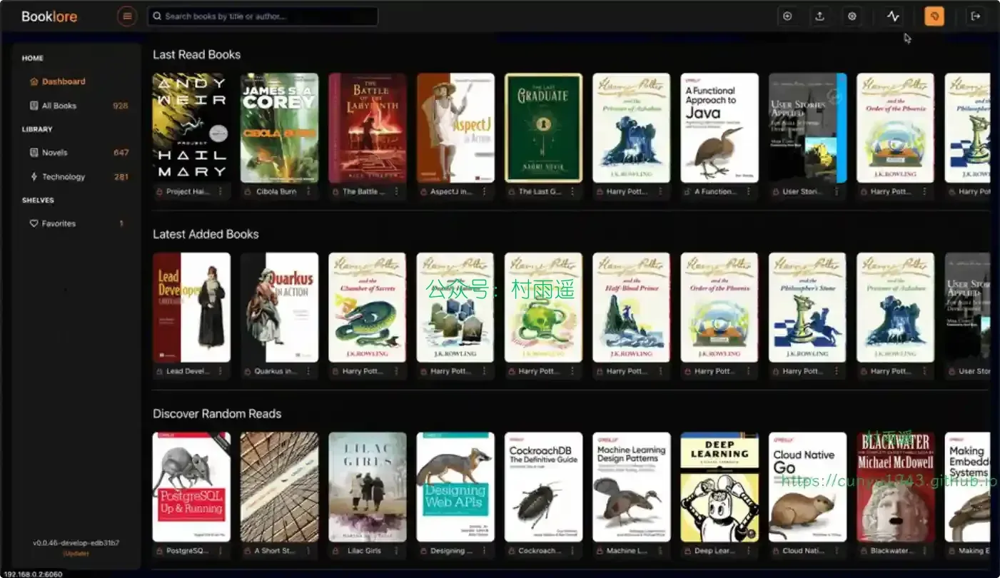

### 2. [Wallos](https://github.com/ellite/Wallos)

一个开源、自托管的个人订阅跟踪类 Web 应用，旨在帮助用户轻松管理财务，替代复杂的电子表格和付费财务软件，核心聚焦于订阅支出的追踪与管理，由社区驱动开发并遵循 GPLv3 开源协议。

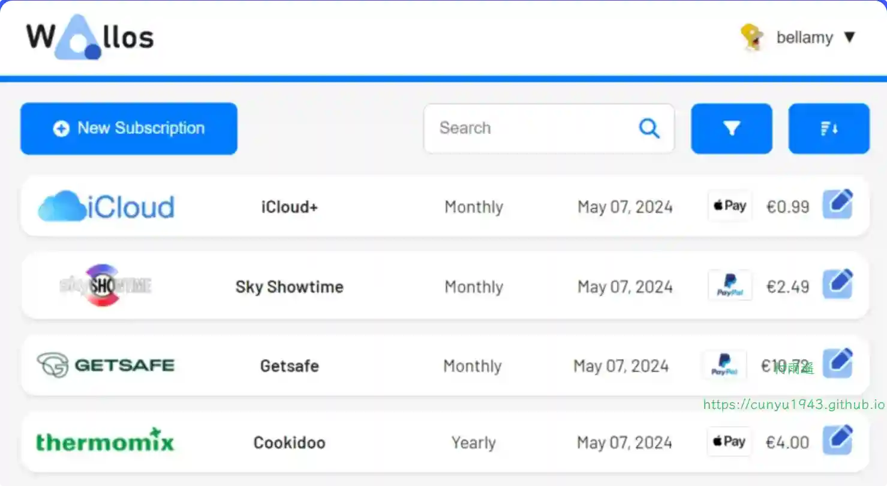

### 3. [ 股票智能分析系统](https://github.com/ZhuLinsen/daily_stock_analysis)

LLM 驱动的 A/H/美股智能分析器，多数据源行情 + 实时新闻 + Gemini 决策仪表盘 + 多渠道推送，零成本，纯白嫖，定时运行

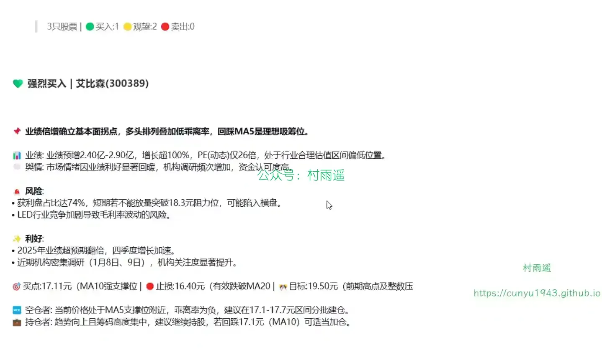

## 二、软件

### 1. [元气 AI Bot](https://yuanqiai.net)

你的电脑全能 AI 伙伴，一句话指令操作电脑，实现电脑任务自动化执行。

### 2. [WordMarker](https://github.com/CarrotWuDev/WordMarker)

AI 时代的文档转换神器，一个能够将 Markdown 转换为 Word 格式的软件，能够完美保留样式（包括数学公式、代码高亮、标题等）。

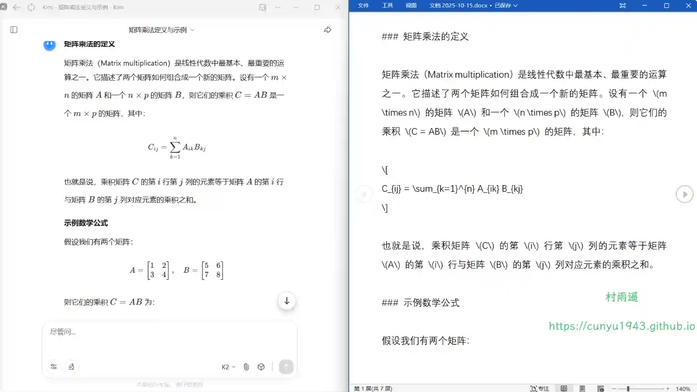

### 3. [分镜大师](https://github.com/BroderQi/Storyboard)

面向创作者与制作团队的本地分镜工作台：从视频导入、抽帧、AI 分析、图像 / 视频生成，到批量任务与成片合成，一条链路完成分镜资产管理与输出。

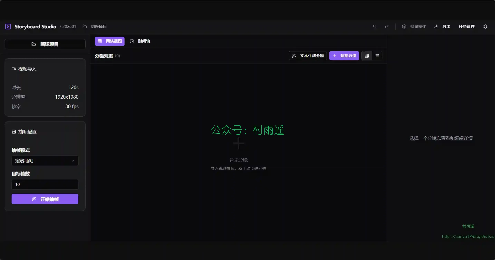

## 三、网站

### 1. [LaTeX 工作室](https://www.latexstudio.net)

精致科研生活从 LaTeX 开始，LaTeX 工作室提供 LaTeX 专业服务，十年经验沉淀，只为让您的作品精致、专业、有品位。精品资源与模板下载，排版服务，技术支持，定制开发等服务。

### 2. [小蜜蜂影院](https://www.xmfyy.com)

免费欧美剧在线观看和视频，欢迎欧美剧爱好者来到这里在线观看欧美剧。

### 3. [考拉新媒体导航](https://www.kaolamedia.com)

收录了100+个新媒体人必备工具，公众号排版、无版权图库、裂变增长、社群运营、抖音数据分析、创意 H5；收录 200+ 篇新媒体干货，用户增长、活动运营、抖音涨粉、数据分析、新媒体书单...

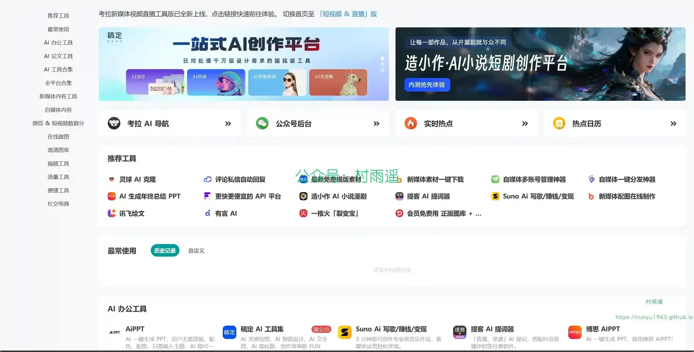

## 四、插件

### 1. [达人精灵](https://chromewebstore.google.com/detail/penohjgblobinadflplocjekaclnoemh?utm_source=item-share-cb)

TikTok 无水印视频下载和爆款筛选，AI 脚本拆解和仿写、达人带货分析和合作建议、数据分析、评论翻译，无需登录即可使用。

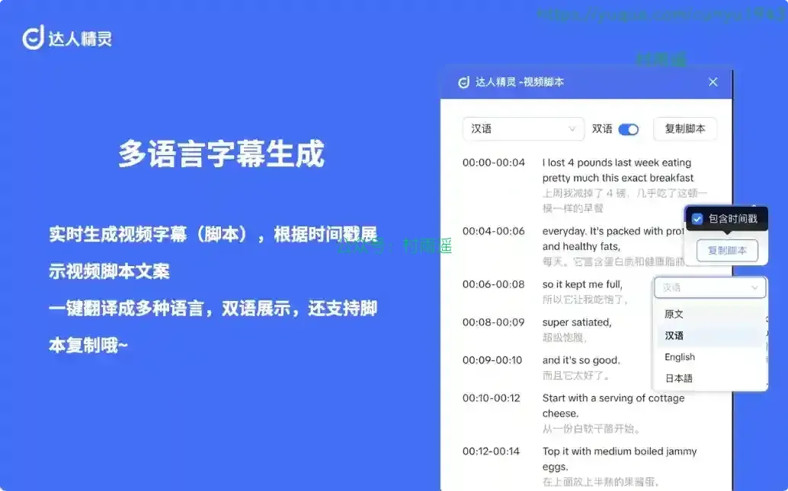

### 2. [Readify](https://chromewebstore.google.com/detail/readify-lifelike-text-to/nnheobpfcpicnkfpdaafonmoaiehgmkj)

AI 仿真朗读阅读器，利用 AI 文本转语音 (TTS) 技术将网页内容转换为音频（支持 30 多种语言），并提供语速控制、文本高亮和悬浮控件等功能。

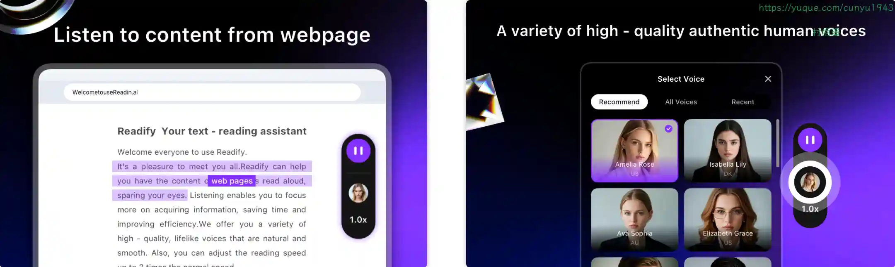

### 3. [OpenWrite](https://chromewebstore.google.com/detail/openwrite/khmeghbfdkghafhpnaimpjpdecnjblgj)

一键将 Markdown 文章发布到各大内容平台，写作 + 发布的效率工具。

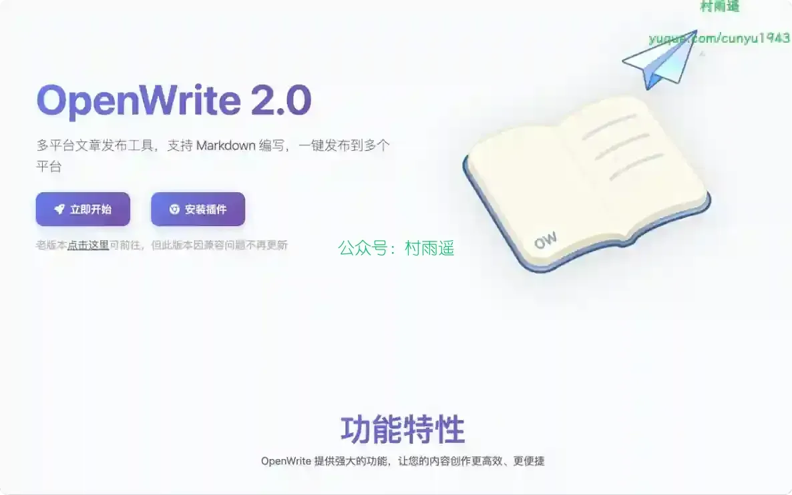

## 五、资料

### 1. [AI/LLM 大模型入门项目](https://github.com/Hoper-J/AI-Guide-and-Demos-zh_CN)

一份入门 AI / LLM 大模型的逐步指南，包含教程和演示代码，带你从 API 走进本地大模型部署和微调，代码文件会提供 Kaggle 或 Colab 在线版本，即便没有显卡也可以进行学习。项目中还开设了一个小型的代码游乐场🎡，你可以尝试在里面实验一些有意思的 AI 脚本。同时，包含李宏毅 (HUNG - YI LEE）2024 生成式人工智能导论课程的完整中文镜像作业。

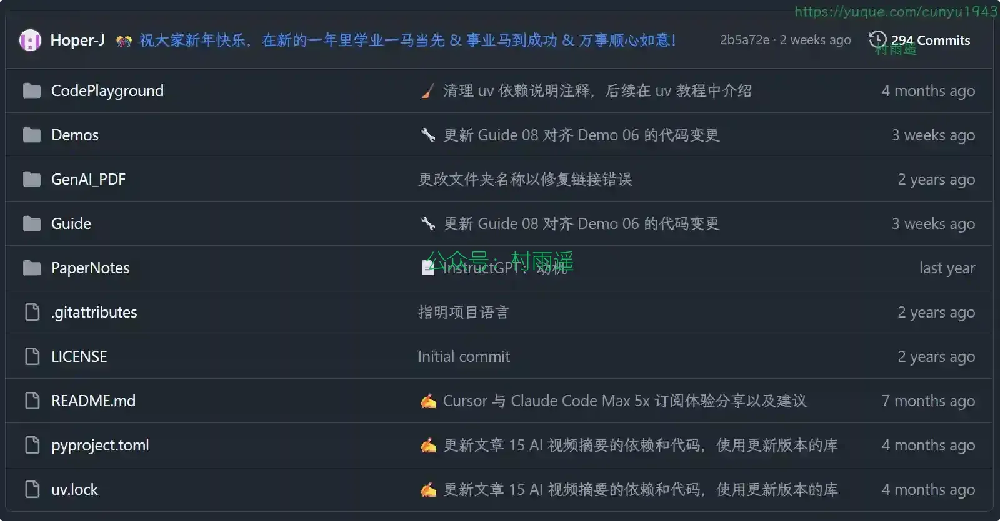

### 2. [AgentGuide](https://github.com/adongwanai/AgentGuide)

AI Agent 学习指南，从入门到拿 Offer，系统化 + 实战化 + 求职导向。

### 3. [Zensical 中文教程](https://github.com/Wcowin/Zensical-Chinese-Tutorial)

最详细、最便捷、最前沿的 Zensical 中文教程。

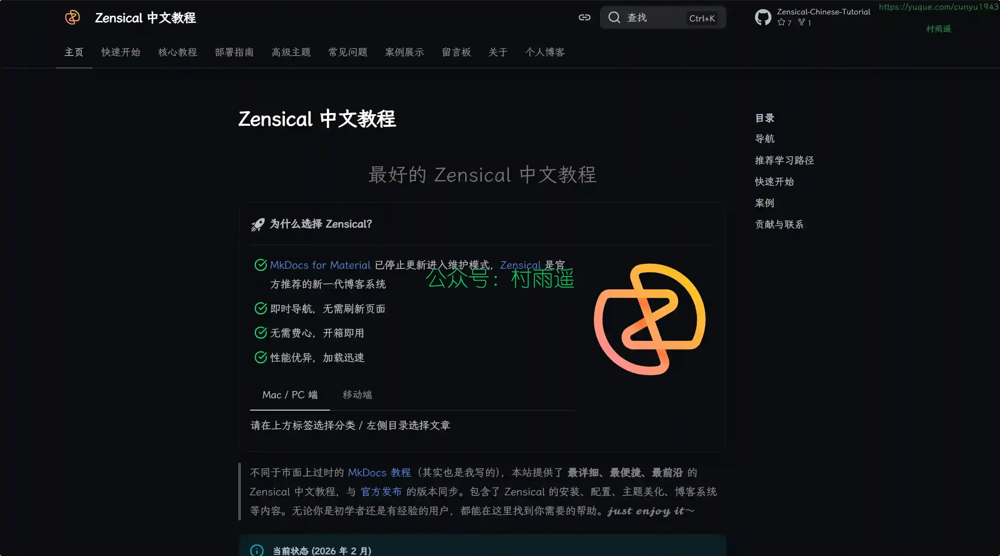

## ✍️ 说明

周刊专栏相关信息：

- **项目地址**：[Github](https://github.com/cunyu1943/weekly)，觉得不错麻烦给我一个**Star**，感谢 ❤️
- **浏览地址**：公众号 | [电子书](https://cunyu1943.github.io/weekly) | [语雀](https://yuque.com/cunyu1943/weekly)

如果你阅读到这里，说明我的工作没有白费。如果你想推荐项目/网站/软件/资源，欢迎提交 **[issue](https://github.com/cunyu1943/weekly/issues)** 或者添加我 **个人微信：coder_cunYu** 与我交流。

---

## ⏳ 联系

想解锁更多知识？不妨关注我的微信公众号：**村雨遥（id：JavaPark）**。

扫一扫，探索另一个全新的世界。

