# 好物周刊#144：小龙虾教程

> 作者：[村雨遥](https://github.com/cunyu1943)
> 
> 不要哀求，学会争取，若是如此，终有所获
> 
> 原文：https://mp.weixin.qq.com/s/VXB-VyTGb-Nsa1GRwWltzg

## 🎈 号外 

最近，公众号之外，建立了微信交流群，不定期会在群里分享各种资源（影视、IT 编程、考试提升……）&知识。如果有需要，可以**扫码或者后台添加小编微信备注入群**。进群后**优先看群公告**，**呼叫群中【资源分享小助手】**，还能免费帮找资源哦～

## 一、项目

### 1. [Voice Key](https://github.com/BuildWithAIs/voicekey)

一款开源的桌面端语音输入产品，集成 GLM ASR (智谱 AI) 实现高精度的语音转文字。

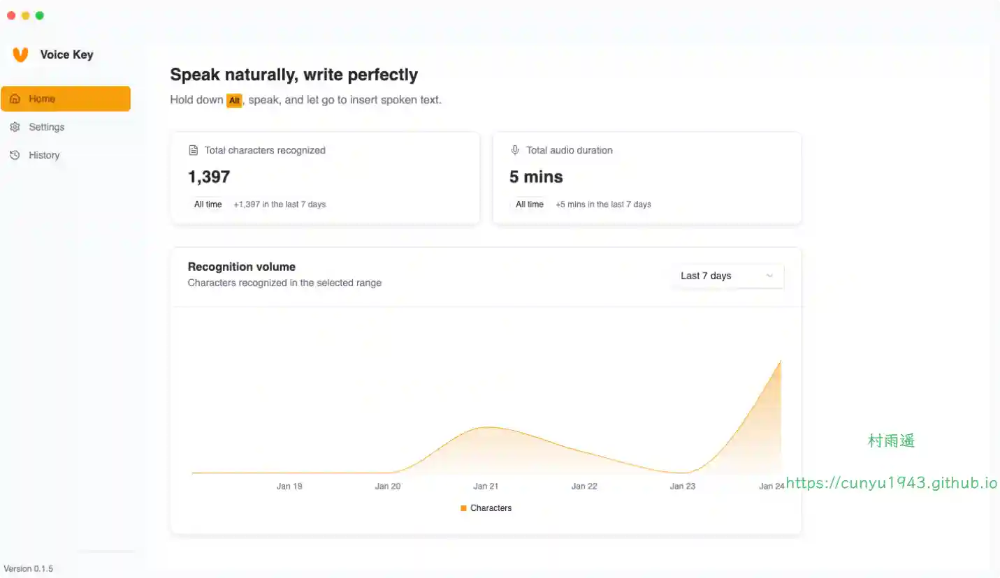

### 2. [Diarum](https://github.com/songtianlun/diarum)

一款零负担、快记录、怡复盘的日记应用，记录独一无二的人生。零负担，软件使用非常简单，登陆后打开首页即跳转到今日日记。快记录，打开立刻开始记录，自动保存。怡复盘，可以愉快的完成复盘、总结分析。轻松实现现代化 AI 加持的 “吾日三省吾身”。

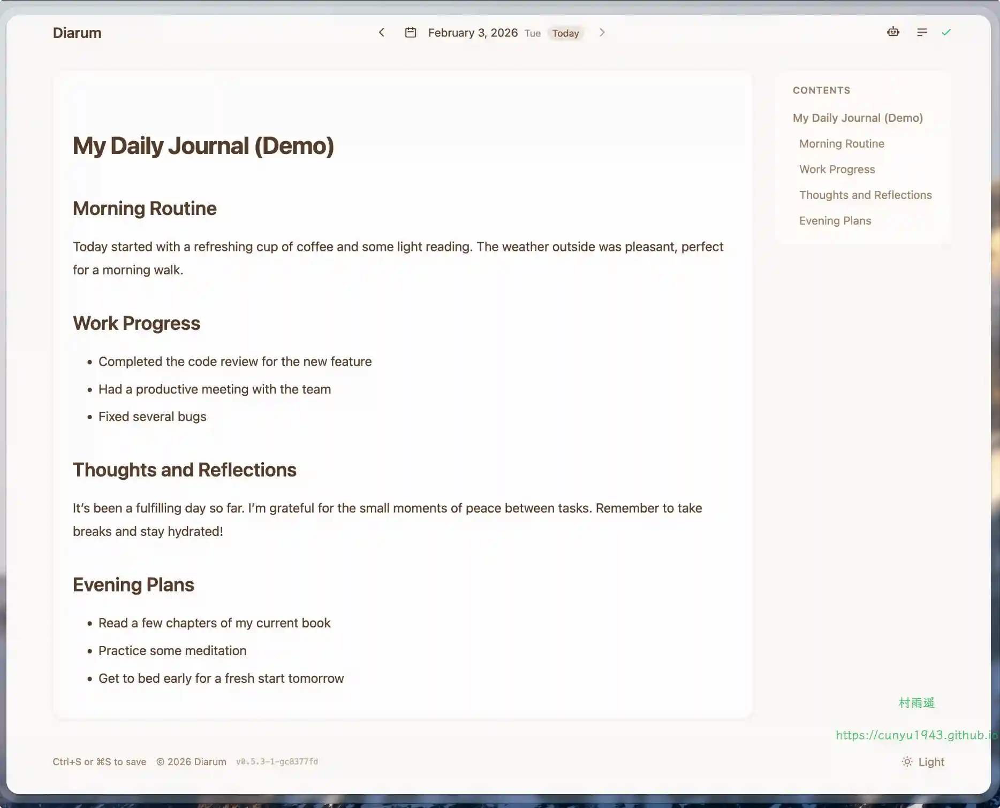

### 3. [云舒 NAS](https://github.com/itning/yunshu-nas)

自建 NAS 系统，实现本地视频音频点播，文件存储等功能。自动视频转码，在线观看下载视频！

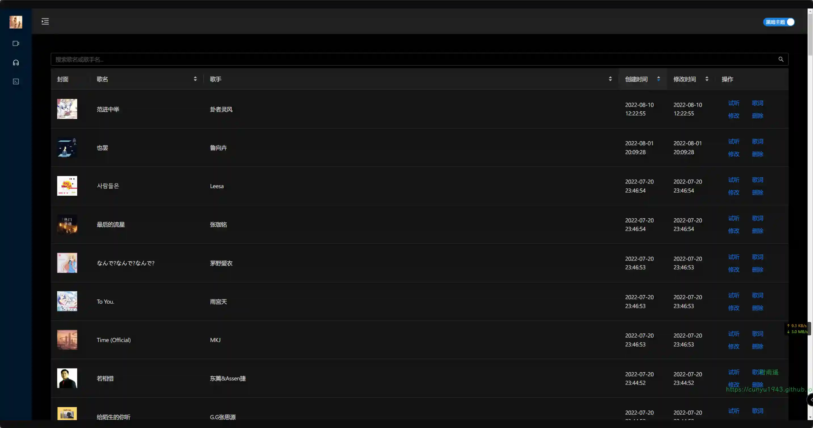

## 二、软件

### 1. [MFCMouseEffect](https://github.com/sqmw/MFCMouseEffect)

一款轻量、高性能的 Windows 桌面特效工具，为点击、拖尾、滚轮、长按、悬停提供实时视觉反馈（波纹、粒子、文字等）。

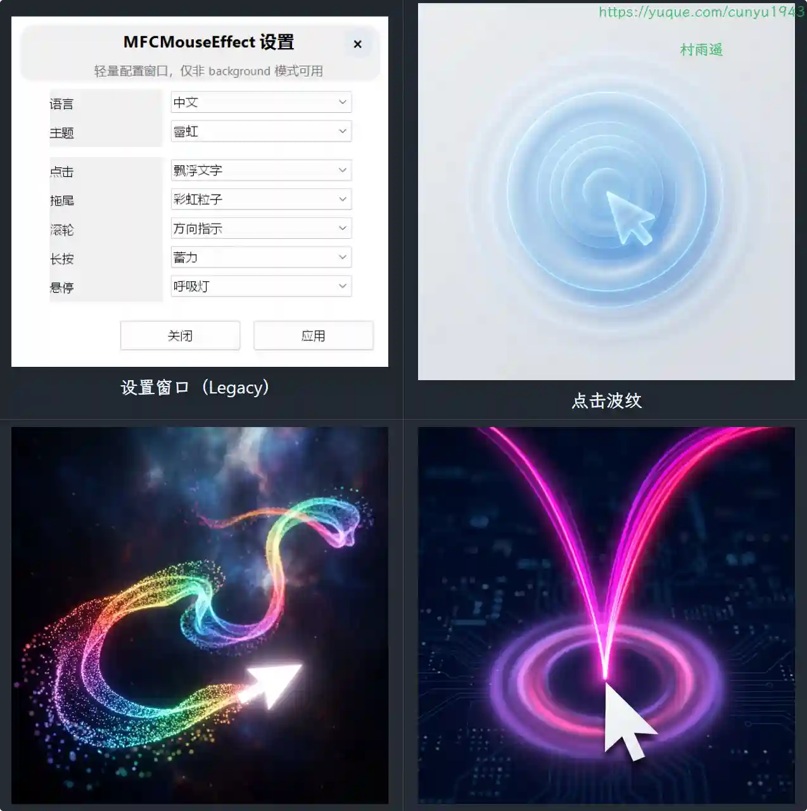

### 2. [SkreenPro](https://github.com/SkreenPro/SkreenPro)

一个强大且漂亮的截图编辑器，由 Electron 、React 和 Konva 构建。使用专业工具编辑截图，包括背景、阴影、边框和更多功能。

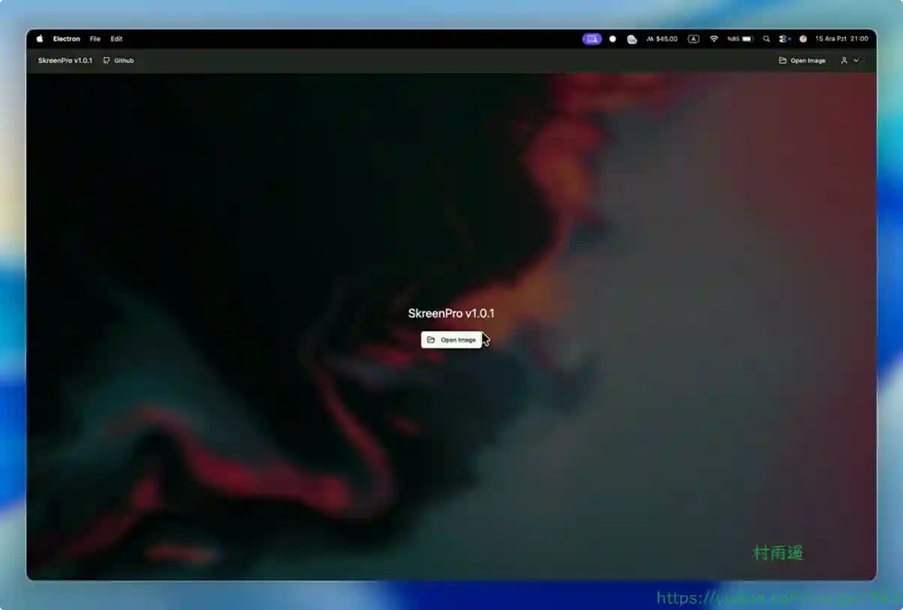

### 3. [AIGCPanel](https://aigcpanel.com)

一个可以在本地轻松使用 AI 模型的面板工具，支持模型安装、模型启动、模型调用等一站式便捷体验，让工作更高效！

## 三、网站

### 1. [纪录片之家](https://www.05jl.com)

分享纪录片，美剧，留住这些让我们感动的电视节目。纪录片之家提供最新、最全、最经典的纪录片和美剧下载。

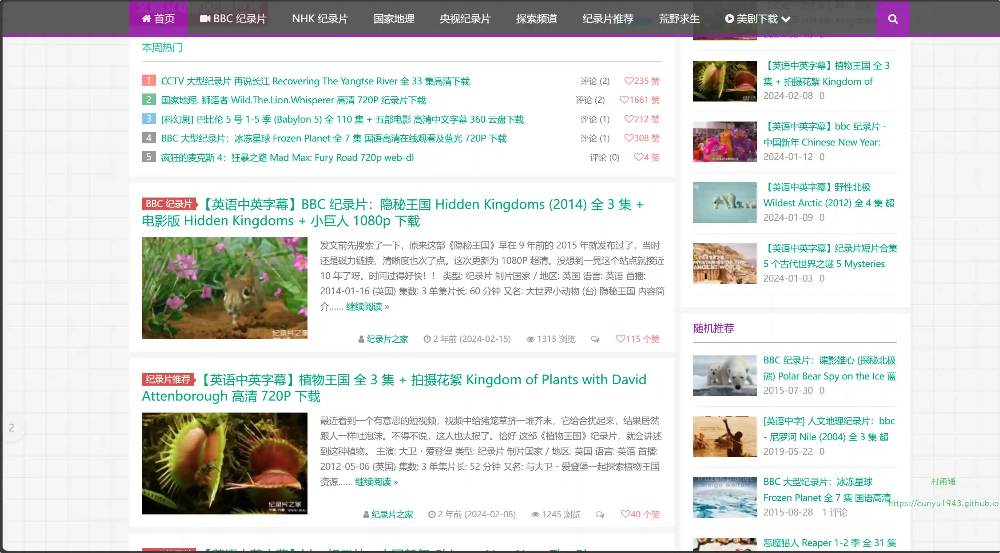

### 2. [小春日](http://www.xiaochunri.com)

摄影图片大全，里面有几百个不同类型的资源美少女全套写真图集。画质非常高清，而且几乎每天都在更新优质资源。

### 3. [doyoudo](https://www.doyoudo.com)

专注于创意设计软件学习的网站，里边有 PS、PR、AE 等各种后期软件的教程。

## 四、插件

### 1. [浮生梦](https://chromewebstore.google.com/detail/aihpjpjndpdkbmdjghjglbmippnjlkcp?utm_source=item-share-cb)

简约美观的自定义新标签页的浏览器扩展，在新标签页上展示中国经典诗词和书签。

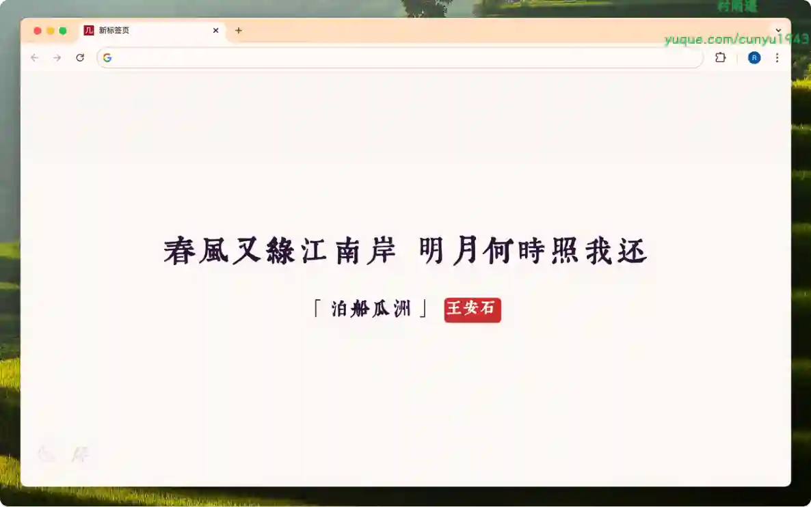

### 2. [Save All Resources](https://chromewebstore.google.com/detail/save-all-resources/abpdnfjocnmdomablahdcfnoggeeiedb)

记录你在浏览器上的所有操作（例如，点击、输入等），提供了 css、js、 和 xhr 等资源的下载。

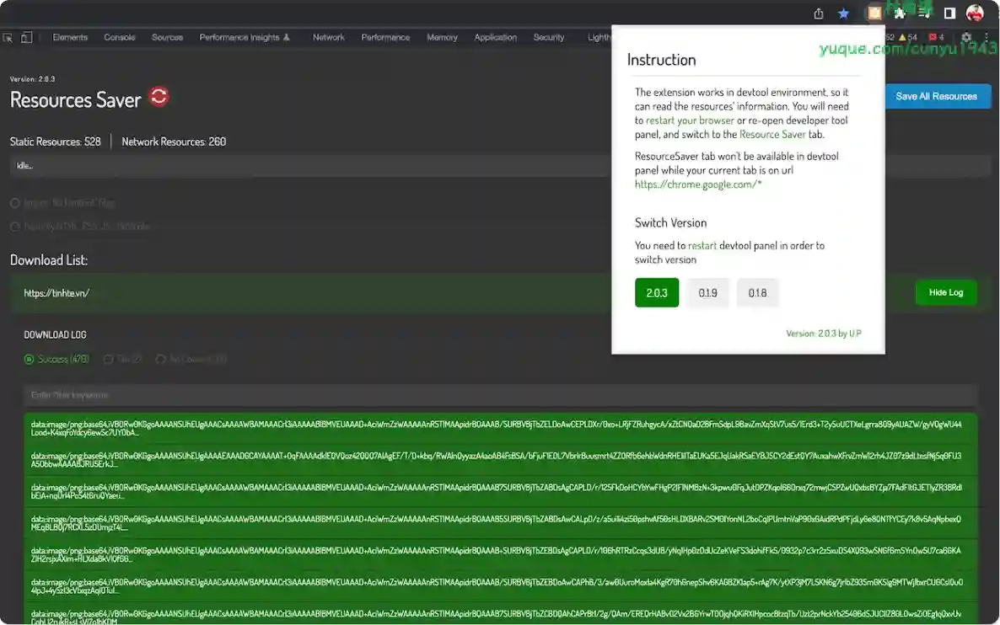

### 3. [DiyTab](https://chromewebstore.google.com/detail/kdgjiakonpbfmndaacfhamdoangincgp)

一款高效、便捷的浏览器插件，专为需要批量下载图片的用户设计。无论你是在社交媒体平台、图片库网站，还是博客文章中发现大量有价值的图片，DiyTab 图片下载器 都能帮助你轻松地进行批量下载，无需逐一保存。

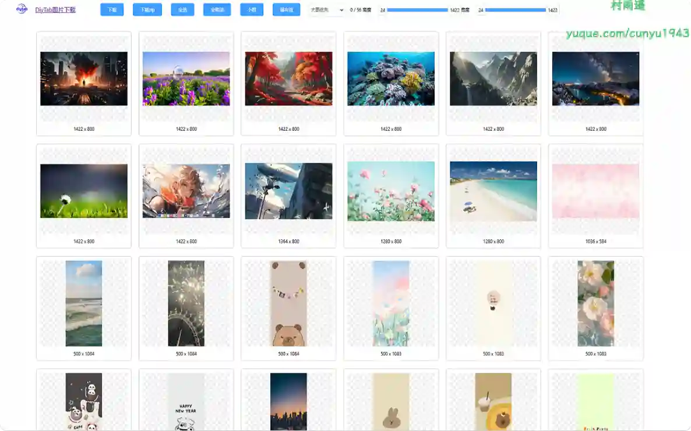

## 五、资料

### 1. [Claw101](https://claw101.com)

OpenClaw 中文教程，从安装部署到高级玩法的保姆级指南。免费 13 章完整教程、实战案例、活跃社群。

### 2. [BUPT 生存指南](https://github.com/byrdocs/bupt-survival-guide)

一个开源的北京邮电大学学生生活指南，旨在帮助新老同学更好地适应校园生活。本指南覆盖了沙河校区和本部校区的详细信息，包含住宿、餐饮、学习、交通、生活服务等方方面面的实用指南。

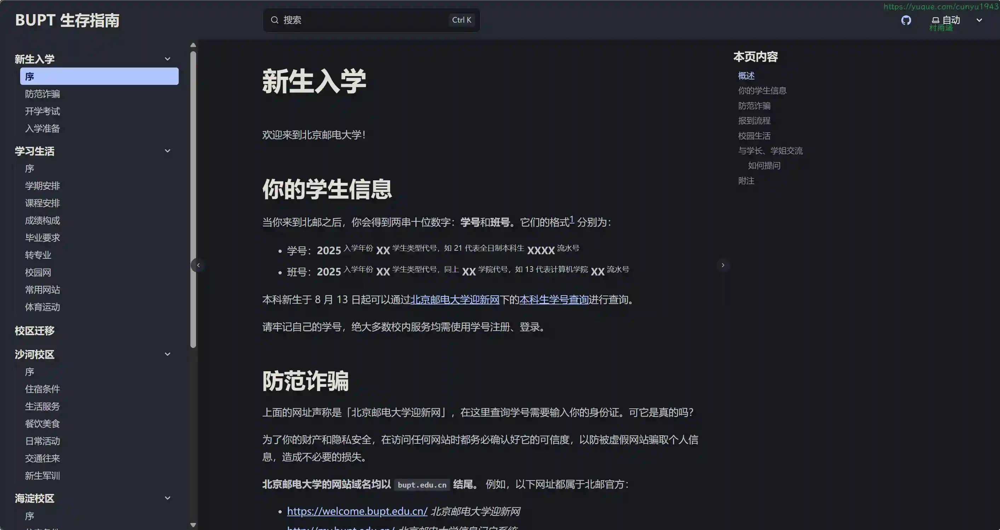

### 3. [Awesome OpenClaw Tutorial](https://github.com/xianyu110/awesome-openclaw-tutorial)

从零开始打造你的 AI 工作助手：最全面的中文教程，涵盖安装、配置、实战案例和避坑指南。

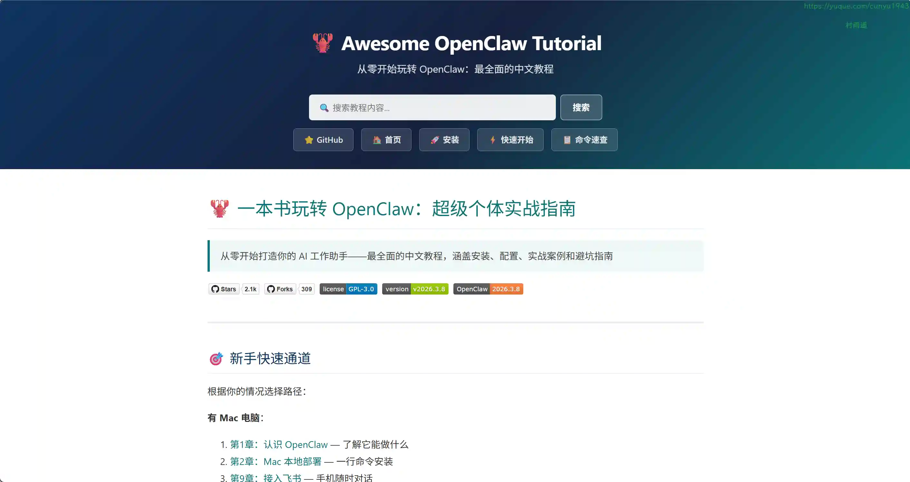

## ✍️ 说明

周刊专栏相关信息：

- **项目地址**：[Github](https://github.com/cunyu1943/weekly)，觉得不错麻烦给我一个**Star**，感谢 ❤️
- **浏览地址**：公众号 | [电子书](https://cunyu1943.github.io/weekly) | [语雀](https://yuque.com/cunyu1943/weekly)

如果你阅读到这里，说明我的工作没有白费。如果你想推荐项目/网站/软件/资源，欢迎提交 **[issue](https://github.com/cunyu1943/weekly/issues)** 或者添加我 **个人微信：coder_cunYu** 与我交流。

---

## ⏳ 联系

想解锁更多知识？不妨关注我的微信公众号：**村雨遥（id：JavaPark）**。

扫一扫，探索另一个全新的世界。

