# 好物周刊#145：浏览器 AI 助手

> 作者：[村雨遥](https://github.com/cunyu1943)
> 
> 不要哀求，学会争取，若是如此，终有所获
> 
> 原文：https://mp.weixin.qq.com/s/mhfLYDdqD1Pnvn6ZgCedHQ

## 🎈 号外 

最近，公众号之外，建立了微信交流群，不定期会在群里分享各种资源（影视、IT 编程、考试提升……）&知识。如果有需要，可以**扫码或者后台添加小编微信备注入群**。进群后**优先看群公告**，**呼叫群中【资源分享小助手】**，还能免费帮找资源哦～

## 一、项目

### 1. [VCPToolBox](https://github.com/lioensky/VCPToolBox)

一个全新的，强大的 AI - API - 工具交互范式 AGI 社群系统。独立多 Agent 封装，非线性超异步工作流，交叉记忆网络，六大插件协议，完整 Websocket 和 WebDav 功能，支持分布式部署和算力均衡！

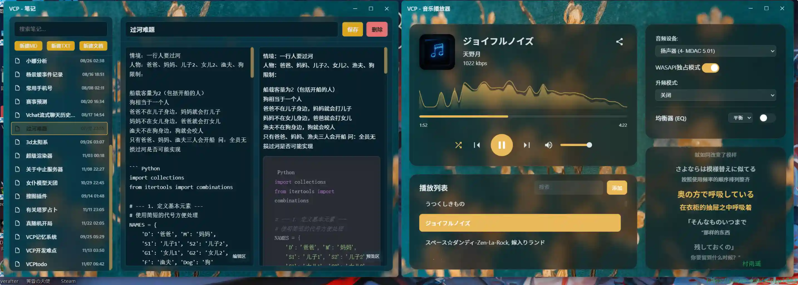

### 2. [NeutralPress](https://github.com/RavelloH/NeutralPress)

基于 Next.js 构建的下一代动态 CMS 博客系统，可免费部署的一站式解决方案：可视化可拖拽页面编辑、所见即所得/Markdown/MDX 内容支持、媒体管理、访问分析、照片墙、自动友链管理、无限层级评论、邮箱通知、实时私信、Github 项目展示、多用户多权限账号管理、内置安全防护。

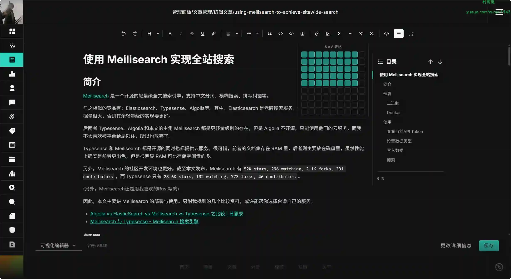

### 3. [dockerCopilot](https://github.com/onlyLTY/dockerCopilot)

一个主打便捷的 docker 容器管理工具，现在已经支持所有平台，支持一键更新容器。

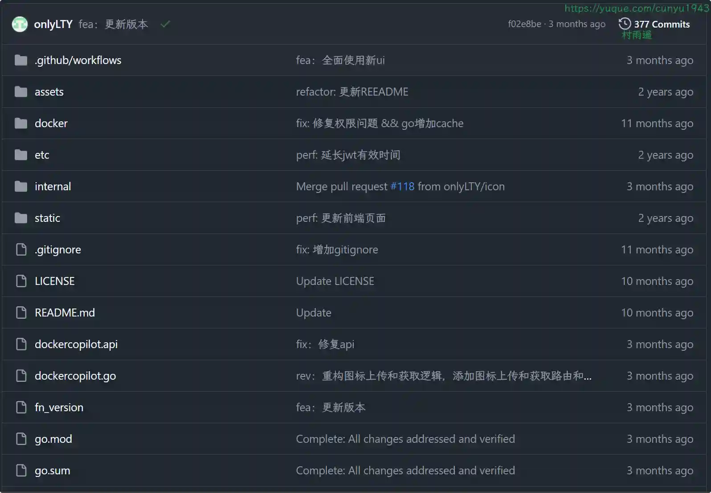

## 二、软件

### 1. [Moraya](https://github.com/zouwei/moraya)

一款极简的 AI Markdown 编辑器，你的 AI 创作员工。你的一个想法，成就无限可能。

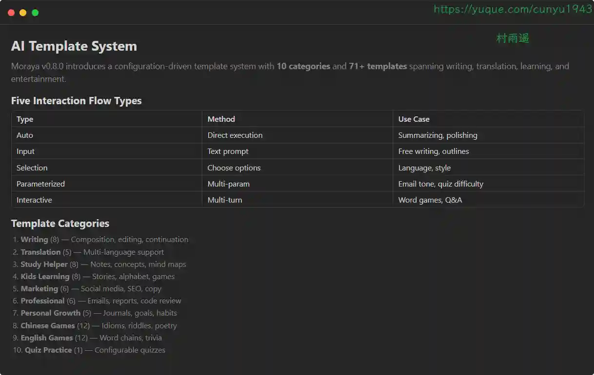

### 2. [ScreenKite](https://www.screenkite.com)

为交付人群设计的原生 macOS 屏幕录制工具。支持自动缩放，内置编辑器，金属加速导出，免费使用无订阅。

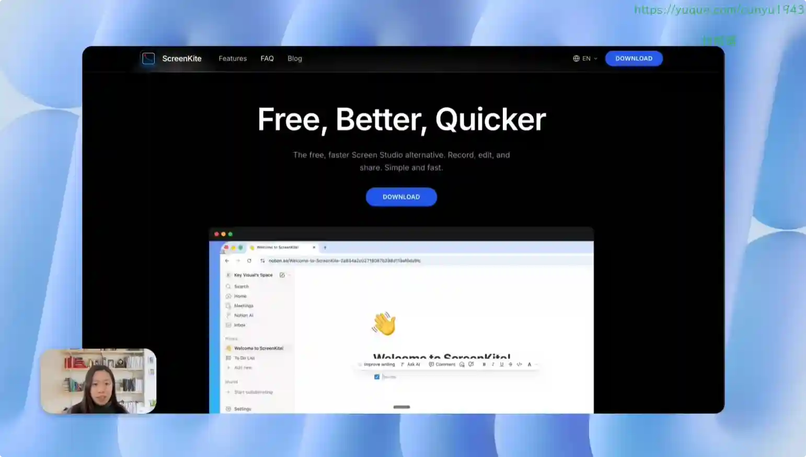

### 3. [迅雷浏览器](https://x.xunlei.com)

极简无广告，还你纯粹。聚合搜索引擎，搜你所想。强大播放器，一键畅播。迅雷浏览器全新登场！

## 三、网站

### 1. [PDFuck](https://pdfuck.com/zh#tools)

免费浏览器端 PDF 工具。合并、分割、压缩、旋转、转换 PDF，100% 隐私保护。

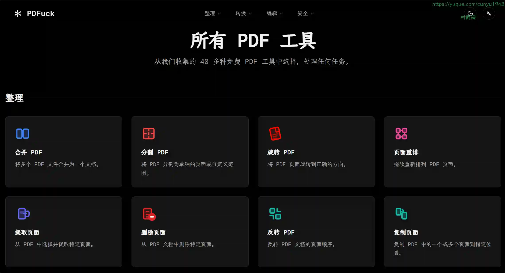

### 2. [MacKed](https://macked.app)

每天更新大量精品 Mac 软件，为您提供优质的 Mac 软件以及各种实用的 Mac 技巧教程，致力于打造从软件到服务都是一流的 Mac 软件资源网站。

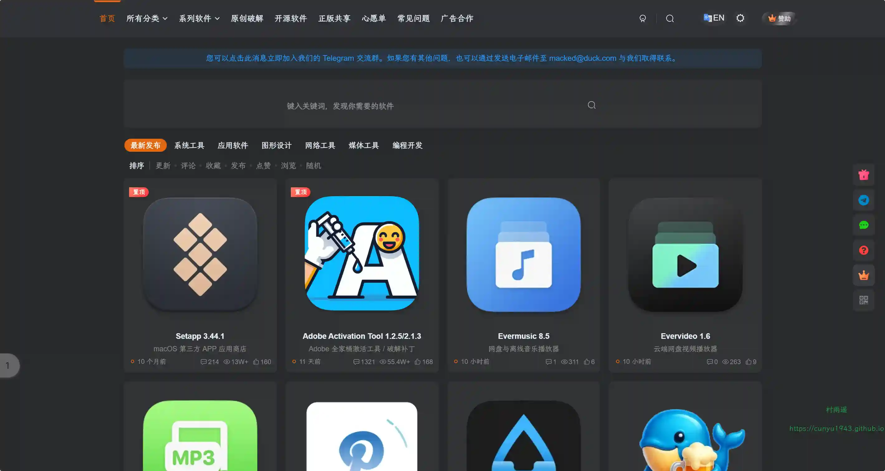

### 3. [嘀嗒影视](https://www.didahd.pro)

专注高分电影，高清 HD 在线，极速秒播不卡顿！

## 四、插件

### 1. [纳米 AI 助手](https://chromewebstore.google.com/detail/fdcmomajekgiigcalflcbjbkemogcbaf)

全新浏览器 AI 助手，搭载多家主流大模型，精通搜索、写作、总结。

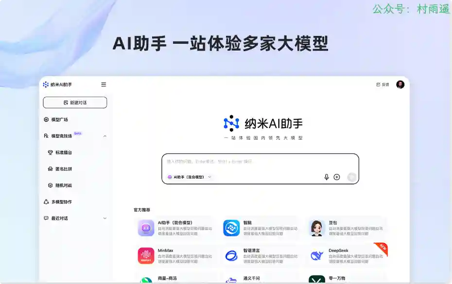

### 2. [夸克浏览器 AI 助手](https://chromewebstore.google.com/detail/nmaekpmealpjglikpijiegglabclhefp)

在浏览器随时唤起夸克 AI，AI 搜索智能回答，还能让 AI 帮你解读、润色、翻译，高效完成工作。

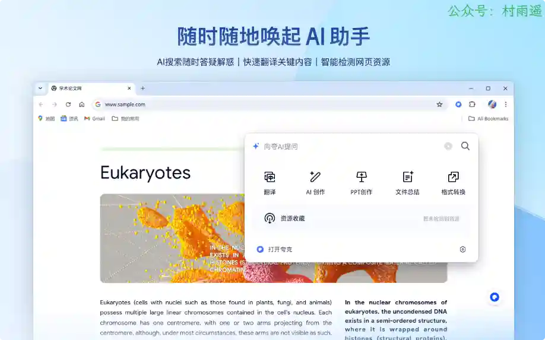

### 3. [智谱清言 AI 助手](https://chromewebstore.google.com/detail/mnpdbmgpebfihcndnpgdaihnkmloclkd)

你的 AI 全能助手，通过划线工具、多链接总结、站内高级检索、写作助手等，清言插件助您轻松应对各种网络浏览场景。

## 五、资料

### 1. [OpenClaw 101](https://github.com/mengjian-github/openclaw101)

从零开始，7 天掌握你的 AI 私人助理，截止目前已经收录了 420+ 教程资源。

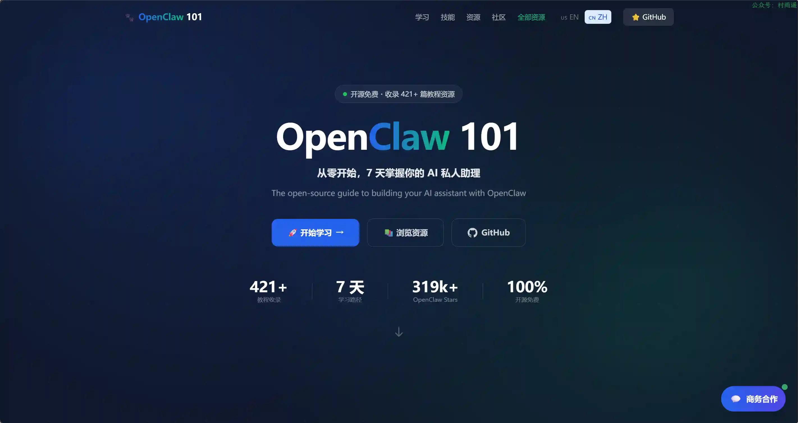

### 2. [OpenClaw 中文官方技能库](https://github.com/clawdbot-ai/awesome-openclaw-skills-zh)

翻译自 Clawdbot 官方技能，按场景分类整理，支持中文自然语言调用。

### 3. [AIInfra](https://github.com/Infrasys-AI/AIInfra)

跟大家一起探讨和学习人工智能、深度学习的系统设计，而整个系统是围绕着在 NVIDIA、ASCEND 等芯片厂商构建算力层面，所用到的、积累、梳理得到大模型系统全栈的内容。

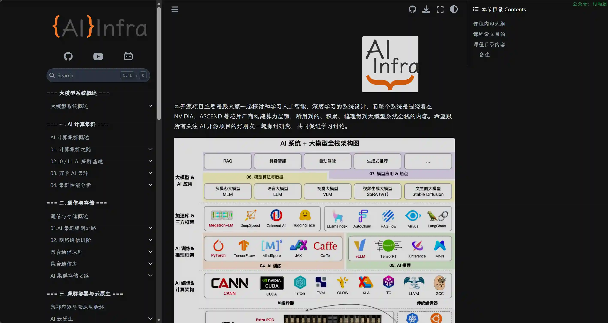

## ✍️ 说明

周刊专栏相关信息：

- **项目地址**：[Github](https://github.com/cunyu1943/weekly)，觉得不错麻烦给我一个**Star**，感谢 ❤️
- **浏览地址**：公众号 | [电子书](https://cunyu1943.github.io/weekly) | [语雀](https://yuque.com/cunyu1943/weekly)

如果你阅读到这里，说明我的工作没有白费。如果你想推荐项目/网站/软件/资源，欢迎提交 **[issue](https://github.com/cunyu1943/weekly/issues)** 或者添加我 **个人微信：coder_cunYu** 与我交流。

---

## ⏳ 联系

想解锁更多知识？不妨关注我的微信公众号：**村雨遥（id：JavaPark）**。

扫一扫，探索另一个全新的世界。

