# 好物周刊#146：Hello Claw

> 作者：[村雨遥](https://github.com/cunyu1943)
> 
> 不要哀求，学会争取，若是如此，终有所获
> 
> 原文：

## 🎈 号外 

最近，公众号之外，建立了微信交流群，不定期会在群里分享各种资源（影视、IT 编程、考试提升……）&知识。如果有需要，可以**扫码或者后台添加小编微信备注入群**。进群后**优先看群公告**，**呼叫群中【资源分享小助手】**，还能免费帮找资源哦～

## 一、项目

### 1. [八爪鱼](https://github.com/openocta/openocta)

基于 OpenClaw 的 Gateway 协议和 Control UI，重写为单一 Go 二进制后端 + 内嵌前端，面向无桌面服务器环境下的运维、可观测与自动化场景。

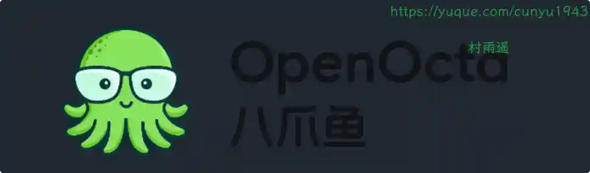

### 2. [挪车通知系统](https://github.com/lesnolie/movecar)

基于 Cloudflare Workers 的智能挪车通知系统，扫码即可通知车主，保护双方隐私。

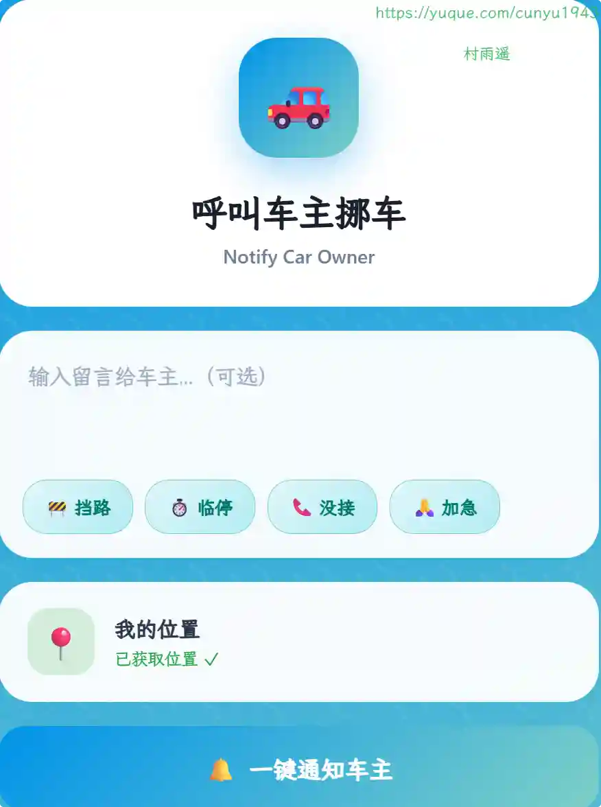

### 3. [Xiaohongshu CLI](https://github.com/jackwener/xhs-cli)

小红书命令行工具，搜索、阅读、点赞、收藏、评论，全在终端完成。

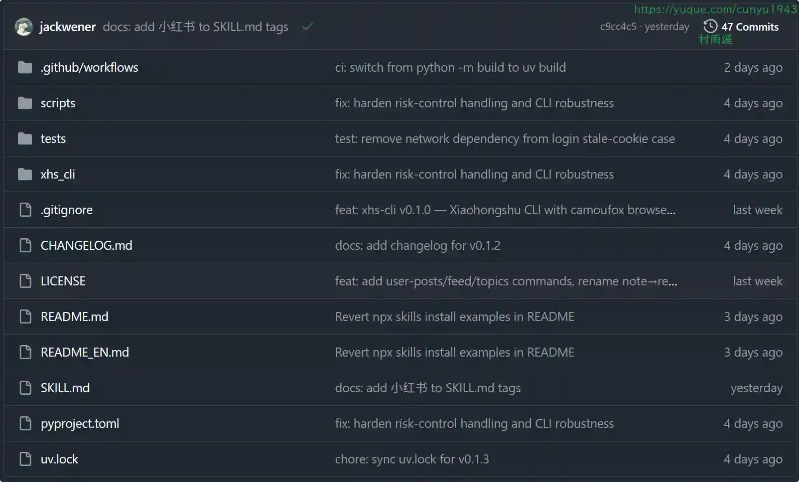

## 二、软件

### 1. [Tabbit 浏览器](https://www.tabbit-ai.com)

新一代 AI 原生浏览器，智能理解你的上下文。一键引用网页、截图、收藏、文件进行对话，Agent 自动执行重复任务，自定义妙招提升效率，智能分组管理标签页。支持 DeepSeek-V3.2、Doubao-seed-1.8、Kimi-k2.5、GLM-5、Minimax-M2.5、Qwen3.5-Plus、Longcat-Flash-Chat 等多个 AI 模型自由切换。适用于内容创作、科研学习、数据分析等场景。macOS 和 Windows 版免费下载，开启高效浏览新体验。

### 2. [阿福记账]( https://apps.apple.com/cn/app/id6751020754)

一款革命性的可视化记账应用，将抽象的数字转化为真实的钱币体验，让记账变得直观有趣。

### 3. [Conex](https://getconex.app)

现代化 SSH 客户端，为效率与安全而生。终端、SFTP、端口转发与可选端到端加密云同步，一应俱全。

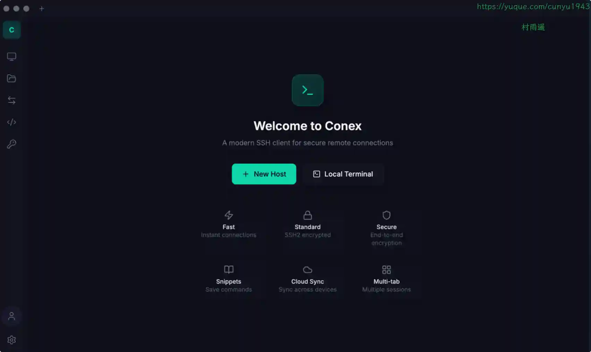

## 三、网站

### 1. [md2ex](https://www.md2ex.com)

支持将 Markdown 保存导出为 PDF、PNG、JPG、DOC、DOCX、HTML 等多种格式。

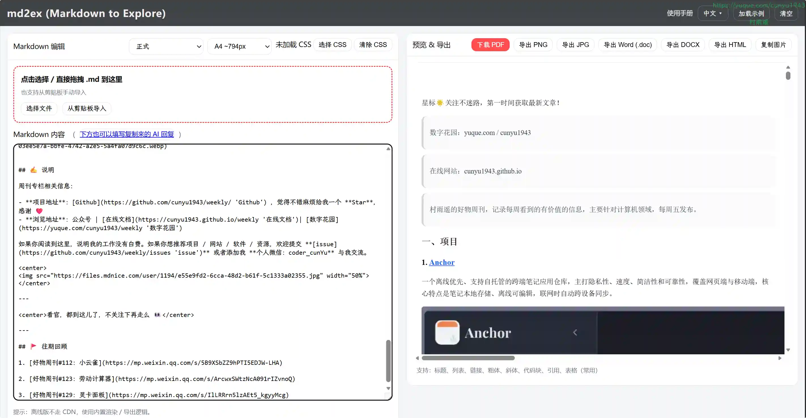

### 2. [简历生成器](https://my-cv.top)

无需编写任何代码即可获得专业的 LaTeX 排版简历。专注于内容，格式处理交给它就行。

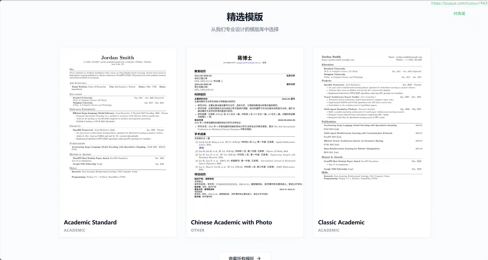

### 3. [趣搜哦](https://qusoo.xyz)

资源搜索分享网站，想看什么就搜什么。

## 四、插件

### 1. [Kortex-NotebookLM](https://chromewebstore.google.com/detail/kortex-notebooklm/hdapplggdhndkblofffknpmnnnnbncbn)

将 NotebookLM 转变为您的终极知识中心。保存提示词、导出聊天记录，并无缝组织所有交互。

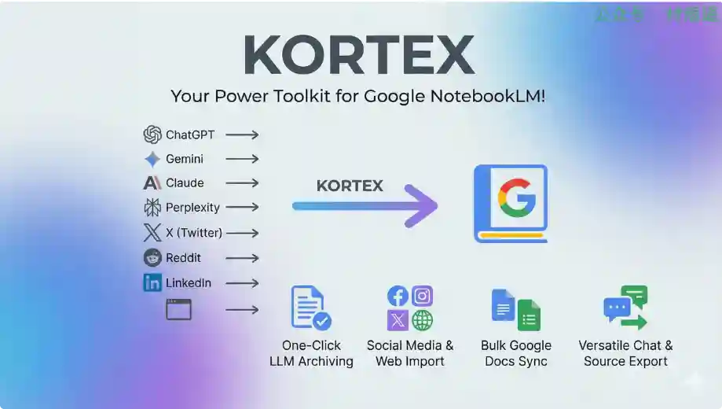

### 2. [2FA](https://chromewebstore.google.com/detail/2fa/ebhcbenbgjmaebpgbldimndmfomjmphd)

在浏览器中生成安全验证码，为您的所有账户提供快速、离线的双重身份验证。

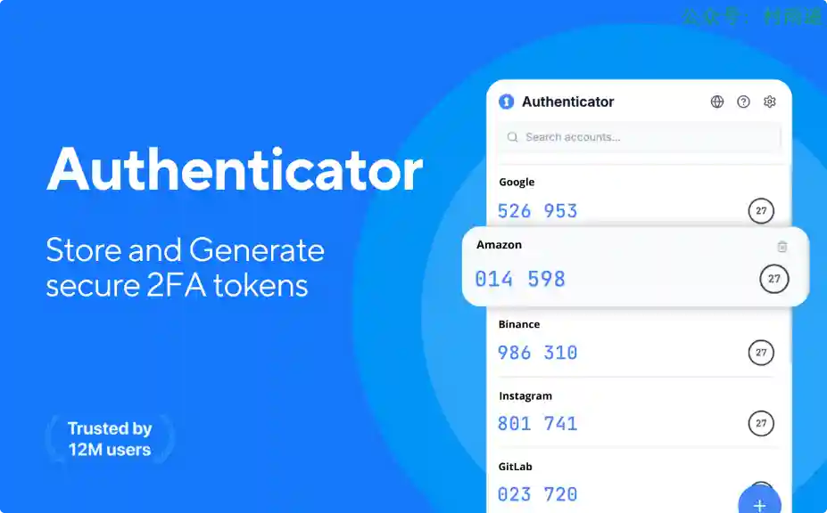

### 3. [Gopeed](https://chromewebstore.google.com/detail/gopeed/mijpgljlfcapndmchhjffkpckknofcnd)

搭配 GoPeed 软件使用的插件，轻松监听浏览器下载行为，通过 Gopeed 进行多线程高速下载。

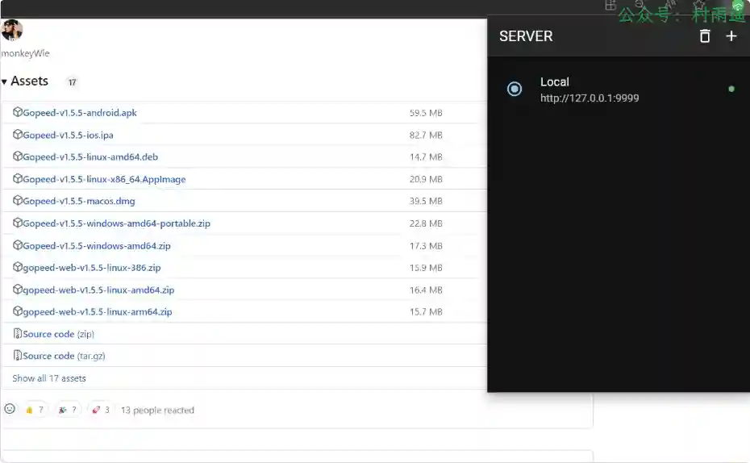

## 五、资料

### 1. [Claude Code & OpenClaw 中文教程](https://github.com/KimYx0207/Claude-Code-x-OpenClaw-Guide-Zh)

从零到企业实战：Claude Code 官方编程神器 + OpenClaw 教程。

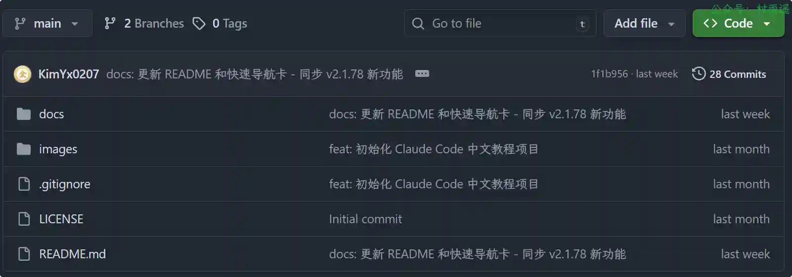

### 2. [哈喽！龙虾](https://github.com/datawhalechina/hello-claw)

一个面向 OpenClaw 的完整学习教程，帮助你从零开始掌握这个强大的命令行 AI 助理系统。无论你是想快速上手使用 OpenClaw 提升效率，还是想深入理解其原理并构建自己的版本，本教程都能为你提供清晰的学习路径。

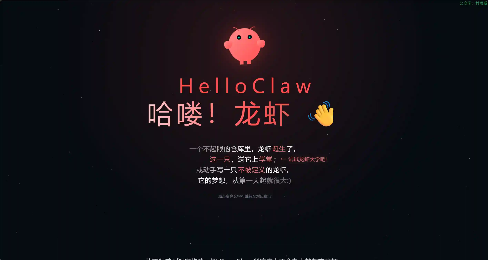

### 3. [AI 智能体实战速成指南](https://github.com/didilili/ai-agents-from-zero)

2026 最系统的 AI Agent 速成指南｜智能体实战教程。完整学习路径 + 实战项目 + 面试题库。

## ✍️ 说明

周刊专栏相关信息：

- **项目地址**：[Github](https://github.com/cunyu1943/weekly)，觉得不错麻烦给我一个**Star**，感谢 ❤️
- **浏览地址**：公众号 | [电子书](https://cunyu1943.github.io/weekly) | [语雀](https://yuque.com/cunyu1943/weekly)

如果你阅读到这里，说明我的工作没有白费。如果你想推荐项目/网站/软件/资源，欢迎提交 **[issue](https://github.com/cunyu1943/weekly/issues)** 或者添加我 **个人微信：coder_cunYu** 与我交流。

---

## ⏳ 联系

想解锁更多知识？不妨关注我的微信公众号：**村雨遥（id：JavaPark）**。

扫一扫，探索另一个全新的世界。

