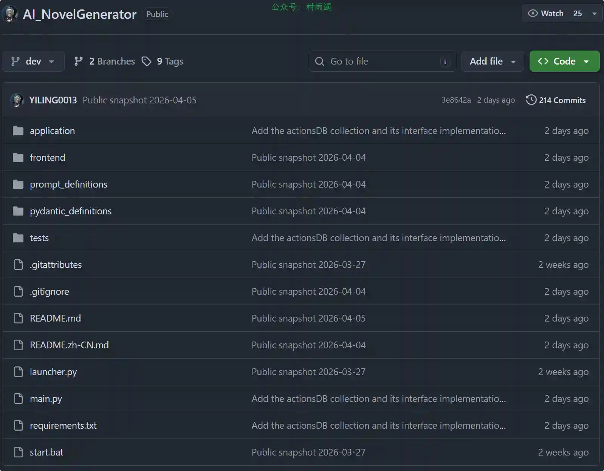
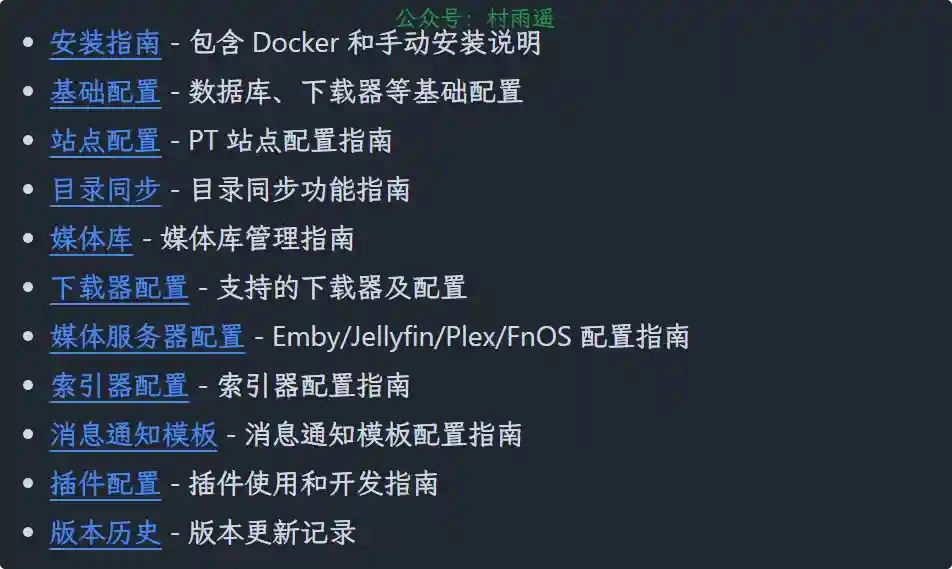
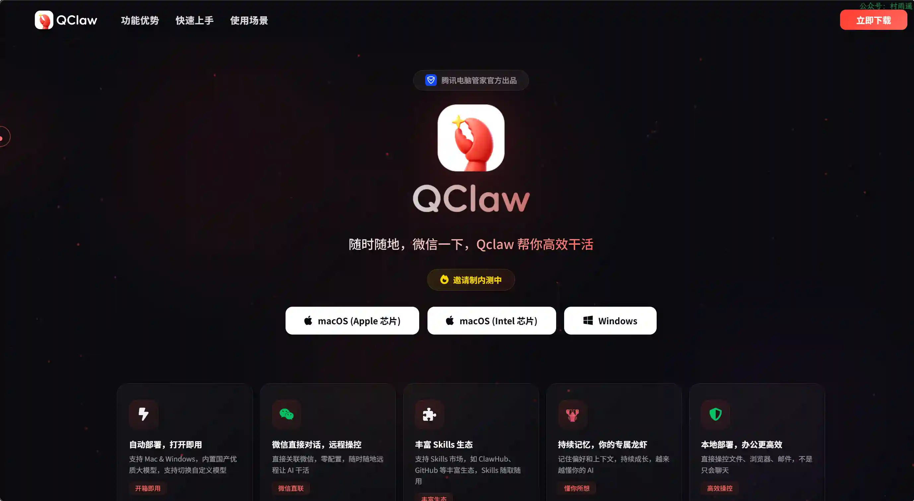
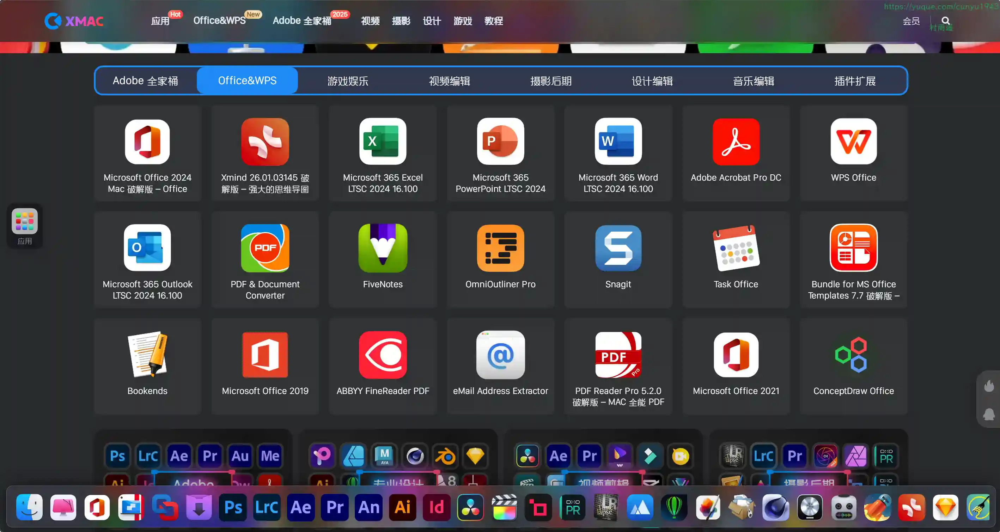
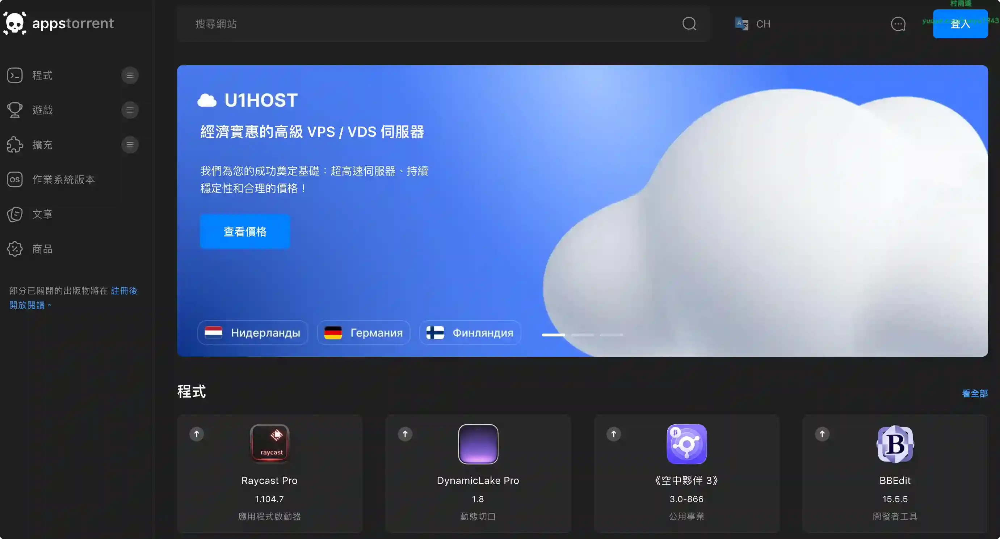
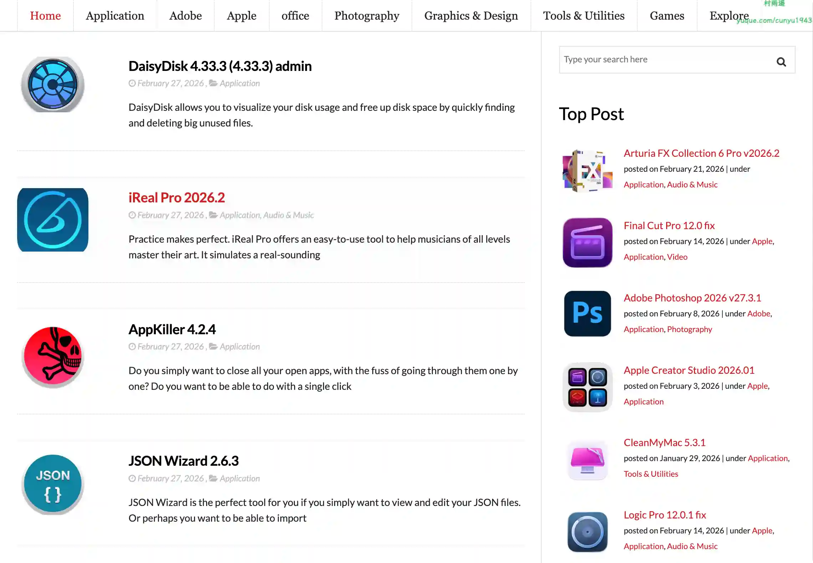
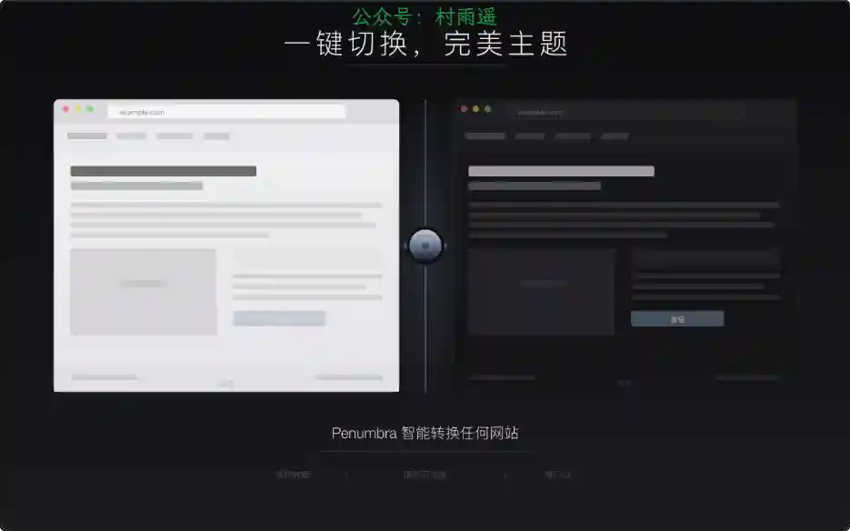
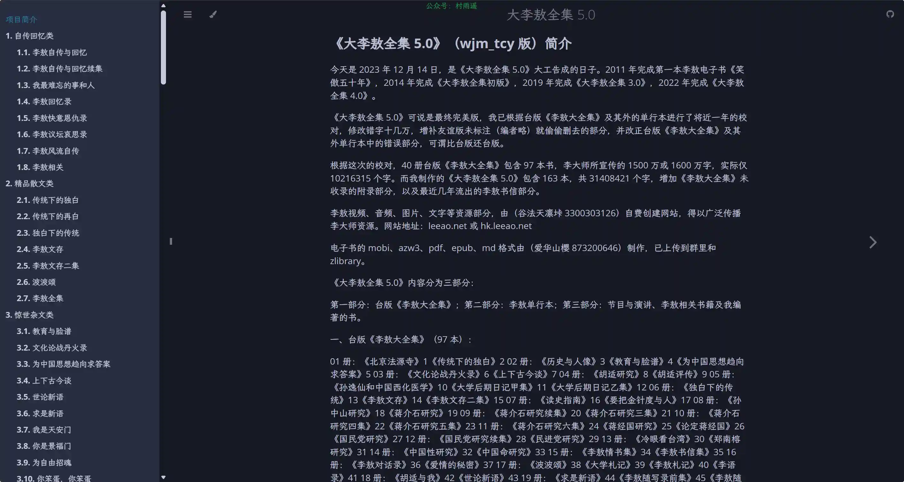
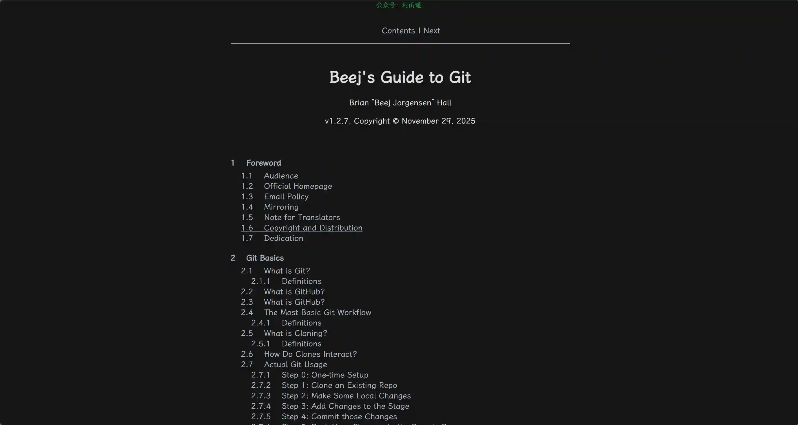
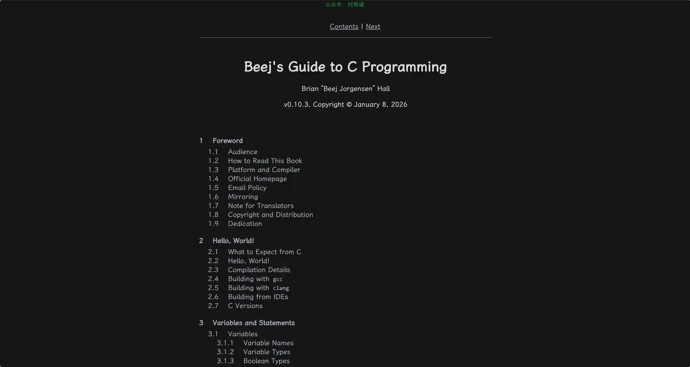

# 好物周刊#148：Mac 乐园

> 作者：[村雨遥](https://github.com/cunyu1943)
> 
> 不要哀求，学会争取，若是如此，终有所获
> 
> 原文：https://mp.weixin.qq.com/s/ox13yRnPBwLHEkjPFyvirQ

## 🎈 号外 

最近，公众号之外，建立了微信交流群，不定期会在群里分享各种资源（影视、IT 编程、考试提升……）&知识。如果有需要，可以**扫码或者后台添加小编微信备注入群**。进群后**优先看群公告**，**呼叫群中【资源分享小助手】**，还能免费帮找资源哦～

## 一、项目

### 1. [AI_NovelGenerator](https://github.com/YILING0013/AI_NovelGenerator)

使用 AI 生成多章节的长篇小说，自动衔接上下文、伏笔。

### 2. [NAS-Tools](https://github.com/linyuan0213/nas-tools)

一个功能强大的媒体库管理工具，提供自动化追剧、资源下载、文件整理和订阅管理等功能，适合 PT 用户和影视爱好者使用。

### 3. [Mimic Them](https://github.com/zhanchey/MimicThem)

一键复刻爆款小红书小姐姐（小哥哥），输入小红书图文链接，使用字节 seedream 图像模型一键复刻爆款。

## 二、软件

### 1. [QClaw](https://claw.guanjia.qq.com)

腾讯电脑管家团队基于 OpenClaw 打造的本地 AI 助手，支持 Mac & Windows 双端。关联微信即可远程操控电脑，让 AI 帮你干活。数据全部留在本地，隐私安全有保障。

### 2. [口袋记账](https://www.qeeniao.com)

简洁的免费个人记账软件，财务分析助手。

### 3. [随手记](https://www.sui.com)

在线记账财务平台，支持网页/iOS/Android/小程序等多端使用，支持多人同步操作，随时随地记账查账，海量免费账本模版涵盖个人/家庭/生意多种场景，多维度报表分析收支数据，预算功能有效控制支出！

## 三、网站

### 1. [XMac](https://xmac.cc)

精品 Mac 软件下载站 优质苹果应用资源聚合。专注分享最新 Mac 应用、游戏插件，提供免费下载与安装教程。

### 2. [appstorrent](https://appstorrent.ru)

一个俄罗斯运营、专注于 macOS 平台 的软件 / 游戏资源下载站。

### 3. [Mac Torrents](https://www.torrentmac.net)

专为 macOS 用户打造的种子文件搜索引擎与下载平台。

## 四、插件

### 1. [Gestify](https://chromewebstore.google.com/detail/gestify-–-video-gesture-c/flafiagpkalojknepegoijkceplidoik)

手势控制网页视频，滑动快进快退，长按倍速播放，上下滑调节音量与亮度。支持 A-B 循环、缩略图预览等高级功能。

### 2. [TikTok 转发清理器](https://chromewebstore.google.com/detail/kmellgkfemijicfcpndnndiebmkdginb?utm_source=item-share-cb)

一键清理你在 TikTok 的所有转发，无需滚动、无需逐个点击。

### 3. [Penumbra - 智能主题控制](https://chromewebstore.google.com/detail/penumbra-smart-theme-cont/ooklbphnohkomhgecdmjapldgddcjeha)

通过智能元素检测，无缝切换任意网站的深色与浅色主题。一键将任何网站切换为精美的暗色主题，全天候舒适浏览。

## 五、资料

### 1. [大李敖全集 5.0](https://books.leeao.net)

《大李敖全集 5.0》专属展示与传播站点，该版本由 wjm_tcy 耗时近一年校对完成并于2023 年 12 月 14 日 定稿，是在台版《李敖大全集》基础上的最终完美版，修复错字十几万、增补删减内容。

### 2. [Beej's Guide to Git](https://beej.us/guide/bggit/html/split/)

一份结构完整、由浅入深的 Git 与 GitHub 系统化教程目录，整体按照基础概念→核心操作→进阶技巧→团队协作→高级命令→附录速查的逻辑展开，覆盖从 Git 本质、基础工作流、分支、合并、冲突，到远程仓库、变基、储藏、重置、回滚、子模块、标签、工作树等几乎全部核心功能。教程不仅讲解命令本身，还解释原理、适用场景、常见问题与错误处理，同时配套身份配置、别名、工具配置、Vim 基础、速查表等实用内容，目标是让学习者从零掌握 Git 完整使用体系，既能独立开发，也能胜任团队协作、开源贡献（Fork / PR）等真实开发场景，是一套全面且偏向实战的 Git 学习框架。

### 3. [Beej's Guide to C Programming](https://beej.us/guide/bgc/html/split/)

该教程从 C 语言基础入门到高级进阶分 36 个核心模块层层递进，涵盖Hello World 入门、变量语句、函数、指针等基础内容，也深入讲解内存管理、预处理、结构体进阶、Unicode 处理等高级知识点，同时包含多文件项目、命令行参数、信号处理等实战开发内容，兼顾语法原理、编译实操（gcc/clang/IDE）和工程化开发。

## ✍️ 说明

周刊专栏相关信息：

- **项目地址**：[Github](https://github.com/cunyu1943/weekly)，觉得不错麻烦给我一个**Star**，感谢 ❤️
- **浏览地址**：公众号 | [电子书](https://cunyu1943.github.io/weekly) | [语雀](https://yuque.com/cunyu1943/weekly) | [ima 知识库](https://ima.qq.com/wiki/?shareId=860487e32c6cc8d6c9070cd7f00caedf3cbf4102f695862d9c82f463b92417af)

如果你阅读到这里，说明我的工作没有白费。如果你想推荐项目/网站/软件/资源，欢迎提交 **[issue](https://github.com/cunyu1943/weekly/issues)** 或者添加我 **个人微信：coder_cunYu** 与我交流。

---

## ⏳ 联系

想解锁更多知识？不妨关注我的微信公众号：**村雨遥（id：JavaPark）**。

扫一扫，探索另一个全新的世界。

