# 好物周刊#149：同事.skill

> 作者：[村雨遥](https://github.com/cunyu1943)
> 
> 不要哀求，学会争取，若是如此，终有所获
> 
> 原文：https://mp.weixin.qq.com/s/0sVzqUoL3S4ns1PtvZ-8jQ

## 🎈 号外 

最近，公众号之外，建立了微信交流群，不定期会在群里分享各种资源（影视、IT 编程、考试提升……）&知识。如果有需要，可以**扫码或者后台添加小编微信备注入群**。进群后**优先看群公告**，**呼叫群中【资源分享小助手】**，还能免费帮找资源哦～

## 一、项目

### 1. [小智后端服务](https://github.com/xinnan-tech/xiaozhi-esp32-server)

基于人机共生智能理论和技术研发智能终端软硬件体系，为开源智能硬件项目 xiaozhi-esp32 提供后端服务。根据小智通信协议使用 Python、Java、Vue 实现，支持 MQTT + UDP 协议、Websocket 协议、MCP 接入点、声纹识别、知识库。

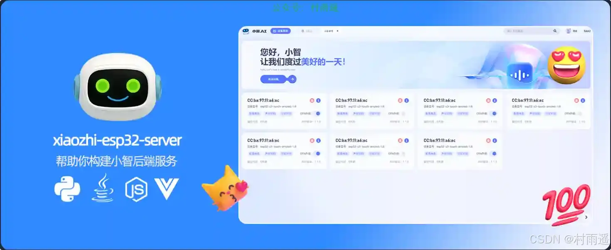

### 2. [PakePlus-Android](https://github.com/Sjj1024/PakePlus-Android)

打包 HTML/网页/Vue/React 项目为桌面/手机应用只需几分钟。

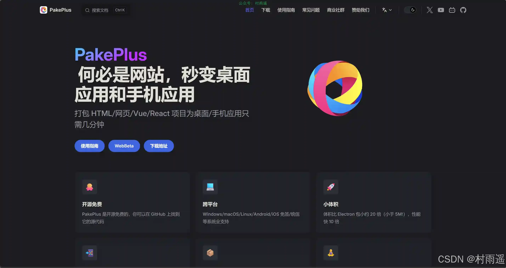

### 3. [FFmpegFreeUI](https://github.com/Lake1059/FFmpegFreeUI)

ffmpeg 在 Windows 上的轻度专业交互外壳，收录大量参数，界面美观，交互友好。此项目面向国内使用环境，让普通人也能够轻松压制视频和转换格式。

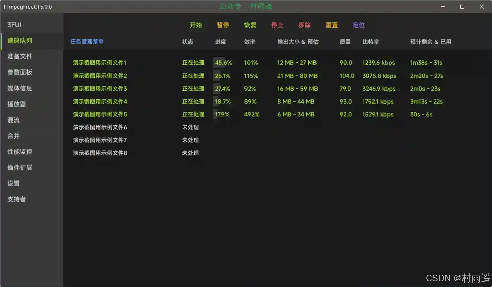

## 二、软件
### 1. [Zen Browser](https://github.com/zen-browser/desktop)
致力于打造一个更宁静的互联网使用环境，它以精美的设计、对用户隐私的高度重视以及丰富的实用功能为核心卖点，明确将用户的浏览体验置于数据收集之上，区别于众多以获取用户数据为目的的浏览器产品。

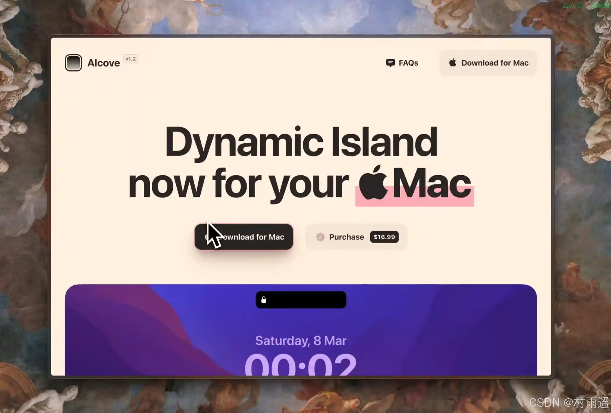

### 2. [MoePeek](https://github.com/cosZone/MoePeek)
一款轻量级 macOS 划词翻译工具，纯 Swift 6 开发，设备端 Apple 翻译保护隐私，安装体积仅 5MB，后台运行内存稳定约 50MB。

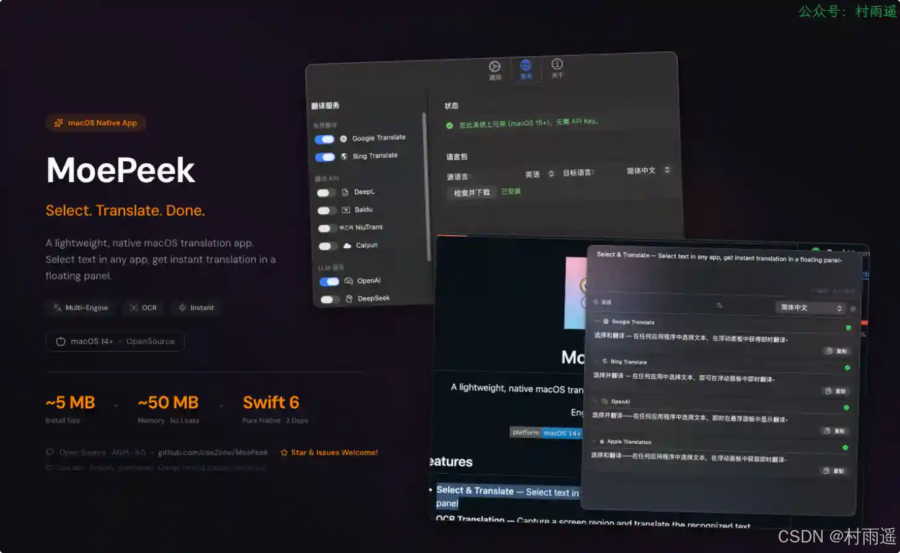

### 3. [FreeCut](https://github.com/walterlow/freecut)
一款完全在浏览器中运行的专业级视频编辑器。无需安装即可进行专业视频剪辑。借助多轨道编辑、关键帧动画、实时预览和高质量导出功能，打造精彩视频。

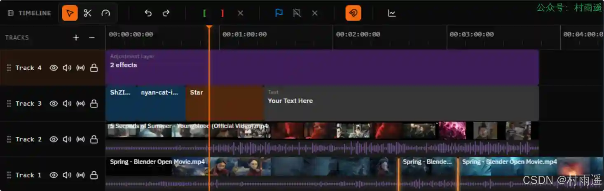

## 三、网站
### 1. [句方便](https://seneasy.cloud)
专业的公众号排版工具，50+精美主题，一键排版配图，支持 Markdown 编辑，让公众号文章更美观。

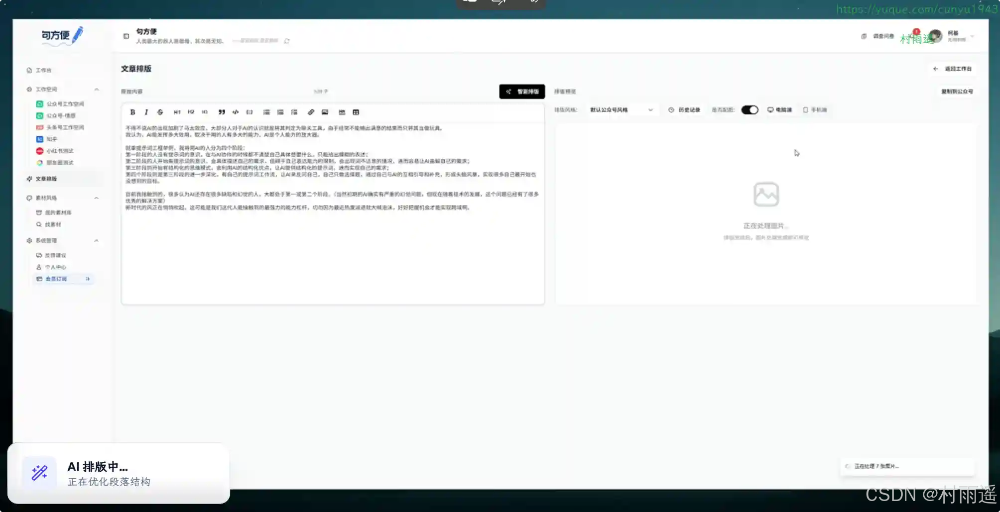

### 2. [开发者武器库](https://devtool.tech)
提供 60+ 免费在线开发工具，Base64、JSON、颜色转换、UUID、JWT 解码等，提升开发效率。

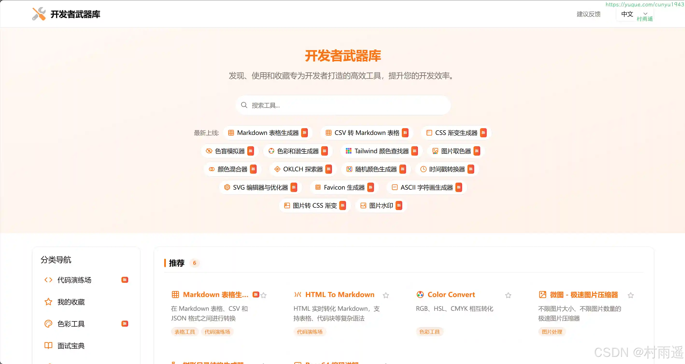

### 3. [古籍文献知识图谱网](https://cnkgraph.com)
一个专业级的古典文学研究数字化平台，适合文学研究者、历史学者、古籍爱好者进行学术研究和数据挖掘。平台通过知识图谱技术将分散的古典文献信息进行结构化整合，提供了传统纸质研究难以实现的时空可视化分析能力。建议用户根据具体研究需求选择相应功能模块，如需要时空分析可使用编年地图，需要文本分析可使用自动笺注和用典分析工具。

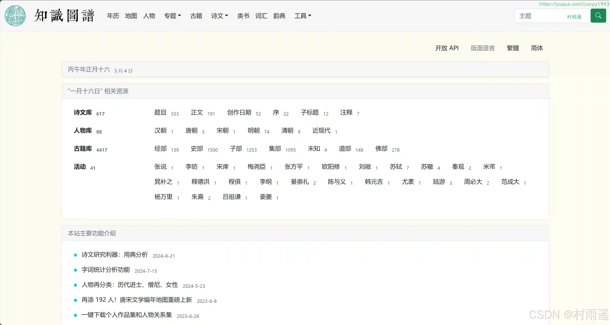

## 四、插件

### 1. [Avira 浏览器安全](https://chromewebstore.google.com/detail/flliilndjeohchalpbbcdekjklbdgfkk?utm_source=item-share-cb)

让您的网上冲浪变得私密且安全。

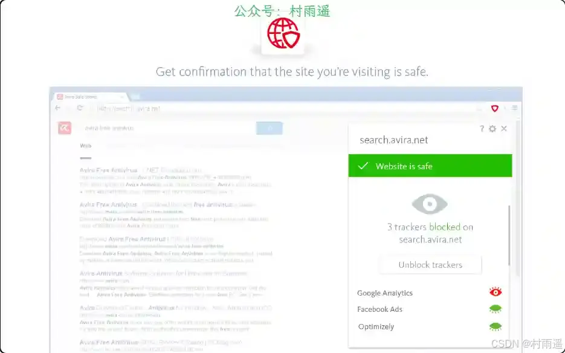

### 2. [Obsidian Web Clipper](https://chromewebstore.google.com/detail/obsidian-web-clipper/cnjifjpddelmedmihgijeibhnjfabmlf?hl=zh-CN)

以私密且持久的格式保存和标注网页内容，支持离线访问。将网络内容引入您的个人知识库。将内容保存到 Obsidian 知识库后，即使离线也可随时访问。Obsidian 安全私密，采用持久的开放格式设计，让您能够长期保存数据。

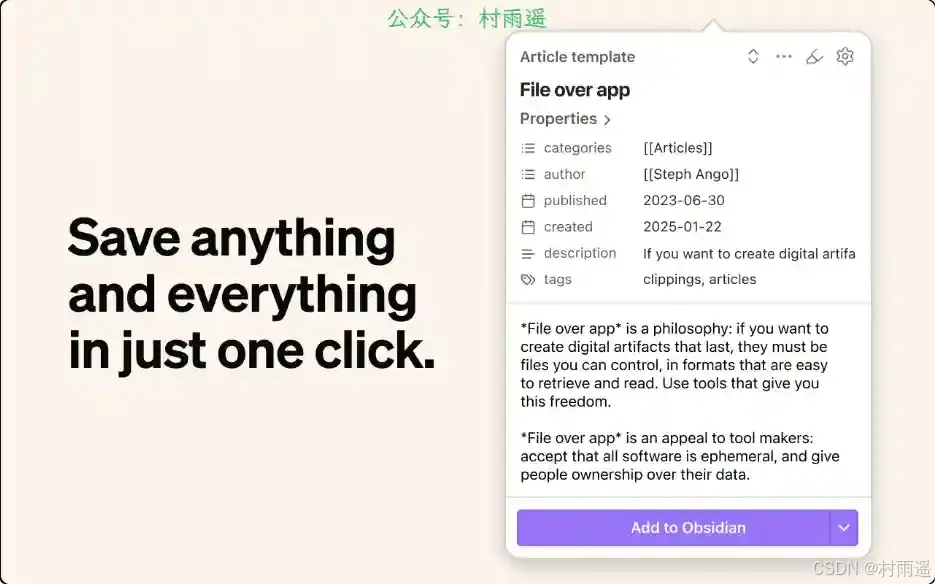

### 3. [网络绘画](https://chromewebstore.google.com/detail/mnopmeepcnldaopgndiielmfoblaennk?utm_source=item-share-cb)

实时在网页上绘制形状，绘制线条，绘制曲线，添加文本。

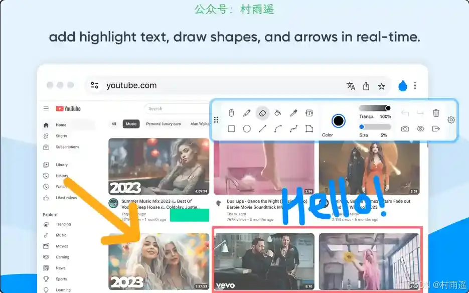

## 五、资料
### 1. [女娲.skill](https://github.com/alchaincyf/nuwa-skill)
女娲帮你蒸馏任何人的思维方式，让乔布斯、马斯克、芒格、费曼都给你打工。

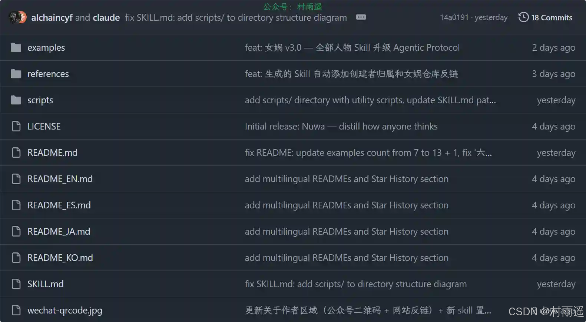

### 2. [同事.skill](https://github.com/titanwings/colleague-skill)
提供同事的原材料（飞书消息、钉钉文档、邮件、截图）加上你的主观描述，生成一个真正能替他工作的 AI Skill。用他的技术规范写代码，用他的语气回答问题，知道他什么时候会甩锅。

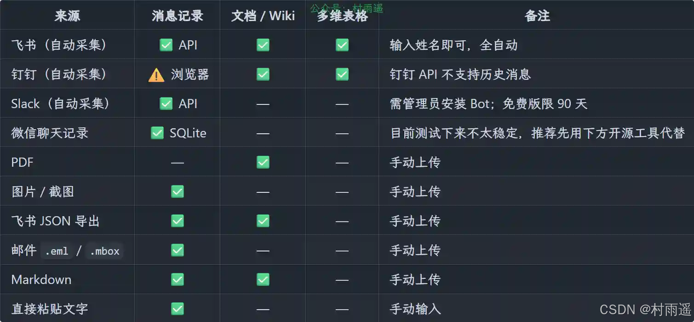

### 3. [超级全面的深度学习笔记](https://github.com/AccumulateMore/CV)

超级全面的深度学习笔记，包含土堆 Pytorch、李沐动手学深度学习、吴恩达深度学习、大飞大模型 Agent 等内容。

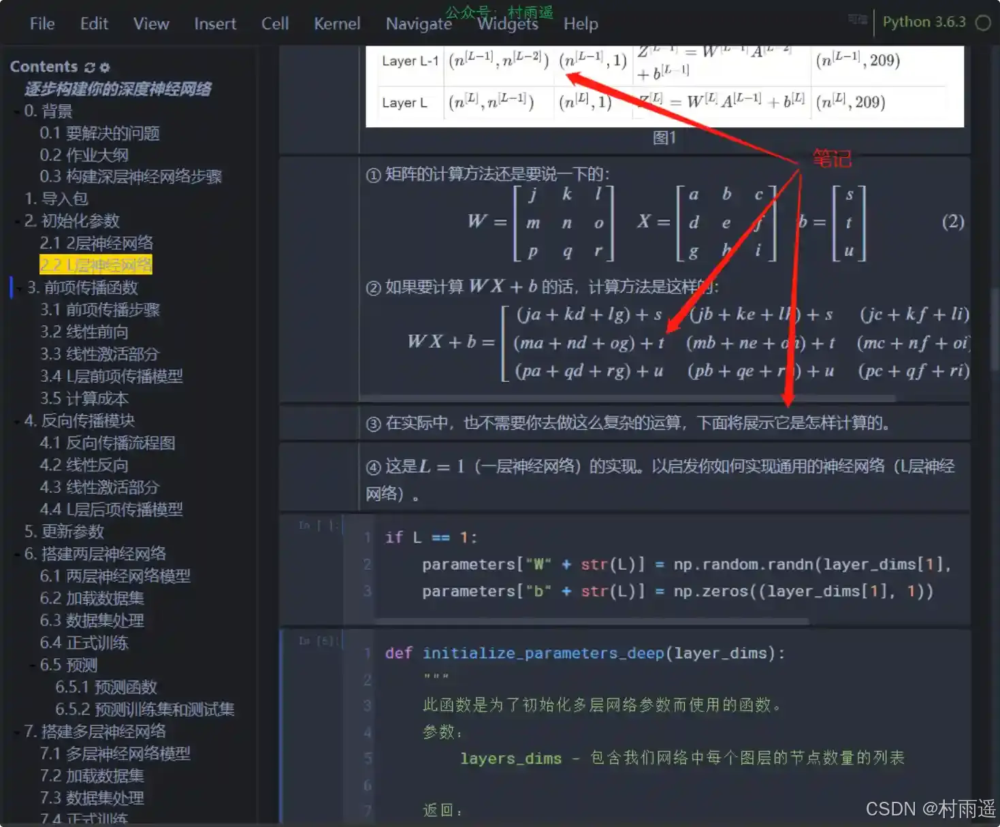

## ✍️ 说明

周刊专栏相关信息：

- **项目地址**：[Github](https://github.com/cunyu1943/weekly)，觉得不错麻烦给我一个**Star**，感谢 ❤️
- **浏览地址**：公众号 | [电子书](https://cunyu1943.github.io/weekly) | [语雀](https://yuque.com/cunyu1943/weekly) | [ima 知识库](https://ima.qq.com/wiki/?shareId=860487e32c6cc8d6c9070cd7f00caedf3cbf4102f695862d9c82f463b92417af)

如果你阅读到这里，说明我的工作没有白费。如果你想推荐项目/网站/软件/资源，欢迎提交 **[issue](https://github.com/cunyu1943/weekly/issues)** 或者添加我 **个人微信：coder_cunYu** 与我交流。

---

## ⏳ 联系

想解锁更多知识？不妨关注我的微信公众号：**村雨遥（id：JavaPark）**。

扫一扫，探索另一个全新的世界。

