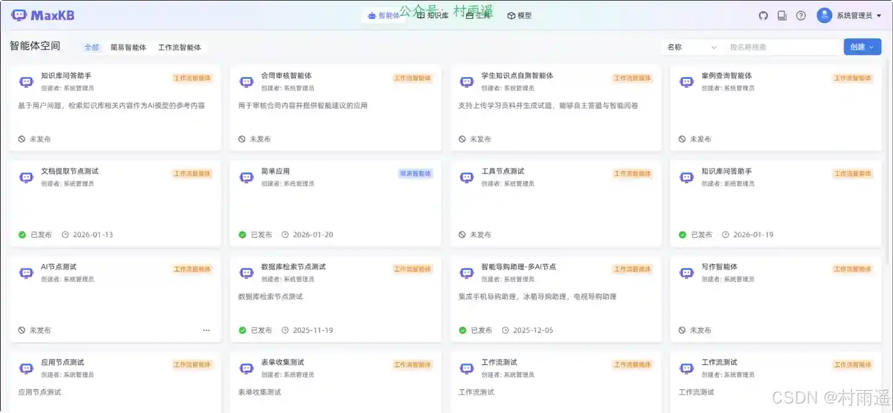
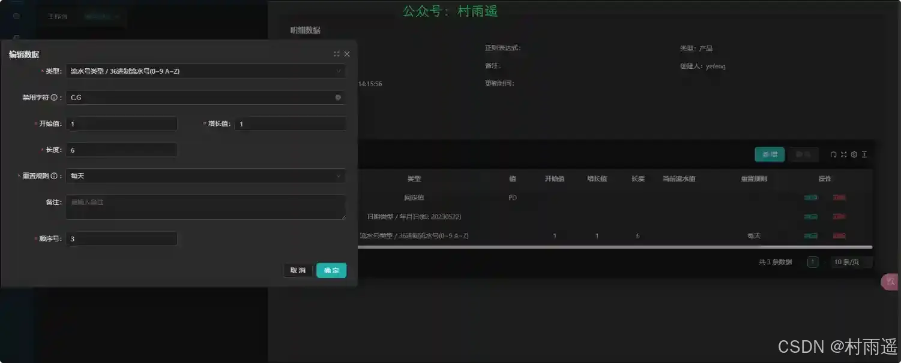
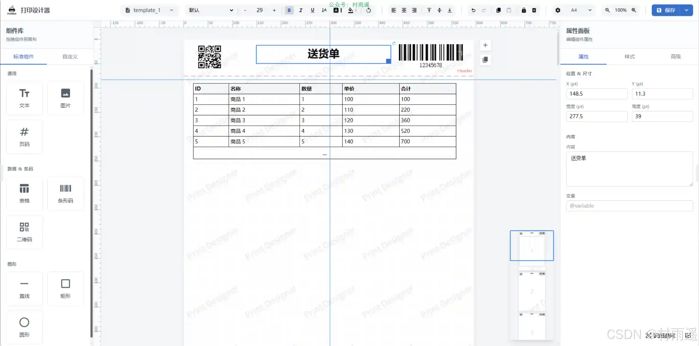
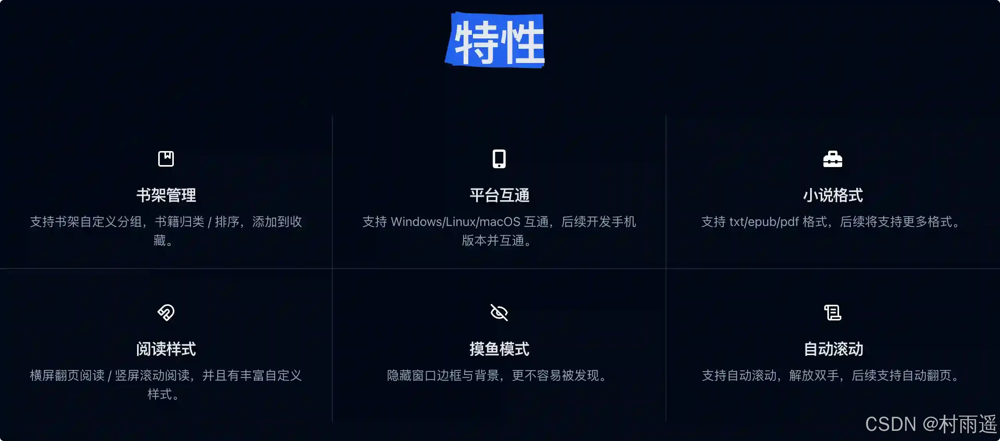
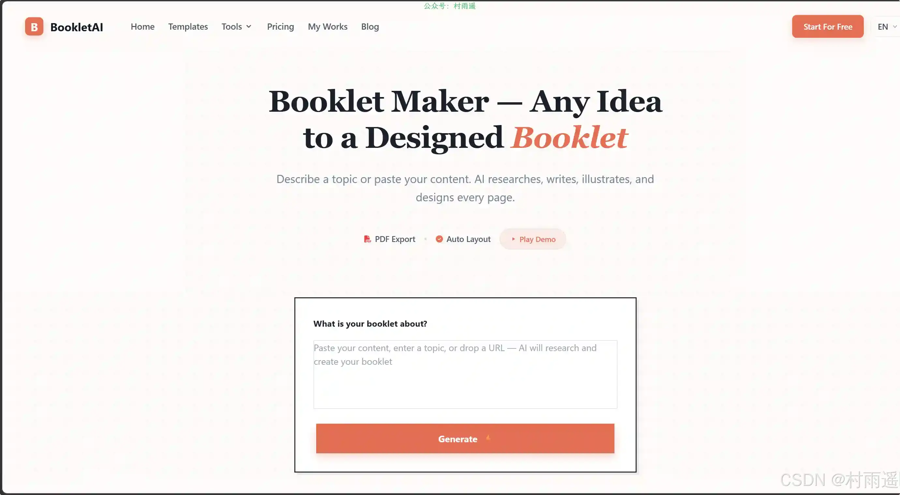
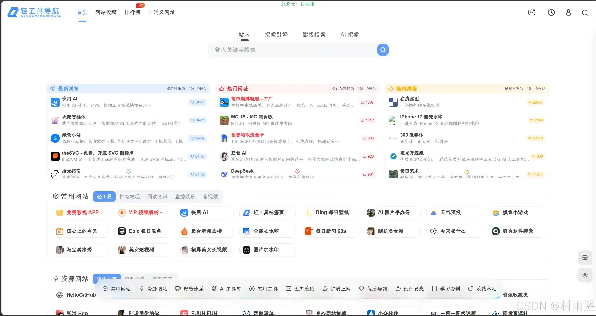
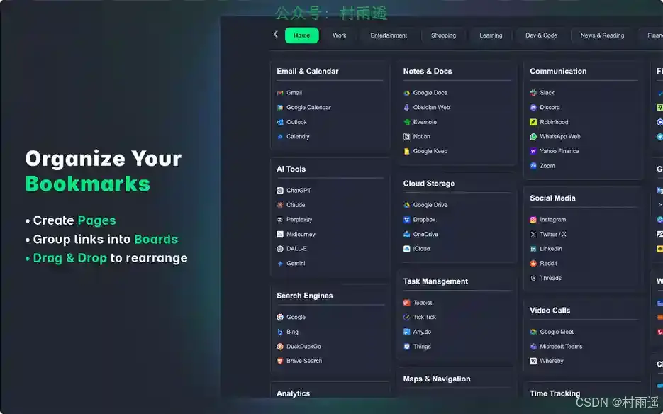
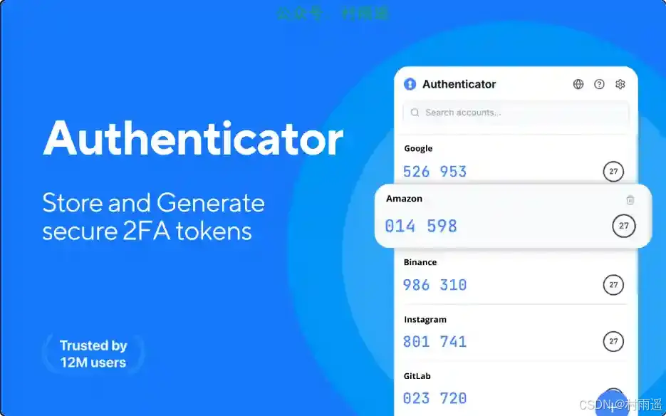
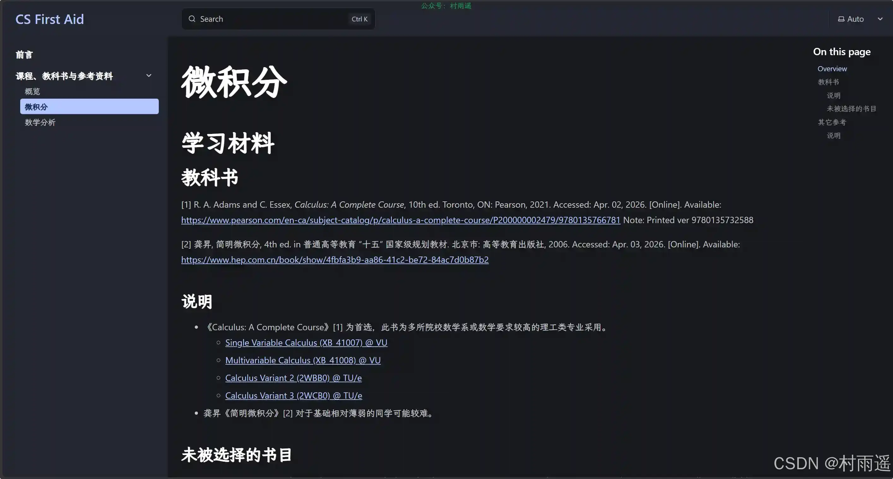
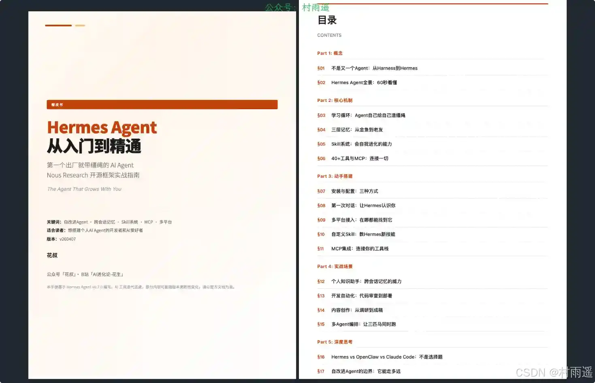

# 好物周刊#150：潮汐阅读

> 作者：[村雨遥](https://github.com/cunyu1943)
> 
> 不要哀求，学会争取，若是如此，终有所获
> 
> 原文：https://mp.weixin.qq.com/s/e3fjFwWL3Qa7LsNrTZ2uHA

## 🎈 号外 

最近，公众号之外，建立了微信交流群，不定期会在群里分享各种资源（影视、IT 编程、考试提升……）&知识。如果有需要，可以**扫码或者后台添加小编微信备注入群**。进群后**优先看群公告**，**呼叫群中【资源分享小助手】**，还能免费帮找资源哦～

## 一、项目

### 1. [MaxKB4j](https://gitee.com/taisan/MaxKB4j)

一款基于 Java 语言开发的 LLM 工作流应用和 RAG 的开源 LLMOps 平台，项目主要借鉴了 MaxKB、AIFlowy、Dify 和 FastGPT, 使用高性能、高稳定性以及安全可靠的 JAVA 语言重新设计开发。MaxKB4j 广泛应用于智能客服、企业内部知识库、学术研究与教育等场景。

### 2. [TMom](https://gitee.com/thgao/tmom)

支持多厂区/多项目级的 MOM/MES 系统，计划排程、工艺路线设计、在线低代码报表、大屏看板、移动端、AOT 客户端...... 目标是尽可能打造一款通用的生产制造系统。前端基于最新的 Vue3、TS、Ant Design Vue, 后端使用 .Net8、Sqlsugar，支持多种数据库切换、数据隔离与聚合。

### 3. [Vue Print Designer](https://gitee.com/theGreatOldFive/vue-print-designer)

一款可视化打印设计器，面向业务表单、标签、票据、快递单等场景，支持模板化、变量化，并提供静默打印与云打印能力，同时兼容多种导出 / 打印方式。

## 二、软件

### 1. [Moeli 阅读](https://reader.moeli.top)

一款多功能本地书籍阅读软件，支持多种功能，提供完善的阅读体验。

### 2. [潮汐阅读](https://tidereader.com)

一个全平台互通，支持 TXT/EPUB 电子书格式，支持摸鱼模式/自动滚动模式，丰富自定义样式的小说阅读器。

### 3. [SoloMD](https://github.com/zhitongblog/solomd)

一款轻量级的跨平台 Markdown 与纯文本编辑器。

## 三、网站

### 1. [Booklet AI](https://bookletai.org/tools/booklet-maker.html)

一个通过对话创建专业小册子的 AI 工具。用户输入主题后，AI 会先追问受众、用途和风格，再自动联网调研、整理大纲，并逐页生成图文混排的 A4 小册子。

### 2. [网络收音机](https://fm365.space)

网络收音机，在线即可收听全国各地的上千个 FM 广播电台。

### 3. [轻工具导航](https://qinggongju.com)

一个专注收集分享优质免费资源的导航网站。

## 四、插件

### 1. [LumiList](https://chromewebstore.google.com/detail/lumilist-smart-bookmark-m/pcekakljniocipfpmjmpmgaleigcbhlh)

可视化 + 拖拽 + 智能搜索的 Chrome 新标签页书签管理器，适合需要高效整理、快速检索大量书签的用户。

### 2. [2FA](https://chromewebstore.google.com/detail/2fa/ebhcbenbgjmaebpgbldimndmfomjmphd?hl=zh-CN)

在浏览器中生成安全验证码，为您的所有账户提供快速、离线的双重身份验证。

### 3. [自动点击器](https://chromewebstore.google.com/detail/speed-auto-clicker/ggggbbllnjbfepahihkdfohpbdgndobb)

一个快速且可靠的自动点击器，该扩展可以在任何网站上工作，具有可自定义的间隔。无论您是需要它用于游戏、测试还是工作，它都能轻松应对。

## 五、资料

### 1. [CS 自救指南](https://github.com/AndyBRoswell/cs-first-aid)

面向（将）在中国内地就读计算机类专业的，有或无留学意向，（准备）自学计算机的人员。

### 2. [Hermes Agent: The Complete Guide](https://github.com/alchaincyf/hermes-agent-orange-book)

Hermes Agent 从入门到精通，Nous Research 开源 AI Agent 框架实战指南。

### 3. [VibeCoding 教程](https://github.com/1EchA/how-to-vibecoding)

Vibecoding 系列教程：从环境搭建到多智能体协作，涵盖 MCP、Skills、Agent 分工治理。

## ✍️ 说明

周刊专栏相关信息：

- **项目地址**：[Github](https://github.com/cunyu1943/weekly)，觉得不错麻烦给我一个**Star**，感谢 ❤️
- **浏览地址**：公众号 | [电子书](https://cunyu1943.github.io/weekly) | [语雀](https://yuque.com/cunyu1943/weekly) | [ima 知识库](https://ima.qq.com/wiki/?shareId=860487e32c6cc8d6c9070cd7f00caedf3cbf4102f695862d9c82f463b92417af)

如果你阅读到这里，说明我的工作没有白费。如果你想推荐项目/网站/软件/资源，欢迎提交 **[issue](https://github.com/cunyu1943/weekly/issues)** 或者添加我 **个人微信：coder_cunYu** 与我交流。

---

## ⏳ 联系

想解锁更多知识？不妨关注我的微信公众号：**村雨遥（id：JavaPark）**。

扫一扫，探索另一个全新的世界。

