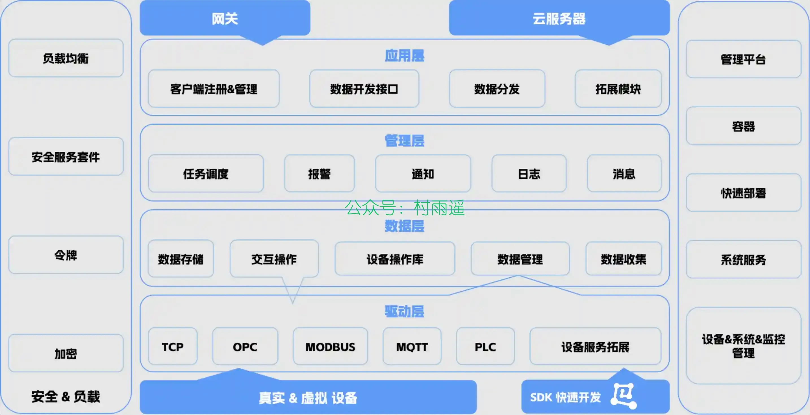
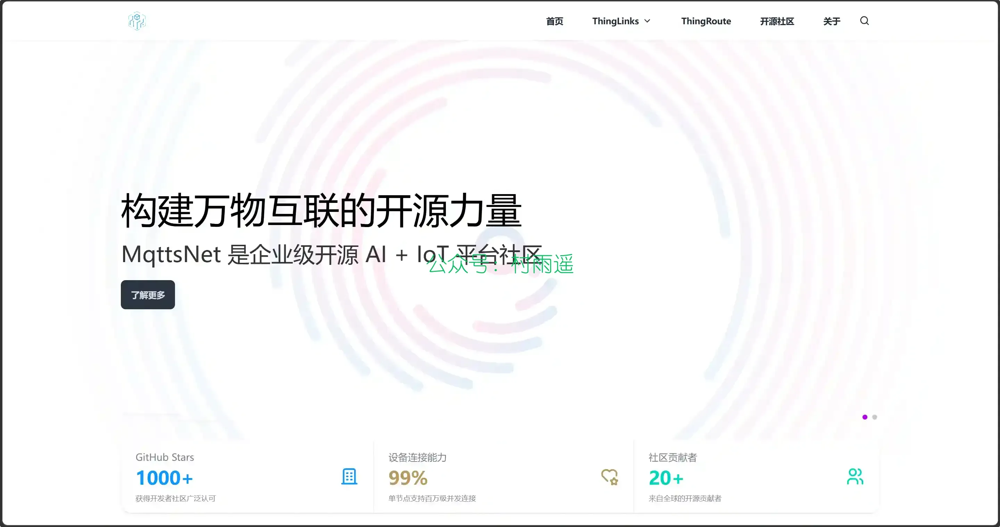
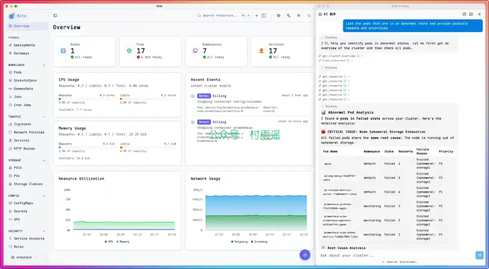
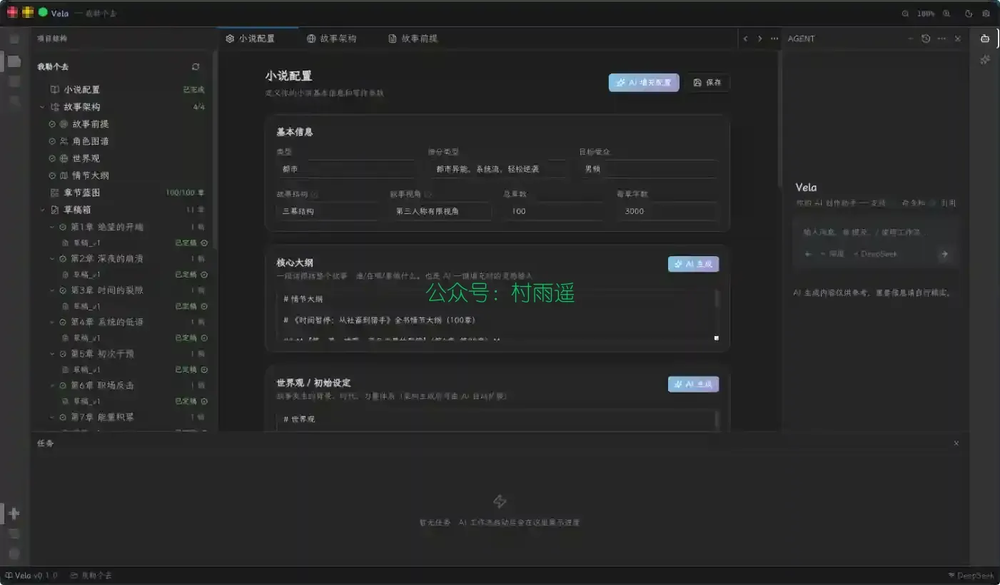
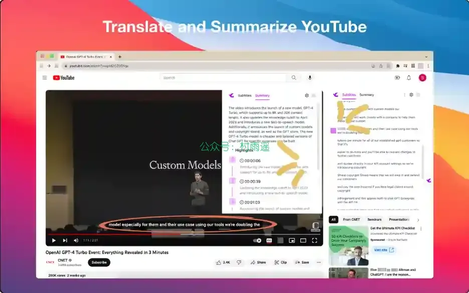
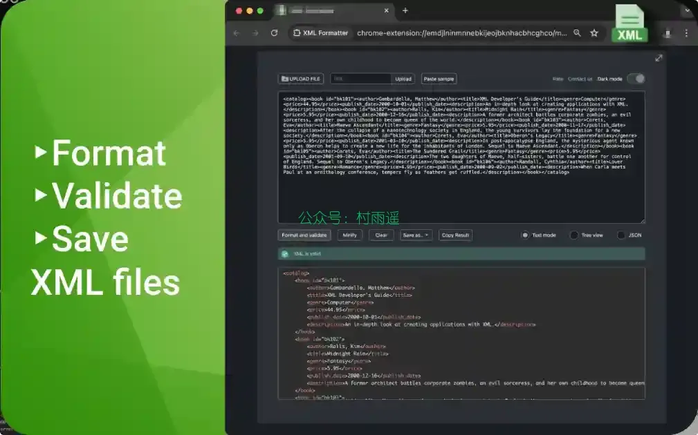
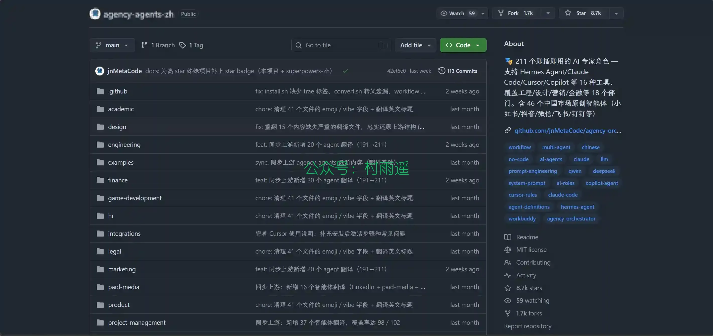
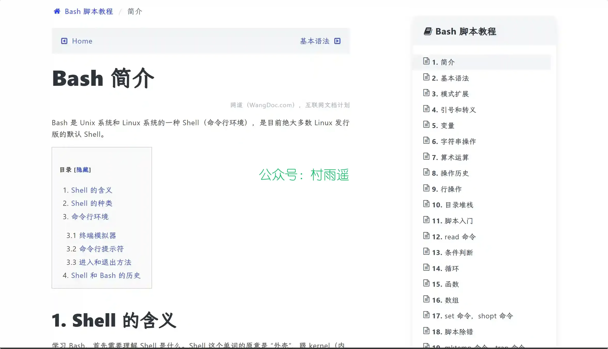

# 好物周刊#151：纯净派

> 作者：[村雨遥](https://github.com/cunyu1943)
> 
> 不要哀求，学会争取，若是如此，终有所获
> 
> 原文：https://mp.weixin.qq.com/s/lXqHDltvG-CDPr2z9ImUGw

## 🎈 号外 

最近，公众号之外，建立了微信交流群，不定期会在群里分享各种资源（影视、IT 编程、考试提升……）&知识。如果有需要，可以**扫码或者后台添加小编微信备注入群**。进群后**优先看群公告**，**呼叫群中【资源分享小助手】**，还能免费帮找资源哦～

## 一、项目

### 1. [IoT DC3](https://gitee.com/pnoker/iot-dc3)

一个基于 Spring Cloud 构建的完全开源分布式物联网 (IoT) 平台。 它加速了物联网项目开发，简化了设备管理，并提供全面的解决方案以构建健壮的物联网系统。 所有组件和代码均为开源，保证了透明性、灵活性，以及由社区驱动的持续创新。

### 2. [ThingLinks](https://gitee.com/mqttsnet/thinglinks)

一款企业级多租户 SaaS 云物联网平台，基于 Spring Cloud 微服务架构构建，具备高性能、高吞吐、高扩展的设备接入能力。单机支持百万级并发连接，支持插件化扩展开发和多协议适配。

### 3. [enjoy-iot](https://gitee.com/open-enjoy/enjoy-iot)

基于若依基础框架开发的物联网平台，包含了产品、物模型、消息转换、组件（mqtt 组件、EMQX 组件、http 组件、tcp 组件、modbus 组件等）、设备管理、设备分组、规则引擎、第三方平台接入、数据流转（http/mqtt/kafka）、告警中心等模块，支持无人机接入，支持 es/td 等多种时序数据库。

## 二、软件

### 1. [aPaste](https://github.com/AlliotTech/aPaste)

一款适用于 macOS 的轻量级剪贴板管理器。支持剪贴板历史记录、固定面板和即时搜索。

### 2. [Kite Desktop](https://github.com/eryajf/kite-desktop)

一个基于 Wails v3 打造、面向桌面端的 K8S 多集群管理工具。

### 3. [Vela](https://github.com/heider-x/vela)

一款开源、隐私优先、本地优先的 AI 写作 IDE，专为长篇小说创作 (Novel Writing)、网文写手 (Web Fiction) 与创意写作 (Creative Writing) 而生。它将大语言模型驱动的全流程工作流（大纲生成、章节起草、智能重写、自动审阅）与本地 RAG 知识库深度融合，为作者提供 IDE 级别的沉浸式创作体验 —— 所有数据和模型调用都运行在您自己的计算机上，使用您自己的 API Key (BYOK)。

## 三、网站

### 1. [纯净派](https://chunjing.app)

精选全球优质绿色软件，提供官方直连、123 云盘等高速下载通道。拒绝广告，拒绝捆绑，让每一个工具回归纯净。

### 2. [Giffox](https://www.giffox.com/)

电子书搜索，Giffox 出品！在这里发现更多开放存取的好书，尊重版权，请勿使用和传播盗版书籍。

### 3. [学吧导航](https://www.xue8nav.com/)

超过四十万学习爱好者都在用的专业学习网址大全学霸导航，汇集了国内外优质的学习网站和平台。网站囊括了综合平台、外语学习、编程算法、电脑办公、百科知识、设计剪辑、音乐艺术、文史哲理、医学政经、演讲座谈、数理化生等 10 余项分类，收录了上百个个优质的国内外学习网站。无论你是在校学生，还是上班人群，亦或是单纯的学习爱好者，无需再苦恼于四处寻找学习网站。

## 四、插件

### 1. [TinaMind - 最强大的 AI 助手](https://chromewebstore.google.com/detail/befflofjcniongenjmbkgkoljhgliihe?utm_source=item-share-cb)

由 GPT-4 驱动：支持聊天、搜索、写作、翻译、TTS、OCR、管理个人提示词、一键处理选定文本、翻译和总结 YouTube 视频等等功能。

### 2. [Better Ruler](https://chromewebstore.google.com/detail/better-ruler/ilcnadaaninblgbekoaihdhoiecaflie)

一款网页测量工具，支持吸附测量。为前端开发和 UI 设计提供便利。

### 3. [XML 格式化工具](https://chromewebstore.google.com/detail/nogokoemmdgggiojcpalgneggpijacea?utm_source=item-share-cb)

将 XML 文件格式化，以便于阅读和编辑。这个在线  XML 格式化工具确保您的代码整齐有序，缩进正确，从而更容易理解和处理。

## 五、资料

### 1. [AI 智能体专家团队](https://github.com/jnMetaCode/agency-agents-zh)

211 个即插即用的 AI 专家角色 — 覆盖工程、设计、营销、产品、游戏、安全、金融等 18 个部门。不是通用提示词模板，每个智能体都有独立的人设、专业流程和可交付成果。支持 Claude Code / Cursor / Copilot 等 16 种 AI 编程工具。

### 2. [Bash 教程](https://github.com/wangdoc/bash-tutorial)

本教程介绍 Linux 命令行 Bash 的基本用法和脚本编程。

### 3. [MySQL 入门教程](https://github.com/jaywcjlove/mysql-tutorial)

从零开始学习 MySQL，主要是面向 MySQL 数据库管理系统初学者。

## ✍️ 说明

周刊专栏相关信息：

- **项目地址**：[Github](https://github.com/cunyu1943/weekly)，觉得不错麻烦给我一个**Star**，感谢 ❤️
- **浏览地址**：公众号 | [电子书](https://cunyu1943.github.io/weekly) | [语雀](https://yuque.com/cunyu1943/weekly) | [ima 知识库](https://ima.qq.com/wiki/?shareId=860487e32c6cc8d6c9070cd7f00caedf3cbf4102f695862d9c82f463b92417af)

如果你阅读到这里，说明我的工作没有白费。如果你想推荐项目/网站/软件/资源，欢迎提交 **[issue](https://github.com/cunyu1943/weekly/issues)** 或者添加我 **个人微信：coder_cunYu** 与我交流。

---

## ⏳ 联系

想解锁更多知识？不妨关注我的微信公众号：**村雨遥（id：JavaPark）**。

扫一扫，探索另一个全新的世界。

