# 好物周刊#152：网页打印机

> 作者：[村雨遥](https://github.com/cunyu1943)
> 
> 不要哀求，学会争取，若是如此，终有所获
> 
> 原文：https://mp.weixin.qq.com/s/rzt58crlNBijFx8HQWzb1g

## 🎈 号外 

最近，公众号之外，建立了微信交流群，不定期会在群里分享各种资源（影视、IT 编程、考试提升……）&知识。如果有需要，可以**扫码或者后台添加小编微信备注入群**。进群后**优先看群公告**，**呼叫群中【资源分享小助手】**，还能免费帮找资源哦～

## 一、项目

### 1. [mini-cc](https://github.com/you-want/mini-cc)

一个极简架构的轻量级 AI 编程智能体，剖析、学习和复刻大厂 Agent 架构的开源教学项目。

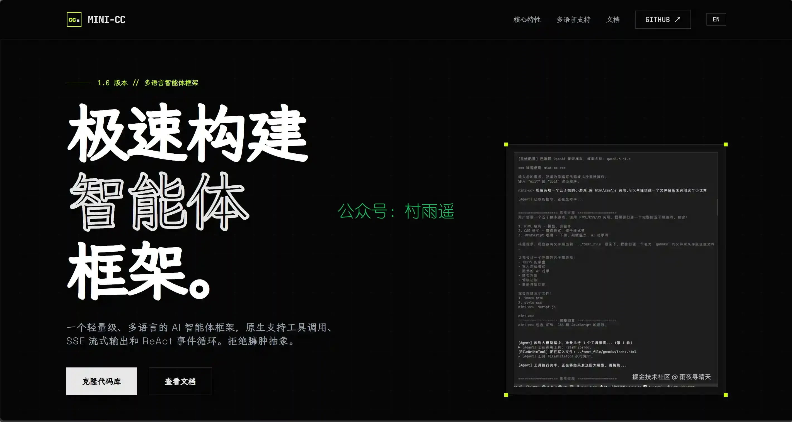

### 2. [Animal-Island-UI](https://github.com/guokaigdg/animal-island-ui)

基于 React + TypeScript 实现的轻量 UI 组件库，设计风格灵感来源于任天堂《集合啦！动物森友会》游戏界面，用于个人前端技术练习与组件化开发学习。

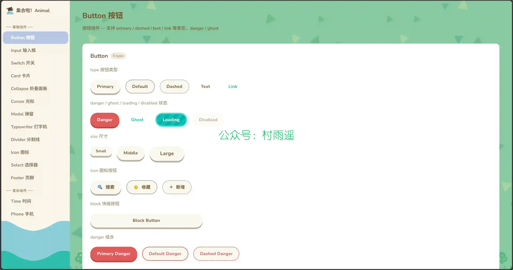

### 3. [网页打印机](https://github.com/hanxi/cups-web)

一个功能完善的网页版打印机管理工具。它允许你通过浏览器远程控制打印机，支持多用户管理、打印记录追踪等功能，轻松实现家庭或小型办公室的打印管理需求。

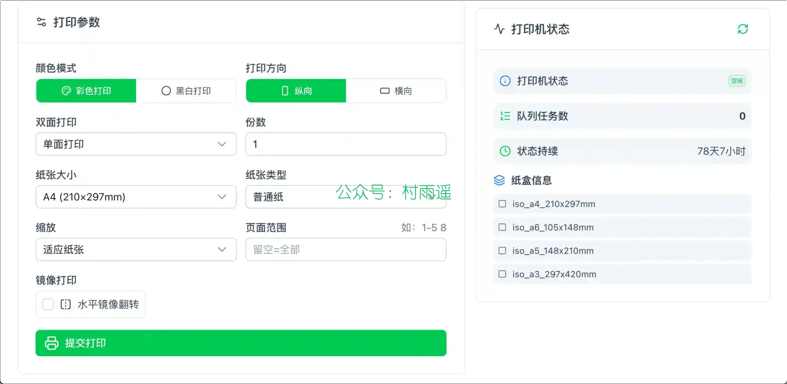

## 二、软件

### 1. [Tolaria](https://github.com/refactoringhq/tolaria)

一款专为 AI 时代打造的轻量化知识管理工具，主打永久免费、开源使用，无需注册账号，核心以本地文件为基础管理笔记，适配 Mac 系统且可在 GitHub 查看相关资源。

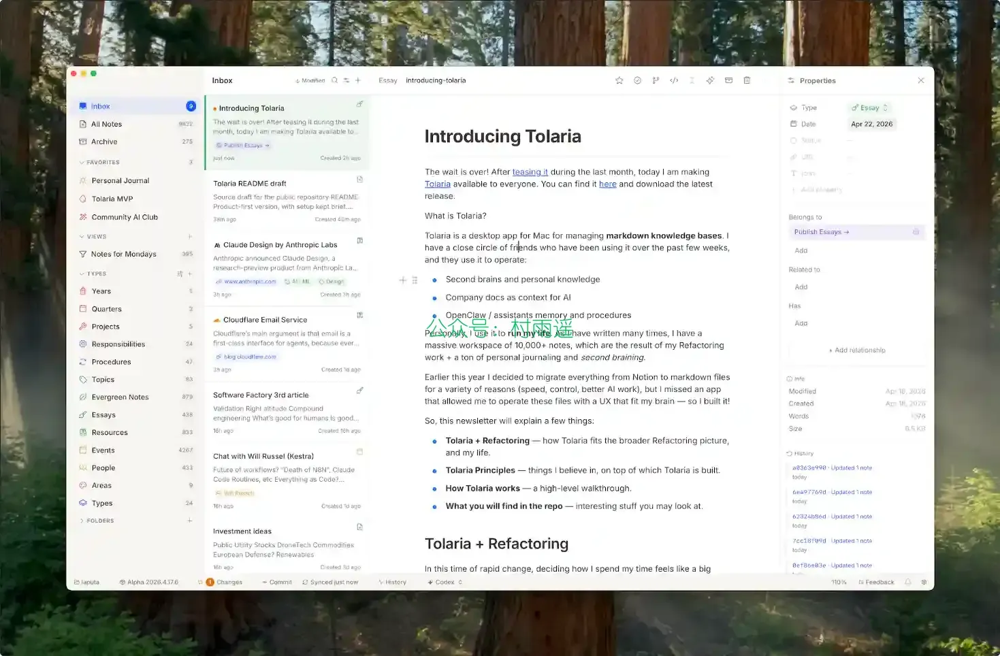

### 2. [BitFun](https://github.com/GCWing/BitFun)

一个桌面级 Agent 运行时（Local Agent Runtime），同时也是一套开箱即用的桌面 Agent 应用。

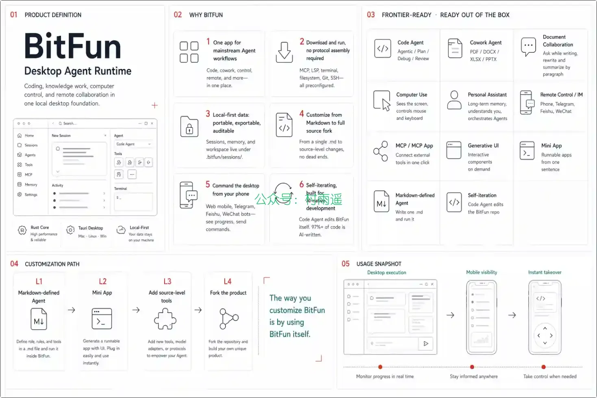

### 3. [光鸭云盘](https://www.guangyapan.com/a?id=1&code=VGIXIV#/activity/invite/share)

迅雷旗下的新网盘，2026-04-20 正式上线，主打永久 2TB 免费、会员不限速、100MB 以下免登录下载、强影音能力。

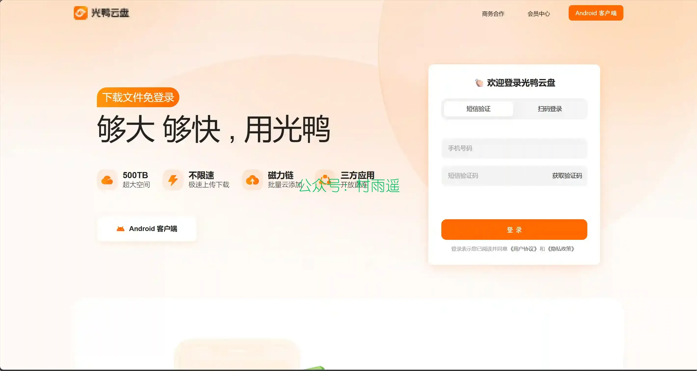

## 三、网站

### 1. [免费项目网](https://blog.951u.cn/)

免费知识付费、网创项目、教学资源，24h 自动实时更新全网教程资料，纯免费！

### 2. [免费导航](https://mianfeidaohang.cn/)

致力于收集全网免费网站、资源！

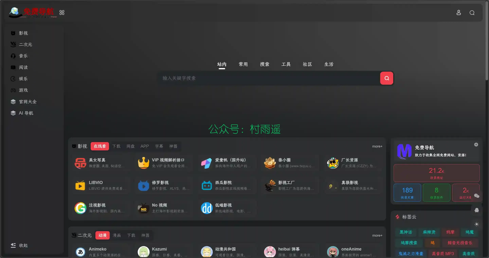

### 3. [免费电影网](https://mianfeidianying.club/)

免费电影网，提供最新最快的视频分享数据。

## 四、插件

### 1. [Tab Harbor](https://github.com/V-IOLE-T/tab-harbor)

一个更安静的新标签页工作台，把打开中的标签、快捷链接、待读和轻量待办收进同一个顺手的空间里。

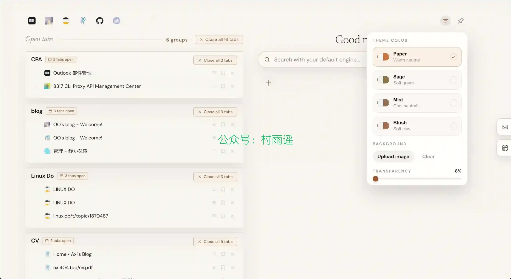

### 2. [Cookies 获取助手](https://chromewebstore.google.com/detail/mmcdaoockinhaeiljdmjmnjfndpfpklo?utm_source=item-share-cb)

一键获取 Cookies 的 Chrome 扩展, 用于配合 QD 框架使用。

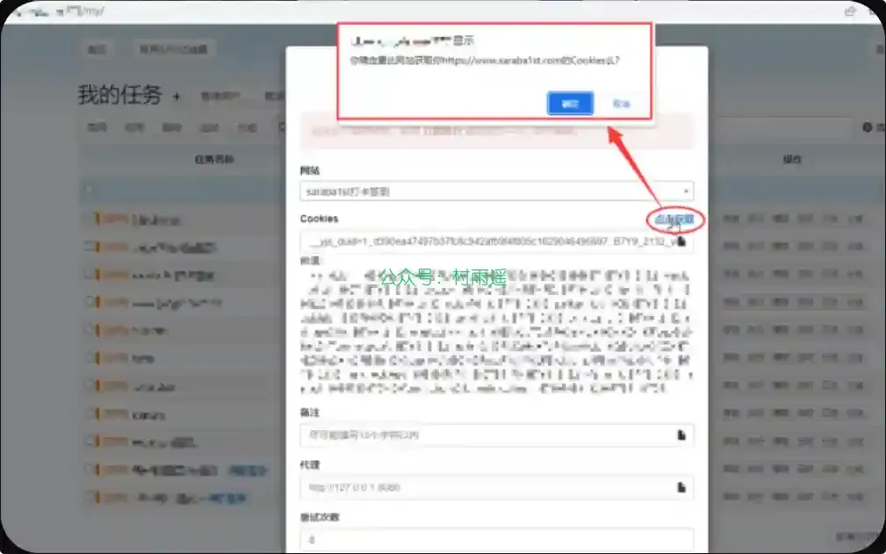

### 3. [Smart Bookmark](https://chromewebstore.google.com/detail/smart-bookmark/nlboajobccgidfcdoedphgfaklelifoa)

智能书签管家，AI 驱动，自动生成标签，语义化搜索，让整理和查找变得更简单。

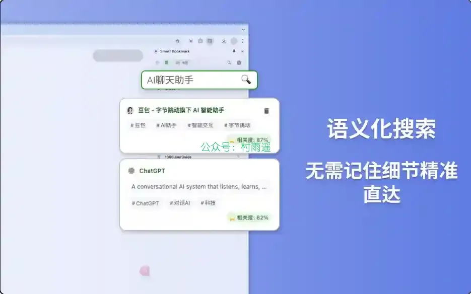

## 五、资料

### 1. [AIInfraGuide](https://github.com/caomaolufei/AIInfraGuide)

AI Infra 全栈从 0 入门学习资料，本项目系统梳理从 GPU 硬件到分布式训练、从 CUDA 编程到推理优化的完整技术栈，帮助工程师构建扎实的 AI 基础设施知识体系。同时提供了面试宝典模块（共收录 180+ 场面试真题，覆盖 40+ 家公司）。

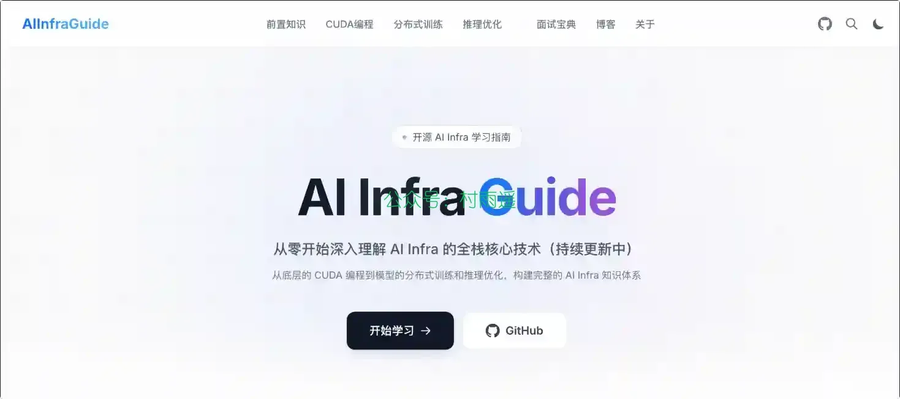

### 2. [Agent Offer](https://github.com/guoguo-tju/agent_java_offer)

一份面向后端转型到 AI Agent 的公开复习资料库。目的是把分散笔记重组为更适合复习、口述和追问深挖的结构化目录。

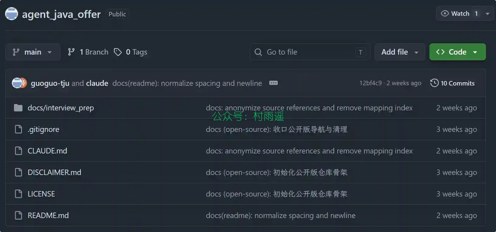

### 3. [Agentic AI Architect](https://github.com/DjangoPeng/agentic-ai)

一套经过生产验证的 OpenClaw + Claude Code 实战资料，包含部署脚本、IM 接入指南、模型配置模板、安全加固清单和排错手册。

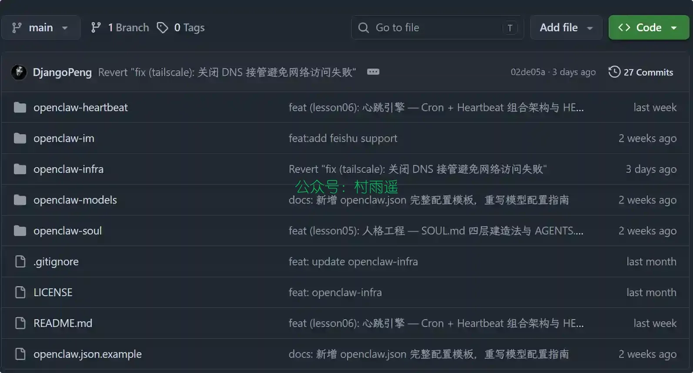

## ✍️ 说明

周刊专栏相关信息：

- **项目地址**：[Github](https://github.com/cunyu1943/weekly)，觉得不错麻烦给我一个**Star**，感谢 ❤️
- **浏览地址**：公众号 | [电子书](https://cunyu1943.github.io/weekly) | [语雀](https://yuque.com/cunyu1943/weekly) | [ima 知识库](https://ima.qq.com/wiki/?shareId=860487e32c6cc8d6c9070cd7f00caedf3cbf4102f695862d9c82f463b92417af)

如果你阅读到这里，说明我的工作没有白费。如果你想推荐项目/网站/软件/资源，欢迎提交 **[issue](https://github.com/cunyu1943/weekly/issues)** 或者添加我 **个人微信：coder_cunYu** 与我交流。

---

## ⏳ 联系

想解锁更多知识？不妨关注我的微信公众号：**村雨遥（id：JavaPark）**。

扫一扫，探索另一个全新的世界。

