# 好物周刊#：

> 作者：[村雨遥](https://github.com/cunyu1943)
> 
> 不要哀求，学会争取，若是如此，终有所获
> 
> 原文：

## 🎈 号外 

最近，公众号之外，建立了微信交流群，不定期会在群里分享各种资源（影视、IT 编程、考试提升……）&知识。如果有需要，可以**扫码或者后台添加小编微信备注入群**。进群后**优先看群公告**，**呼叫群中【资源分享小助手】**，还能免费帮找资源哦～

## 一、项目

### 1. [UJCMS](https://gitee.com/dromara/ujcms)

一款基于 Java 的开源企业级网站内容管理系统（Java CMS），采用 Spring Boot、MyBatis、Spring Security、Vue 3、Vite、Element Plus 等技术开发，支持 无头 CMS 架构。系统提供 模板 + 标签 和 Vue（React）+ API 两种开发模式，分别适用于传统模板渲染与现代化前后端分离场景，为网站的建设、管理与维护提供高效、灵活、可靠的解决方案。

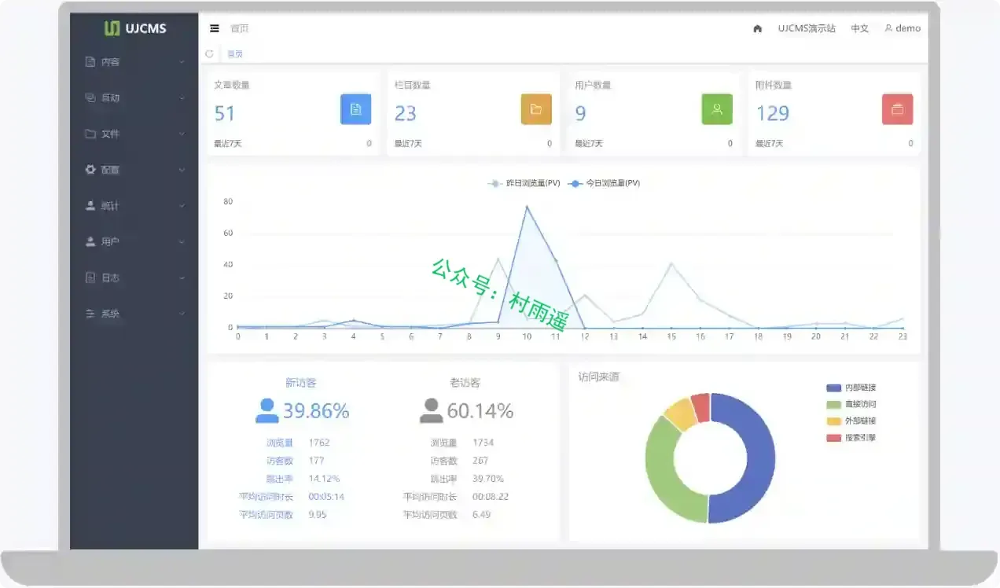

### 2. [GuaDa](https://gitee.com/zhendongdong/guada_ai)

智能 AI 对话系统，支持 ReAct Agent、多模型适配、RAG 知识库检索、MCP 工具调用与 Skills 技能框架。目标是打造一个可用、易用、好用的个人智能助理。目前处于早期开发阶段，部分功能正在持续快速迭代中。

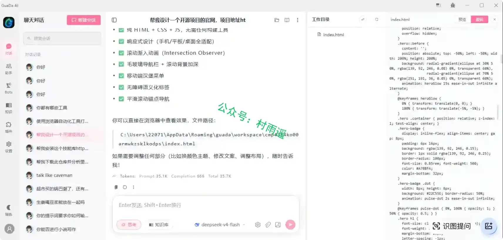

### 3. [MateClaw](https://gitee.com/mateos/mateclaw)

你的超级大脑，Java 智能体 ，支持多 Agent 编排、Skills、Memory、Dream 、MCP 协议与多渠道接入，底层由 Spring AI Alibaba 驱动。

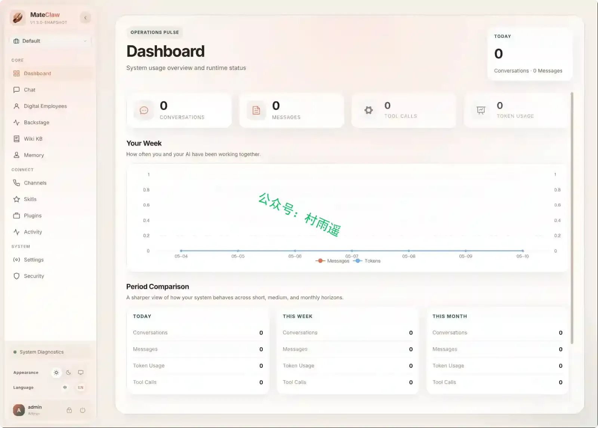

## 二、软件

### 1. [觅影](https://github.com/nandieling/OmniPlay)

一款原生开发的海报墙播放器，支持 mac、win 双系统。mac 采用 swift 开发，win 采用C# + .net + Avalonia UI。底层播放器核心为 MPVKit-GPL / libmpv / FFmpeg 相关组件。 

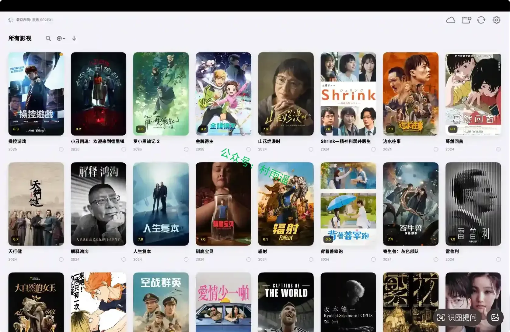

### 2. [Quetta](https://www.quetta.net)

一款基于 Chromium 主打去广告 + 视频下载 + 扩展支持的移动浏览器，适配安卓与 iOS，免费且无数据收集。

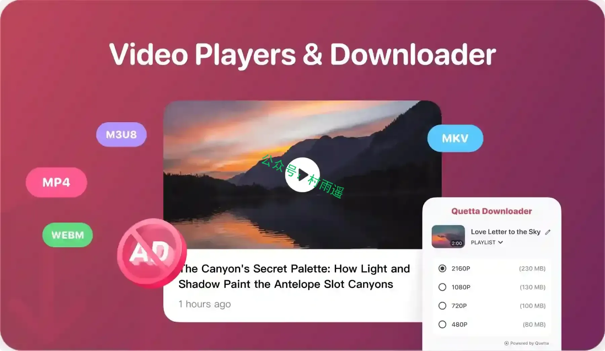

### 3. [AndDrive](https://anddrive.catchingnow.com)

无缝连接你的 Mac 和 Android，将手机原生挂载至 Finder，享受无感的高画质投屏。打破桌面与移动设备的生态隔阂。

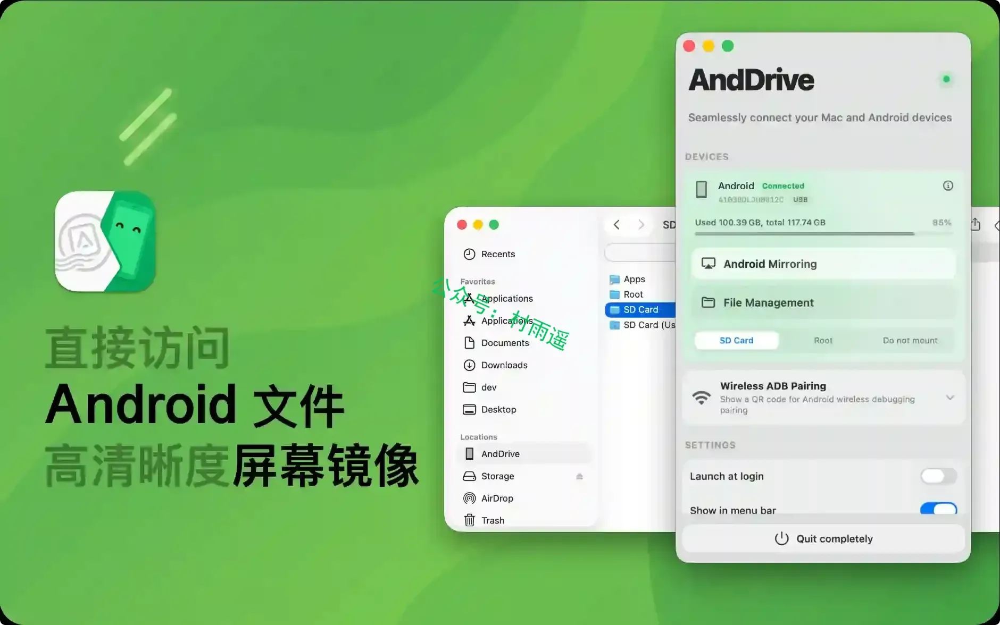

## 三、网站

### 1.  [新趣集](https://xinquji.com)

一个产品发现社区，发现最新的网站，移动 App 和技术产品。

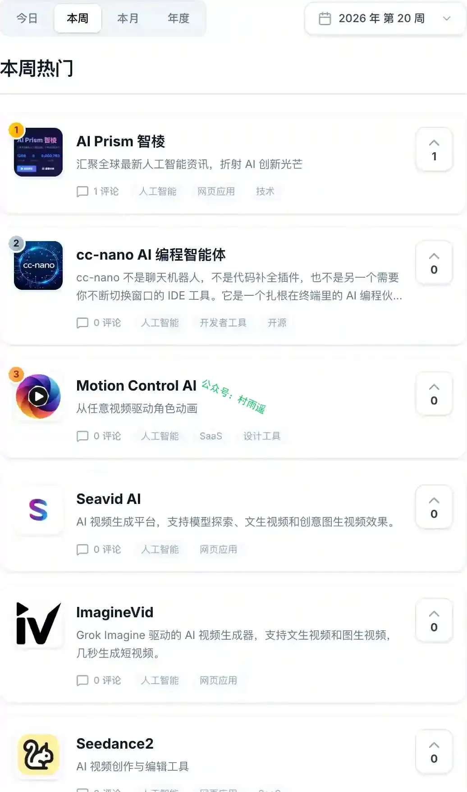

### 2. [源仓](https://yuancang.cc)

书源、订阅源分享平台。

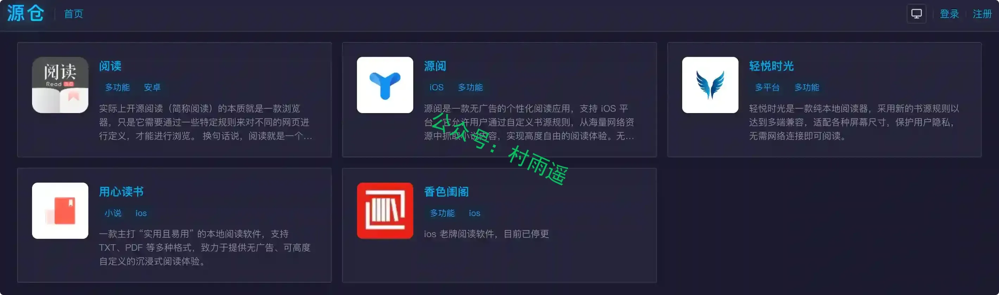

### 3. [音述](https://www.yinshu.me)

音述被誉为“中文版 Suno”，是全球地标级AI音乐创作平台。独家黑科技引擎，3 秒生成录音棚级无损音质歌曲。完全无需乐理，输入歌词一键成曲，支持流行、古风、电音等全风格覆盖。包含无损 Stem 分轨、人声替换、歌词生成等专业功能。永久免费试用，立即打造你的百万爆款单曲！

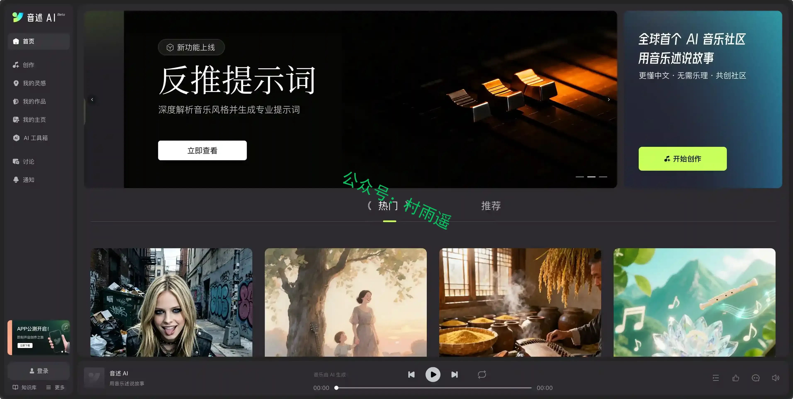

## 四、插件

### 1. [materialYouNewTab](https://chromewebstore.google.com/detail/mynt-material-you-new-tab/ngagaahlooknahpbppifocdndhcdknel)

一款功能全面的浏览器扩展程序，它可以通过可自定义的主题、欢迎信息和各种便捷工具来个性化您的新标签页，同时还能与您首选的搜索引擎无缝集成。

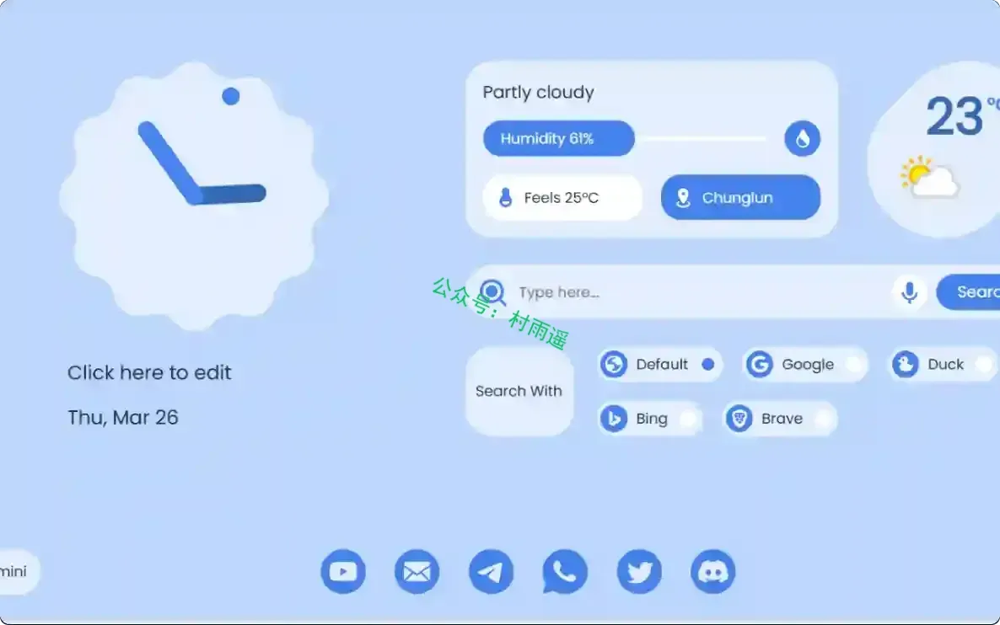

### 2. [Glass New Tab](https://chromewebstore.google.com/detail/pdjebhcifgoembcidgjhdjohnkgcbflb?utm_source=item-share-cb)

iOS 风格控制面板，将 Chrome 新标签页升级为高级磨砂玻璃质感仪表盘，内置聚焦搜索、桌面小组件、快捷访问，并主打隐私优先个性化定制。

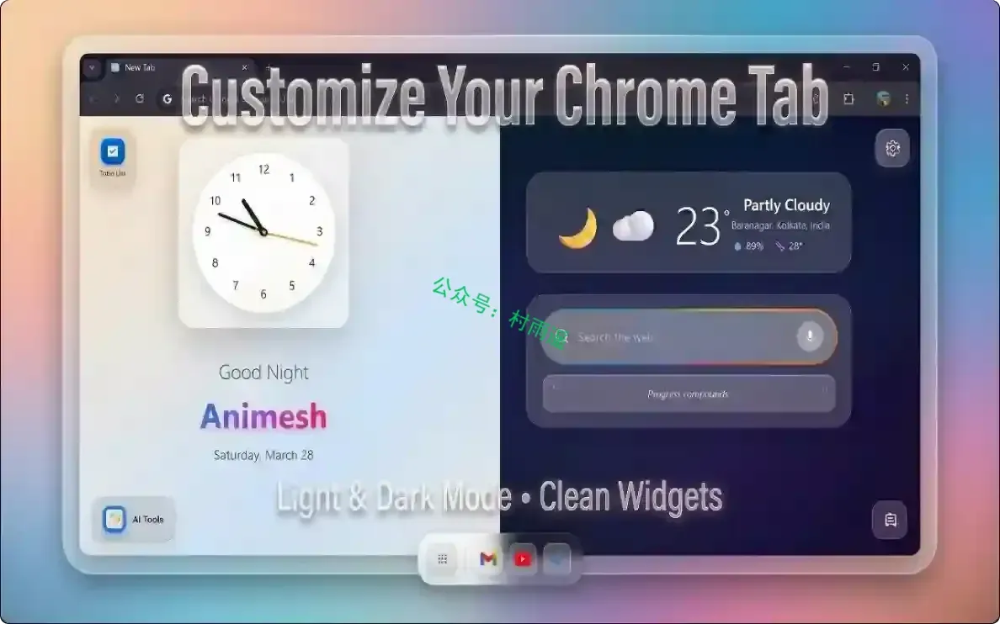

### 3. [DragFree](https://chromewebstore.google.com/detail/cnfngpgfjllafbghaimjcmailafcdhod?utm_source=item-share-cb)

在禁用了鼠标拖动、右键和图片保存的网站上重新启用这些功能。还可一键保存页面上的所有图片，附带字数统计功能，并支持页面截图（当前画面/选择区域/选择元素/滚动）。

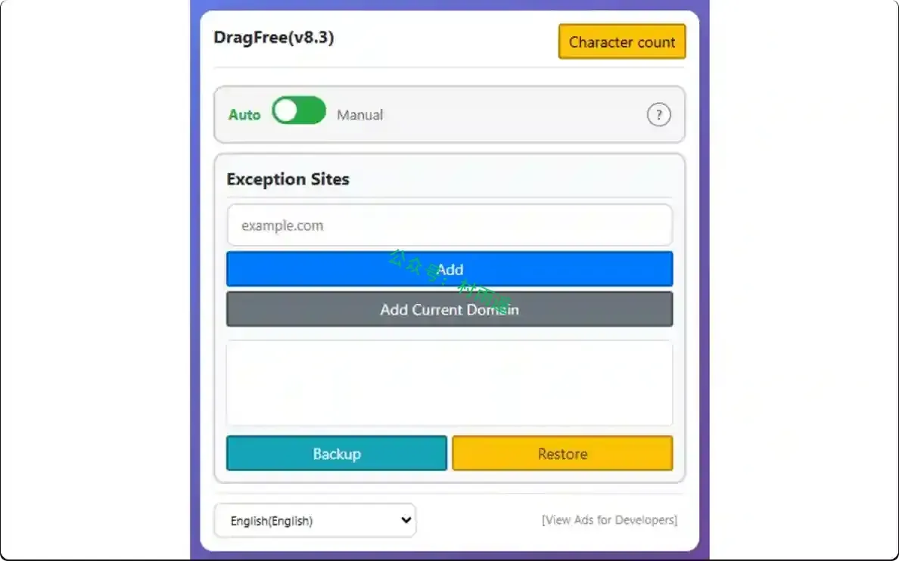

## 五、资料

### 1. [笔记百科网](https://bijibaike.cn)

笔记百科技艺，助力超级个体！

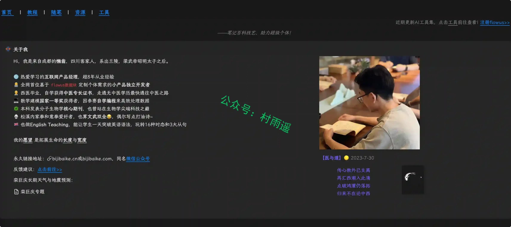

### 2. [潘厂长 AI 知识库](https://flowus.cn/aimrp/share/0d822c47-9a8e-427a-84da-9d2f6382246e)

汇总了一些作者收集到的各种行业报告，支持下载，并且持续更新中。

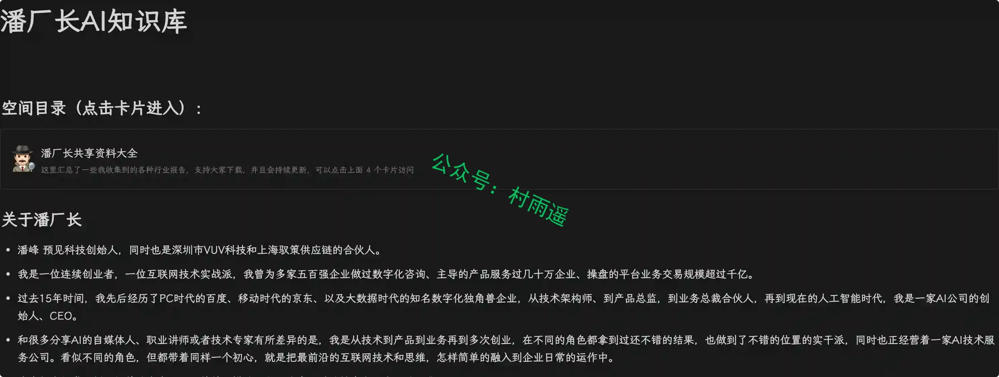

### 3. [高中语文知识库](https://flowus.cn/wangdaoyuwen/share/c2fb50f3-b9ae-49c1-b75d-f55bb43e2700?code=FH75L4)

涵盖高中语文知识，包含信息类文本、文学类文本、古诗词赏默、文言文阅读、预演综合用等模块。

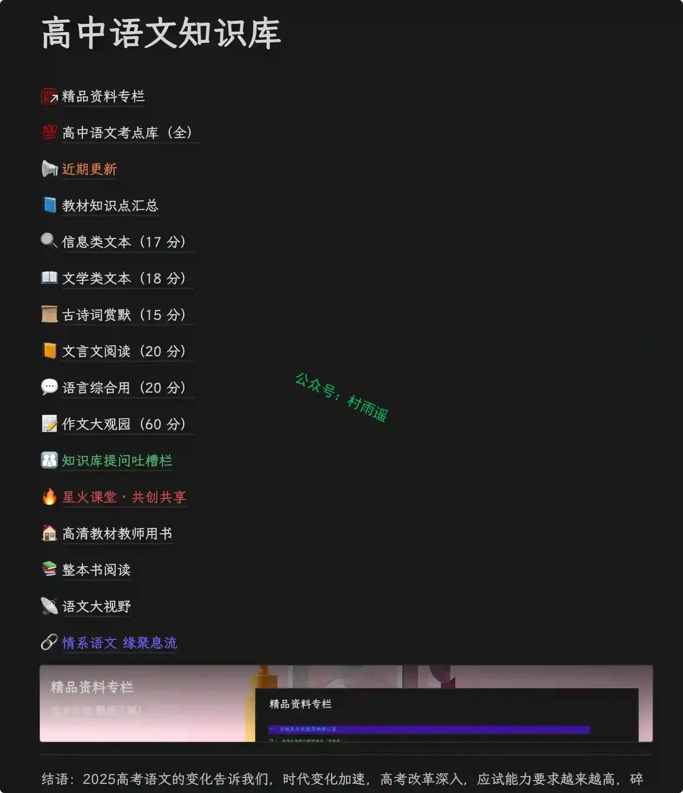

## ✍️ 说明

周刊专栏相关信息：

- **项目地址**：[Github](https://github.com/cunyu1943/weekly)，觉得不错麻烦给我一个**Star**，感谢 ❤️
- **浏览地址**：公众号 | [电子书](https://cunyu1943.github.io/weekly) | [语雀](https://yuque.com/cunyu1943/weekly) | [ima 知识库](https://ima.qq.com/wiki/?shareId=860487e32c6cc8d6c9070cd7f00caedf3cbf4102f695862d9c82f463b92417af)

如果你阅读到这里，说明我的工作没有白费。如果你想推荐项目/网站/软件/资源，欢迎提交 **[issue](https://github.com/cunyu1943/weekly/issues)** 或者添加我 **个人微信：coder_cunYu** 与我交流。

---

## ⏳ 联系

想解锁更多知识？不妨关注我的微信公众号：**村雨遥（id：JavaPark）**。

扫一扫，探索另一个全新的世界。

