# 好物周刊#154：麦当秀，AI PPT 行业的一匹黑马

> 作者：[村雨遥](https://github.com/cunyu1943)
> 
> 不要哀求，学会争取，若是如此，终有所获
> 
> 原文：https://mp.weixin.qq.com/s/WzSzOxmG5mR0FiNyuJxvwg

## 🎈 号外 

最近，公众号之外，建立了微信交流群，不定期会在群里分享各种资源（影视、IT 编程、考试提升……）&知识。如果有需要，可以**扫码或者后台添加小编微信备注入群**。进群后**优先看群公告**，**呼叫群中【资源分享小助手】**，还能免费帮找资源哦～

## 一、项目

### 1. [FeedFuse](https://github.com/BryanHoo/FeedFuse)

一个把 RSS 阅读、全文抓取和 AI 辅助理解放进同一工作台的信息阅读器。

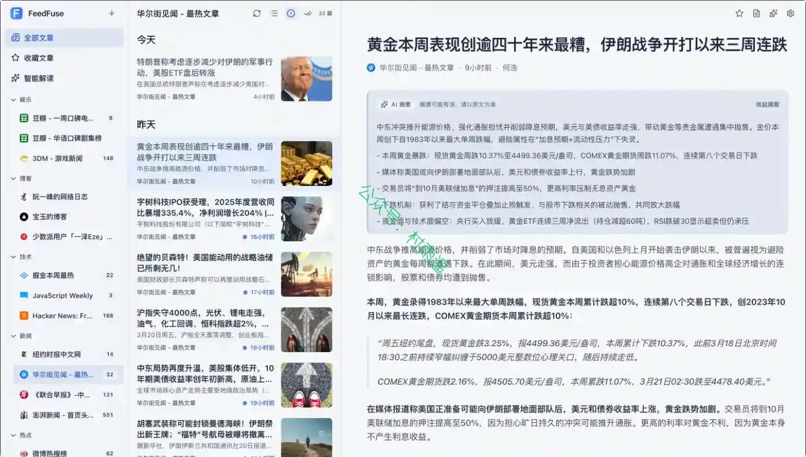

### 2. [WeKnora](https://github.com/Tencent/WeKnora)

一款开源的、基于大语言模型（LLM）的知识管理框架，专为企业级文档理解、语义检索与智能推理场景打造。

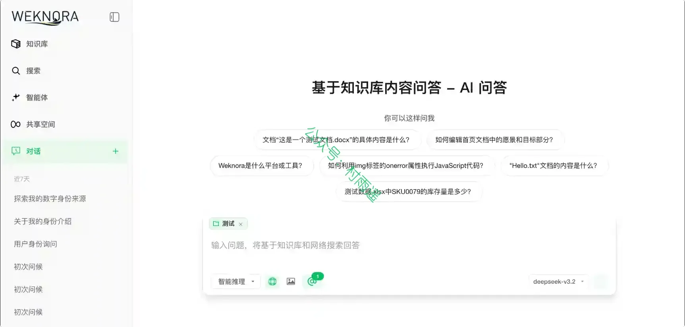

### 3. [Knife4j](https://github.com/xiaoymin/knife4j)

为 Java MVC 框架集成 Swagger 生成 Api 文档的增强解决方案，前身是 swagger-bootstrap-ui，取名 knife4j 是希望她能像一把匕首一样小巧，轻量，并且功能强悍！

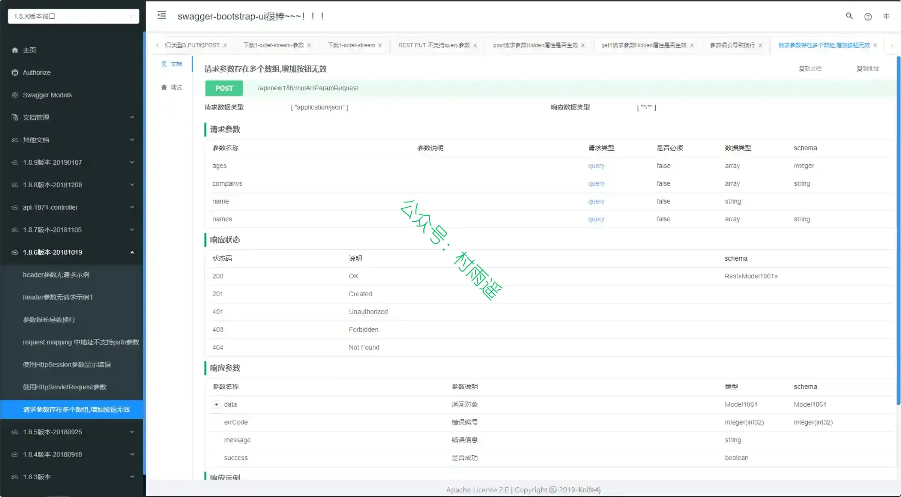

## 二、软件

### 1. [Markra](https://github.com/murongg/markra)

一个本地优先的开源 Markdown 编辑器，把 AI 融入写作流程。支持所见即所得和源码两种模式，文件以纯 .md 格式保存在本地，AI 可以帮你润色、改写或扩写内容。

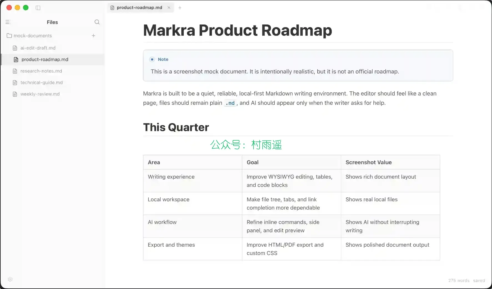

### 2. [Pinta](https://github.com/PintaProject/Pinta)

免费开源轻量图片编辑绘图工具，跨 Windows、Mac、Linux 系统，界面简单易上手，集修图、手绘、调色、特效于一体，支持图层与无限撤销，替代简易 PS，新手也能快速做图修图。

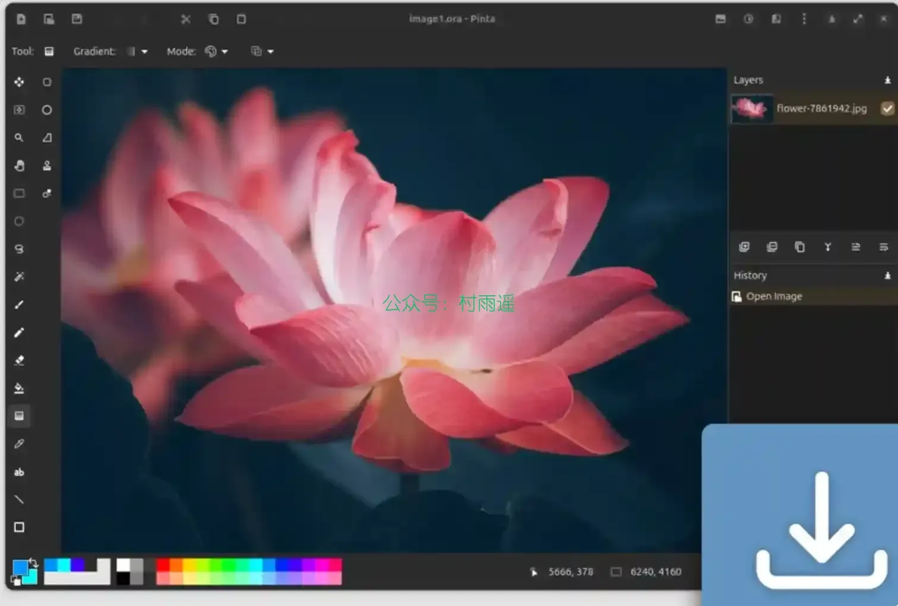

### 3. [RisohEditor](https://github.com/katahiromz/RisohEditor)

一款由片山博文 MZ 开发的免费的 Win32 资源编辑器，支持添加，编辑，导出，克隆和移除 EXE/DLL/RC/RES 文件里面的资源数据。

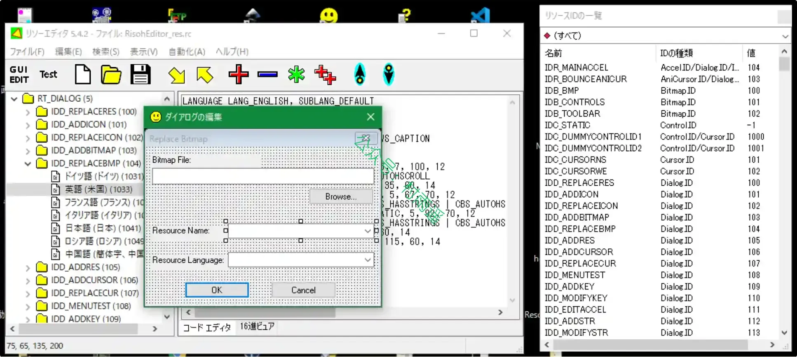

## 三、网站

### 1. [麦当秀](https://www.mindshow.vip)

AIPPT 行业黑马，将您的想法瞬间变为现实，创新你的演示体验！一款基于 AI 技术的在线 PPT 生成工具，旨在帮助用户快速生成漂亮的 PPT 演示文稿。

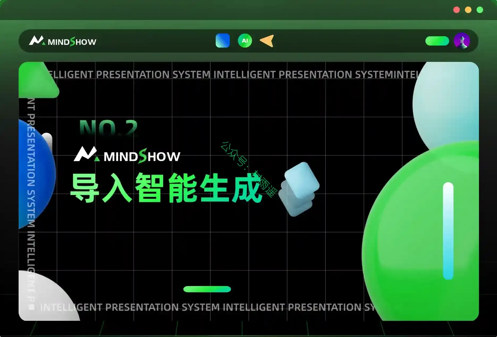

### 2. [ViiTor AI](https://www.viitor.com)

一站式 AI 视频与音频工具套件，覆盖视频翻译、音色克隆、AI 配音与全球内容本地化，让创作更简单。

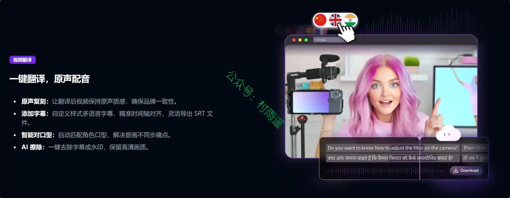

### 3. [OmniTool](https://omnitool.pro)

免费在线工具箱，覆盖文本处理、开发者工具、图片工具、转换工具和 SEO 常用工具，打开即用。

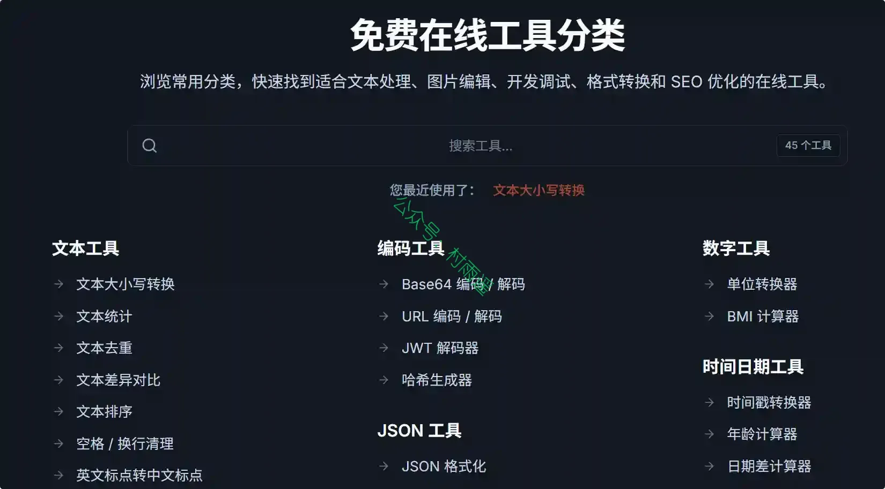

## 四、插件

### 1. [xb](https://chromewebstore.google.com/detail/xb/ffhppkcianllofhhjohbfbobjfppbeao)

你是不是想随便刷刷微博，却被满屏的广告、杂乱的超话、各类牛皮癣信息晃得头疼？该插件把这些噪音全部去掉，只留下你想看的内容。并将微博重新设计成像 X（Twitter）那样清爽、干净、专注的阅读界面。

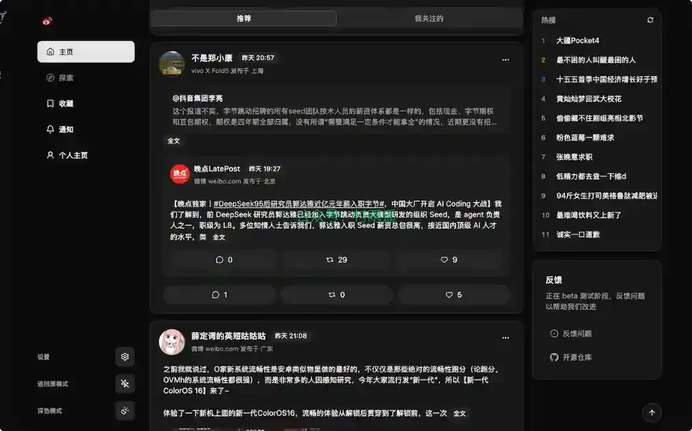

### 2. [AB Download Manager](https://chromewebstore.google.com/detail/ab-download-manager-brows/bbobopahenonfdgjgaleledndnnfhooj)

一款免费开源 Chrome 下载管理扩展，可右键调用、自动捕获链接并识别音视频与 HLS 流，将下载任务交由客户端管理。

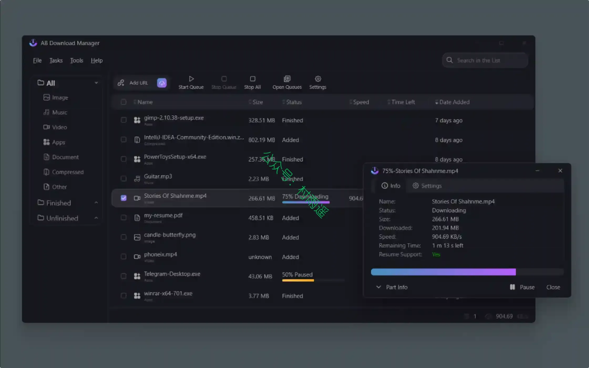

### 3. [AirTranslate](https://github.com/himomohi/AirTranslate)

适用于 macOS 的实时系统音频转写与翻译应用，可以捕获 Mac 正在播放的音频，实时转写并翻译，也可以通过悬浮字幕窗口显示结果。它适用于会议、课程、视频、采访和直播等场景，避免通过外部麦克风转录造成的麻烦和音质损失。

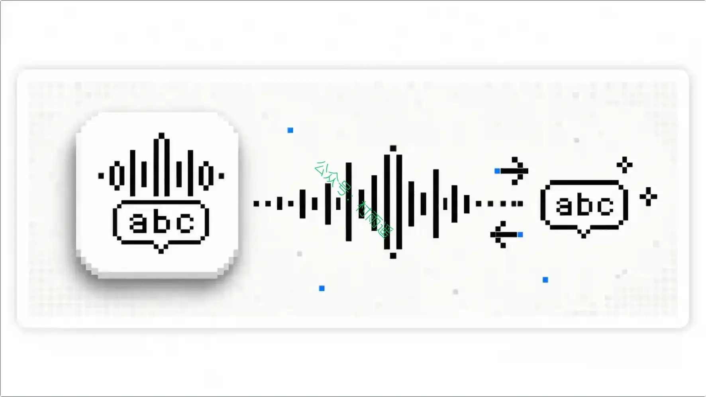

## 五、资料

### 1. [恪言人 - 英语](https://en.kyrgk.com)

专为四六级与考研设计的原生题库，真题 100% 交互式词库覆盖。

### 2. [Spanios](https://spanios.qdkf.net)

网站把疾病资料、就医资源和公益信息放在同一个可搜索入口，帮助患者和家属把分散线索整理成清晰的下一步。

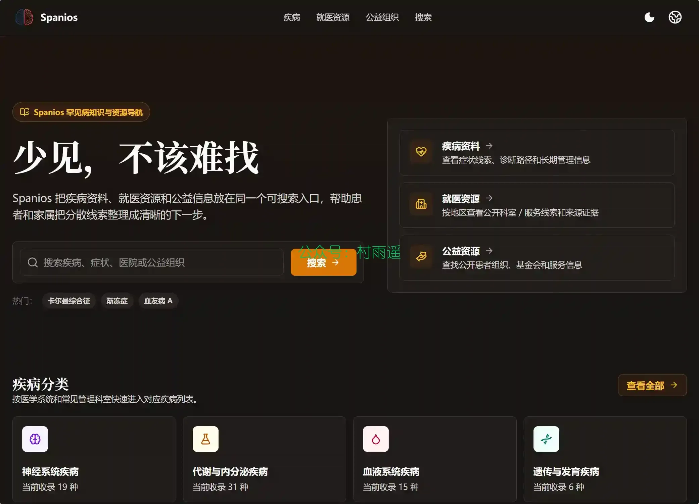

### 3. [MathNet](https://mathnet.mit.edu)

麻省理工学院旗下的数学竞赛题库网站，收录全球多国数学奥赛及各类赛事真题，按竞赛类型与国家分类呈现。

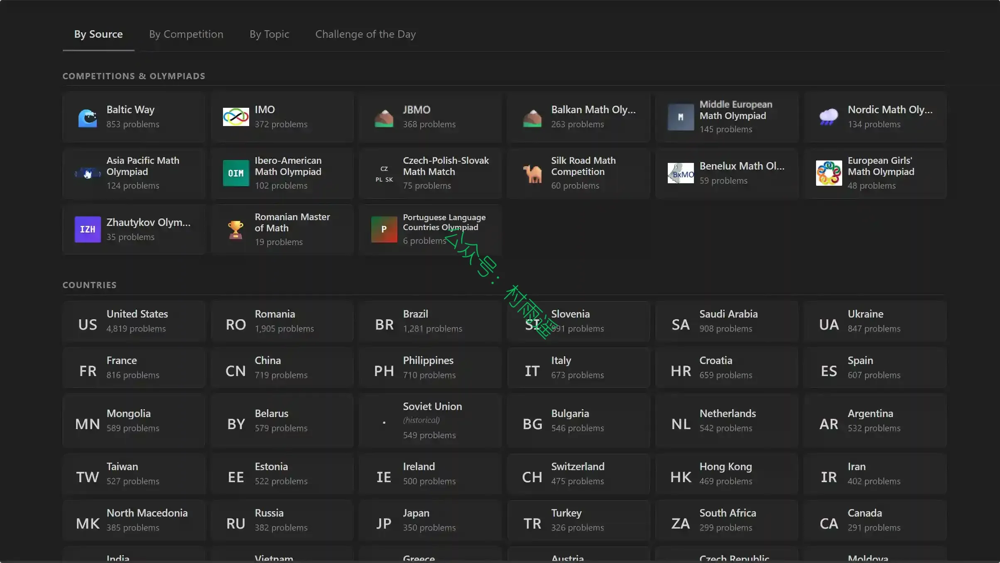

## ✍️ 说明

周刊专栏相关信息：

- **项目地址**：[Github](https://github.com/cunyu1943/weekly)，觉得不错麻烦给我一个**Star**，感谢 ❤️
- **浏览地址**：公众号 | [电子书](https://cunyu1943.github.io/weekly) | [语雀](https://yuque.com/cunyu1943/weekly) | [ima 知识库](https://ima.qq.com/wiki/?shareId=860487e32c6cc8d6c9070cd7f00caedf3cbf4102f695862d9c82f463b92417af)

如果你阅读到这里，说明我的工作没有白费。如果你想推荐项目/网站/软件/资源，欢迎提交 **[issue](https://github.com/cunyu1943/weekly/issues)** 或者添加我 **个人微信：coder_cunYu** 与我交流。

---

## ⏳ 联系

想解锁更多知识？不妨关注我的微信公众号：**村雨遥（id：JavaPark）**。

扫一扫，探索另一个全新的世界。

