# 好物周刊#155：摸鱼神器！一个网站看遍全网所有热搜

> 作者：[村雨遥](https://github.com/cunyu1943)
> 
> 不要哀求，学会争取，若是如此，终有所获
> 
> 原文：https://mp.weixin.qq.com/s/OFMiwFkOgt8FGzcacE_elw

## 🎈 号外 

最近，公众号之外，建立了微信交流群，不定期会在群里分享各种资源（影视、IT 编程、考试提升……）&知识。如果有需要，可以**扫码或者后台添加小编微信备注入群**。进群后**优先看群公告**，**呼叫群中【资源分享小助手】**，还能免费帮找资源哦～

## 一、项目

### 1. [Weibo Spider](https://github.com/dataabc/weiboSpider)

连续爬取一个或多个新浪微博用户（如胡歌、迪丽热巴、郭碧婷）的数据，并将结果信息写入文件或数据库。写入信息几乎包括用户微博的所有数据，包括用户信息和微博信息两大类。

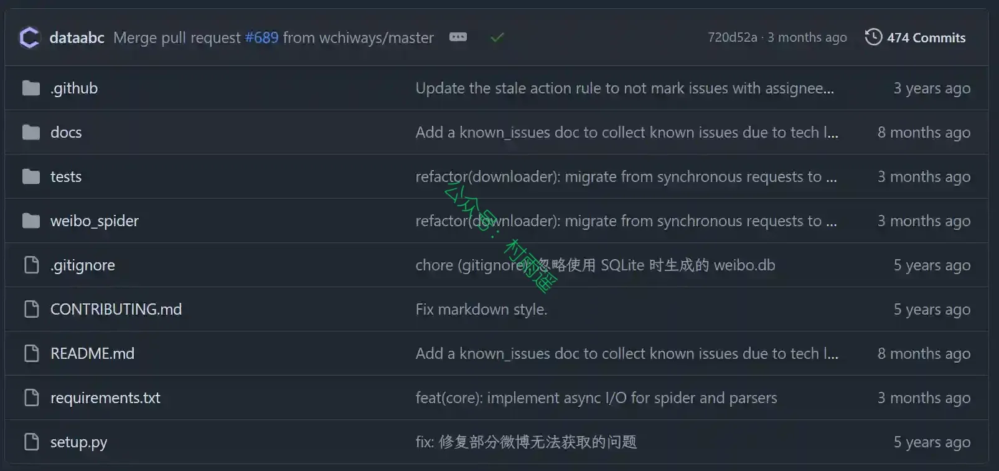

### 2. [JustAuth](https://github.com/justauth/JustAuth)

一个第三方授权登录的工具类库，它可以让我们脱离繁琐的第三方登录 SDK，让登录变得 So easy！集成了诸如：Github、Gitee、支付宝、新浪微博、微信、Google、Facebook、Twitter、StackOverflow 等国内外数十家第三方平台。

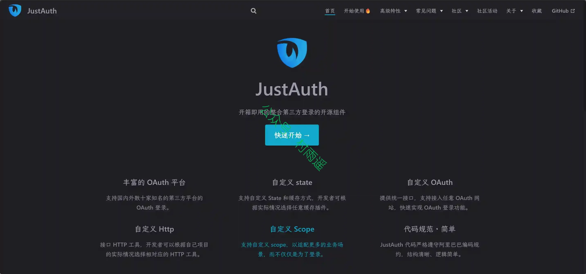

### 3. [OSharp](https://github.com/dotnetcore/osharp)

一个基于.Net6.0 的快速开发框架，框架对 AspNetCore 的配置、依赖注入、日志、缓存、实体框架、Mvc (WebApi)、身份认证、功能权限、数据权限等模块进行更高一级的自动化封装，并规范了一套业务实现的代码结构与操作流程，使 .Net 框架更易于应用到实际项目开发中。

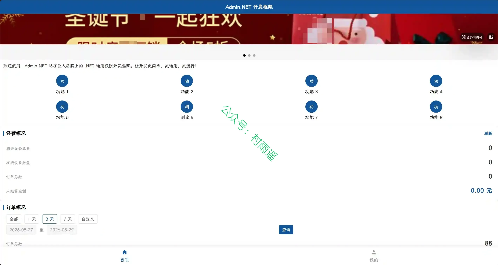

## 二、软件

### 1. [PhoXoSee](https://phoxo.com)

Windows 平台极速轻量、无广告、免费商用的图片查看器，主打秒开加载、超低内存，支持 HEIC 批量转 JPEG、按日期搜图与多格式预览。

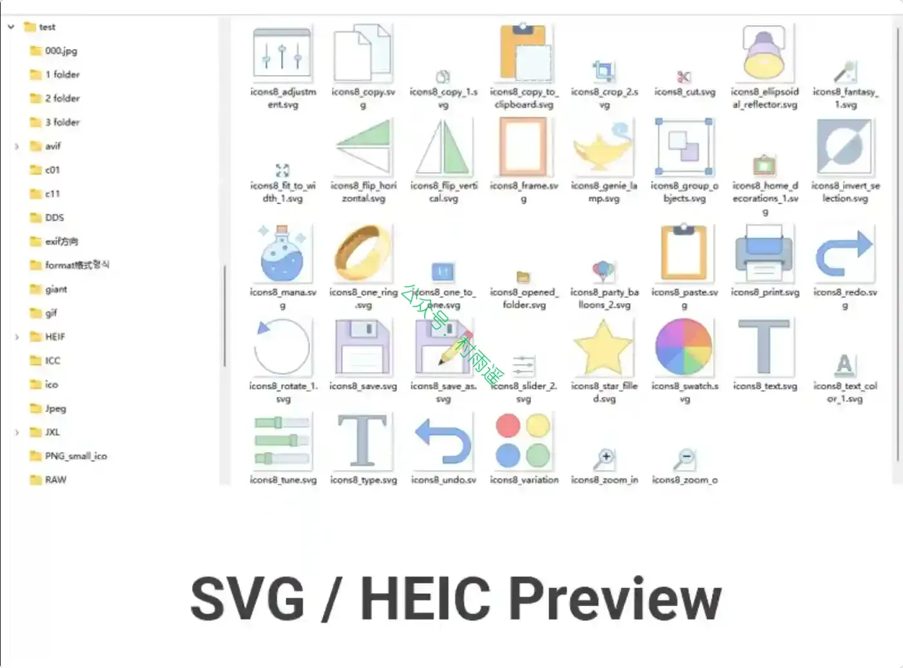

### 2. [人工桌面](https://n0va.mihoyo.com)

人工桌面，Windows 桌面动态壁纸软件。可爱的鹿鸣小姐姐等你唤醒~

### 3. [资源帮](https://zyb.juapp3.com)

一个 APP，搞定资源查找 与 AI 创作，把飞书文档、网盘聚合、热榜速览、媒体解析、AI 绘画 / 换脸 / 配音 / 视频转录 等 14+ 项高频工具集合在同一个清爽界面里，让你无需再在十几个 APP 之间反复跳转。

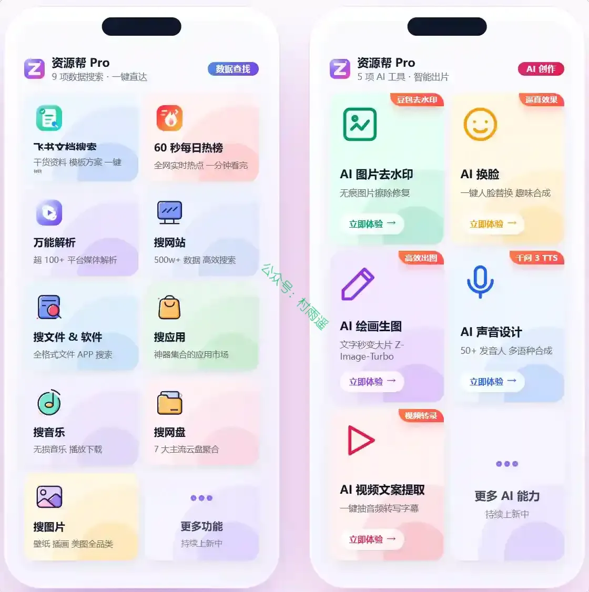

## 三、网站

### 1. [罗码术](https://www.luomashu.com)

罗码术提供 180+ 种免费在线测试工具，涵盖反应速度、记忆力、专注力等认知基准测试，MBTI、大五人格、九型人格等权威心理测评，以及多种趣味互动实验与休闲游戏。

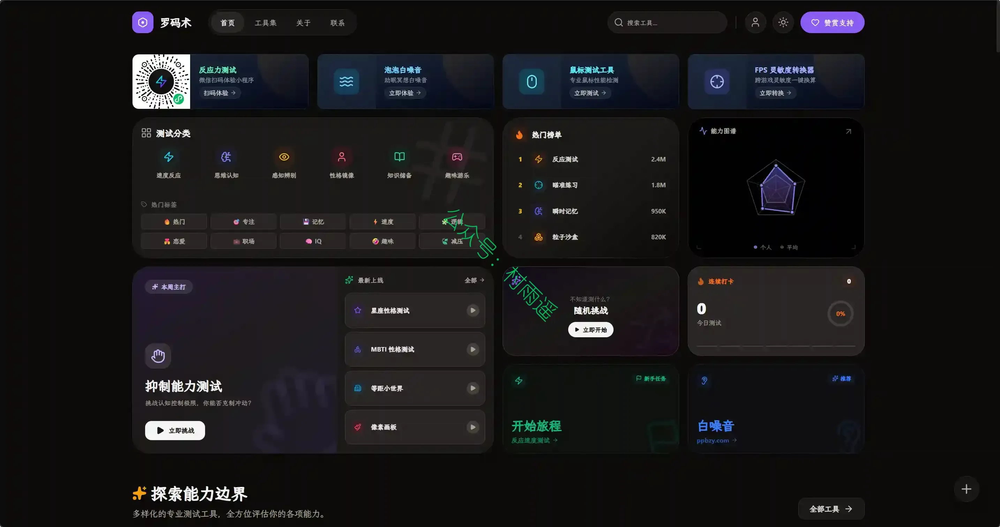

### 2. [摸鱼热榜](https://moyuhot.com)

摸鱼热榜是你的热搜平台与摸鱼网站，实时聚合微博、知乎、B站、抖音、贴吧、GitHub、V2EX 等热搜榜，提供一站式热搜聚合与新闻聚合阅读入口。

### 3. [中国互联网联合辟谣平台](https://www.piyao.org.cn/pypt_gywm/index.html)

秉承 “发布权威辟谣信息，提升网民媒介素养，营造清朗网络空间” 的宗旨，辟谣范围涵盖时事热点、公共政策、社会民生、科学常识等领域，拥有网站、客户端、微信 (公众号、视频号、小程序) 、法人微博、强国号、新华号、快手号、支付宝小程序 10 个终端，为广大群众识谣辨谣、举报谣言提供权威平台。

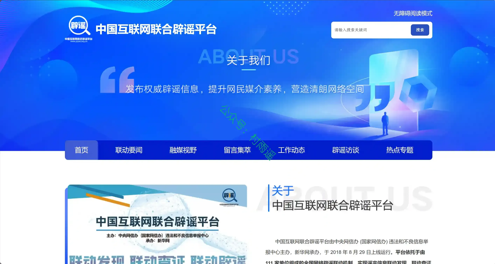

## 四、插件

### 1. [小黑 OmniBox](https://chromewebstore.google.com/detail/omnibox/gckiocdfdaofgabchobljcdimjieookl)

一款轻量级、功能强大的浏览器扩展，帮助你高效收集、管理并调用网页内容。无论是整页保存、局部摘录，还是按项目、主题整理，OmniBox 都能让你的知识资产随时可用，告别信息碎片化。

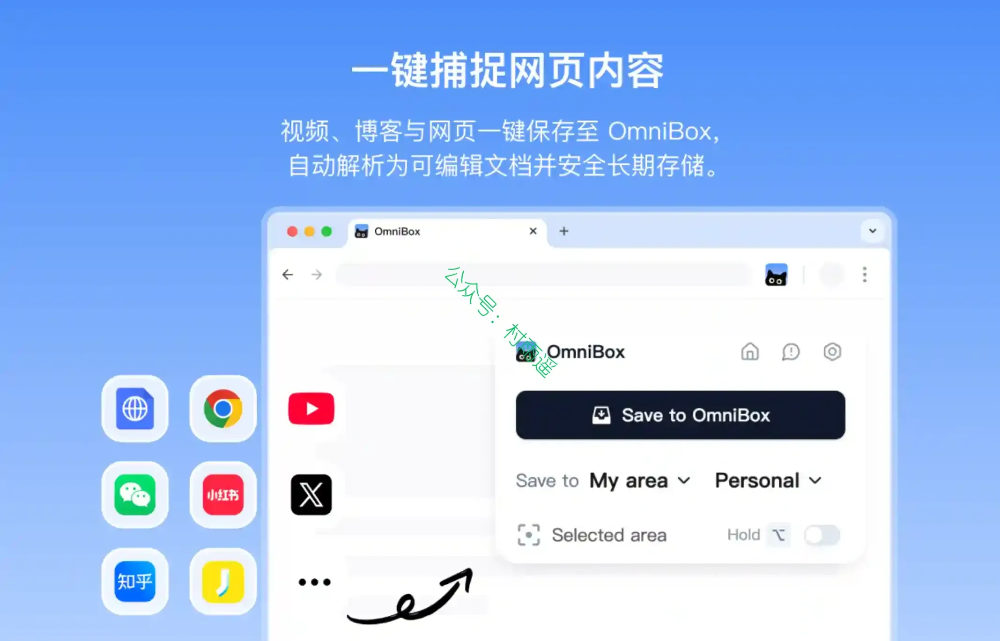

### 2. [UPlog 红薯助手](https://chromewebstore.google.com/detail/mbkdnplcfjbjaknihcbhbdhgaejeinda?utm_source=item-share-cb)

一款专为小红书创作者与企业运营团队打造的图文内容创作与发布助手。通过 UPlog，你可以轻松导入内容、多风格转化为小红书图文卡片，并一键同步至后台，无需繁琐操作，让创作和发布更高效、更美观。

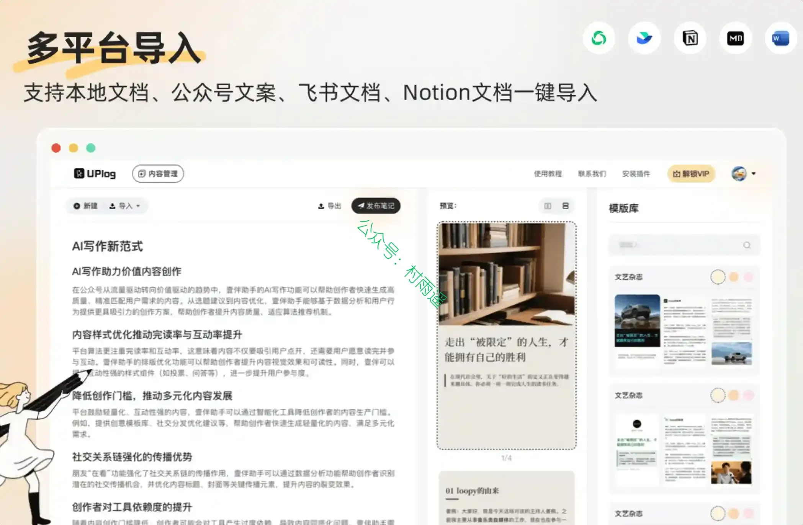

### 3. [智小红 - 小红书 AI 全能助手](https://chromewebstore.google.com/detail/zhi-xiaohong-xiaohongshu/keeelahekhhgkpaipdodgjnmgkfcdpde)

一款专为小红书（xiaohongshu、xhs）平台用户打造的高效运营工具，尤其适合博主、市场调研、产品设计和运营岗位人士。它能够深入分析竞品数据，助力爆文创作、营销策略制定以及竞品种草分析，大幅提升运营效率！

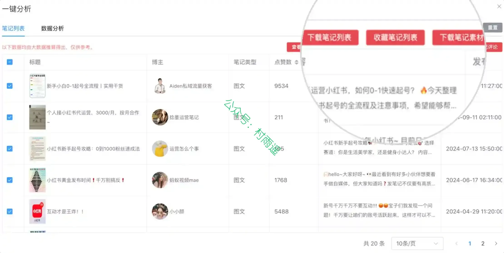

## 五、资料

### 1. [Obsidian + Claude Code 橙皮书](https://github.com/alchaincyf/obsidian-ai-orange-book)

用 AI 重建你的第二大脑，从零搭建 AI 驱动的个人知识管理系统。免费、开源、持续更新。

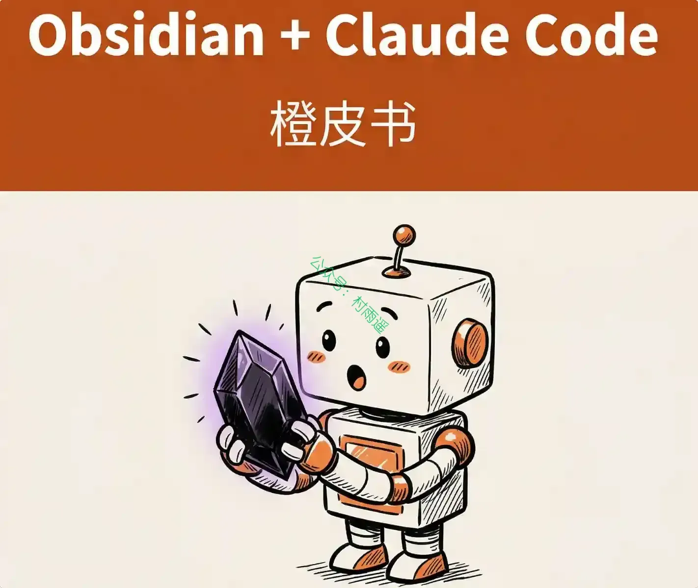

### 2. [Deepseek 精选库](https://ima.qq.com/wiki/?shareId=2a0586922ec81903df429ba175441cd0d131db1f926a475955aed72c9e3061d5)

清华、北大、厦大、浙大等高校，腾讯、国信证券、华安证券等主流公司，社区及研究中心等权威机构发布的最新内容为用户提供全面且精准的知识服务。该知识库不仅涵盖了自然语言处理、图像识别等复杂场景，还支持多平台无缝集成，满足多样化的需求。

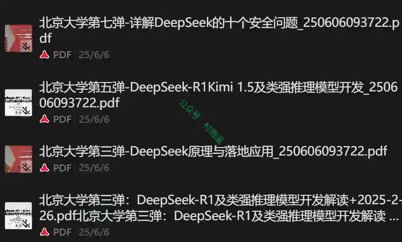

### 3. [张雪峰.skill](https://github.com/alchaincyf/zhangxuefeng-skill)

张雪峰的认知操作系统，高考志愿/考研/职业规划的实战思维框架。

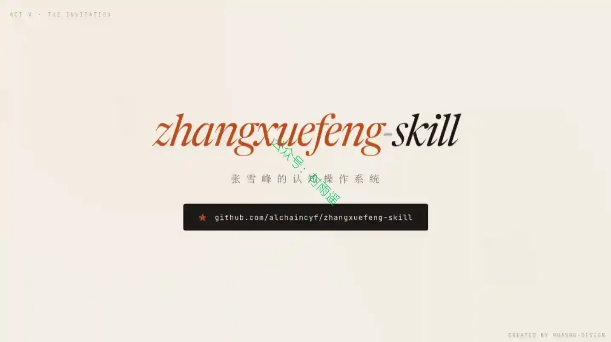

## ✍️ 说明

周刊专栏相关信息：

- **项目地址**：[Github](https://github.com/cunyu1943/weekly)，觉得不错麻烦给我一个**Star**，感谢 ❤️
- **浏览地址**：公众号 | [电子书](https://cunyu1943.github.io/weekly) | [语雀](https://yuque.com/cunyu1943/weekly) | [ima 知识库](https://ima.qq.com/wiki/?shareId=860487e32c6cc8d6c9070cd7f00caedf3cbf4102f695862d9c82f463b92417af)

如果你阅读到这里，说明我的工作没有白费。如果你想推荐项目/网站/软件/资源，欢迎提交 **[issue](https://github.com/cunyu1943/weekly/issues)** 或者添加我 **个人微信：coder_cunYu** 与我交流。

---

## ⏳ 联系

想解锁更多知识？不妨关注我的微信公众号：**村雨遥（id：JavaPark）**。

扫一扫，探索另一个全新的世界。

