# 好物周刊#157：从预览到排版，WeMD 打造高效公众号创作流程

> 作者：[村雨遥](https://github.com/cunyu1943)
> 
> 不要哀求，学会争取，若是如此，终有所获
> 
> 原文：https://mp.weixin.qq.com/s/VLjX1wYN3LxavbHLe4735w

## 🎈 号外 

最近，公众号之外，建立了微信交流群，不定期会在群里分享各种资源（影视、IT 编程、考试提升……）&知识。如果有需要，可以**扫码或者后台添加小编微信备注入群**。进群后**优先看群公告**，**呼叫群中【资源分享小助手】**，还能免费帮找资源哦～

## 一、项目

### 1. [DOCX Editor](https://github.com/eigenpal/docx-editor)

一款跨 React/Vue/Nuxt 多框架、基于 OOXML 的开源可视化 docx 在线编辑器，支持修订追踪、协同编辑和 AI 接入，内核解耦易二次开发。

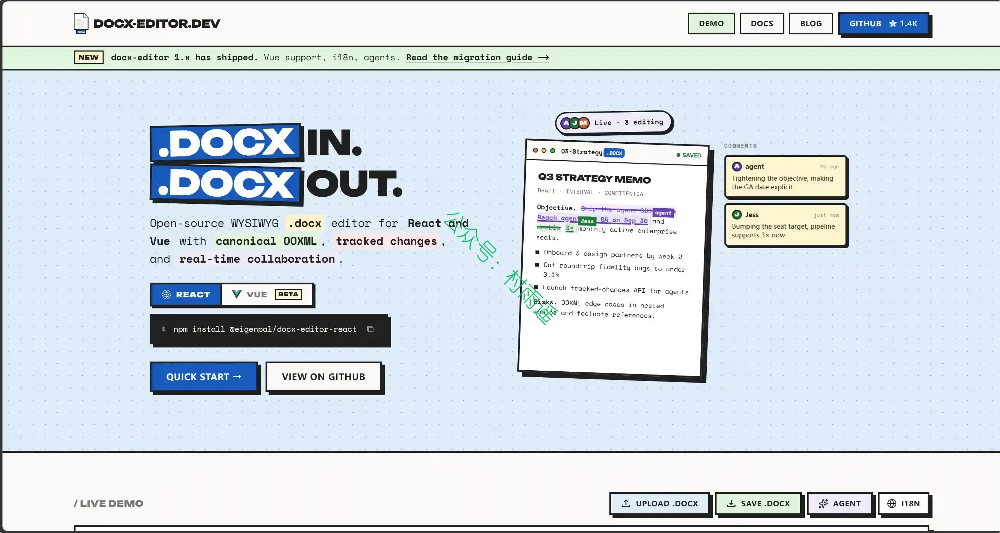

### 2. [FunASR](https://github.com/modelscope/FunASR)

开源语音理解工具包，支持生产级语音识别、语音检测、标点恢复、说话人分离、情感检测、音频事件识别。

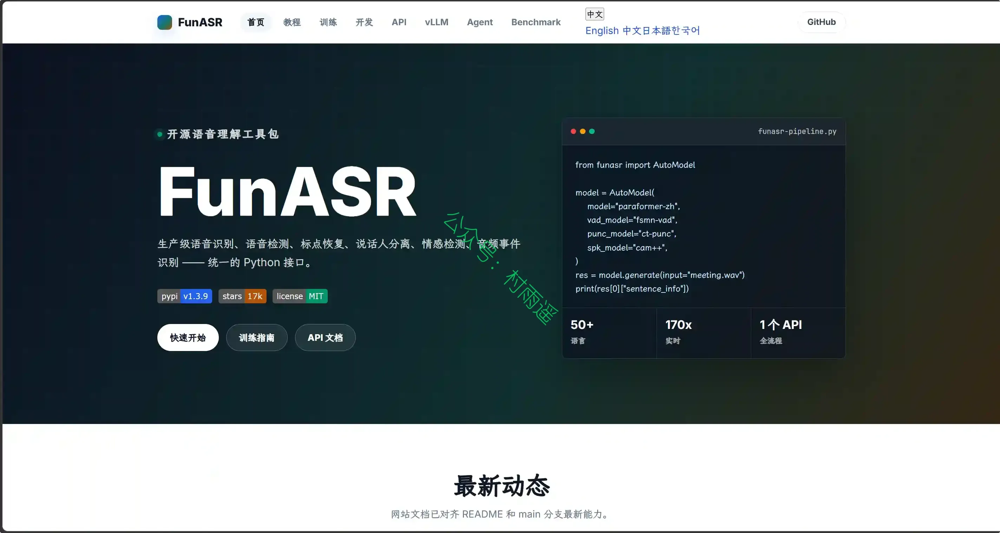

### 3. [Codex Mate](https://github.com/SakuraByteCore/codexmate)

一站式本地 AI 编程智能体管理面板。统一管理 Codex、Claude Code 与 OpenClaw，支持 Provider 切换、会话管理与任务编排。纯本地优先，你的智能体控制中心。

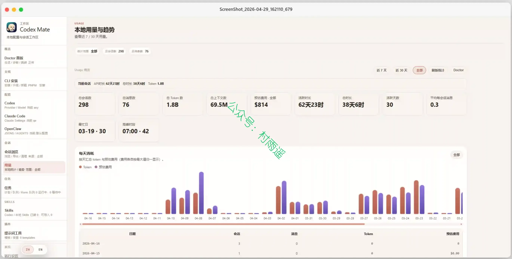

## 二、软件

### 1. [Tomorobot](https://tomorobot.com)

面向内容创作、图文排版、导出发布和 AI 写作工作流，提供从免费编辑到专业 AI 创作的多版本能力。

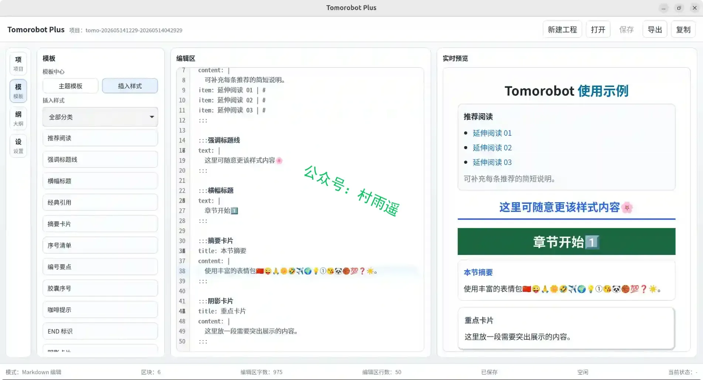

### 2. [WeMD](https://github.com/tenngoxars/WeMD)

更优雅的 Markdown 公众号排版工具，告别复杂工具。Markdown 写作，一键复制到公众号。专为公众号创作者设计的本地优先编辑器。

### 3. [DBX](https://github.com/t8y2/dbx)

15 MB 轻松驾驭管理 40+ 种数据库，桌面端 & Docker 自托管，内置 AI 助手。

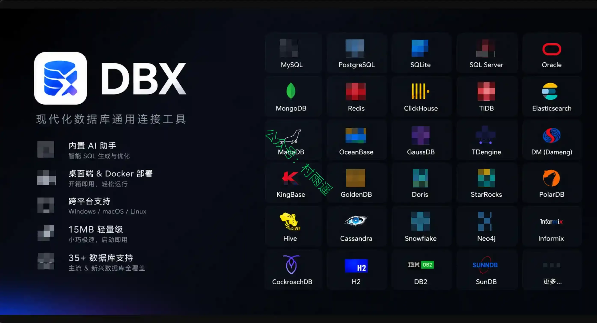

## 三、网站

### 1. [超能文献 Suppr](https://suppr.wilddata.cn)

AI 学术研究助手，支持中文自然语言搜索 OpenAlex、PubMed 等多学科学术文献，提供 PDF、PPT、Word、Excel、ePub 等文档翻译，AI 生成综述与研究报告，并支持 Zotero 文献翻译与管理。适用于医学、生命科学、计算机、工程、社科等全领域研究场景。

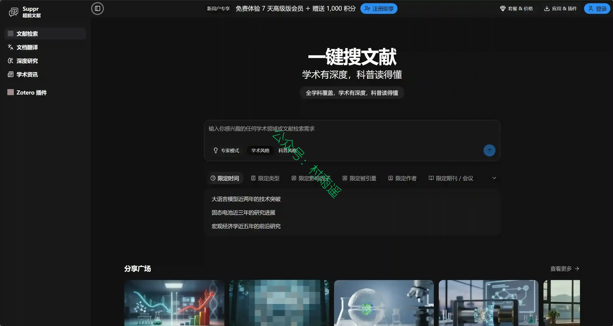

### 2. [ailiaili](https://alaap.top)

一直致力于为广大喜爱 cosplay 的设计师提供高质量的 cosplay 服装设计素材和化妆参考。从微博人气 coser、知名 UP 主购入优质付费内容，以呈现更专业的内容给大家。

### 3. [工具王](https://www.toolsking.top)

功能强大的免费在线工具网站。

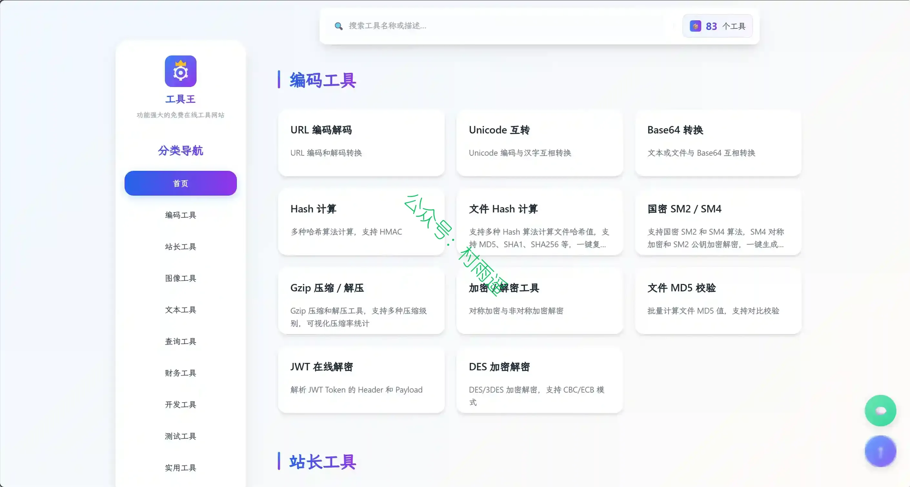

## 四、插件

### 1. [Chrome 视频下载器](https://chromewebstore.google.com/detail/video-downloader-for-chro/pjdbebkgllbkjfbbbbceeeenhkngnddp)

是一款强大的 Chrome 视频下载工具，允许您从网站下载视频，保存 M3U8 流，并以快速可靠的性能离线观看视频。

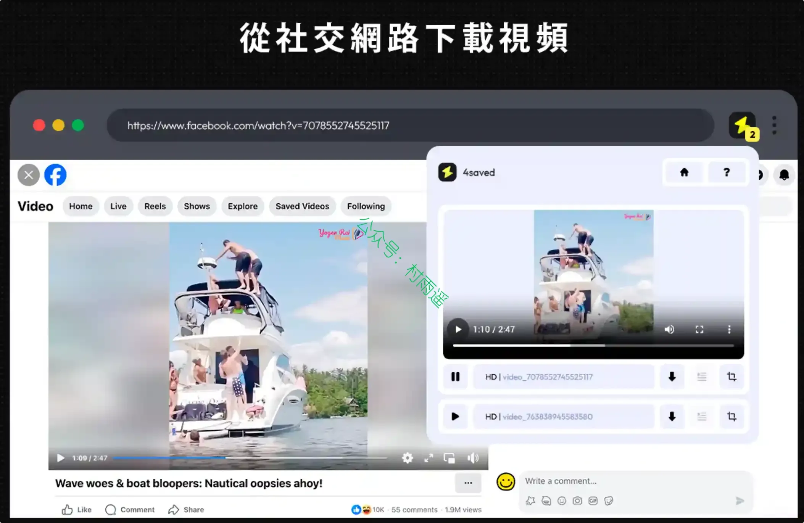

### 2. [AdBlock Pro](https://chromewebstore.google.com/detail/adblock-pro-%E2%80%93-ad-blocker/jhgpcbfjmmkclnkdoplcpinejekdjomp)

在每个网站屏蔽广告、追踪器和弹窗。最快的 MV3 广告拦截器，拥有 48,000+ 条过滤规则，免费且开源。

### 3. [Save image as Type](https://chromewebstore.google.com/detail/save-image-as-type/agddafeppiiohhalnjfhcfjemjjcgmcb)

可将任意网页图片转换并下载为您选择的格式。右键单击任意图片，保存为 jpg、png、pdf、gif 或 webp 而无需离开页面。

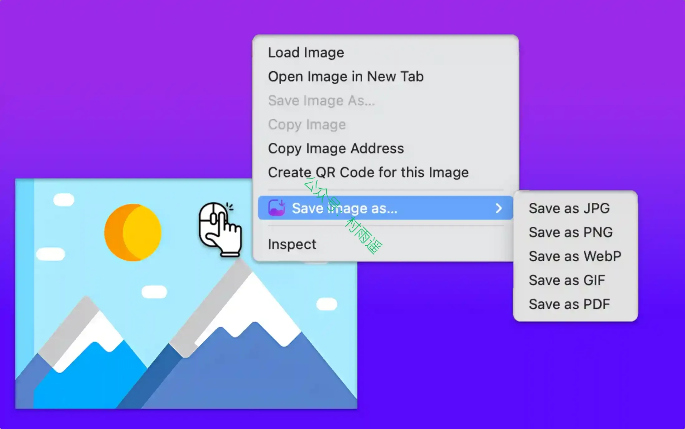

## 五、资料

### 1. [claude-code-best-practice](https://github.com/shanraisshan/claude-code-best-practice)

汇集官方与实战经验，系统化整理 Claude Code 全场景配置、智能体、命令、技能等落地最佳实践与可复用模板，帮开发者把 Claude Code 从简易代码工具升级为工程化 AI 编程框架。

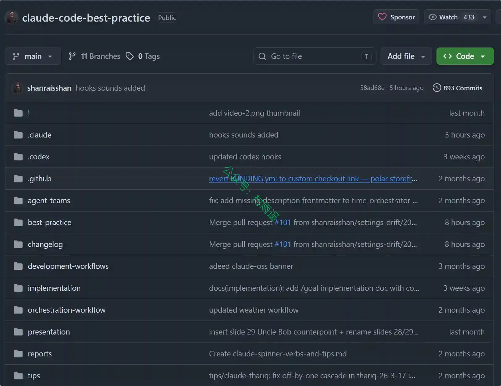

### 2. [vibe-coding](https://github.com/LingyiChen-AI/vibe-coding)

AI 时代的 Vibe Coding 实践：使用 Claude Code 从零开发 AI 漫剧生成平台的完整记录，涵盖技术选型、AI 驱动开发、UI 优化与功能迭代全流程。

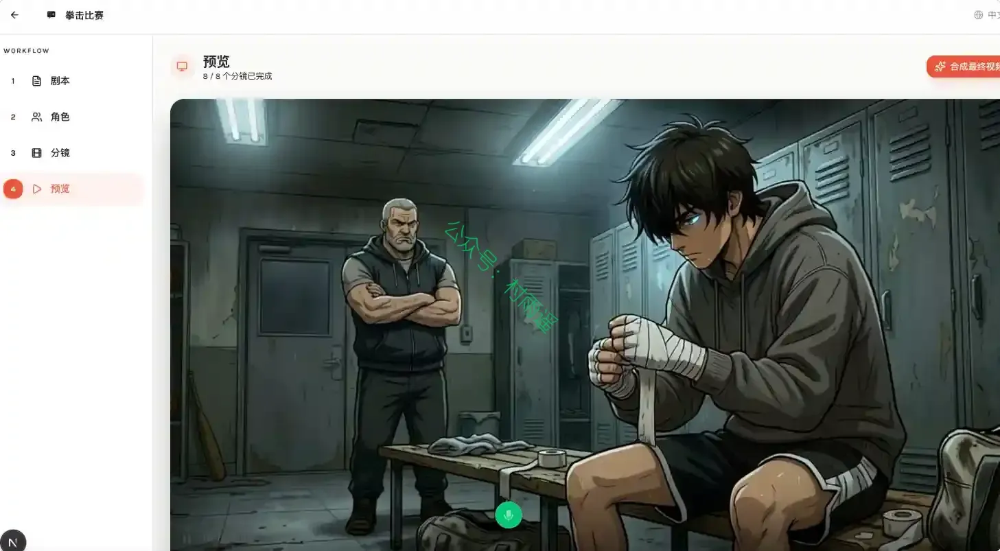

### 3. [CS146S 中文版课程](https://github.com/ShouZhengAI/CS146S_CN)

包含 assignments，vibe coding 工具等，项目长期持续维护，致力于打造中文最好的 vibe coding 教程。

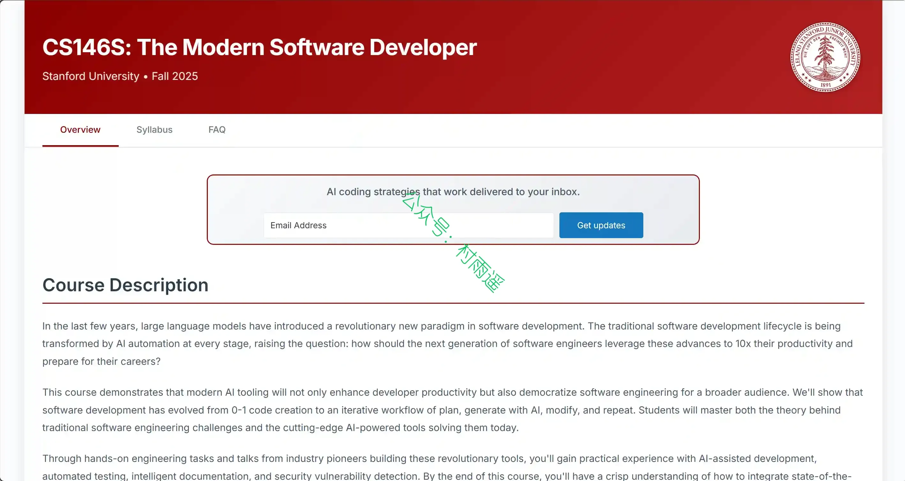

## ✍️ 说明

周刊专栏相关信息：

- **项目地址**：[Github](https://github.com/cunyu1943/weekly)，觉得不错麻烦给我一个**Star**，感谢 ❤️
- **浏览地址**：公众号 | [电子书](https://cunyu1943.github.io/weekly) | [语雀](https://yuque.com/cunyu1943/weekly) | [ima 知识库](https://ima.qq.com/wiki/?shareId=860487e32c6cc8d6c9070cd7f00caedf3cbf4102f695862d9c82f463b92417af)

如果你阅读到这里，说明我的工作没有白费。如果你想推荐项目/网站/软件/资源，欢迎提交 **[issue](https://github.com/cunyu1943/weekly/issues)** 或者添加我 **个人微信：coder_cunYu** 与我交流。

---

