# 好物周刊#158：紫东太初：国产旗舰多模态大模型

> 作者：[村雨遥](https://github.com/cunyu1943)
> 
> 不要哀求，学会争取，若是如此，终有所获
> 
> 原文：https://mp.weixin.qq.com/s/PsrNuKM-9uknWSP7IG8CfQ

## 🎈 号外 

最近，公众号之外，建立了微信交流群，不定期会在群里分享各种资源（影视、IT 编程、考试提升……）&知识。如果有需要，可以**扫码或者后台添加小编微信备注入群**。进群后**优先看群公告**，**呼叫群中【资源分享小助手】**，还能免费帮找资源哦～

## 一、项目

### 1. [NavNote](https://github.com/zouming123/NavNote)

一款开源轻量级网址导航 + 文章聚合管理系统，集成网址导航、文章内容聚合、可视化后台管理三大核心能力，部署简单、使用便捷。

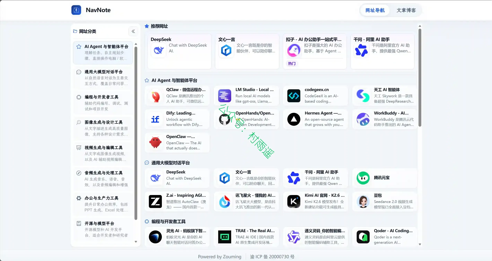

### 2. [readNeo](https://github.com/extrastu/readneo)

你的微信读书数据面板，连接微信读书 Skill API，可视化书架、阅读统计、笔记划线，支持一键导出到 Notion 和 Flomo。

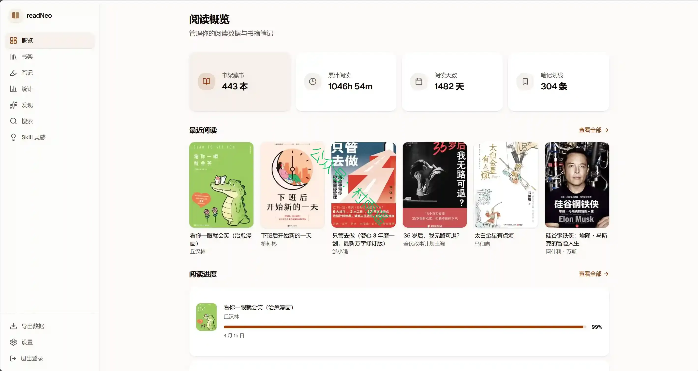

### 3. [book-to-skill](https://github.com/virgiliojr94/book-to-skill)

将任意技术类书籍PDF转化为Claude Code技能，可随时用于学习、查阅以及工作实操。

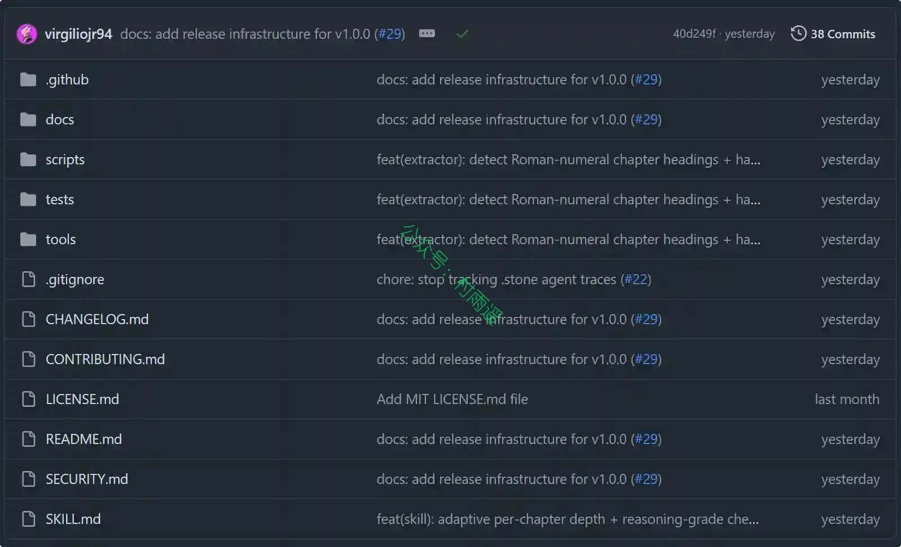

## 二、软件

### 1. [WorkShadow](https://github.com/FutureUniant/WorkShadow)

一款本地优先的桌面工作日志应用。左侧管理你的日志，右侧用富文本编辑器记录日常的工作、决策、问题与线索。数据保存在你自己的电脑上；若需要 AI 能力（搜索、总结、问答、图片说明等），由你在设置中接入自己的模型服务。

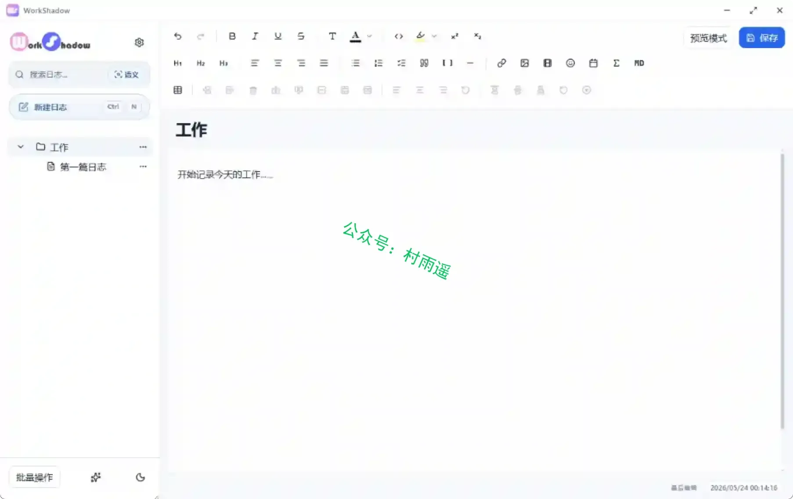

### 2. [Envis](https://github.com/xopenbeta/envis-app)

一款全平台环境管理软件，让开发环境安装/切换像呼吸一样自然。

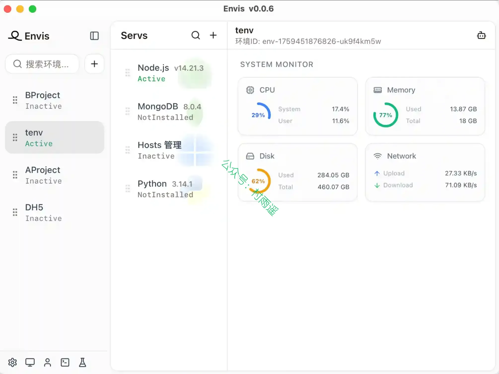

### 3. [Echo Loop](https://github.com/echo-loop/Echo-Loop)

一款科学、高效的 AI 英语听说训练 App，通过盲听、精听、跟读、复述和间隔复习，自动驱动学习者把每一段音频真正练懂、练熟、练到会说。

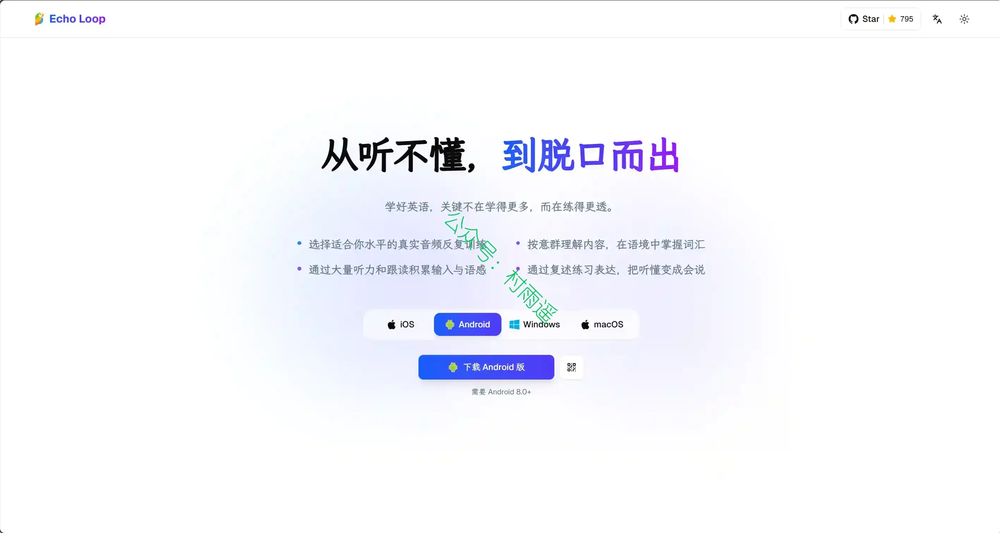

## 三、网站

### 1. [高考真题大全](https://t.urongda.com)

历年全国高考真题与答案解析，一键下载，助力备考。

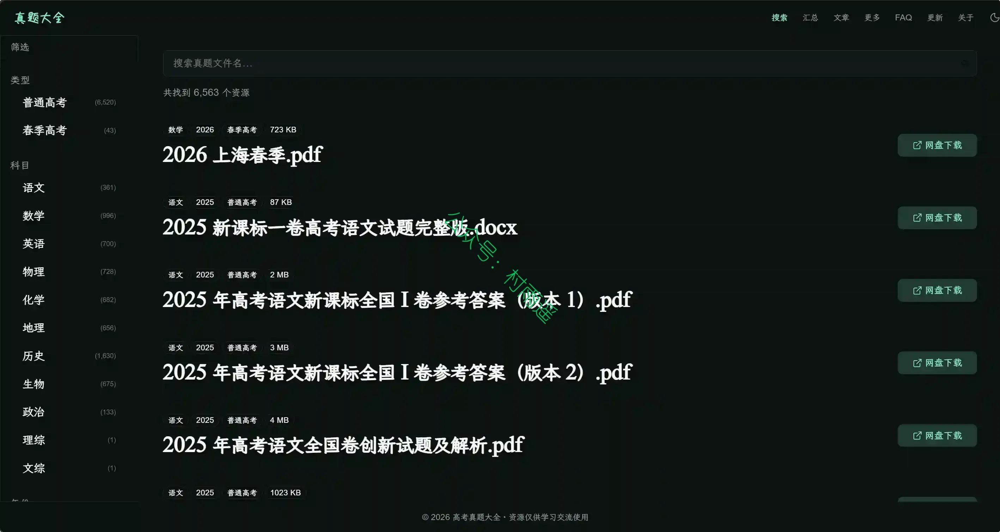

### 2. [Class Central](https://www.classcentral.com)

一款全球在线课程聚合平台，整合各大教育机构与平台的海量课程，支持课程检索、筛选、查看用户评价，还能帮助用户收藏课程、追踪学习进度并获取在线教育行业资讯。

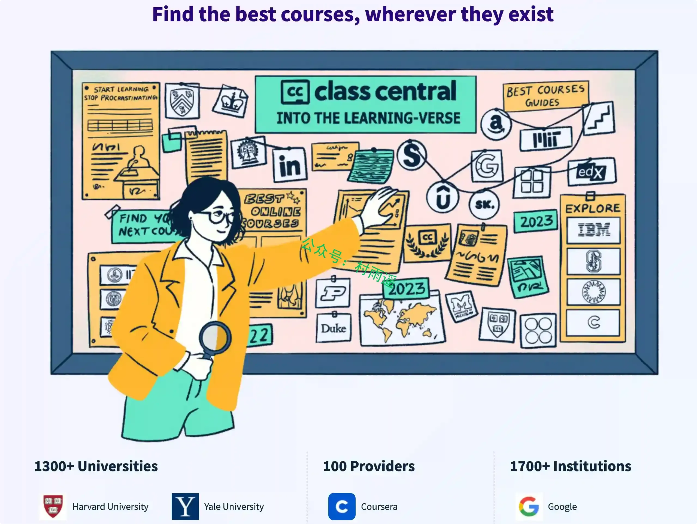

### 3. [紫东太初](https://www.zidongtaichu.com)

中国科学院自动化研究所和武汉人工智能研究院推出新一代多模态大模型，支持多轮问答、文本创作、图像生成、3D 理解、信号分析等全面问答任务，拥有更强的认知、理解、创作能力，带来全新互动体验。

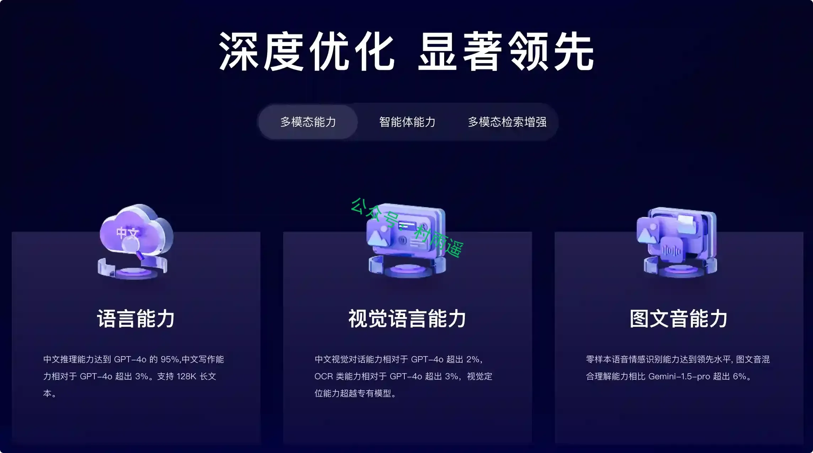

## 四、插件

### 1. [DualPiP](https://chromewebstore.google.com/detail/dualpip-%E2%80%93-pip-player-asr/ddkmobcljbfggkmibabekgpbighaogpn)

画中画播放器，支持 ASR 语音识别实时生成AI字幕，双语字幕AI翻译，弹幕、倍速播放和手势控制。兼容 YouTube、Netflix、Disney+、哔哩哔哩等视频网站。

### 2. [Aura Tab](https://chromewebstore.google.com/detail/aura-tab/adeamimoopnlcflnpjgcfmebboajlkja)

一款融合了极致美学与原生性能的 Chrome 浏览器扩展。它摒弃了传统标签页的喧嚣，引入 macOS 级精微的毛玻璃质感与呼吸光晕，为您打造一个既令人惊艳又极致专注的数字工作台。

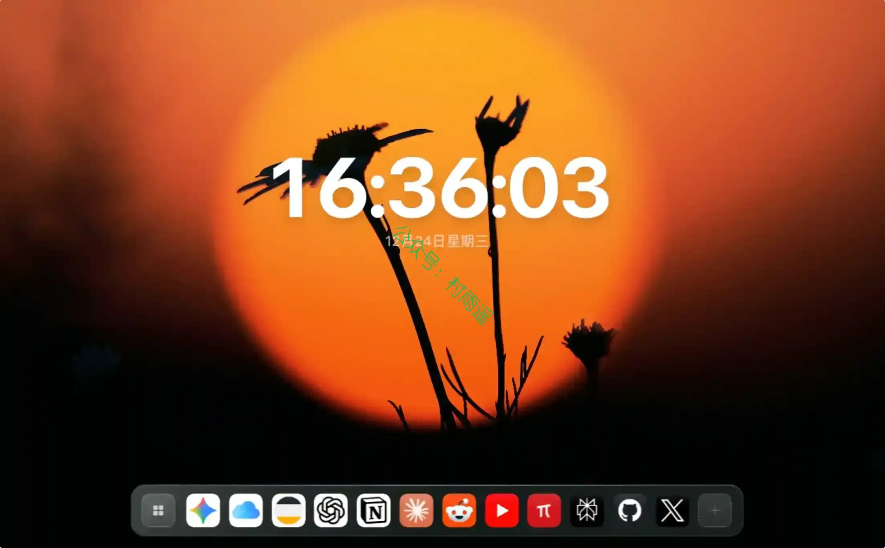

### 3. [PlainTab](https://chromewebstore.google.com/detail/plaintab-·-minimal-new-ta/jhpfjcefcmooplmaimgdafohdlhacjdo)

一个快速、安静、以壁纸为中心的新标签页。打开浏览器的新标签页时，你应该先看到一张舒服的壁纸，而不是新闻流、广告、热榜、推荐内容和满屏组件。

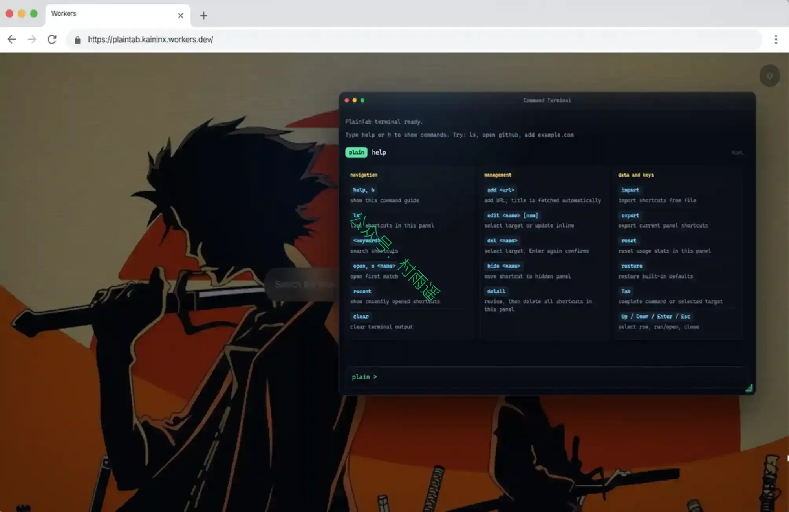

## 五、资料

### 1. [手写字体制作教程](https://qingsu.link)

从零基础开始，手把手教你把手写字做成字体。涵盖手写样本准备、扫描矢量化、FontForge & Glyphs 全流程教程，打造独一无二的个人专属手写字体。

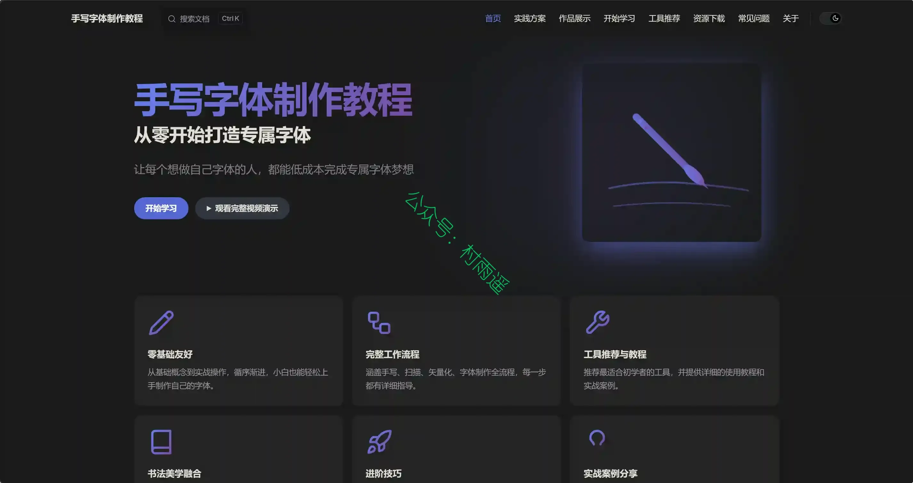

### 2. [Battle-Tested Patterns](https://github.com/Totoro-jam/battle-tested-patterns)

从 React 调度器到 Linux 内核，46 个生产验证的编程模式，按类别组织。每个都包含交互式可视化、多语言实现、练习和精确源码链接。

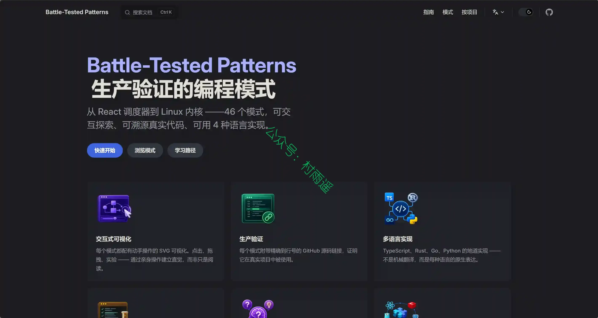

### 3. [Java 面试干货](https://github.com/Abyte-zym/java-career-blog)

一个面向 2026 年 Java 求职者的开源面试准备工具集。包含以下内容：

-   📚 40 + 篇深度面试文章（HashMap 源码到分布式系统设计全覆盖）
-   🧰 30 + 免费在线工具（简历生成器、面试模拟器、JD 押题器、段位测试、技能雷达等）
-   📄 一页纸速查表（可打印 PDF）
-   📋 30 天通关清单（交互式打卡）
-   ☕ 每日一签知识卡片（社交分享）

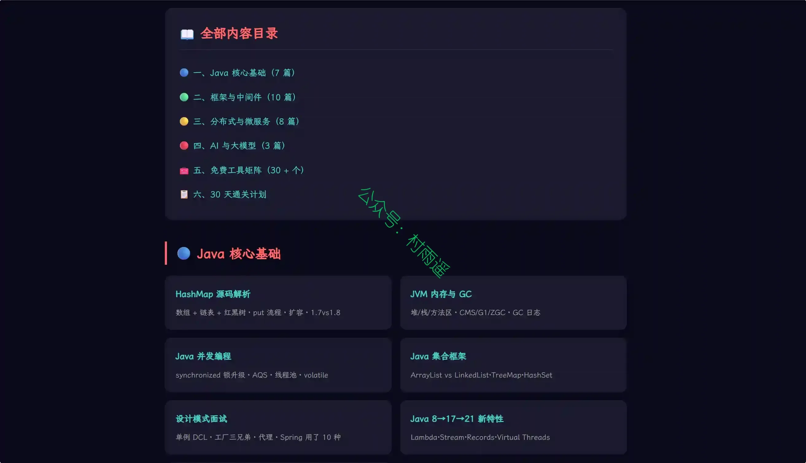

## ✍️ 说明

周刊专栏相关信息：

- **项目地址**：[Github](https://github.com/cunyu1943/weekly)，觉得不错麻烦给我一个**Star**，感谢 ❤️
- **浏览地址**：公众号 | [电子书](https://cunyu1943.github.io/weekly) | [语雀](https://yuque.com/cunyu1943/weekly) | [ima 知识库](https://ima.qq.com/wiki/?shareId=860487e32c6cc8d6c9070cd7f00caedf3cbf4102f695862d9c82f463b92417af)

如果你阅读到这里，说明我的工作没有白费。如果你想推荐项目/网站/软件/资源，欢迎提交 **[issue](https://github.com/cunyu1943/weekly/issues)** 或者添加我 **个人微信：coder_cunYu** 与我交流。

---

