# 好物周刊#159：排版神器，章鱼排版

> 作者：[村雨遥](https://github.com/cunyu1943)
> 
> 不要哀求，学会争取，若是如此，终有所获
> 
> 原文：https://mp.weixin.qq.com/s/zAuwsW9ZD0EYSYOOhKSytA

## 🎈 号外 

最近，公众号之外，建立了微信交流群，不定期会在群里分享各种资源（影视、IT 编程、考试提升……）&知识。如果有需要，可以**扫码或者后台添加小编微信备注入群**。进群后**优先看群公告**，**呼叫群中【资源分享小助手】**，还能免费帮找资源哦～

## 一、项目

### 1. [Amytis](https://github.com/hutusi/amytis)

一个功能强大、设计优雅、交互友好的开源数字花园框架，用于构建知识空间、博客、展示页面或企业知识库等。它基于 Next.js 16、Tailwind CSS v4 和 Bun 构建，强调 Markdown 优先、文本优先，保障作者对内容的长期所有权，在不损失功能和性能的前提下追求极致简洁与优雅。

### 2. [墨探](https://github.com/caol64/omni-article-markdown)

轻松将网页文章转换为 Markdown 格式的 CLI 工具。

### 3. [SiftMarks](https://github.com/Lling0000/SiftMarks)

把 Chrome 书签变成本地优先、可搜索、可审查、可给 AI 使用的私人上下文层。

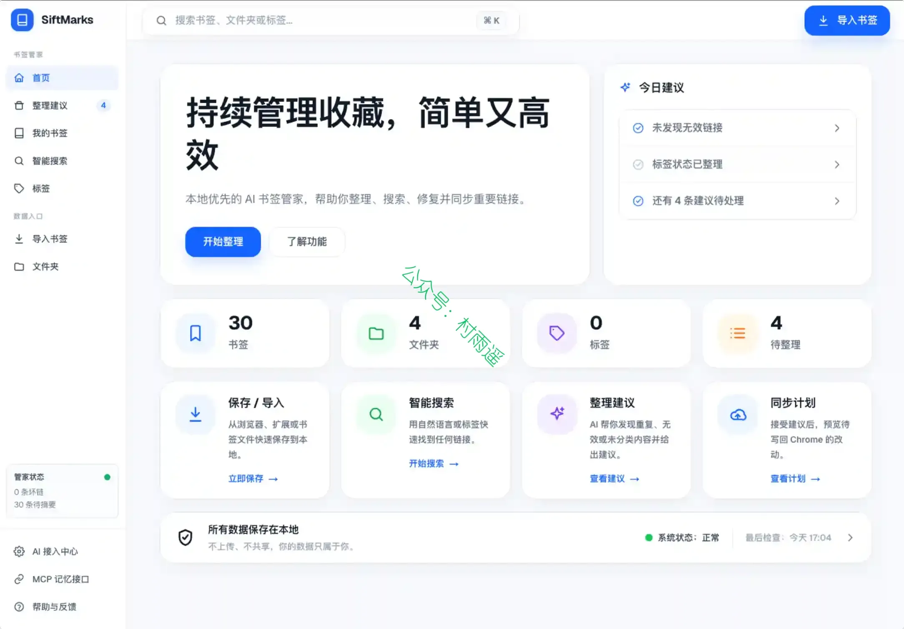

## 二、软件

### 1. [res-downloader](https://github.com/putyy/res-downloader)

一款基于 Go + Wails 的跨平台资源下载工具，简洁易用，支持多种资源嗅探与下载。

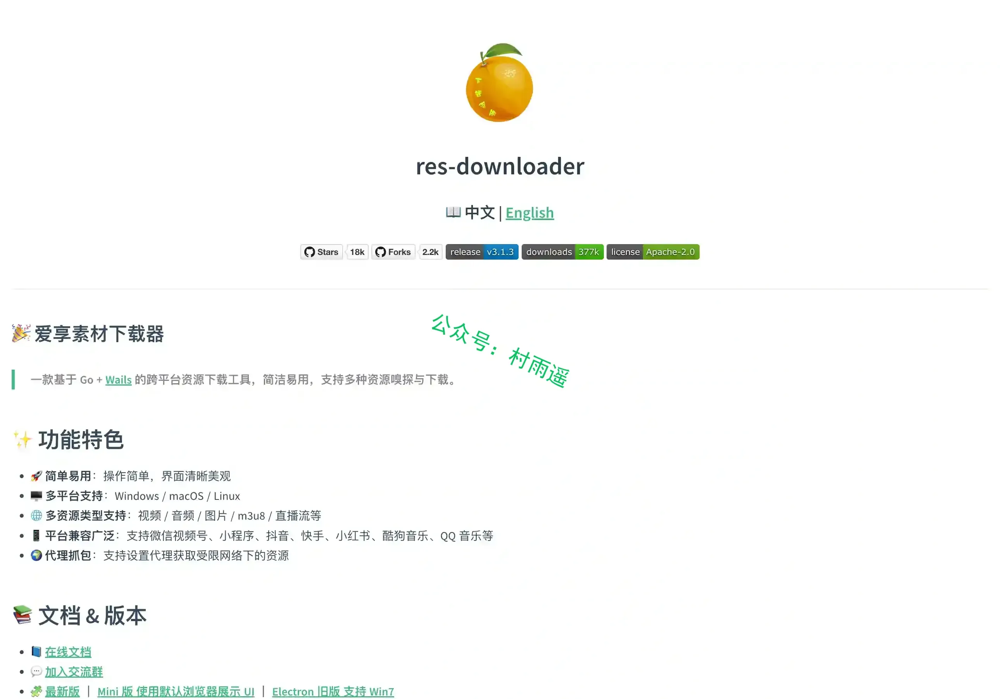

### 2. [Fresh](https://github.com/sinelaw/fresh)

一款现代化、功能完备的终端文本编辑器，无需任何配置即可直接使用。它沿用大众熟悉的快捷键，支持鼠标操作，还具备媲美集成开发环境（IDE）的强大能力，上手零门槛，不用额外花费时间学习。

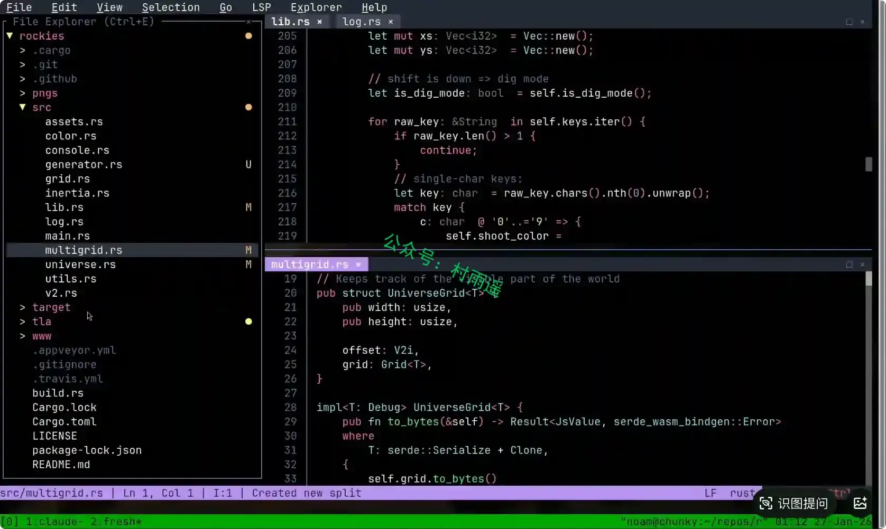

### 3. [DeepSeek GUI](https://github.com/XingYu-Zhong/DeepSeek-GUI)

一个面向开发者和高频 AI 工作者的本地桌面工作台。它以 Kun 为唯一运行时，把终端里的智能体体验整理成更容易上手、更适合长期使用的应用：选择工作目录，发起任务，实时查看推理、工具调用和文件改动，并在需要时审批或回退。

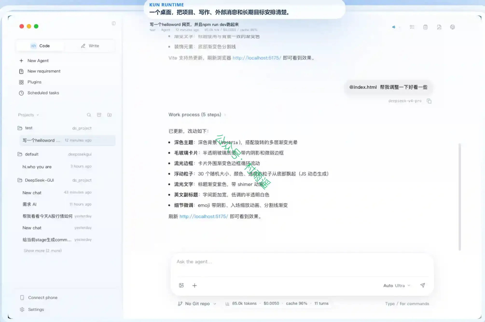

## 三、网站

### 1. [章鱼排版](https://zhangyupaiban.com)

支持将一篇长文，自动排成小红书、公众号、X/Twitter 支持的格式及图片，排版后一键复制即可。

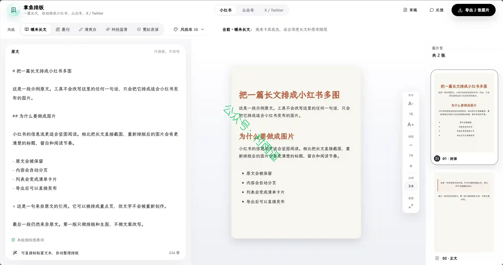

### 2. [汉语拼音在线学习](https://hanyupinyin.net)

汉语拼音在线学习平台，提供标准拼音发音、声母韵母表、整体认读音节等学习资源，是学习汉语拼音的最佳工具！

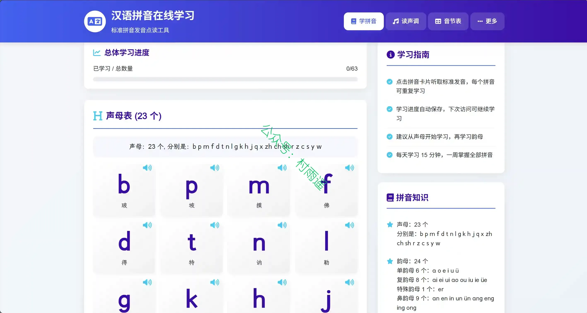

### 3. [ToolWebsite](https://tool.randomcc.cn)

一个专注于在线办公服务的工具类网站，平台汇集了超过 50 款不同类型的免费在线工具，工具品类覆盖图片处理、文档转换、开发工具等多个办公常用领域，能够满足普通办公人群、技术从业者等不同用户的日常使用需求。

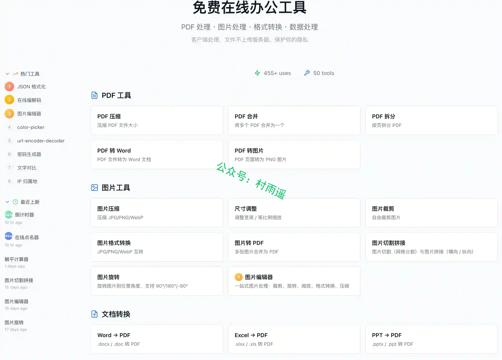

## 四、插件

### 1. [Browser Books](https://chromewebstore.google.com/detail/browser-books/hobljkdcnojlldjlkmfcnflnjbogmiig)

针对收藏网页抓不住重点、复制摘抄丢失原文语境的痛点，具备网页随处高亮批注、邮箱验证码极简云端同步、域名黑名单与全局开关防打扰的能力，为网页深度查阅与碎片化轻笔记需求用户提供轻量优雅的解决方案。

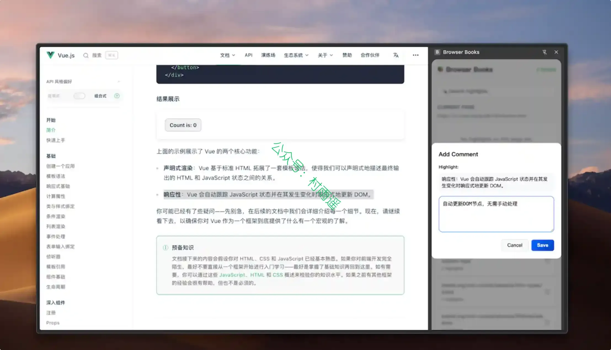

### 2. [TabNest](https://chromewebstore.google.com/detail/tabnest/oghchmagammlcniikanbgcebphcdogjf)

一个用于替换 Chrome 新标签页的标签整理工作台，帮助你更快查看、关闭和整理当前打开的标签页。

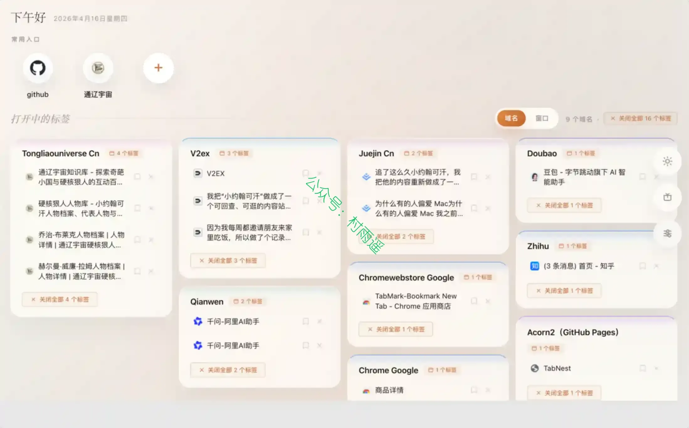

### 3. [SimilarRepos](https://chromewebstore.google.com/detail/similarrepos-ai-powered-r/phgdoclnoiokacipnhgaebaknfnjpfll)

一款利用 AI 技术增强 GitHub 浏览体验的浏览器插件。当你访问任何公开仓库时，它会自动在侧边栏为你推荐相关的类似项目，帮助你快速寻找替代方案、竞品或发现新灵感。

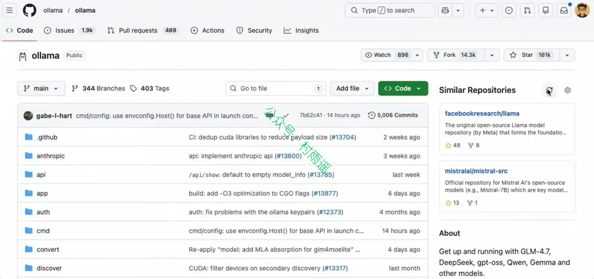

## 五、资料

### 1. [Deep Agents 实战](https://github.com/datawhalechina/deepagents-in-action)

基于 LangChain / LangGraph 生态，从零构建生产级 AI Agent 的完整指南。

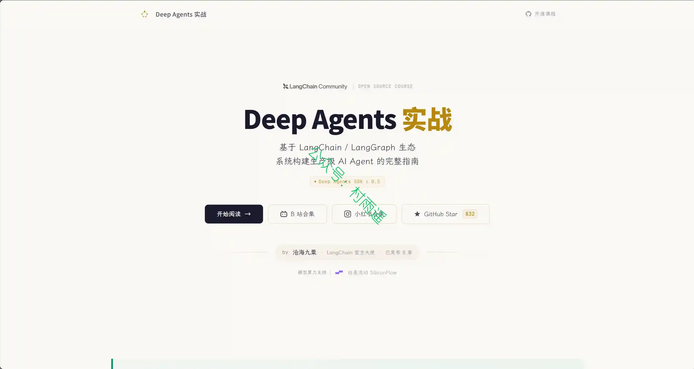

### 2. [前端 Python 3.12](https://python-docs.yysuni.com/)

给中高级前端准备的 Python 精简教程：快速建立语义与工程习惯，并把本站当作日常脚本和标准库的速查入口。

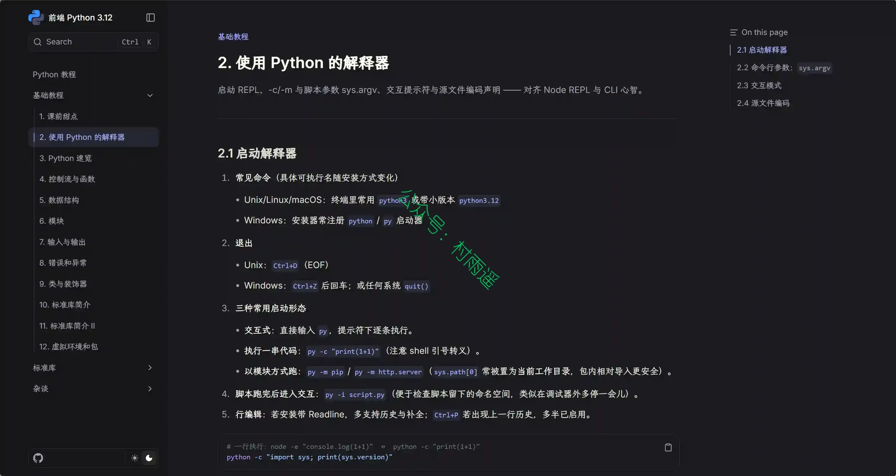

### 3. [Vibe Coding Guide](https://github.com/Lling0000/Vibe_coding_guide)

把 AI Coding 从 prompt 实验，升级为可审查、可验证、可交付的工程工作流。

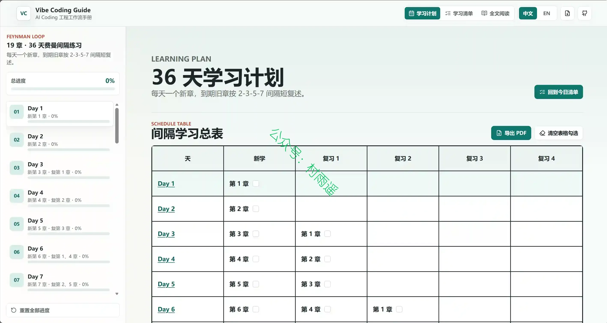

## ✍️ 说明

周刊专栏相关信息：

- **项目地址**：[Github](https://github.com/cunyu1943/weekly)，觉得不错麻烦给我一个**Star**，感谢 ❤️
- **浏览地址**：公众号 | [电子书](https://cunyu1943.github.io/weekly) | [语雀](https://yuque.com/cunyu1943/weekly) | [ima 知识库](https://ima.qq.com/wiki/?shareId=860487e32c6cc8d6c9070cd7f00caedf3cbf4102f695862d9c82f463b92417af)

如果你阅读到这里，说明我的工作没有白费。如果你想推荐项目/网站/软件/资源，欢迎提交 **[issue](https://github.com/cunyu1943/weekly/issues)** 或者添加我 **个人微信：coder_cunYu** 与我交流。

---

