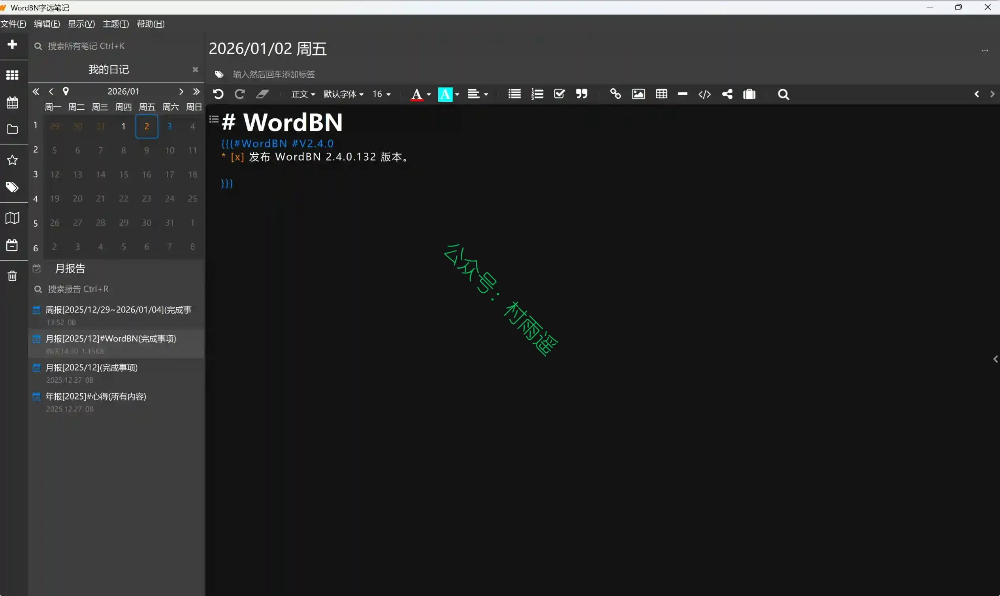
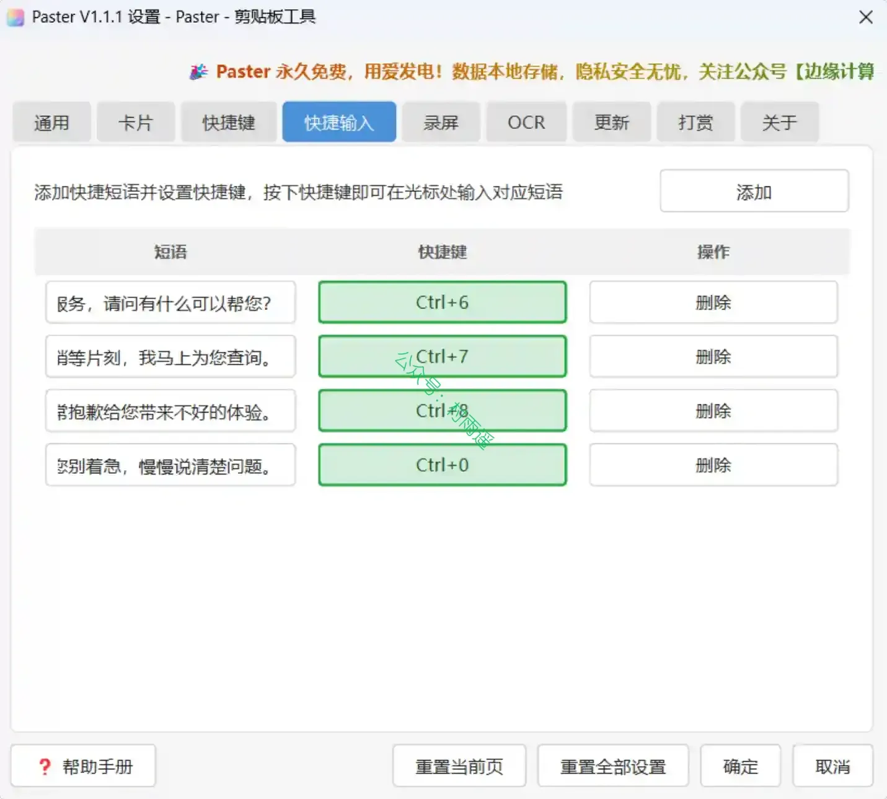
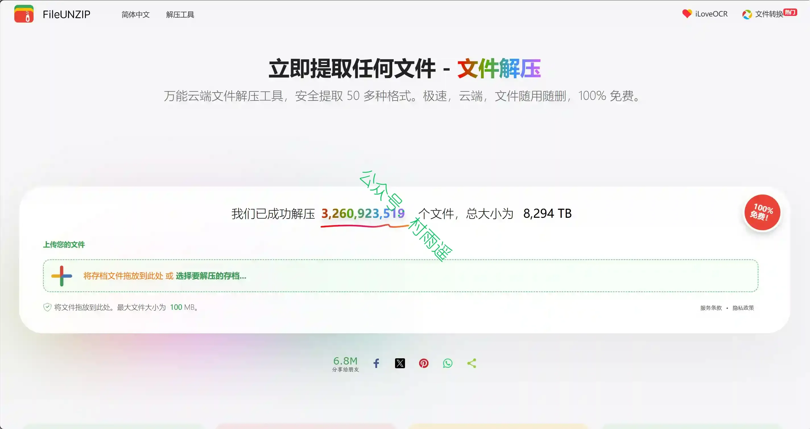
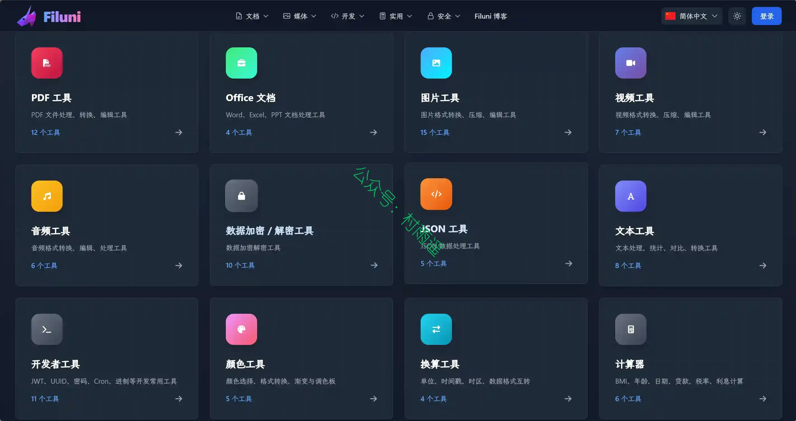
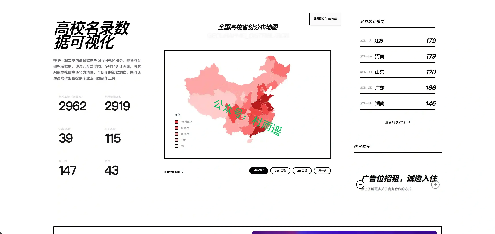
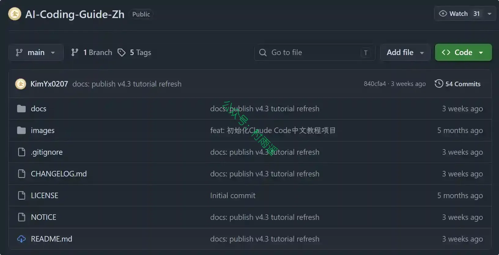
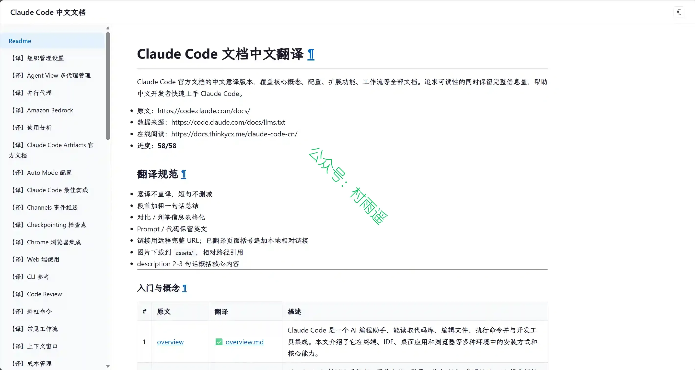
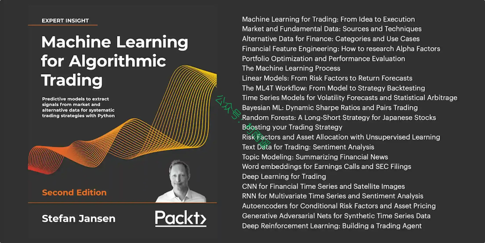

# 好物周刊#160：AI 三件套

> 作者：[村雨遥](https://github.com/cunyu1943)
> 
> 不要哀求，学会争取，若是如此，终有所获
> 
> 原文：https://mp.weixin.qq.com/s/uEZr43Um53fUPGWTJyNXOw

## 🎈 号外 

最近，公众号之外，建立了微信交流群，不定期会在群里分享各种资源（影视、IT 编程、考试提升……）&知识。如果有需要，可以**扫码或者后台添加小编微信备注入群**。进群后**优先看群公告**，**呼叫群中【资源分享小助手】**，还能免费帮找资源哦～

## 一、项目

### 1. [Web Chat](https://github.com/Jazee6/web-chat)

基于 Cloudflare 生态构建的实时 Web 聊天与通话应用。采用 Monorepo 架构，集成 WebRTC 通话、Durable Objects 状态管理与 D1 数据库，提供低延迟、高可用的 Serverless 聊天体验。

### 2. [WebUtils](https://github.com/chicogong/html-tools)

一个完全开源、隐私至上的在线工具集。无需安装、无需注册、无广告、无追踪，1086+ 纯前端在线工具集。

### 3. [AI Hub](https://github.com/YD4223/aihub)

一个开源且免费的 AI 工具导航站，致力于为用户一站式发现、筛选和比较全球范围内的优质 AI 工具。平台目前已收录 1183 + 款 AI 工具，覆盖聊天对话、图像生成、视频处理、代码助手等 16 大分类。

## 二、软件

### 1. [WordBN 字远笔记](https://www.wordbn.com)

一款免费桌面端双链笔记软件，主打日记管理、双链关联、富文本编辑、多格式导出、可视化图谱等能力，适配写作、学习、编程、自媒体创作等场景，支持 Markdown+HTML 混合编辑，功能全面且内置多种实用扩展工具。

### 2. [BookDock](https://github.com/NasDock/BookDock)

一款专为 NAS 用户设计的电子书管理 & 阅读平台，支持多格式电子书阅读、TTS 语音朗读、多端同步，并提供强大的书源管理和 NAS 存储集成能力。

### 3. [Paster](https://gitee.com/aiexporter/paster)

一款轻量高效的 Windows / Linux 剪贴板增强工具，自动保存你复制过的文本、图片、文件、链接和代码，支持实时搜索、收藏置顶、全局快捷键、快捷短语输入、内置截图标注和图片 OCR 工具、桌面贴图、支持视频和 Gif 录制、桌面便签、局域网电脑和手机共享剪贴板、明暗双主题，所有数据本地存储不上传云端，永久免费。

## 三、网站

### 1. [FileUNZIP](https://cn.fileunzip.com)

使用终极在线文件提取器，立即提取任何存档。支持解压 ZIP、RAR、7Z 和 50 多种格式。100% 基于浏览器以实现最大隐私，无需上传文件，免费、快速且安全。

### 2. [在线文件处理工具](https://www.filuni.com/zh)

一站式文件处理解决方案
支持 PDF、Office、图片、视频、音频等多种格式转换与处理。无需安装任何软件，在线即可完成各种文件处理任务。安全可靠，保护您的隐私。

### 3. [高校名录数据可视化](https://uni.utities.online)

探索中国顶尖大学的官方数据源。提供交互式的高校省份分布地图、多维度的办学数据统计分析，以及为高考毕业生打造的零代码个性化蹭饭图（毕业去向图）生成工具。

## 四、插件

### 1. [枝理 Tab](https://chromewebstore.google.com/detail/mdgmfopabppoboeoblbjgpdfjiandjlp)

一个安静、轻量的标签页整理工具，会接管新标签页，帮助你快速看清当前打开的页面。它支持按域名、窗口和重复标签分组，也提供搜索、关闭重复标签、休眠闲置标签、主题切换与东方色盘等功能，让浏览器从杂乱回到清爽。

### 2. [Blog Wander](https://chromewebstore.google.com/detail/blog-wander/dignlbmfodpdafnepgjlcfhliomplgfl)

按标签和语言偏好随机打开一篇博客。选中感兴趣的标签和语言，点击按钮/按下快捷键之后，即可跳转到一篇随机的博客。每次点击，都是一次未知的内容冒险。

### 3. [Make X Great Again](https://chromewebstore.google.com/detail/make-x-great-again/aeoldnecphbkkckeedfgfcdcekkljdea)

一个开源的 X (Twitter) 旁路防 spam 扩展。你正常刷 X 时，它会在后台读取页面上已经公开显示的账号信息和推文上下文，识别色情引流号、广告推广号和明显模板化 spam bot，并把可疑账号标在评论区旁边。你可以逐个复核，也可以在气泡面板里勾选后批量拉黑。拉黑使用 X 自己的屏蔽能力，结果会同步到你的 X 账号。

## 五、资料

### 1. [Claude Code & OpenClaw & Codex 中文教程](https://github.com/KimYx0207/AI-Coding-Guide-Zh)

一套系统化、适合循序学习、也能进入团队落地的 AI Coding 与 Agent 工作流中文教程，覆盖三类代表性工具。

### 2. [Claude Code 中文文档](https://github.com/thinkycx/docs)

项目将全部 58 篇 Claude Code 官方文档做了中文意译，覆盖从快速上手、权限配置、MCP 扩展、Hooks 自动化到企业部署的完整知识体系。

### 3. [ML for Trading](https://github.com/stefan-jansen/machine-learning-for-trading)

这本书籍旨在以实用且全面的方式讲解机器学习如何为算法交易策略赋能。书中涵盖从线性回归到深度强化学习的各类机器学习技术，并演示如何搭建、回测以及评估依托模型预测生成的交易策略。

## ✍️ 说明

周刊专栏相关信息：

- **项目地址**：[Github](https://github.com/cunyu1943/weekly)，觉得不错麻烦给我一个**Star**，感谢 ❤️
- **浏览地址**：公众号 | [电子书](https://cunyu1943.github.io/weekly) | [语雀](https://yuque.com/cunyu1943/weekly) | [ima 知识库](https://ima.qq.com/wiki/?shareId=860487e32c6cc8d6c9070cd7f00caedf3cbf4102f695862d9c82f463b92417af)

如果你阅读到这里，说明我的工作没有白费。如果你想推荐项目/网站/软件/资源，欢迎提交 **[issue](https://github.com/cunyu1943/weekly/issues)** 或者添加我 **个人微信：coder_cunYu** 与我交流。

---

