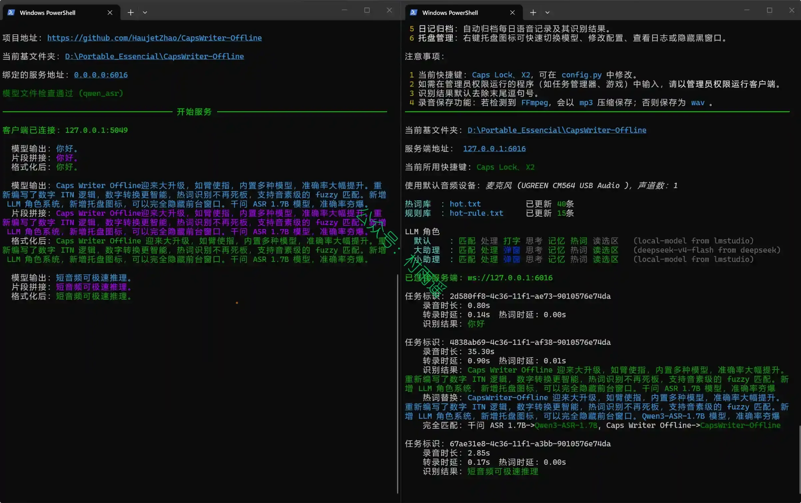
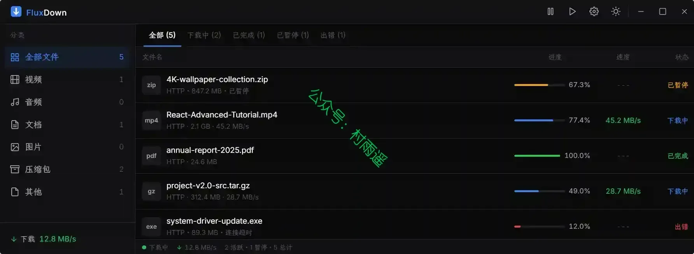
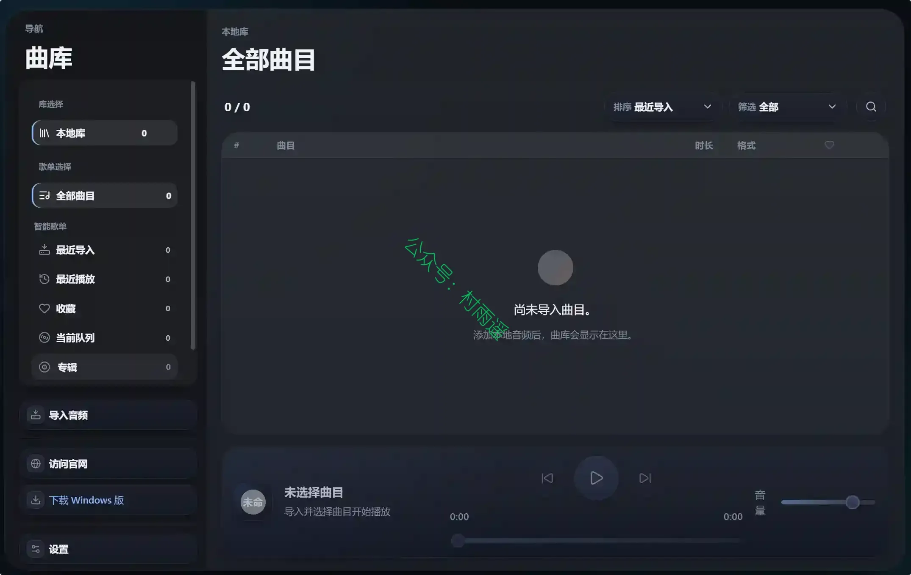
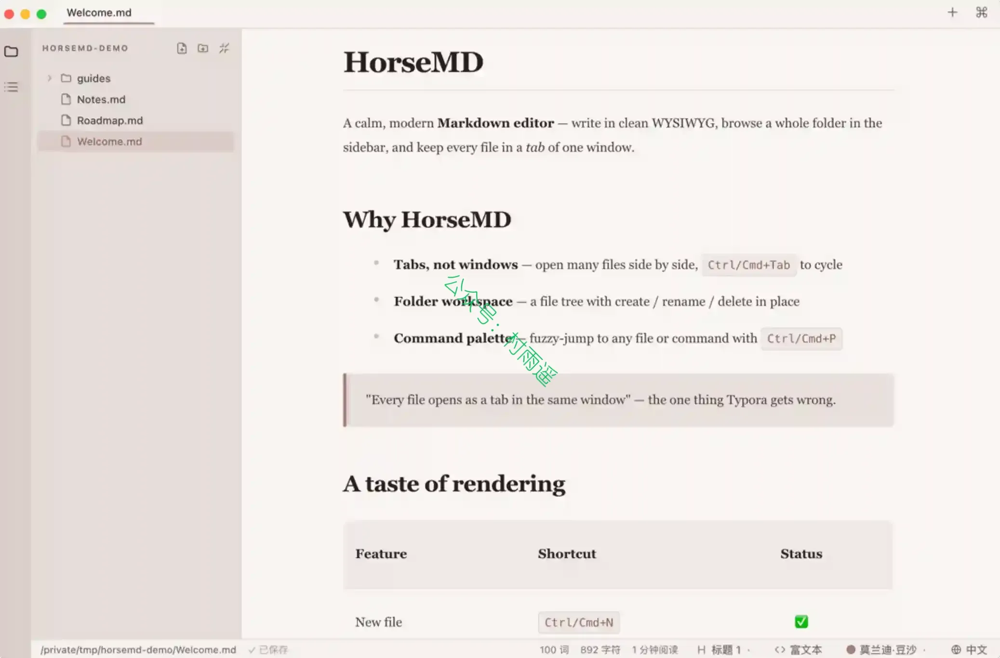
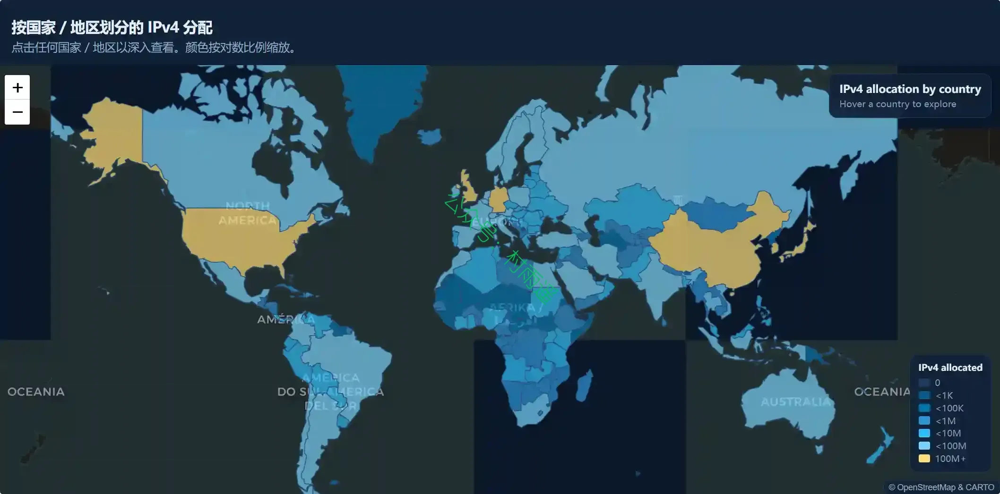
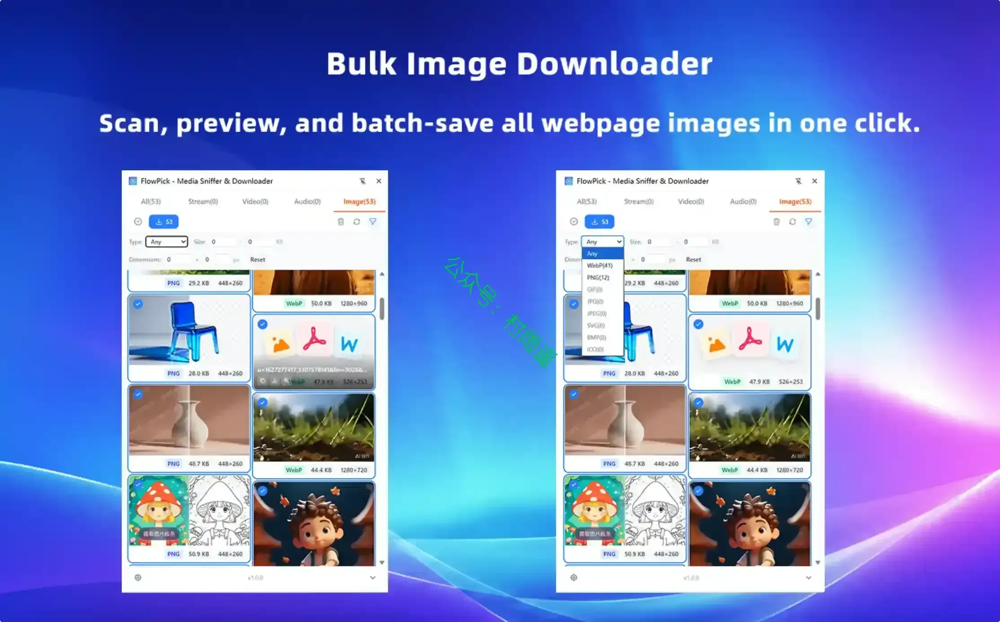
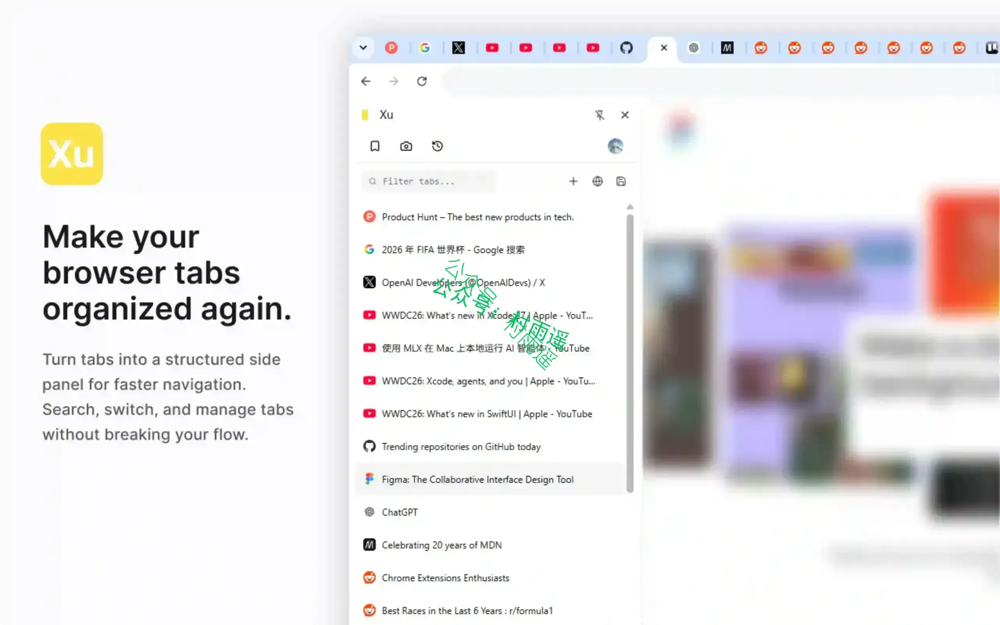
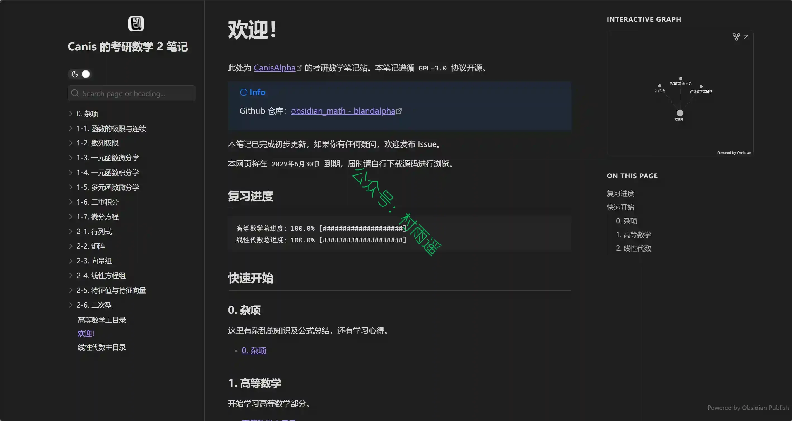
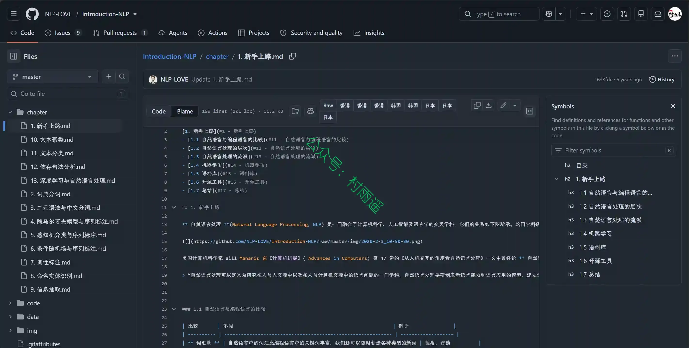

# 好物周刊#161：60s 每日简报

> 作者：[村雨遥](https://github.com/cunyu1943)
> 
> 不要哀求，学会争取，若是如此，终有所获
> 
> 原文：https://mp.weixin.qq.com/s/4lMabei7WY1aai83689jbg

## 🎈 号外 

最近，公众号之外，建立了微信交流群，不定期会在群里分享各种资源（影视、IT 编程、考试提升……）&知识。如果有需要，可以**扫码或者后台添加小编微信备注入群**。进群后**优先看群公告**，**呼叫群中【资源分享小助手】**，还能免费帮找资源哦～

## 一、项目

### 1. [60s-web](https://github.com/dogxii/60s-web)

集成 60s API，支持每日简报、全网热榜、城市天气、实用数据、娱乐内容和常用工具整合导航页。

### 2. [Monolith](https://github.com/one-ea/Monolith)

一套运行在 Cloudflare 全球边缘网络上的现代化博客系统，前后端通过适配器模式解耦，零运维即可获得全球 < 50ms 的访问延迟。

### 3. [CapsWriter-Offline](https://github.com/HaujetZhao/CapsWriter-Offline)

一个专为 Windows 打造的完全离线语音输入工具。支持离线识别，高准确率、低延迟，支持热词、LLM 润色。按住 CapsLock 或鼠标侧键 X2 说话，松开自动上屏。

## 二、软件

### 1. [FluxDown](https://fluxdown.zerx.dev)

Rust 驱动的多协议下载管理器，支持 HTTP/FTP/BitTorrent 磁力链接及 HLS/DASH 流媒体，智能多线程加速与浏览器无缝集成。精美界面，极致性能，永久免费，零广告。

### 2. [OFPlayer](https://ofplayer.org)

一款本地优先的现代音乐播放器。支持 FLAC/MP3 无损播放、智能歌单管理、音频元数据解析，专为认真听歌的人设计。

### 3. [HorseMD](https://github.com/BND-1/horseMD)

一款温暖、现代的 Markdown 编辑器。一个更顺手的 Typora 替代品，核心理念是 Typora 做反了的那件事：每个文件都作为标签页在同一个窗口里打开，而不是新开一个程序。左侧文件树浏览整个文件夹，标签页之间随手切换，在干净的所见即所得编辑器里书写。

## 三、网站

### 1. [Txt2Eb](https://txt2eb.toolooz.com)

免费在线 TXT 转 EPUB 工具，自动识别章节，浏览器本地转换，文件不上传，保护隐私。支持小说、讲义、笔记等多种文本。

### 2. [WorldIP.io](https://worldip.io)

查找 43 亿个 IPv4 地址中任意一个的所有者、ASN、国家、州 / 地区、城市、反向 DNS、PTR 记录和分配历史。按 IP、CIDR、ASN、组织、国家、州或城市搜索。无需注册，无需 API 密钥。

### 3. [青椒科研](https://www.qingjiaoky.com)

青椒为医护、科研与医学生提供精选、权威的医学学术导航。

## 四、插件

### 1. [FlowPick](https://chromewebstore.google.com/detail/flowpick-media-sniffer-do/mfinfkkabangbkanlfhhbokgfekjklea)

一款专为大众用户设计的全能型网页媒体资源嗅探与下载插件。无论是网页视频、音乐、配音，还是精美图片，FlowPick 都能在后台自动为您捕捉、整理并归类，彻底告别繁琐的代码审查和寻找下载链接的烦恼。

### 2. [Bilitato - AI陪你看B站](https://chromewebstore.google.com/detail/ggddcgdafeeoijoaohcffinbefcbpcga?utm_source=item-share-cb)

一款专为 B 站用户打造的沉浸式AI增强插件。无论视频是否有官方字幕，Bilitato 都能帮你秒读视频，直击重点，帮助你在B站大学高效学习。

### 3. [Xu](https://chromewebstore.google.com/detail/xu-tab-manager-snapshots/maehjhoeflfjfgbcijfhpfmbneakjhad)

一款浏览器侧边栏效率工具，轻量、快速、无打扰的浏览整理工具。

## 五、资料

### 1. [AI 编程（Claude Code + Codex）指南](https://github.com/stormzhang/ai-coding-guide)

面向小白的 AI 编程 CLI 中文教程：Claude Code + Codex 92 篇精修文章。

### 2. [考研数学 2 Obsidian 笔记本](https://github.com/BlandAlpha/obsidian_math)

基于考研数学 2025 张宇基础 30 讲总结而出的笔记，适合考研学习的朋友。

### 3. [自然语言处理入门笔记](https://github.com/NLP-LOVE/Introduction-NLP)

项目旨在帮助更多同路人能够快速的掌握 NLP 的专业知识，理清知识要点，在工作中发挥更大的作用。以书本为主，记录项目发起者在学习《自然语言处理入门时》的心路历程、总结和笔记。

## ✍️ 说明

周刊专栏相关信息：

- **项目地址**：[Github](https://github.com/cunyu1943/weekly)，觉得不错麻烦给我一个**Star**，感谢 ❤️
- **浏览地址**：公众号 | [电子书](https://cunyu1943.github.io/weekly) | [语雀](https://yuque.com/cunyu1943/weekly) | [ima 知识库](https://ima.qq.com/wiki/?shareId=860487e32c6cc8d6c9070cd7f00caedf3cbf4102f695862d9c82f463b92417af)

如果你阅读到这里，说明我的工作没有白费。如果你想推荐项目/网站/软件/资源，欢迎提交 **[issue](https://github.com/cunyu1943/weekly/issues)** 或者添加我 **个人微信：coder_cunYu** 与我交流。

