# 好物周刊#162：考研 PDF

> 作者：[村雨遥](https://github.com/cunyu1943)
> 
> 不要哀求，学会争取，若是如此，终有所获
> 
> 原文：https://mp.weixin.qq.com/s/FPPtQyOzi3mG3SpJOvJpFQ

## 🎈 号外 

最近，公众号之外，建立了微信交流群，不定期会在群里分享各种资源（影视、IT 编程、考试提升……）&知识。如果有需要，可以**扫码或者后台添加小编微信备注入群**。进群后**优先看群公告**，**呼叫群中【资源分享小助手】**，还能免费帮找资源哦～

## 一、项目

### 1. [ArtPlayer.js](https://github.com/zhw2590582/ArtPlayer)

浏览器视频工具与播放器编辑器，把编辑器、字幕流程和轻量媒体工具整合到同一个应用外壳中。

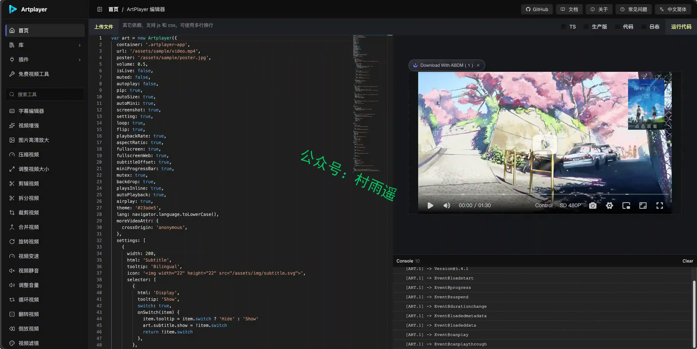

### 2. [A 股智能量化工作台](https://github.com/shy3130/tickflow-stock-panel)

自托管、零运维的 A 股「选股 + 监控 + 回测」量化工作台，面向个人散户与量化爱好者而生。

### 3. [An Otter Wiki](https://github.com/redimp/otterwiki)

一款基于 Python、采用 Flask 微框架开发的协作式维基内容管理工具，以 Git 仓库存储并记录全部内容修改记录，使用 Markdown 标记语言，搭配 Halfmoon CSS 框架、CodeMirror 编辑器与免费 Font Awesome 图标库搭建而成。

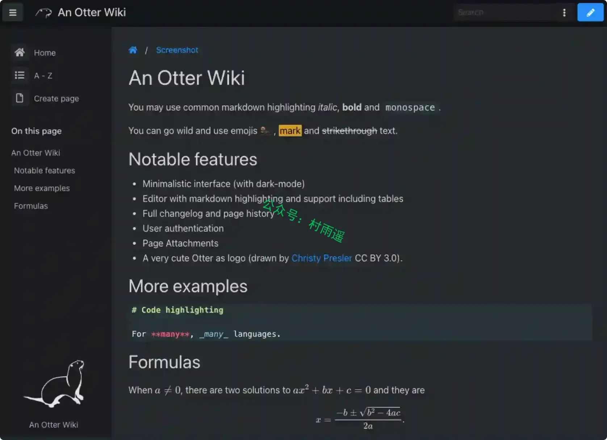

## 二、软件

### 1. [NoteGen](https://github.com/codexu/note-gen)

一款跨平台的 Markdown AI Agent 笔记软件，致力于使用 AI 建立记录和写作的桥梁。

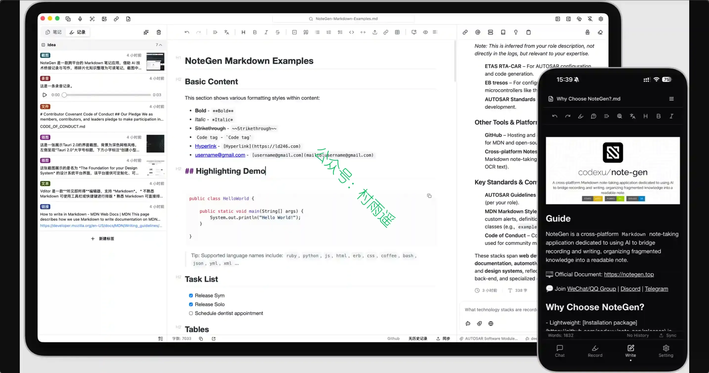

### 2. [Anx Reader](https://github.com/anxcye/anx-reader)

一款为热爱阅读的你精心打造的电子书阅读器。集成多种 AI 能力，支持丰富的电子书格式，让阅读更智能、更专注。现代化界面设计，只为提供纯粹的阅读体验。

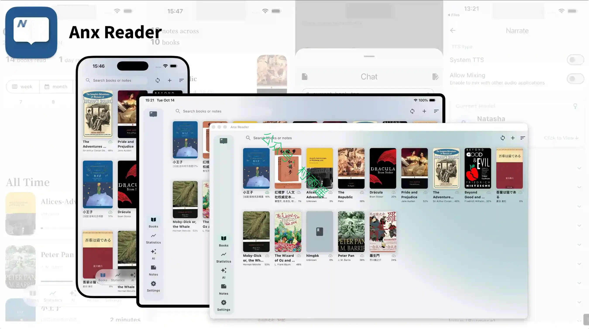

### 3. [Tadado](https://github.com/HananxR/Tadado)

一款 Windows 桌面任务管理工具。你用简单的 Markdown 语法写任务，它帮你组织、追踪、回顾。所有数据存本地，无需联网，无需注册。

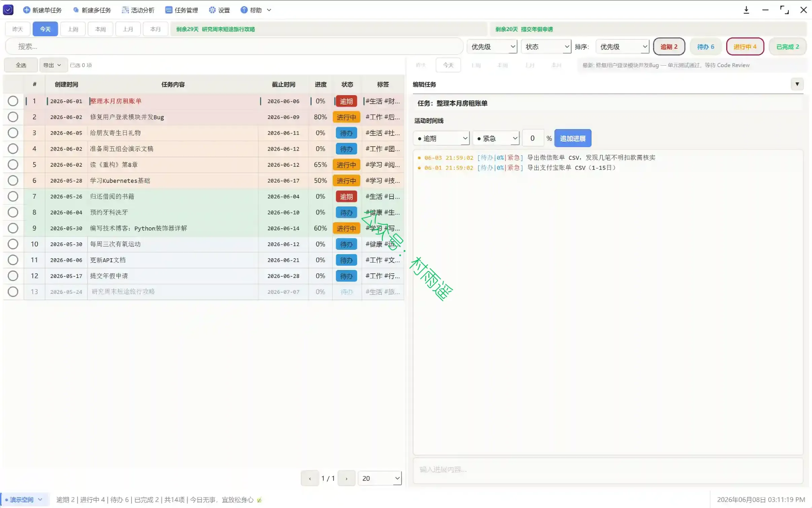

## 三、网站

### 1. [导航中心](https://jolyee.net)

一个精心整理的优质资源导航平台，汇聚开发工具、学习社区、AI 应用、影视资源、音乐资源等优质内容。提供快速访问、搜索、收藏等便捷功能。

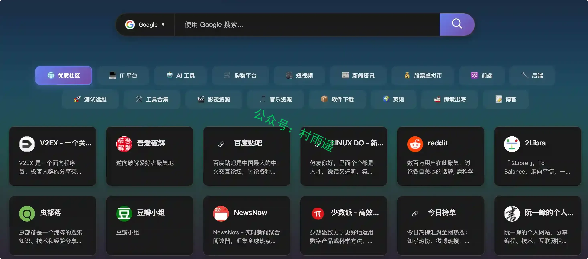

### 2. [KaoYanPDF](https://kaoyanpdf.com)

免费考研真题PDF下载资料库，汇总 101 政治、204 英语二、301 数学一、408 计算机等统考科目代码与门类，覆盖公共课、专硕联考、医学、教育、农学、法硕等全部统考科目，方便考生按科目查找对应真题资料，全站拥有上万份考研真题与解析可免费下载。

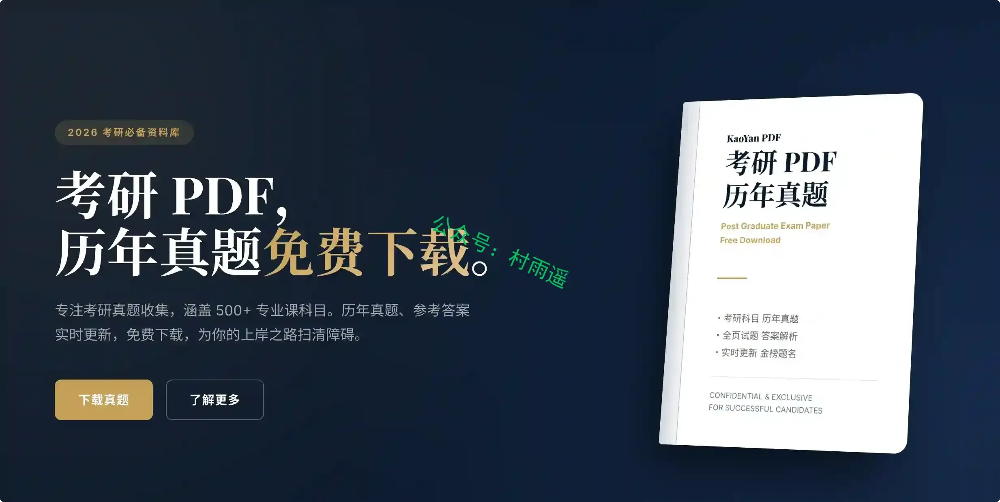

### 3. [墨格](https://moyufang.cn)

一款在线微信公众号排版工具，支持 Markdown 转公众号文章、公众号美化、图文排版、AI 写作排版、样式模板和一键复制到公众号编辑器，让微信文章排版更轻松。

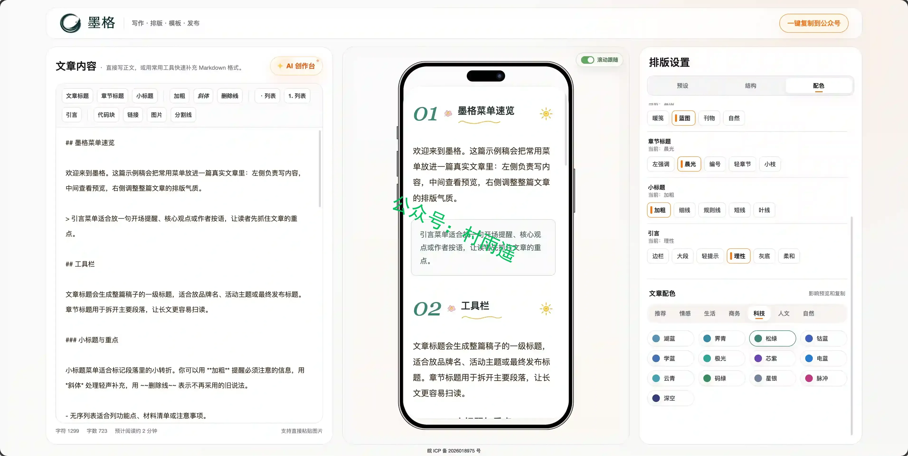

## 四、插件

### 1. [LarkSnap · 飞书文档导出助手](https://chromewebstore.google.com/detail/gepndmikbdjpdedkfiejchmhmhegjeal?utm_source=item-share-cb)

在飞书文档页面一键导出为 Markdown / PDF / HTML，批量下载附件，支持离线缓存；任意网页一键转 Markdown、解除复制限制、选中自动复制。

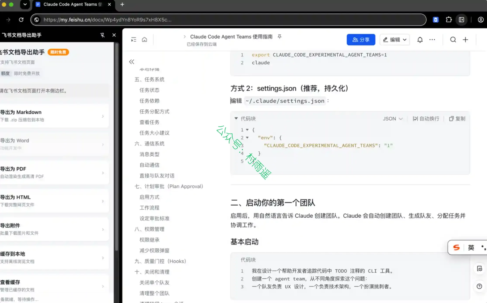

### 2. [NextAI Translator](https://chromewebstore.google.com/detail/nextai-translator/ogjibjphoadhljaoicdnjnmgokohngcc)

一个使用 ChatGPT API 进行划词翻译、总结、润色、分析、代码解释的浏览器插件。借助了 ChatGPT 强大的翻译能力，它将帮助您更流畅地阅读、编辑外语。

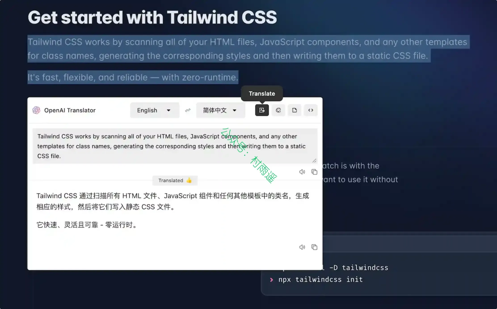

### 3. [SingleFile](https://chromewebstore.google.com/detail/singlefile/mpiodijhokgodhhofbcjdecpffjipkle)

可将完整网页保存为单个 HTML 文件。它是一款网页扩展程序（同时也是命令行工具），支持谷歌浏览器、火狐浏览器（桌面端与移动端）、微软 Edge、Safari、Vivaldi、Waterfox、Yandex 以及 Opera。

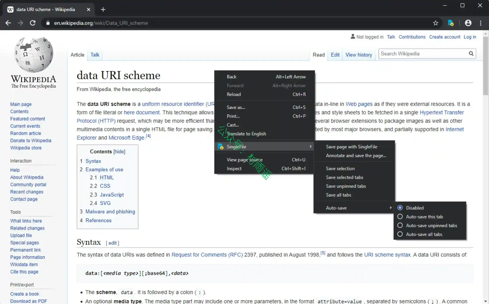

## 五、资料

### 1. [简历收集](https://github.com/mmmlllnnn/ResumeCollection)

收集全网的中英文简历，总有一款适合你。涵盖多种风格，各行各业的简历模板，收集自网络，免费分享。

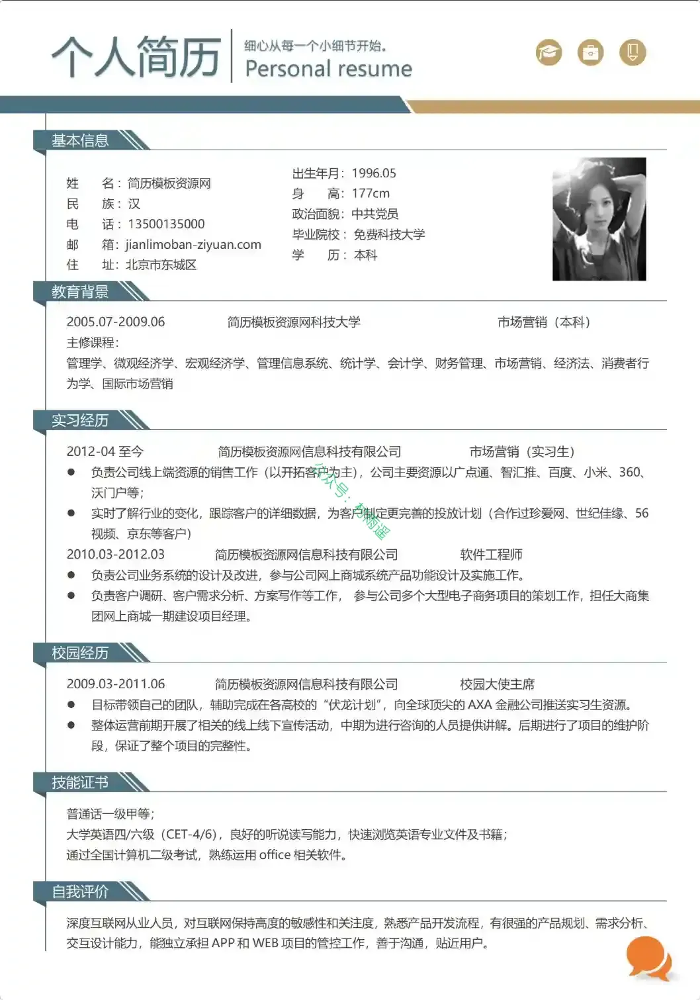

### 2. [Java Source Code Learning](https://github.com/coderbruis/JavaSourceCodeLearning)

一份面向 Java 后端工程师的源码阅读地图：从 JDK / JUC 到 Spring、Netty、Kafka、RocketMQ，按核心链路拆解框架设计与底层实现。

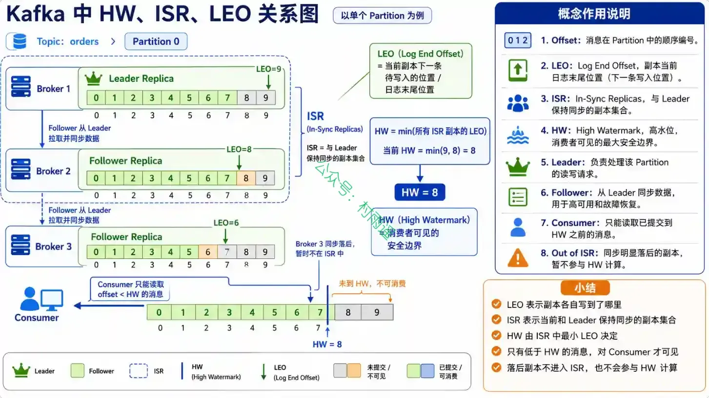

### 3. [神经网络与深度学习](https://github.com/nndl/nndl)

邱锡鹏《神经网络与深度学习》（蒲公英书）理论书 v2 与通识版。

## ✍️ 说明

周刊专栏相关信息：

- **项目地址**：[Github](https://github.com/cunyu1943/weekly)，觉得不错麻烦给我一个**Star**，感谢 ❤️
- **浏览地址**：公众号 | [电子书](https://cunyu1943.github.io/weekly) | [语雀](https://yuque.com/cunyu1943/weekly) | [ima 知识库](https://ima.qq.com/wiki/?shareId=860487e32c6cc8d6c9070cd7f00caedf3cbf4102f695862d9c82f463b92417af)

如果你阅读到这里，说明我的工作没有白费。如果你想推荐项目/网站/软件/资源，欢迎提交 **[issue](https://github.com/cunyu1943/weekly/issues)** 或者添加我 **个人微信：coder_cunYu** 与我交流。

 

