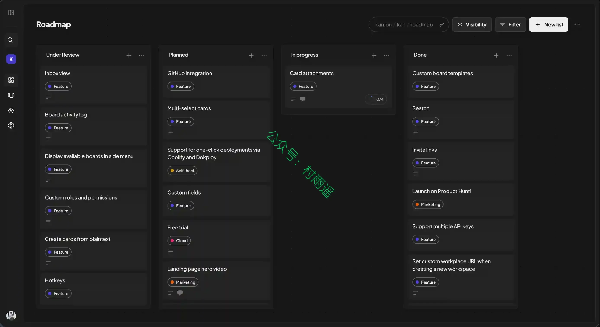
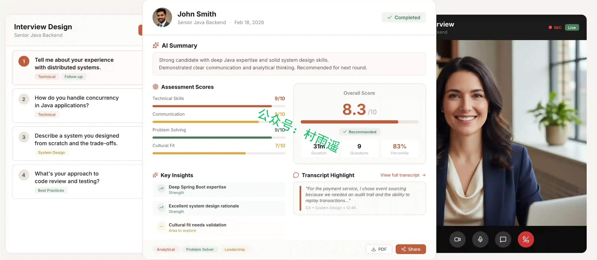
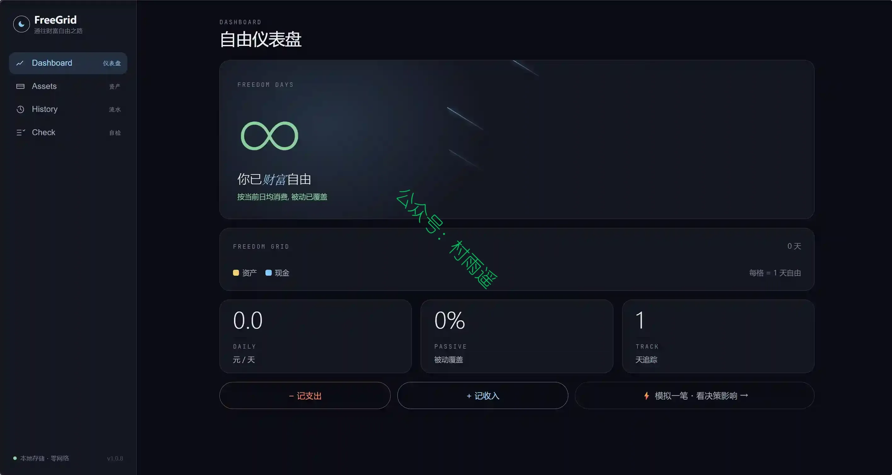
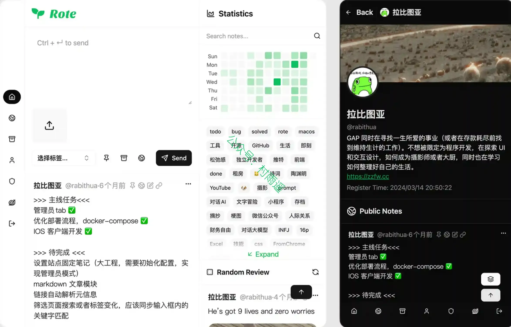
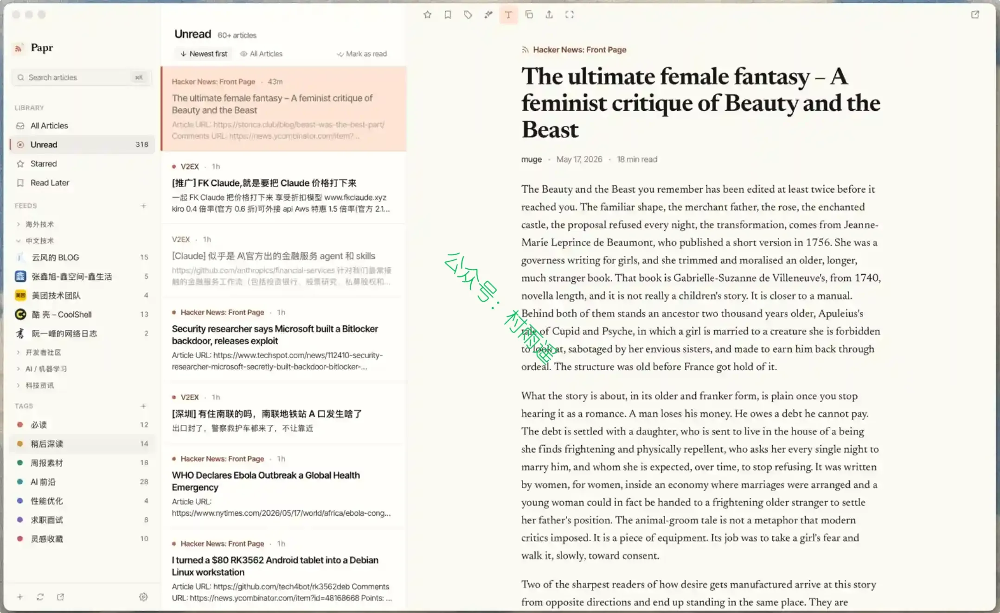
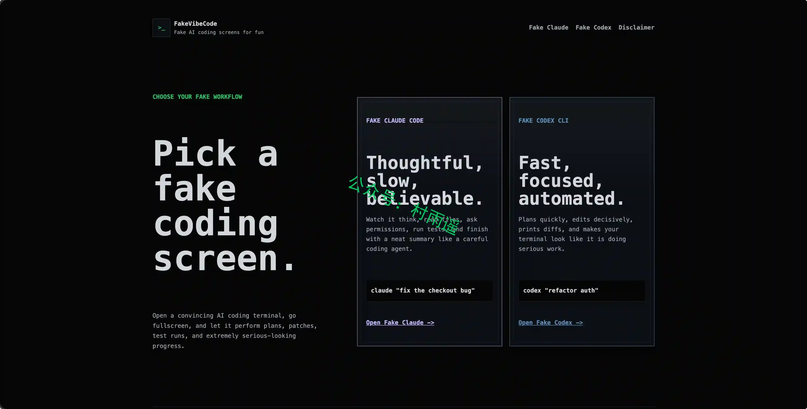
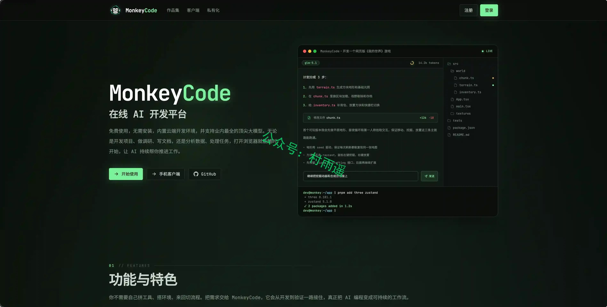
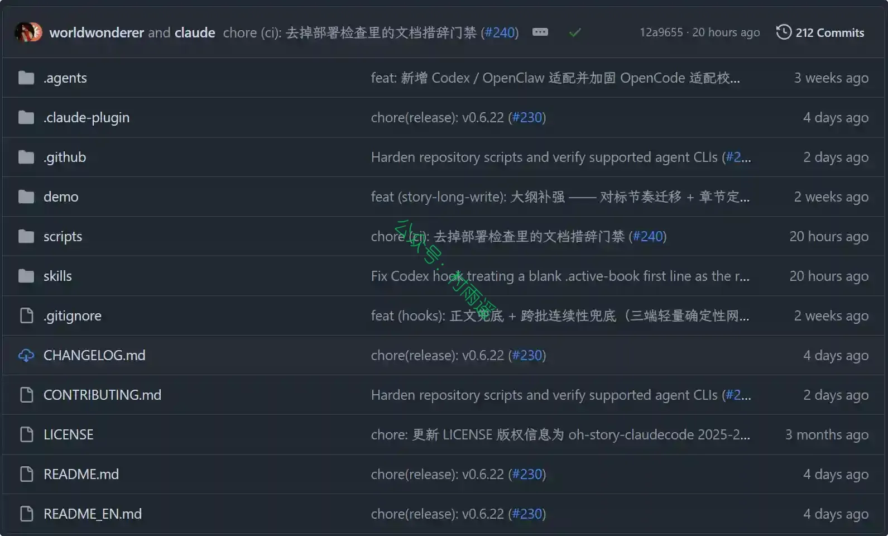
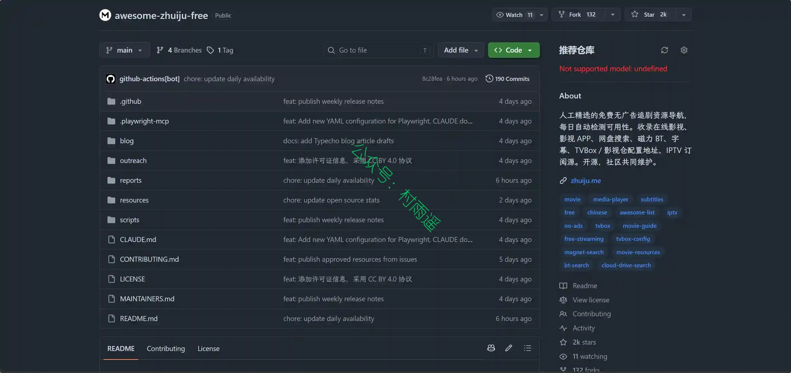
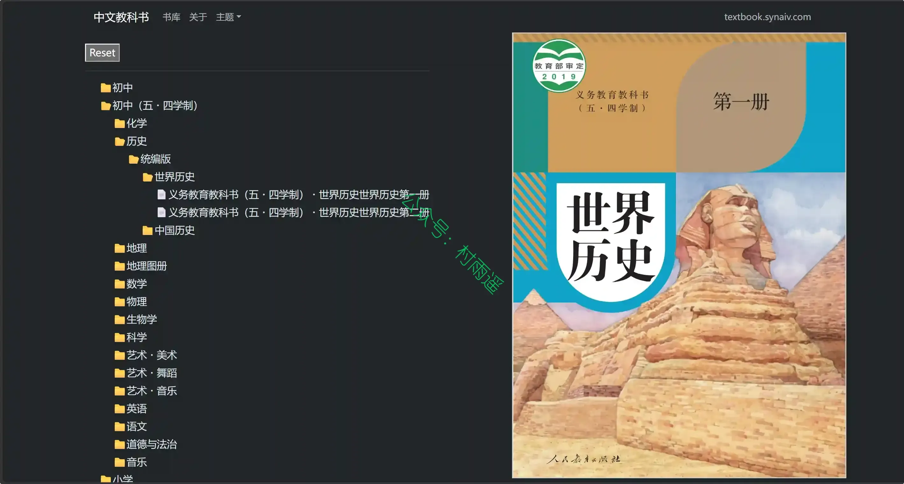

好物周刊#163：快给你的 Codex 换个皮肤吧

> 作者：[村雨遥](https://github.com/cunyu1943)
> 
> 不要哀求，学会争取，若是如此，终有所获
> 
> 原文：https://mp.weixin.qq.com/s/s01AV2xBg-k5YlEx0nLivg

## 🎈 号外 

最近，公众号之外，建立了微信交流群，不定期会在群里分享各种资源（影视、IT 编程、考试提升……）&知识。如果有需要，可以**扫码或者后台添加小编微信备注入群**。进群后**优先看群公告**，**呼叫群中【资源分享小助手】**，还能免费帮找资源哦～

## 一、项目

### 1. [kan](https://github.com/kanbn/kan)

一款对标 Trello 的开源项目管理工具，官方提供官网、文档、路线图与 Discord 社群渠道，搭载多项核心协作功能，同时开放多种部署方式、本地开发方案、详细环境变量配置以及适配主流 AI 客户端的 MCP 人工智能控制服务，整体技术栈基于 Next.js、tRPC、Tailwind CSS 等主流开发组件搭建。

### 2. [Codex-Dream-Skin](https://github.com/Fei-Away/Codex-Dream-Skin)

给 Codex 桌面端换一张会呼吸的脸。外部主题/换肤工具，通过本机 CDP 注入，不改官方安装包。

### 3. [Aural](https://github.com/1146345502/aural-oss)

面向求职者与招聘团队的开源 AI 面试平台，支持语音、聊天和视频面试、上下文自适应追问、结构化评分与报告、编程题和白板题、多语言界面，并兼容 OpenAI API。项目采用 MIT 许可证，可本地部署或自托管。

## 二、软件

### 1. [FreeGrid](https://github.com/coni555/FreeGrid-Freedom)

别的记账软件告诉你花了多少，该软件让你看见代价把「财富自由」折算成一个你每天看得见的数字：自由天数。把财富自由翻译成「自由天数」的纯本地 iOS 记账 App。

### 2. [Rote](https://github.com/Rabithua/Rote)

一款开源私有化个人笔记系统，主打数据自主掌控、简约轻量化、可选 AI 记忆、全平台适配，面向重视数据隐私、希望自建私有笔记服务的个人与小型团队，采用前后端分离架构，支持容器化快速部署，生态拓展性强。

### 3. [Papr](https://github.com/l0ng-ai/papr)

一个本地优先的桌面 RSS 阅读器。所有订阅和阅读记录都保存在本地的一个 SQLite 文件里，无需账号，也不会上传云端。支持 OPML、全文抓取、FreshRSS 同步，以及可选的 AI 摘要。

## 三、网站

### 1. [FakeVibeCode](https://fakevibecode.com/)

假装正在使用 Claude/Codex 等 AI 工具进行编码，摸鱼必备。

### 2. [MonkeyCode](https://monkeycode-ai.com)

在线 AI 开发平台，免费使用，无需安装，内置云端开发环境，并支持业内最全的顶尖大模型。无论是开发项目、做调研、写文档，还是分析数据、处理任务，打开浏览器就能随时开始，让 AI 持续帮你推进工作。

### 3. [RantBase](https://rantbase.app)

AI 驱动的 App Store 评论分析工具。查看任意应用的真实用户吐槽、缺失功能和实际问题。

## 四、插件

### 1. [Copy With Format](https://chromewebstore.google.com/detail/copy-with-format/jpbllgpgnaoiabkkgphlbonmjnghlbbl?hl=zh-CN&utm_source=ext_sidebar)

一款免费的、能够完美保留格式的复制插件，专为解决 AI 大模型聊天工具复制时格式丢失的问题而设计。无论是加粗、斜体、换行还是列表，都能一键复制，保持原样粘贴到任何地方。支持多种文档格式，包括 Markdown、HTML 表格等，确保你的内容在复制后依然美观、清晰。真正帮助你提升工作效率，告别格式混乱的烦恼。

### 2. [跨站快搜](https://chromewebstore.google.com/detail/ihjlfkkicmgakjppcbdnpkhdcmhaihja?utm_source=item-share-cb)

跨浏览器书签同步插件，用于收藏、管理和高效使用网页书签。只需输入一次关键词，即可在自定义的多个网站内部搜索内容。

### 3. [戏词拼台词](https://chromewebstore.google.com/detail/jieacfjdhkgedmlniacpnoclaaikajfi?utm_source=item-share-cb)

一款运行在浏览器上的视频截图与录制工具，包含截图、拼图功能一体的高效工具。可以通过简单点击完成视频截图、录制片段，并生成台词拼图。

## 五、资料

### 1. [oh-story-claudecode](https://github.com/worldwonderer/oh-story-claudecode)

网文 / 小说写作 skill 包，覆盖长篇与短篇网络小说的扫榜、拆文、写作、去 AI 味、封面图全流程。

### 2. [Awesome Zhuiju Free](https://github.com/laoma2053/awesome-zhuiju-free)

人工精选的免费无广告追剧资源导航，每日自动检测可用性。收录在线影视、影视 APP、网盘搜索、磁力 BT、字幕、TVBox / 影视仓配置地址、IPTV 订阅源。

### 3. [中文教科书](https://textbook.synaiv.com)

网站教科书资源来自于国家中小学智慧教育平台，使用类似文件目录树结构方便用户定位具体课本。

## ✍️ 说明

周刊专栏相关信息：

- **项目地址**：[Github](https://github.com/cunyu1943/weekly)，觉得不错麻烦给我一个**Star**，感谢 ❤️
- **浏览地址**：公众号 | [电子书](https://cunyu1943.github.io/weekly) | [语雀](https://yuque.com/cunyu1943/weekly) | [ima 知识库](https://ima.qq.com/wiki/?shareId=860487e32c6cc8d6c9070cd7f00caedf3cbf4102f695862d9c82f463b92417af)

如果你阅读到这里，说明我的工作没有白费。如果你想推荐项目/网站/软件/资源，欢迎提交 **[issue](https://github.com/cunyu1943/weekly/issues)** 或者添加我 **个人微信：coder_cunYu** 与我交流。

---

## ⏳ 联系

想解锁更多知识？不妨关注我的微信公众号：**村雨遥（id：JavaPark）**。

扫一扫，探索另一个全新的世界。

