# 好物周刊#164：从 AI 渲染到加密笔记，总有一个戳中你

> 作者：[村雨遥](https://github.com/cunyu1943)
> 
> 不要哀求，学会争取，若是如此，终有所获
> 
> 原文：https://mp.weixin.qq.com/s/H0mHH5zY5DfBJDwmIuPwKQ

## 🎈 号外 

最近，公众号之外，建立了微信交流群，不定期会在群里分享各种资源（影视、IT 编程、考试提升……）&知识。如果有需要，可以**扫码或者后台添加小编微信备注入群**。进群后**优先看群公告**，**呼叫群中【资源分享小助手】**，还能免费帮找资源哦～

## 一、项目

### 1. [Markstream](https://github.com/Simon-He95/markstream-vue)

为 AI Chat 场景设计的流式 Markdown 渲染器，可以在模型内容仍在逐字到达、Markdown 语法尚未闭合时持续稳定地渲染。

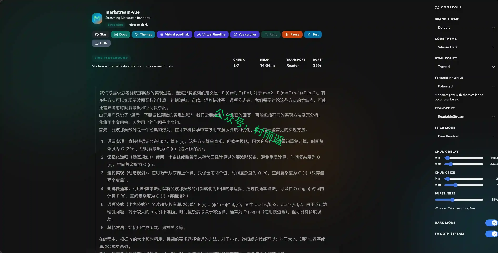

### 2. [BentoPDF](https://github.com/goodtab/bentopdf)

专为隐私打造的 PDF 工具箱，提供最全面的 PDF 工具，尊重隐私，且永不收费。

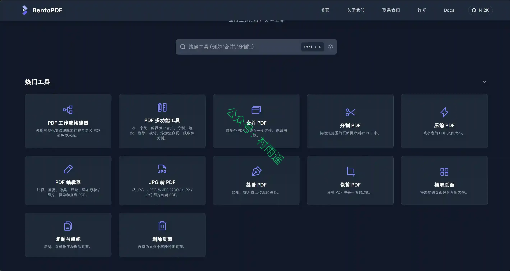

### 3. [fireworks-tech-graph](https://github.com/yizhiyanhua-ai/fireworks-tech-graph)

一份可由 Codex 和 Claude Code 共用的 Agent Skill。它将自然语言描述转化为经过几何校验的 SVG、高分辨率 PNG、经过媒体探测验证的 SVG 转 GIF 语义动效与离线交互 HTML。聚焦后的动效链路只接收生成器产出的语义 SVG，只输出一个紧凑、可验证的 GIF。项目内置 11 种生成器风格 + 1 种 AI 手绘风格（Dark Luxury）；新增的四种工程风格分别为 C4 评审、云部署、事件流和可靠性排查提供可执行语义契约，同时保留 AI/Agent Pattern 与全部 14 种 UML 图类型。

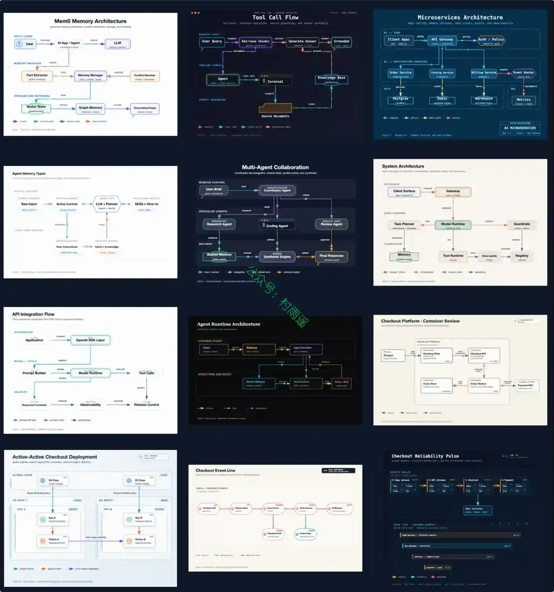

## 二、软件

### 1. [KA Music](https://github.com/Linsxyx/KugouMusic.NET)

最好用、最轻量的酷狗音乐概念版播放器，登录自动领取 VIP。项目基于 .NET 10 + Avalonia 打造，尽量提供一致的全平台桌面体验，而不是浏览器套壳式客户端。因为作者长期使用 Arch Linux 和 Windows 双系统，而 Linux 上又缺少一款体验完整的酷狗音乐播放器，这个项目就这样诞生了。

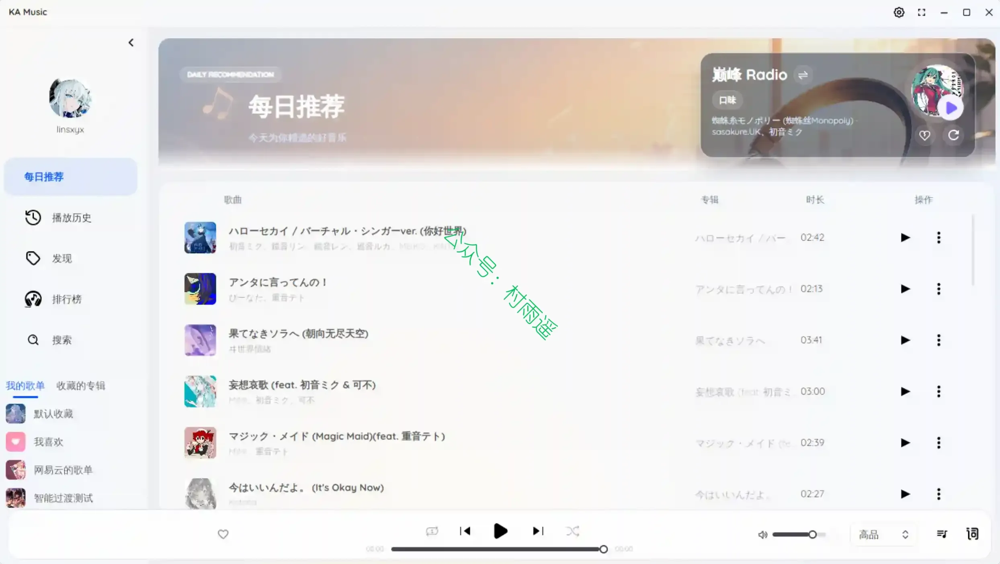

### 2. [Lockbook](https://github.com/lockbook/lockbook)

一款完全开源的加密工具，可集中管理笔记、草图与各类文件，支持跨端同步、离线使用、便捷分享，文件加密后官方也无法查看内容。

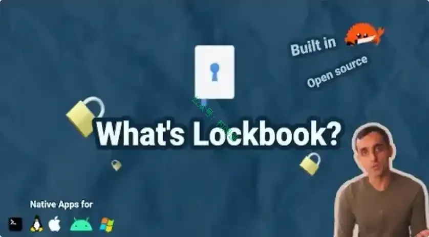

### 3. [Skills Manager](https://github.com/jiweiyeah/Skills-Manager)

一款用于管理 AI 编程助手技能（Skills）的统一桌面应用。 无缝组织、同步和共享 Claude Code、Codex、Opencode 及其他 AI 工具的技能。

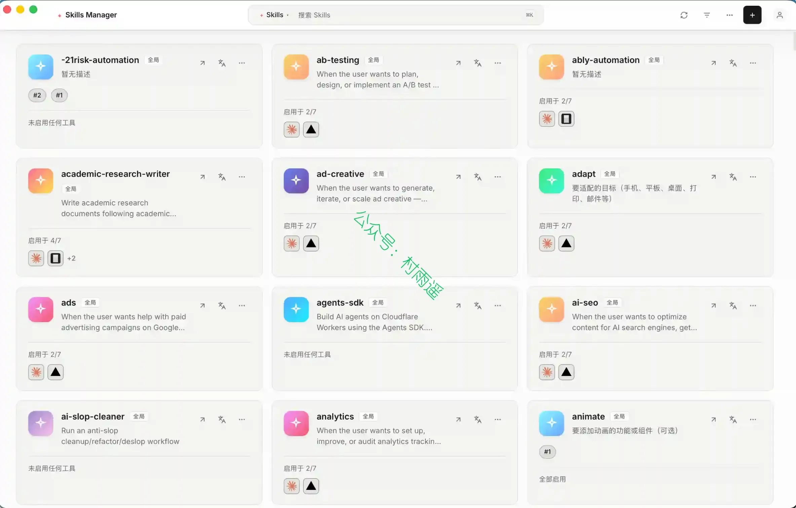

## 三、网站

### 1. [MarkFlow](https://markdowntoword.pro)

在线 Markdown 转 Word — 免费 MD 转 DOCX 转换器
即时将 Markdown 文件转换为 Word 文档，完整支持 GFM 语法。表格、LaTeX 数学公式、Mermaid 图表、代码高亮一键保留，无需注册。

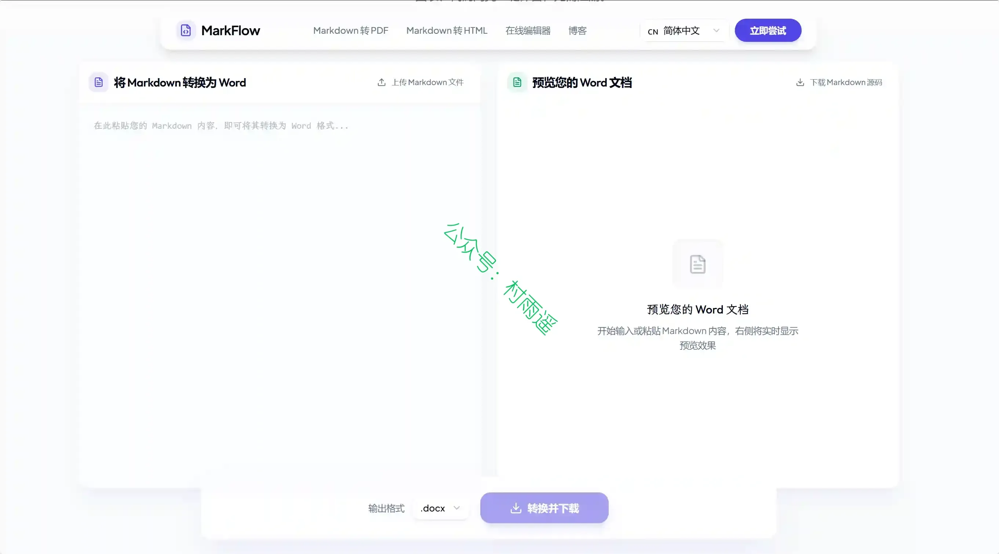

### 2. [电影上映雷达](https://moviereleaseradar.com)

网站提供按月展示的电影上映时间表，覆盖全球数十个国家和地区，可以根据地区、类型以及内容分级来筛选电影。

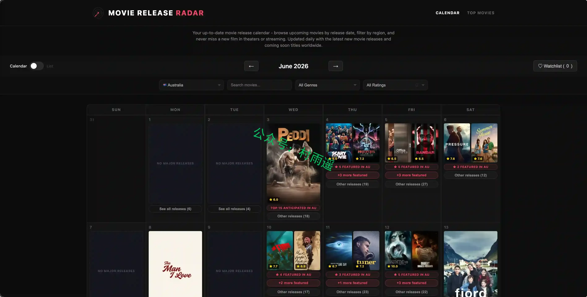

### 3. [中国卷烟博物馆](https://www.ciggies.app)

一个香烟图鉴收藏类网站，仅收录展示国内外各类香烟图文参数。

## 四、插件

### 1. [微信读书评论插件](https://chromewebstore.google.com/detail/kfjimgaoegibikoojcbnkbffkongnoep?utm_source=item-share-cb)

一个让网页微信读书页面显示评论的插件，了解他人的见解，解答阅读中的困惑, 不做一个孤独的阅读者。

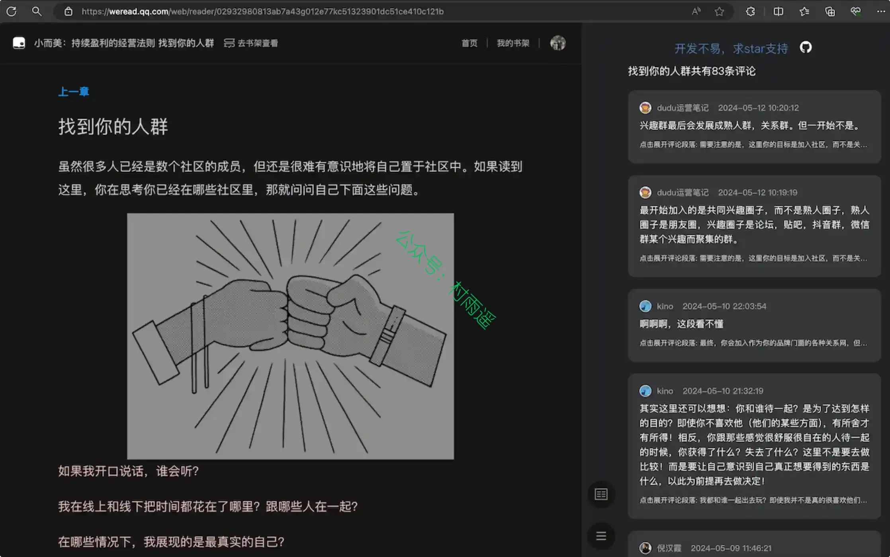

### 2. [拷贝猫](https://chromewebstore.google.com/detail/jdjbiojkklnaeoanimopafmnmhldejbg?utm_source=item-share-cb)

为网页提供前所未有的强大复制功能。此扩展创建了一个右键菜单，提供增强的复制功能。可以复制链接为 Markdown、HTML、选中内容为纯文本、复制图片为 Markdown 等功能。

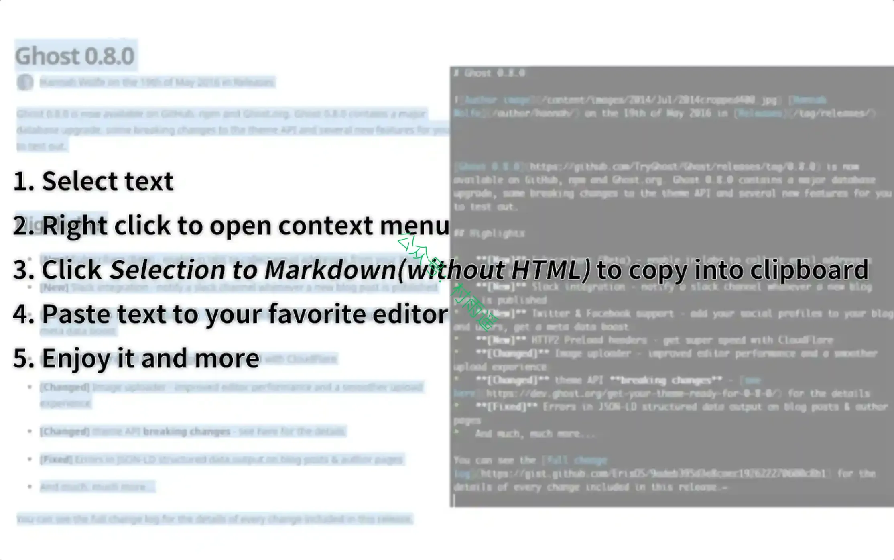

### 3. [Link Map](https://chromewebstore.google.com/detail/link-map/jappgmhllahigjolfpgbjdfhciabdnde)

适配 Chrome/Edge 的树形侧边栏标签管理插件，可分层收纳、暂存网页释放内存，本地存储数据，还能导入 Tabs Outliner 内容，适合批量整理大量网页标签。

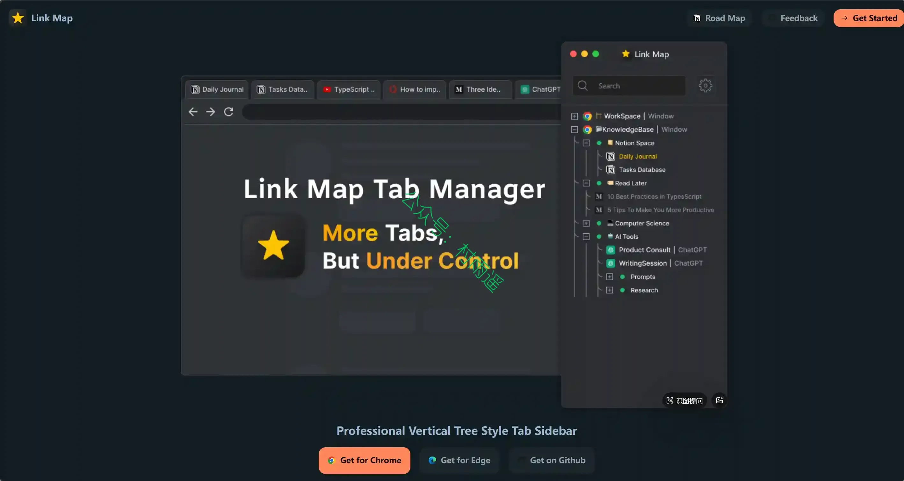

## 五、资料

### 1. [存储技术书](https://github.com/Lularible/storage-book)

开源中文技术书，一本从结绳记事到 Flash 物理、从文件系统理论到动手实现的存储技术书。

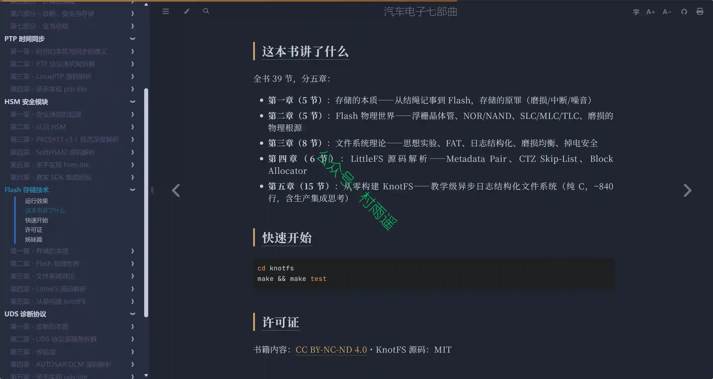

### 2. [Claude Code 保姆级教程：从入门到进阶](https://www.yuque.com/juennn/tnmoif/lmdlencynbqvq9vt)

一份从 0 基础开始的 Claude Code 系统教程。从安装讲起，接入第三方厂商模型绕过区域限制，逐一拆解权限系统、Tools 工具、Hooks 钩子、Skills 技能、Plugins 插件、Subagent 子智能体以及自动化任务这些核心功能，最后把它们综合起来，一起做一个真正可用的网页 AI App。

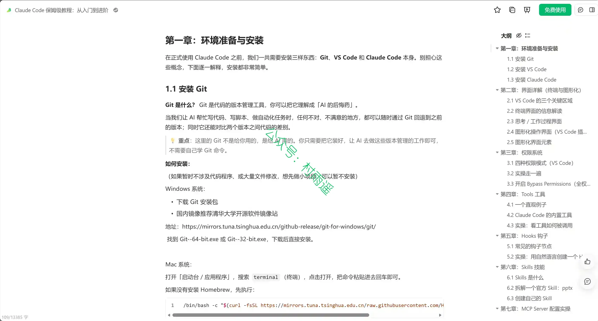

### 3. [《深入理解 AI Agent：设计原理与工程实践》](https://github.com/bojieli/ai-agent-book)

Agent = LLM + 上下文 + 工具——本书围绕这个核心公式，用 10 章把 AI Agent 从原理讲到工程实战。全书正文、配图、92 个配套实验全部开源。

## ✍️ 说明

周刊专栏相关信息：

- **项目地址**：[Github](https://github.com/cunyu1943/weekly)，觉得不错麻烦给我一个**Star**，感谢 ❤️
- **浏览地址**：公众号 | [电子书](https://cunyu1943.github.io/weekly) | [语雀](https://yuque.com/cunyu1943/weekly) | [ima 知识库](https://ima.qq.com/wiki/?shareId=860487e32c6cc8d6c9070cd7f00caedf3cbf4102f695862d9c82f463b92417af)

如果你阅读到这里，说明我的工作没有白费。如果你想推荐项目/网站/软件/资源，欢迎提交 **[issue](https://github.com/cunyu1943/weekly/issues)** 或者添加我 **个人微信：coder_cunYu** 与我交流。

---

## ⏳ 联系

想解锁更多知识？不妨关注我的微信公众号：**村雨遥（id：JavaPark）**。

扫一扫，探索另一个全新的世界。

