# 好物周刊#165：本周挖到的 15 个宝藏，从 AI 笔记到强化学习

> 作者：[村雨遥](https://github.com/cunyu1943)
> 
> 不要哀求，学会争取，若是如此，终有所获
> 
> 原文：https://mp.weixin.qq.com/s/c3wrLHLpa-5vPDGeNsARSQ

## 🎈 号外 

最近，公众号之外，建立了微信交流群，不定期会在群里分享各种资源（影视、IT 编程、考试提升……）&知识。如果有需要，可以**扫码或者后台添加小编微信备注入群**。进群后**优先看群公告**，**呼叫群中【资源分享小助手】**，还能免费帮找资源哦～

## 一、项目

### 1. [EdgeEver](https://github.com/tianma-if/edgeever)

一个开源、自托管、Cloudflare-native 的现代笔记工作区。它保留经典印象笔记的三栏体验，同时提供清晰的数据模型、REST API、OpenAPI schema 和 MCP endpoint，原生支持 AI Agent 接入。

### 2. [Open File Viewer](https://github.com/xushanpei/open-file-viewer)

一个面向现代 Web 产品的文件预览 SDK。它把 PDF、Office、图片、音视频、压缩包、邮件、图纸、3D、GIS 和代码文件放进同一个可控容器里，并同时支持原生 JavaScript、React、Vue 和 Svelte。

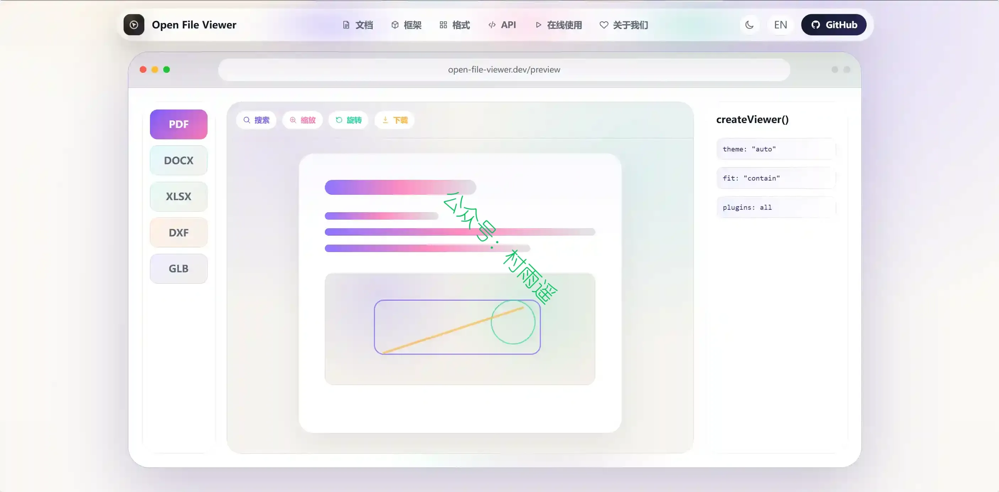

### 3. [录阶](https://github.com/Chozzc/Lujie-Careerkit)

面向实习、校招和职业求职场景，把简历编辑、岗位匹配、投递管理、面试准备、模拟练习和 AI 复盘放在同一个 AI 驱动的求职工作台里。你可以围绕不同岗位维护多份简历版本，根据岗位描述生成更贴合岗位要求的简历表达与专属面试准备资料，记录每一次投递进展，并在面试前后持续沉淀知识、回答、反馈和复盘材料。

## 二、软件

### 1. [OpenNote](https://github.com/The-Flash-7/open-note)

一款拥有长期记忆和自我进化能力的跨平台智能笔记 Agent，内置聪明又贴心的智能 AI 助手 Cici。得益于巧妙的记忆提取-经验总结-自我反省-知识整理-召回反哺的闭环进化架构设计，你的 Cici 会越来越懂你，越用越默契。同时它基于强大的 ReAct 多步推理引擎和丰富的Skill技能，配合在本地运行的开源文本嵌入模型提供 RAG 能力，让 Cici 真正成为你的超级助理——轻松执行多步骤任务、复杂的笔记操作，智能管理整个笔记库，支持自然语言问答、检索、编辑、润色、提取、总结等等，让记录与思考更智能！更多超能力✨，等你来解锁！

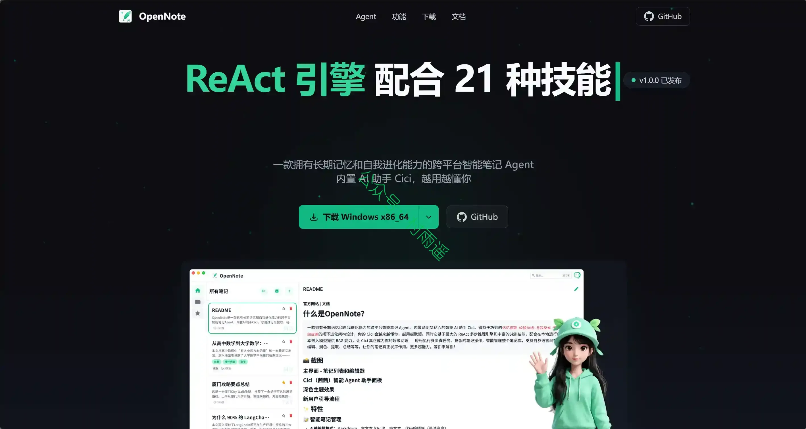

### 2. [观墨](https://github.com/we-used-to-be/Guanmo-open)

一款面向知识工作者的 AI Markdown 编辑器，基于 Tauri 2 构建为轻量桌面应用。它将专业的 Markdown 编辑能力、本地 RAG 知识库、长期记忆系统和 Agent 工具调用整合为一体，让你在写作的同时拥有一个真正「理解」你文档上下文的 AI 助手。

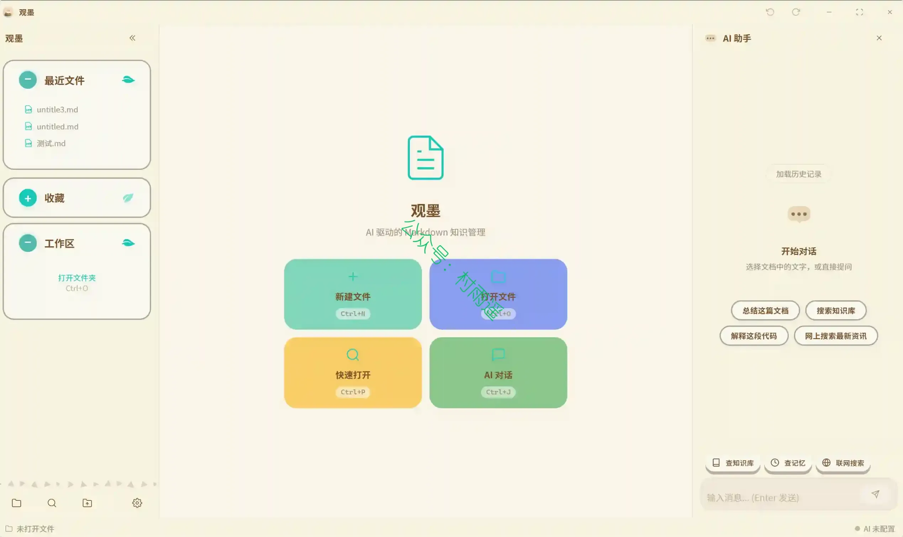

### 3. [Clypra](https://github.com/AIEraDev/Clypra)

一个开源的视频编辑工具，目标是免费复刻 CapCut Pro 的高端功能。

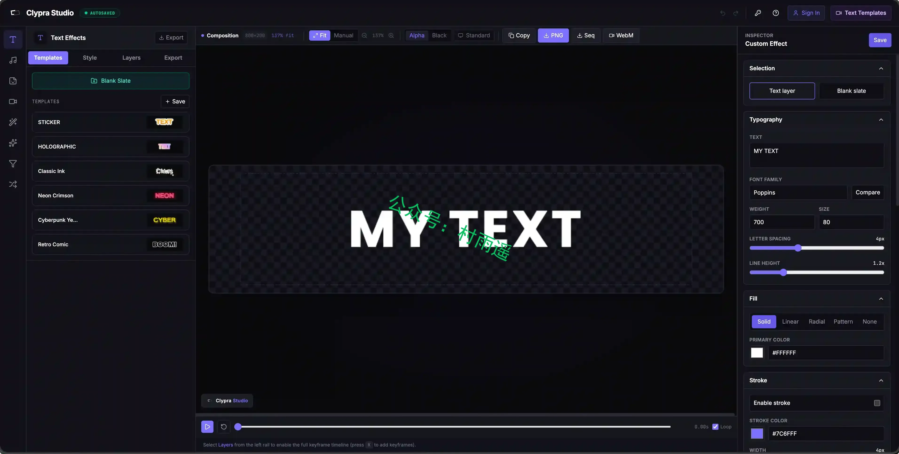

## 三、网站

### 1. [产品派](https://chanpinpai.com)

一个发现和分享优质产品的创意社区。 无论你是热衷探索新奇产品的用户，还是正在打磨产品的独立开发者或创业者，都可以在这里更方便地找到好产品、分享好产品，同时也让自己的作品被更多人看见。

### 2. [VlogLearn](https://www.vloglearn.com)

AI 驱动的英语视频学习平台，通过 375+ 真实英语视频、AI 字幕、闪卡与测验，提供最地道的语言环境，高效提升听说读写能力。

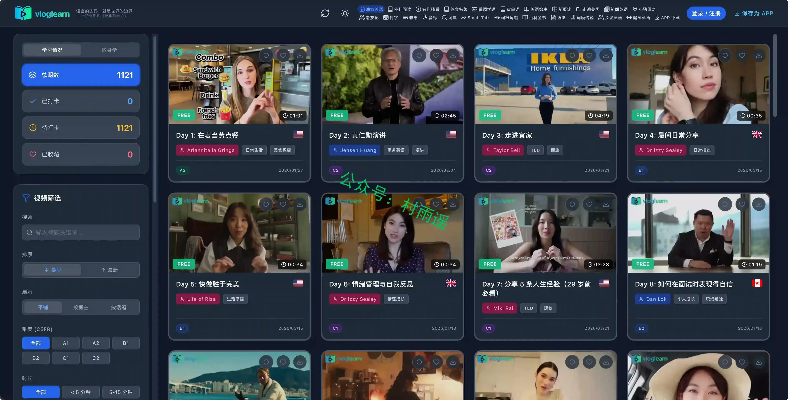

### 3. [奇迹秀](https://www.qijishow.com)

一个公益组织，为设计师提供设计干货及资源，站内所有收集的资源都能免费下载，且资源都经过组织成员测试后再发布，保证资源绿色，大家可放心使用，

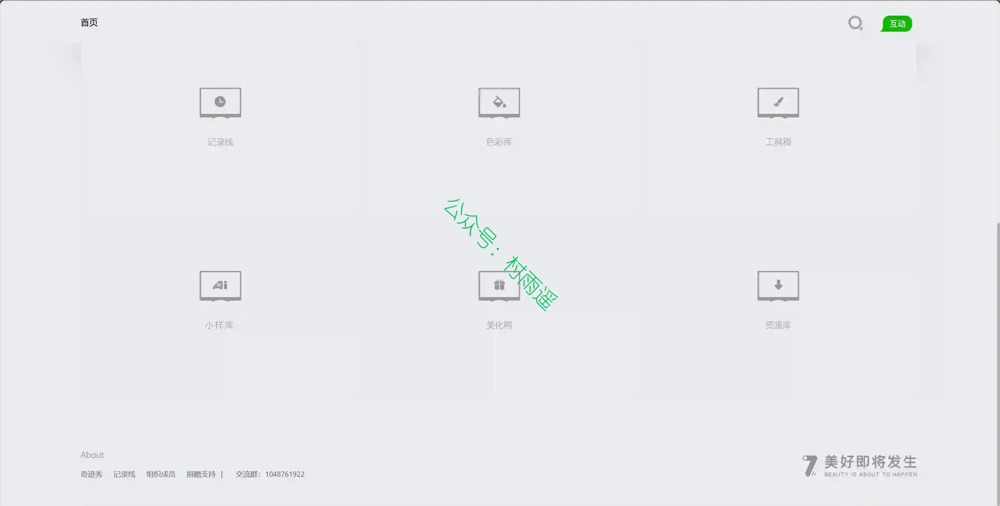

## 四、插件

### 1. [Linkly AI Clipper](https://chromewebstore.google.com/detail/linkly-ai-clipper/akplbgdjkgkakgoemhpjpphfilipdbda)

一款极简的浏览器剪藏插件，它把你看到的网页，转化并下载为对 AI 更友好的 Markdown。

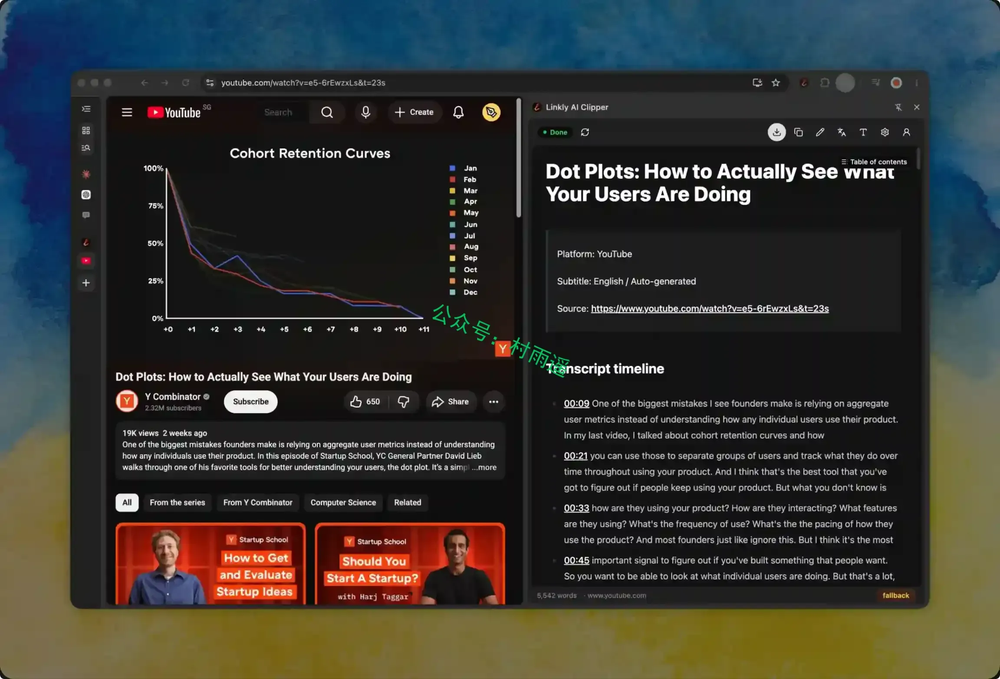

### 2. [Extension Manager](https://chromewebstore.google.com/detail/extension-manager/efajbgpnlnobnkgdcgcnclngeolnmggp)

一个用于浏览器扩展管理的扩展，支持灵活的规则自定义，自动启用或禁用指定的浏览器扩展。批量导出扩展信息，支持分享文本，json，自定义 markdown 格式。

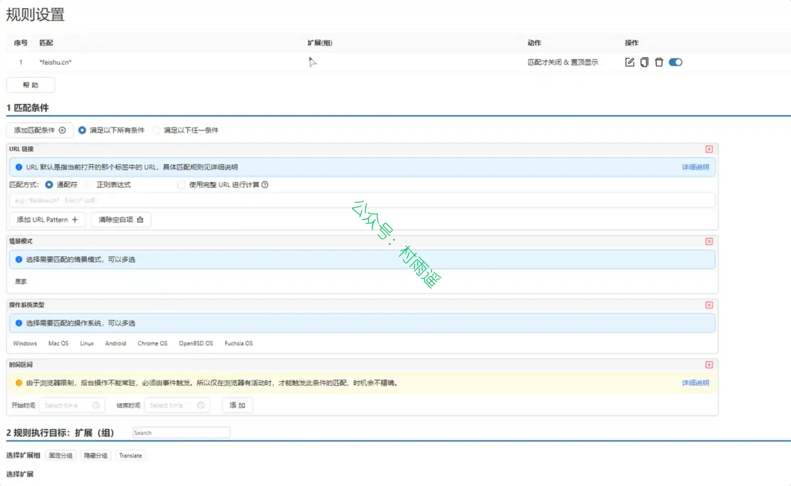

### 3. [CocoCut](https://chromewebstore.google.com/detail/ekhbcipncbkfpkaianbjbcbmfehjflpf)

最佳视频下载器 Chrom e扩展程序，快速轻松地在 Chrome 中下载视频或音频。使用此视频下载器，您可以从成千上万的网站下载任何视频。同时它也是一个 HLS 流媒体下载器。它可以检测 M3U8 文件并下载其中的 TS 文件。所有 HLS 流媒体都将下载并合并为 MP4 格式。

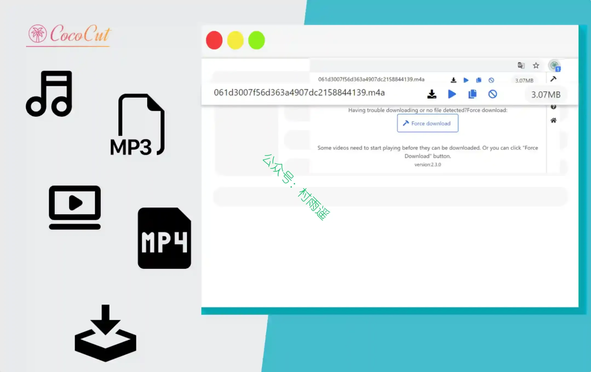

## 五、资料

### 1. [My IELTS™](https://github.com/hefengxian/my-ielts)

雅思备考资料，包含词汇、语法、听说读写最出名的一些内容。

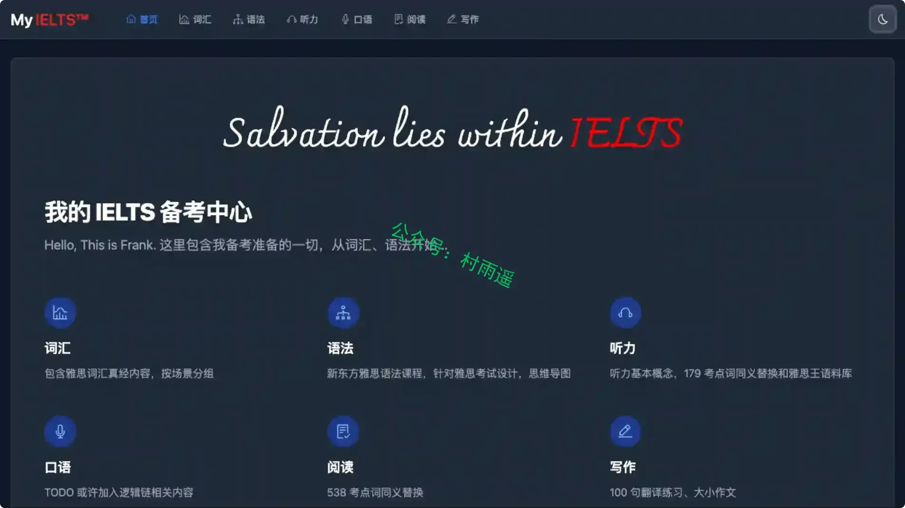

### 2. [ChatGPT 中文指南](https://github.com/EmbraceAGI/awesome-chatgpt-zh)

旨在帮助中文用户了解和使用 ChatGPT 及前沿 AI 技术。项目收集了各种免费和付费的 ChatGPT 资源、高效使用中文与大模型交流的方法、应用开发的相关资源，以及基于大模型能力的生产力工具。项目持续跟进 AI 前沿：从 GPT-5、Claude 4、DeepSeek、Gemini 3 等最新大模型，到 Claude Skills、MCP（模型上下文协议）、AI Agent 智能体开发等当代核心主题，您都能在这里找到丰富的工具、应用与示例。

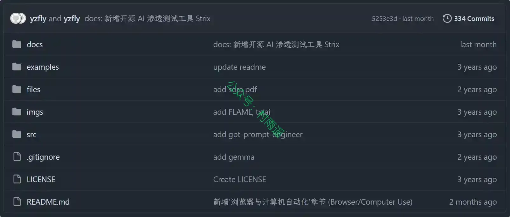

### 3. [《强化学习小书》](https://github.com/alxndrTL/little-book-rl)

这本《强化学习小书》是强化学习简明入门读物，内容从基础理论延伸至各类应用算法。

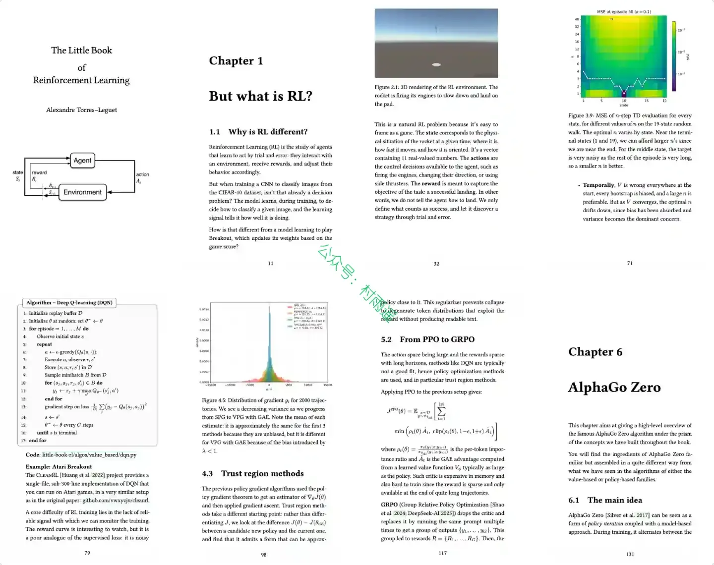

## ✍️ 说明

周刊专栏相关信息：

- **项目地址**：[Github](https://github.com/cunyu1943/weekly)，觉得不错麻烦给我一个**Star**，感谢 ❤️
- **浏览地址**：公众号 | [电子书](https://cunyu1943.github.io/weekly) | [语雀](https://yuque.com/cunyu1943/weekly) | [ima 知识库](https://ima.qq.com/wiki/?shareId=860487e32c6cc8d6c9070cd7f00caedf3cbf4102f695862d9c82f463b92417af)

如果你阅读到这里，说明我的工作没有白费。如果你想推荐项目/网站/软件/资源，欢迎提交 **[issue](https://github.com/cunyu1943/weekly/issues)** 或者添加我 **个人微信：coder_cunYu** 与我交流。

---

