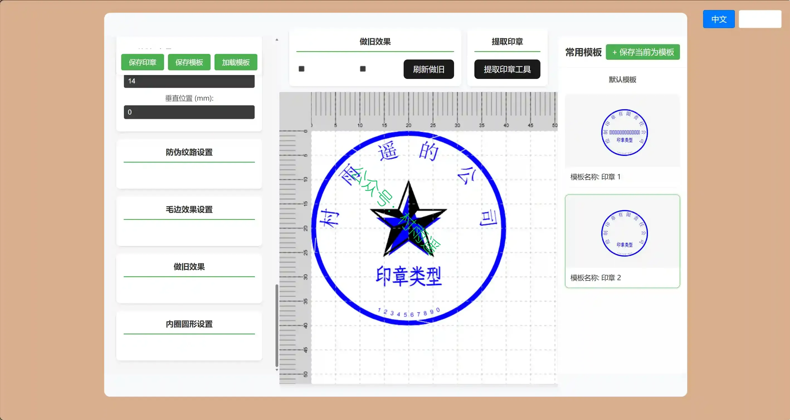
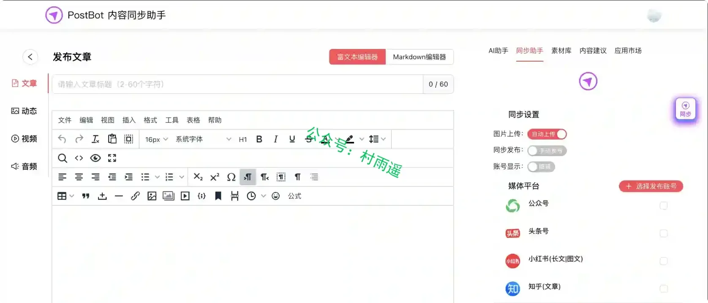
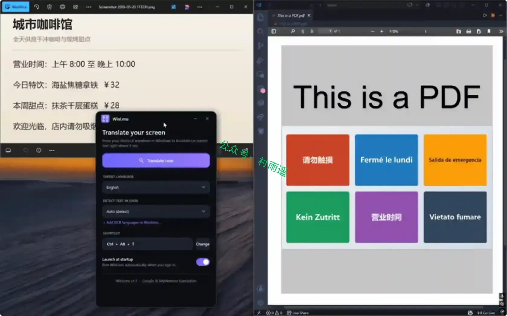
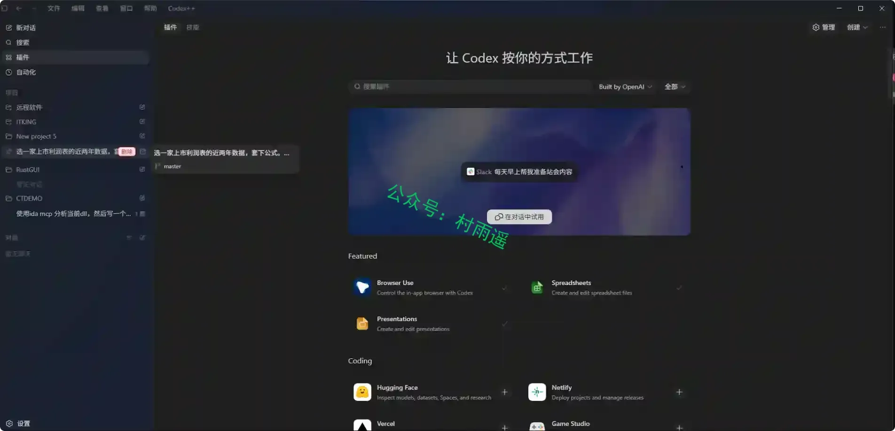
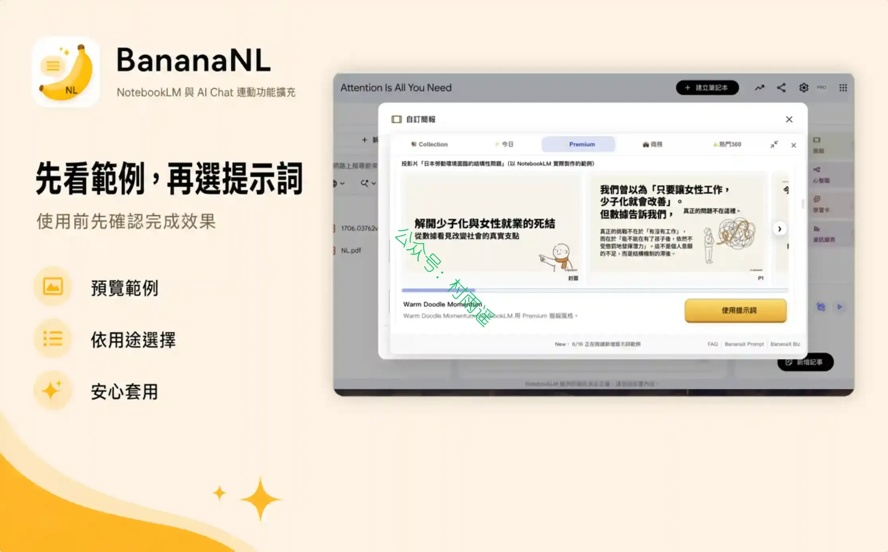
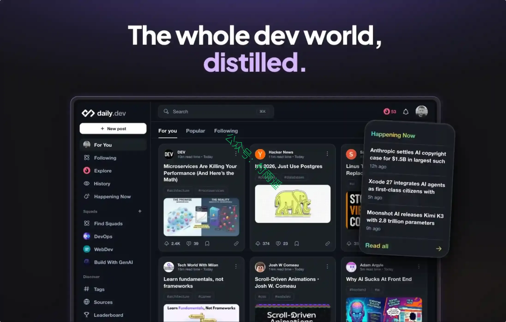
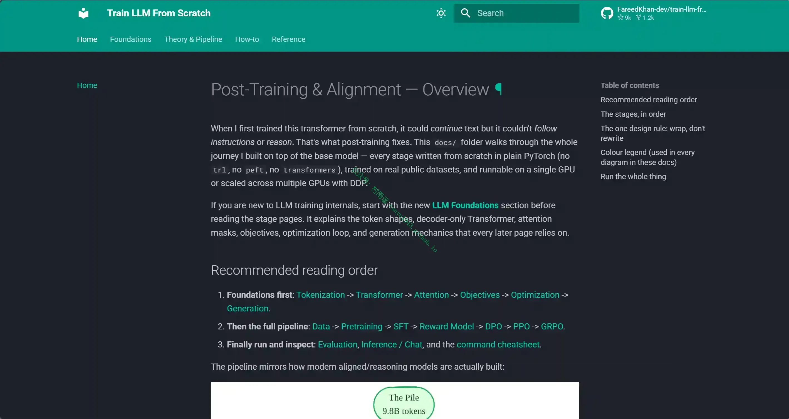
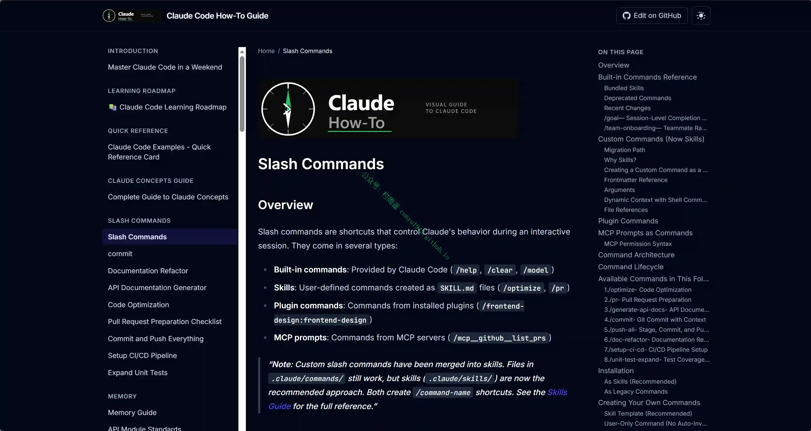
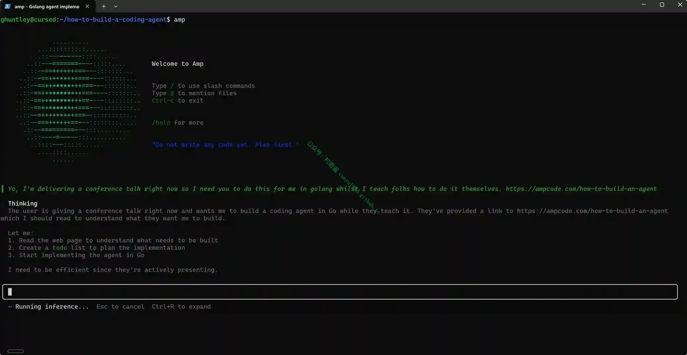

# 好物周刊#166：从电子印章到 AI 编程助手

> 作者：[村雨遥](https://github.com/cunyu1943)
> 
> 不要哀求，学会争取，若是如此，终有所获
> 
> 原文：https://mp.weixin.qq.com/s/1cmNZwNADB_LDdDNteeySQ

## 🎈 号外 

最近，公众号之外，建立了微信交流群，不定期会在群里分享各种资源（影视、IT 编程、考试提升……）&知识。如果有需要，可以**扫码或者后台添加小编微信备注入群**。进群后**优先看群公告**，**呼叫群中【资源分享小助手】**，还能免费帮找资源哦～

## 一、项目

### 1. [DrawStampUtils.js](https://github.com/xxss0903/drawstamputils)

一个使用 TypeScript 制作电子印章的工具。仓库同时包含一个基于 Vue 3 + Vite 的本地示例界面，界面只保留一个基于 StampWorkspace.vue 的编辑器 Demo，用于在浏览器中交互式调整印章配置并导出图片，不再依赖任何后端接口或 Cloudflare Workers。

### 2. [PostBot 内容同步助手](https://github.com/gitcoffee-os/postbot)

一款开源的多平台内容同步分发生产力工具。支持将文章、笔记、动态、图片、视频、音频等内容，一键同步发布至主流媒体平台。

### 3. [Gaia](https://github.com/boommanpro/gaia-workflow-engine)

一个现代化的可视化规则引擎平台，用于编排复杂的 AI 工作流。在无限画布上设计、测试和部署 AI 流程。

## 二、软件

### 1. [Kun](https://github.com/KunAgent/Kun)

探索需求先行的下一代 coding 范式。
用 DeepSeek、Xiaomi MiMo、MiniMax 的高性价比组合，把需求澄清、设计稿、计划和 Agent 编码串成完整闭环。

### 2. [WinLens](https://github.com/marco-beltrame/WinLens)

翻译屏幕上任何无法选中或复制的文字。 比如游戏、图片、PDF、外语软件等。只需按下快捷键，即可让译文在原位置显示。

### 3. [Codex++](https://github.com/BigPizzaV3/CodexPlusPlus)

一个 CodexApp 的增强工具，努力让 Codex 变得更好用更舒服。

## 三、网站

### 1. [EZ 在线工具箱](https://ezwebtools.net)

新一代网页版视频处理解决方案，一键解析、转换、播放，免下载的极速视频处理体验，无需下载，轻松快捷！

### 2. [localhost](https://localhost.cc/invite/sgxvj)

为开发者、学生和创作者提供免费的二级域名。一键认领专属子域名，自助管理 DNS 解析（A/AAAA/CNAME/TXT），全球任播网络加速，永久免费续费。

### 3. [小羿 - 专注收录各种优秀软件！](https://xiaoyi.vc)

最新最全软件资讯，收录新出品软件（安卓、Windows、macOS、Linux、AI、鸿蒙），分享、推荐优秀软件、常用软件等，提倡自由，开源的软件。目标是成为一种生活态度，不拘泥于形式，在持有质量和原则之下，怀着一颗纯真的感恩的心过活。

## 四、插件

### 1. [BananaNL](https://chromewebstore.google.com/detail/mjennffndagebhgcbeblffhgooohling)

帮助你在 NotebookLM、ChatGPT、Gemini、Grok 中快速插入用于图片生成、图解和信息图的提示词。

### 2. [Headerly](https://chromewebstore.google.com/detail/headerly/lmlapacaojgifapgjkbdkmaclkgcbhng)

轻松管理和自定义 HTTP 请求与响应标头，快速设置、追加或移除标头。

### 3. [daily.dev](https://chromewebstore.google.com/detail/jlmpjdjjbgclbocgajdjefcidcncaied)

基于个人技术栈的个性化开发者资讯，每次打开新标签页即可浏览。内容精选自 2000+ 个优质技术博客和发布源，涵盖 GitHub Blog、Hacker News、Dev.to、freeCodeCamp 等众多站点。

## 五、资料

### 1. [Train LLM From Scratch](https://github.com/FareedKhan-dev/train-llm-from-scratch)

一份纯 PyTorch 从零搭建大模型的完整教学文档，不依赖 Hugging Face 封装库，完整覆盖预训练、SFT、奖励模型、DPO/PPO/GRPO 对齐、评测与推理全链路，支持单 / 多 GPU 复现可推理对齐 LLM。

### 2. [用一个周末掌握 Claude Code](https://github.com/luongnv89/claude-howto)

覆盖 Claude Code 全部斜杠命令的完整参考文档，详解内置/插件/MCP/自定义技能四类指令、版本变更、自定义命令编写方法、实操模板与排错方案，一站式教会开发者高效使用和拓展 Claude 快捷指令。

### 3. [从零实现 AI 编程助手的实战教程](https://github.com/ghuntley/how-to-build-a-coding-agent)

一套 Go 语言实战工作坊教程，基于 Claude API 分 6 个版本循序渐进教开发者从零搭建具备文件读写、终端执行、代码检索等工具调用能力的本地 AI 编程智能体。

## ✍️ 说明

周刊专栏相关信息：

- **项目地址**：[Github](https://github.com/cunyu1943/weekly)，觉得不错麻烦给我一个**Star**，感谢 ❤️
- **浏览地址**：公众号 | [电子书](https://cunyu1943.github.io/weekly) | [语雀](https://yuque.com/cunyu1943/weekly) | [ima 知识库](https://ima.qq.com/wiki/?shareId=860487e32c6cc8d6c9070cd7f00caedf3cbf4102f695862d9c82f463b92417af)

如果你阅读到这里，说明我的工作没有白费。如果你想推荐项目/网站/软件/资源，欢迎提交 **[issue](https://github.com/cunyu1943/weekly/issues)** 或者添加我 **个人微信：coder_cunYu** 与我交流。

---

