# 好物周刊#138：证件盾

> 作者：[村雨遥](https://github.com/cunyu1943)
> 
> 不要哀求，学会争取，若是如此，终有所获
> 
> 原文：https://mp.weixin.qq.com/s/CO-uYJX6UrpmdD0iUELrsQ

## 🎈 号外 

最近，公众号之外，建立了微信交流群，不定期会在群里分享各种资源（影视、IT 编程、考试提升……）&知识。如果有需要，可以**扫码或者后台添加小编微信备注入群**。进群后**优先看群公告**，**呼叫群中【资源分享小助手】**，还能免费帮找资源哦～

## 一、项目

### 1. [ThisCover](https://github.com/weizwz/cover)

一个免费、漂亮的封面生成器。使用 next.js v15 + react v19 + shadcn/ui + tailwindcss v4 + lucide icons 搭建。

### 2. [岛屿编辑器](https://github.com/isboyjc/isle-editor)

一款开源 Web 编辑器，支持富文本、块、markdown 编辑，高效且开箱即用，基于 prosemirror 和 tiptap。

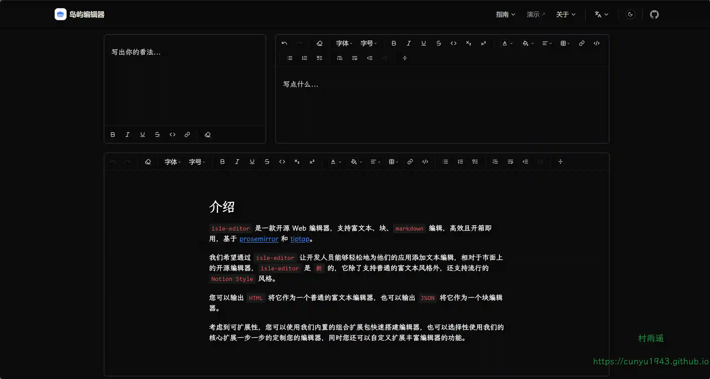

### 3. [MTranServer](https://github.com/xxnuo/MTranServer)

一个超低资源消耗速度超快的离线翻译模型服务器，无需显卡。单个请求平均响应时间 50 毫秒。支持全世界主要语言的翻译。

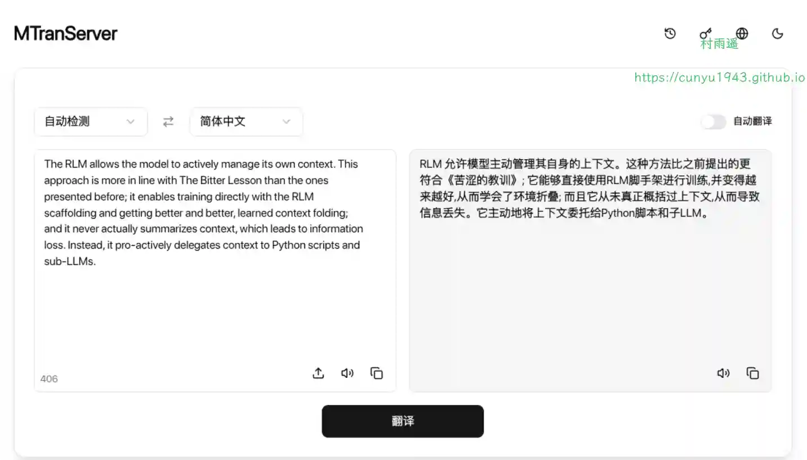

## 二、软件

### 1. [智能 Host 测速工具](https://github.com/KenDvD/SmartHostsTool-github)

一款帮你优化网络访问的实用工具。它能自动获取域名的多个 IP 地址，测试各 IP 延迟并排序，一键将最优 IP 写入系统 Hosts 文件，还支持 GitHub 专属 IP 获取、自定义域名管理和可视化操作界面，让你轻松解决网络访问慢的问题。

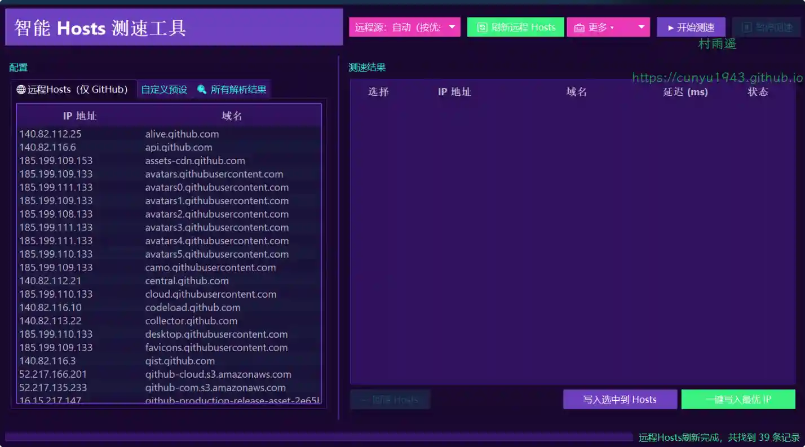

### 2. [WezTerm](https://github.com/wezterm/wezterm)

一款强大的跨平台终端工具，由 Rust 实现，支持 GPU 加速。

### 3. [MagicView](https://pic.ghxi.com)

果核剥壳团队开发的一款专注于高性能和简洁体验的图片查看器，无广告，不骚扰，看图体验更顺畅。

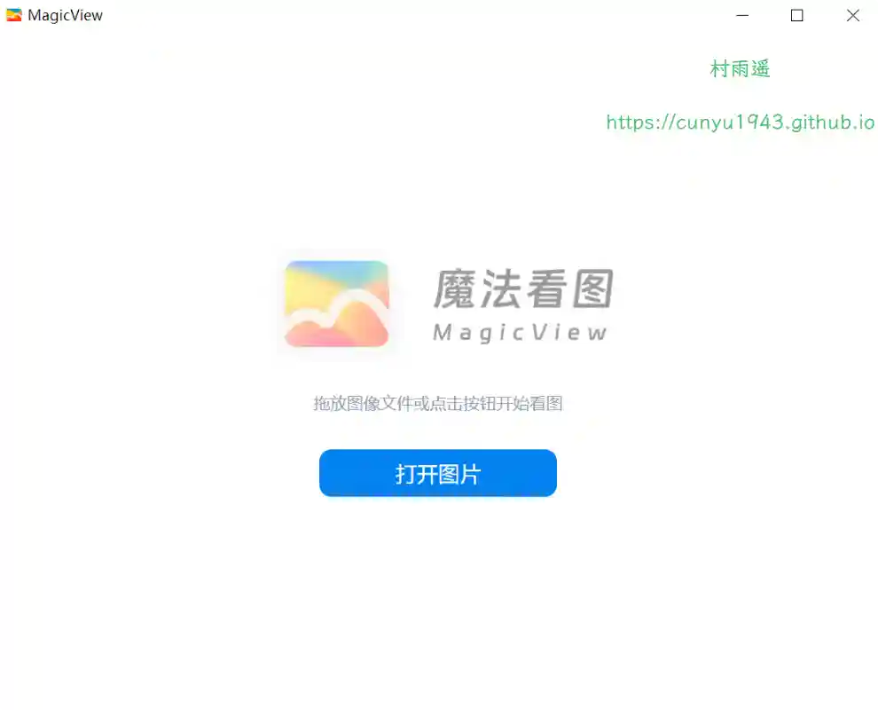

## 三、网站

### 1. [证件盾](https://localscan.leavesc.cn)

一款免费的本地身份证扫描工具，100% 本地处理无需上传，支持身份证双面合成打印、水印添加、PDF/PNG 导出。不用 PS 即可制作标准身份证扫描件，求职、办证必备！安全、精准、高效。

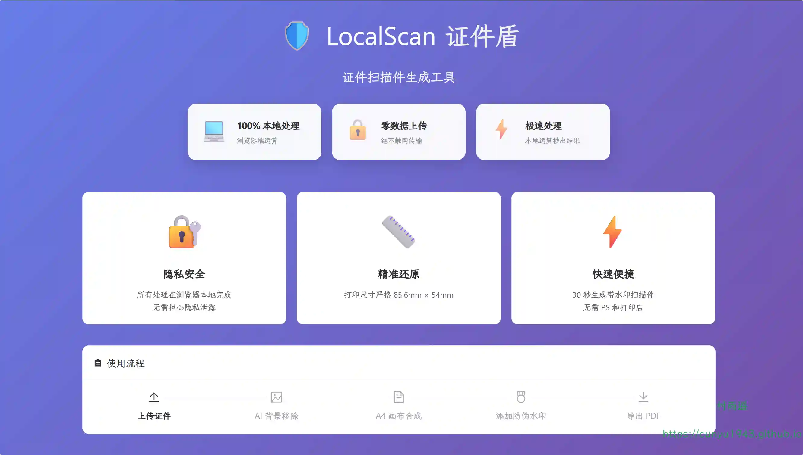

### 2. [i 导航解析器](https://www.idaohang123.com)

一个免费的视频解析网站，支持下载解析抖音，快手，B 站(哔哩哔哩)，油管(YouTube)等上百个平台的视频，并自动去除视频水印。

### 3. [在线 HTTP 请求](https://www.httprequest.net)

免费 API 测试工具，即时在线测试 HTTP 请求。通过自定义请求头、参数和身份验证发送 GET、POST、PUT、DELETE 请求。无需安装或注册。

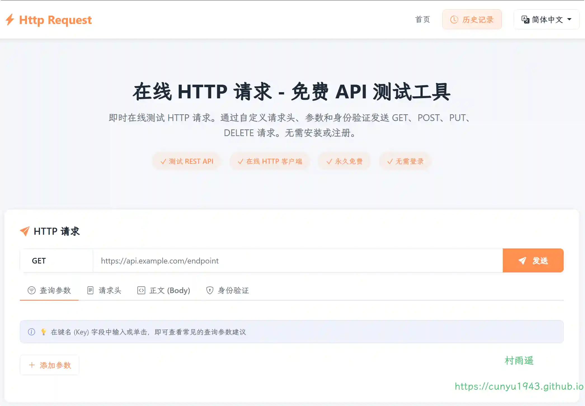

## 四、插件

### 1. [搜款助手](https://chromewebstore.google.com/detail/ekpdlaocahddpljdjpfefgpkpbbdpchl?utm_source=item-share-cb)

一款专业的图片搜同款货源工具，专为电商卖家、代购、采购人员等需要快速找货的用户设计。通过上传图片或区域截图，您可以快速找到同款商品和货源，大大提高找货效率。

### 2. [Markdown Viewer](https://chromewebstore.google.com/detail/markdown-viewer/jekhhoflgcfoikceikgeenibinpojaoi)

帮助用户将 Markdown 文档一键导出为高质量 Word 文件，可转换流程图、图表、公式、信息图、代码等格式，全面提升效率。

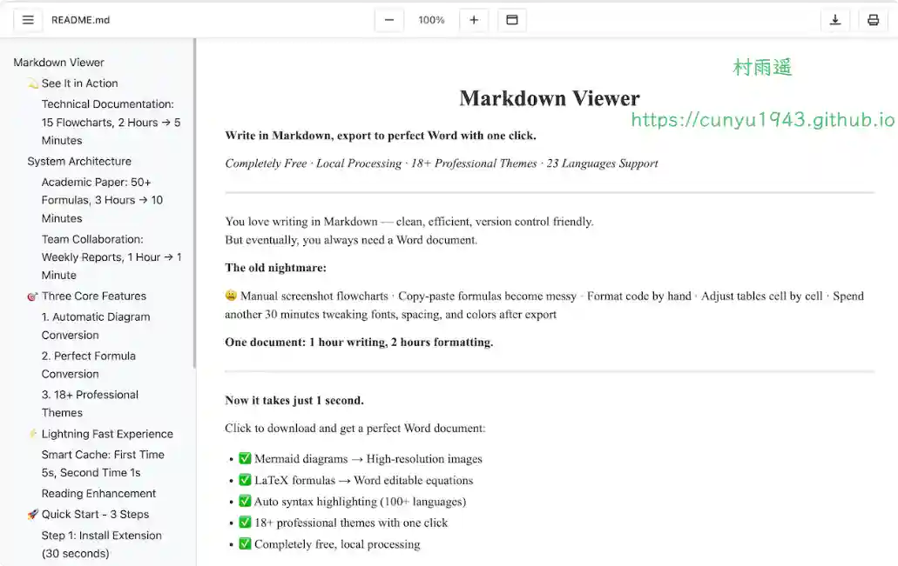

### 3. [PageTalk](https://chromewebstore.google.com/detail/pagetalk-your-browser-qa/pjmpcpolpfejiacaemgjnjnknlcfcami?authuser=0&hl=zh-CN)

你的网页 AI 助手，可以选择网页上的任何文本进行翻译阶段。新增多个 AI 提供商的支持，可以自定义添加和管理来自不同平台的模型。

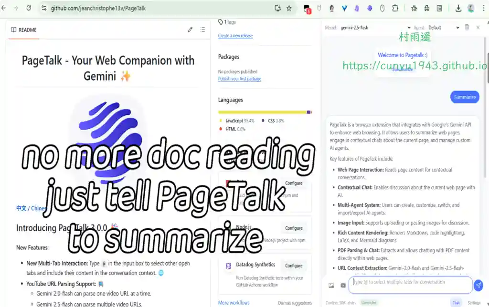

## 五、资料

### 1. [Introduction to Bash Scripting](https://github.com/bobbyiliev/introduction-to-bash-scripting)

Bash 脚本入门教程资源库，包含了丰富的示例及实践练习。

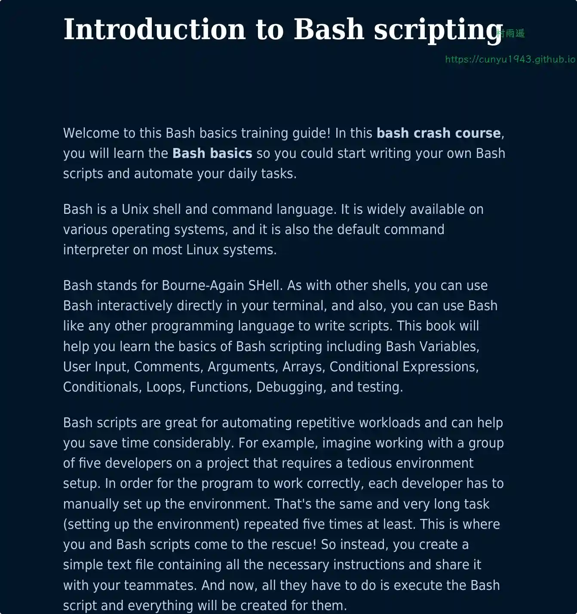

### 2. [华中科技大学研究生课程资料](https://github.com/lyandut/HUST-Invictus)

华中科技大学研究生课程资料分享。

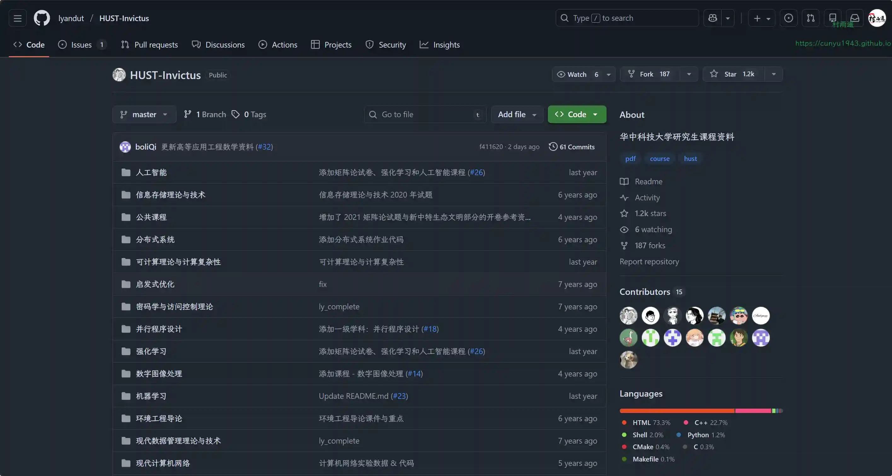

### 3. [EasyOffer](https://github.com/jingtian11/EasyOffer)

一个大模型初学者和秋招准备 er 的开源项目，致力于提供主流大语言模型（LLM）秋招和暑期实习中遇到的手写代码实现以及大模型面经记录，帮助各位同学们深入理解 LLM 底层原理，辅助实习准备。

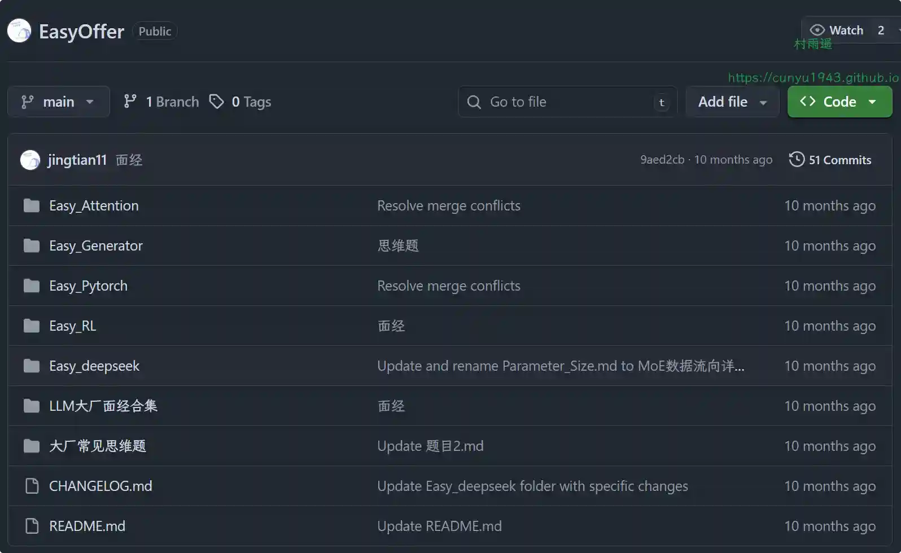

## ✍️ 说明

周刊专栏相关信息：

- **项目地址**：[Github](https://github.com/cunyu1943/weekly)，觉得不错麻烦给我一个**Star**，感谢 ❤️
- **浏览地址**：公众号 | [电子书](https://cunyu1943.github.io/weekly) | [语雀](https://yuque.com/cunyu1943/weekly)

如果你阅读到这里，说明我的工作没有白费。如果你想推荐项目/网站/软件/资源，欢迎提交 **[issue](https://github.com/cunyu1943/weekly/issues)** 或者添加我 **个人微信：coder_cunYu** 与我交流。

---

## ⏳ 联系

想解锁更多知识？不妨关注我的微信公众号：**村雨遥（id：JavaPark）**。

扫一扫，探索另一个全新的世界。

