# 好物周刊#147：字魂

> 作者：[村雨遥](https://github.com/cunyu1943)
> 
> 不要哀求，学会争取，若是如此，终有所获
> 
> 原文：

## 🎈 号外 

最近，公众号之外，建立了微信交流群，不定期会在群里分享各种资源（影视、IT 编程、考试提升……）&知识。如果有需要，可以**扫码或者后台添加小编微信备注入群**。进群后**优先看群公告**，**呼叫群中【资源分享小助手】**，还能免费帮找资源哦～

## 一、项目

### 1. [U-Claw](https://github.com/dongsheng123132/u-claw)

OpenClaw 离线安装 U 盘，插上就能用，双击就安装，专为中国用户打造。

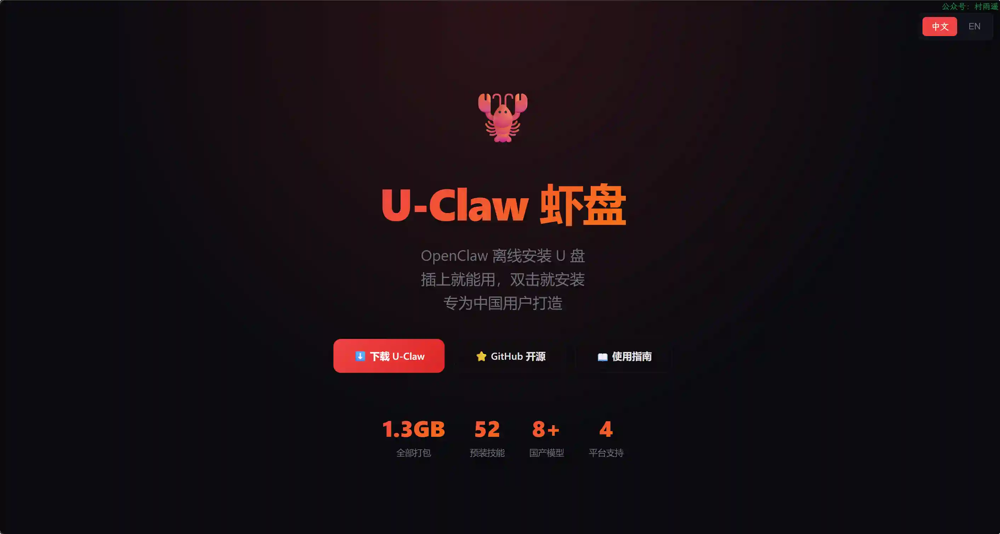

### 2. [oMLX](https://github.com/jundot/omlx)

在 Apple Silicon 上支持文本 LLM、视觉语言模型（VLM）、OCR 模型、嵌入模型和重排序模型。

### 3. [OpeniLink](https://github.com/openilink/openilink-hub)

微信 ClawBot iLink 协议的开源消息管理平台，一行命令安装，零依赖，内置 SQLite 零配置启动。支持 WebSocket、Webhook、AI 自动回复三通道并行。

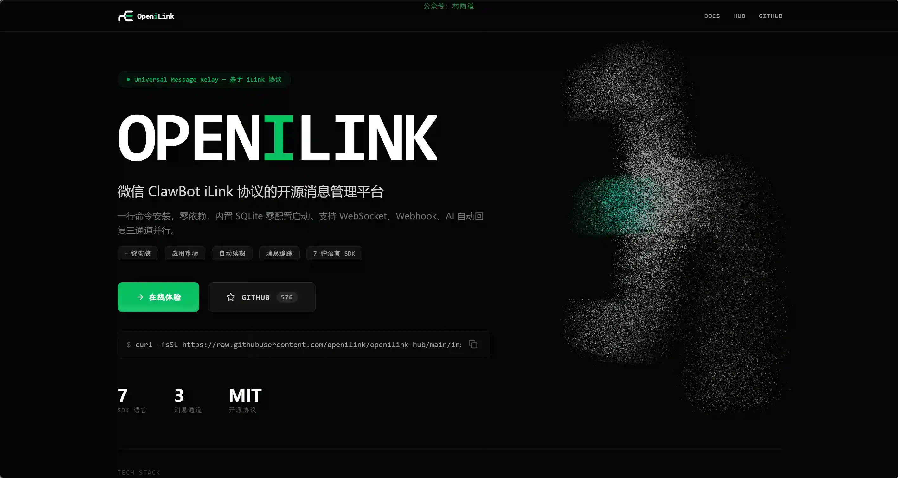

## 二、软件 

### 1. [夸克浏览器](https://www.quark.cn)

为你带来极速、智能、安全、高效的搜索体验。找答案，找资料，找工具，办公，学习，工作必备应用。夸克提供浏览器搜索引擎、网盘、AI 扫描王工具及小说阅读等高效功能，为你提供稳定,安全,流畅的浏览环境和优质的产品服务体验。

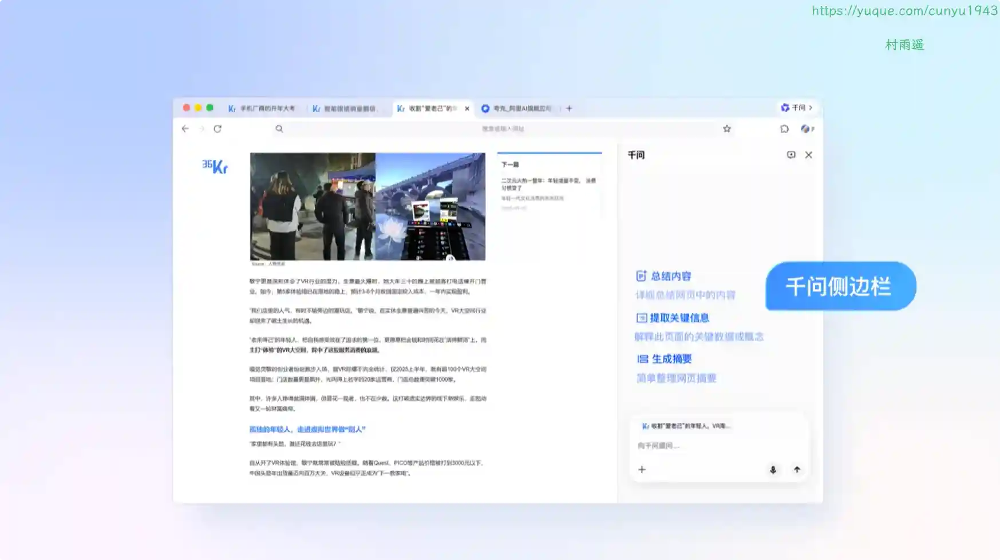

### 2. [iFilesManage](https://ifilesmanage.kesug.com)

一款专为个人和小型团队打造的高效文件管理软件，集文件分类、快速检索、批量操作等核心功能于一体，完美适配 Windows 主流系统。

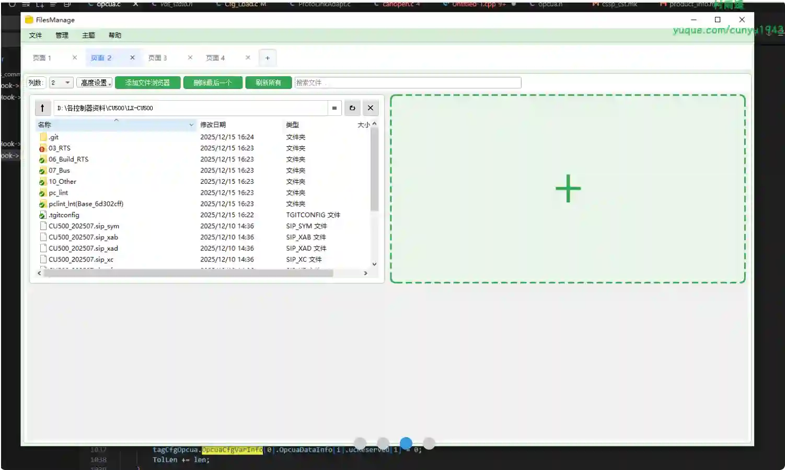

### 3. [Smart Cleaner](https://github.com/lifedever/smart-cleaner)

一款采用 Tauri v2 + Vue 3 + Rust 开发的现代化、轻量级 Mac 目录清理工具。致力于帮助用户快速扫描任意文件夹，根据多种自定义属性过滤并清理庞大的垃圾文件。

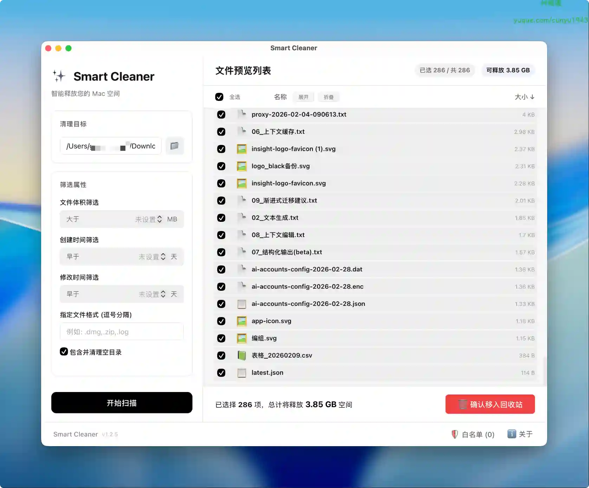

## 三、网站

### 1. [广东全民终身学习平台](https://www.gdlll.cn)

广东全民终身学习平台，终身学习，人人出彩。

### 2. [LiblibAI](https://www.liblib.art/viphome?referralCode=CHaExdtb)

AI 绘画原创模型分享社区，10万+模型免费下载。原汁原味的 webUI、comfyUI，在线 AI 绘图工具免费使用。还可在线进行模型训练。

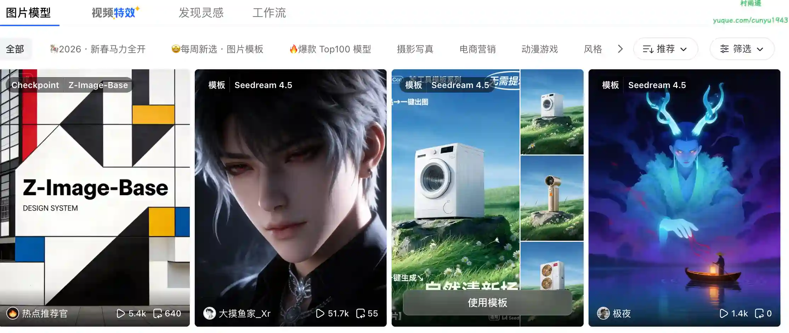

### 3. [字魂](https://izihun.com)

提供商用字体下载授权,字体定制，免费字体下载，字体授权，中文字体设计，字体大全以及在线字体转换器的字体网站，致力于让所有人用得起正版字体。

## 四、插件

### 1. [QuickMark](https://microsoftedge.microsoft.com/addons/detail/quickmark/gnloppekemcadeodkipehppplaipdipm)

一个面向重度书签用户的增强型浏览器书签管理扩展，帮助你更快地保存、整理和找回书签。

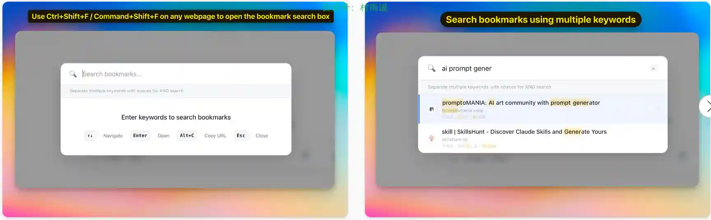

### 2. [Automa](https://chromewebstore.google.com/detail/automa/infppggnoaenmfagbfknfkancpbljcca)

一款低代码 / 无代码的浏览器扩展，用于进行浏览器自动化操作。与手动输入、点击和从网站检索数据相比，Automa 将帮助您自动执行所有这些操作。

### 3. [快捷扩展管理](https://chromewebstore.google.com/detail/pbgjpgbpljobkekbhnnmlikbbfhbhmem?utm_source=item-share-cb)

一个非常简洁明快的扩展管理器，用于快速启用、禁用、卸载扩展程序。

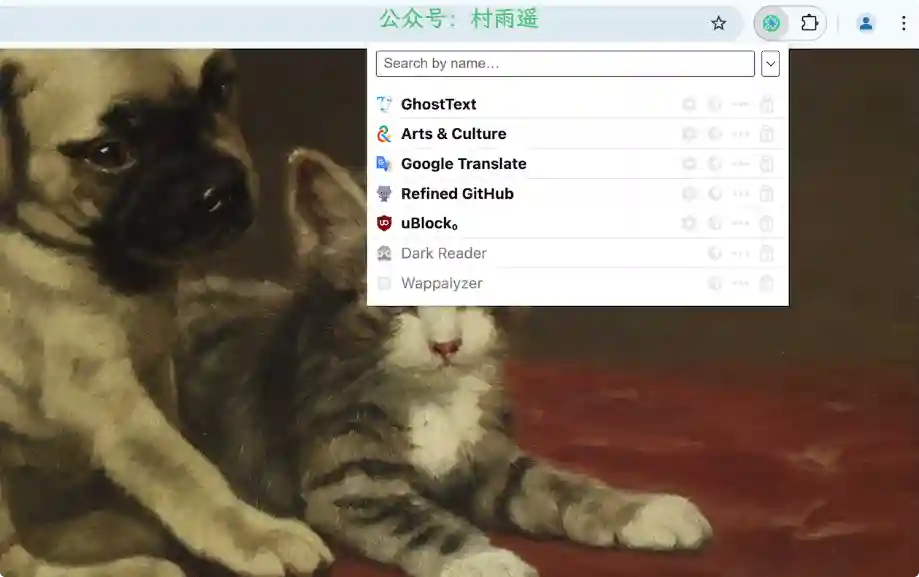

## 五、资料

### 1. [TypeScript 简洁之书](https://github.com/gibbok/typescript-book)

全面而简洁地概述了 TypeScript 的功能。它提供了清晰的解释，涵盖了该语言最新版本中的所有方面，从强大的类型系统到高级功能。无论您是初学者还是经验丰富的开发人员，本书都是增强您对 TypeScript 的理解和熟练程度的宝贵资源。

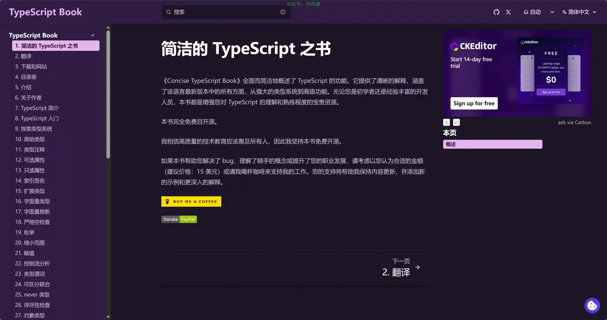

### 2. [Tutorial](https://github.com/zhonghuasheng/Tutorial)

后端 （Java Golang）全栈知识架构体系总结，项目为作者个人学习之总结，内容大多来源网上、书籍、视频。

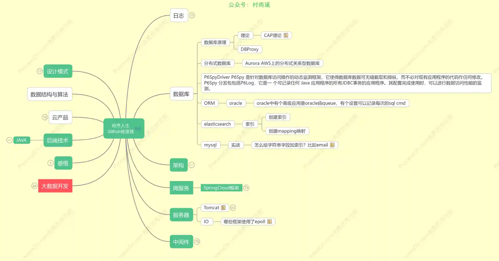

### 3. [Go 入门指南](https://github.com/unknwon/the-way-to-go_ZH_CN)

适合学习 Go 编程语言的爱好者，这里包含了当前最全面的学习资源。本书通过对官方的在线文档、名人博客、书籍、相关文章以及演讲的资料收集和整理，并结合我自身在软件工程、编程语言和数据库开发的授课经验，将这些零碎的知识点组织成系统化的概念和技术分类来进行讲解。

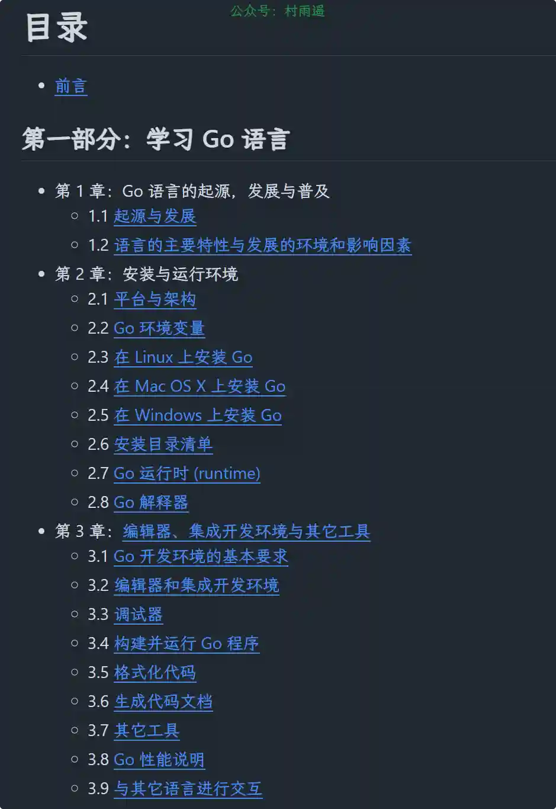

## ✍️ 说明

周刊专栏相关信息：

- **项目地址**：[Github](https://github.com/cunyu1943/weekly)，觉得不错麻烦给我一个**Star**，感谢 ❤️
- **浏览地址**：公众号 | [电子书](https://cunyu1943.github.io/weekly) | [语雀](https://yuque.com/cunyu1943/weekly)  | [ima 知识库](https://ima.qq.com/wiki/?shareId=860487e32c6cc8d6c9070cd7f00caedf3cbf4102f695862d9c82f463b92417af)

如果你阅读到这里，说明我的工作没有白费。如果你想推荐项目/网站/软件/资源，欢迎提交 **[issue](https://github.com/cunyu1943/weekly/issues)** 或者添加我 **个人微信：coder_cunYu** 与我交流。

---

## ⏳ 联系

想解锁更多知识？不妨关注我的微信公众号：**村雨遥（id：JavaPark）**。

扫一扫，探索另一个全新的世界。

