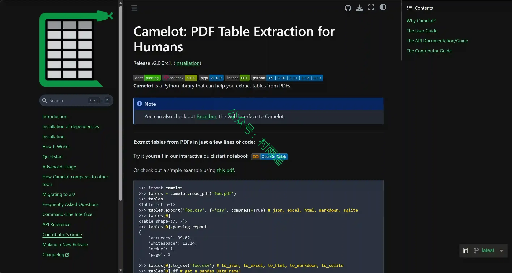
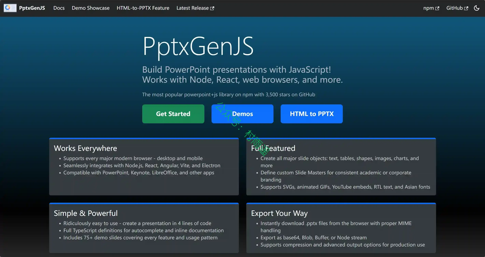
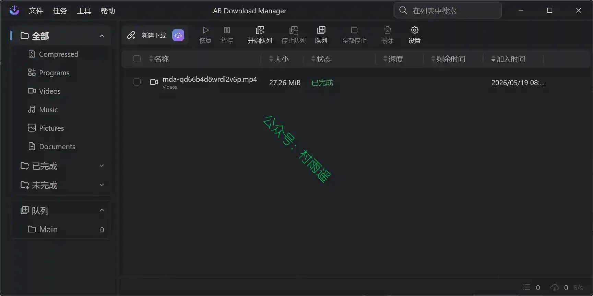
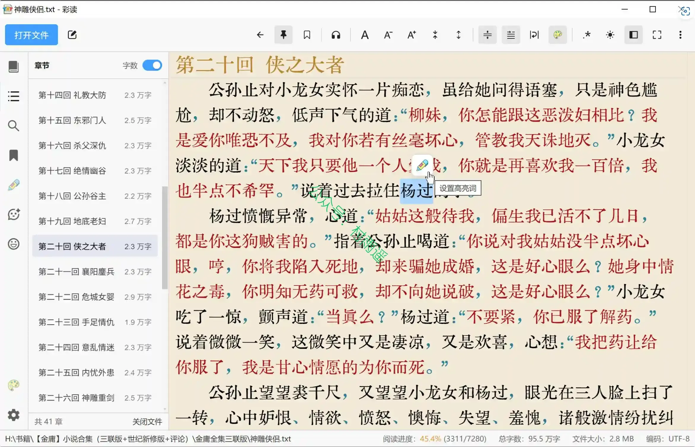
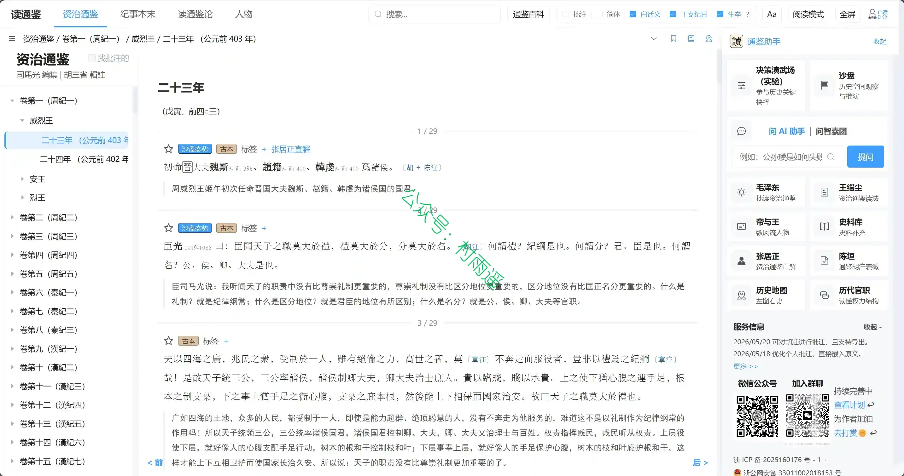
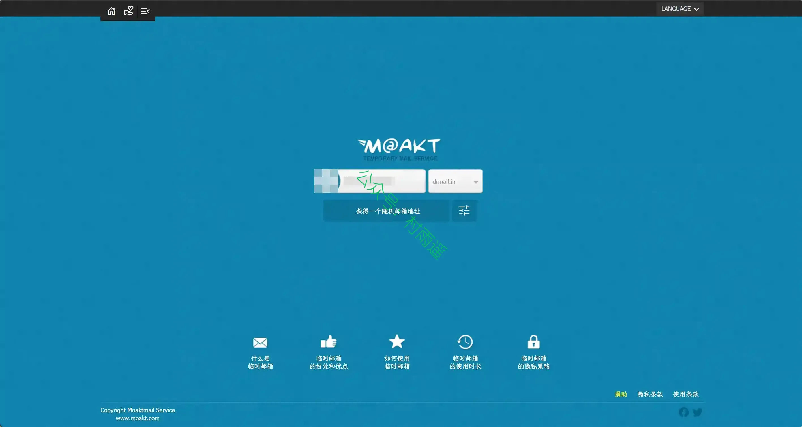
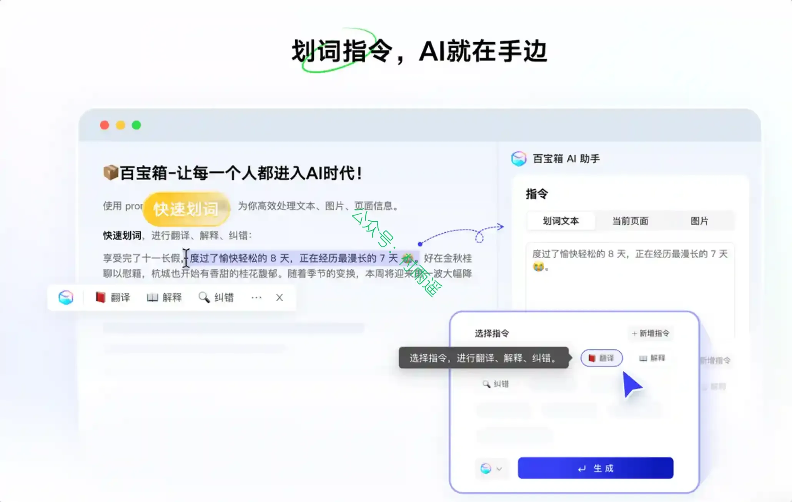
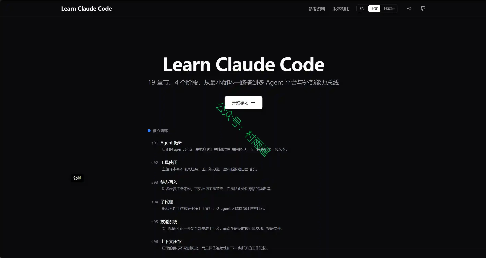

# 好物周刊#156：白嫖开源阅读器！TXT 一键上色 + AI 读小说

> 作者：[村雨遥](https://github.com/cunyu1943)
> 
> 不要哀求，学会争取，若是如此，终有所获
> 
> 原文：https://mp.weixin.qq.com/s/cQOEJl7-n1Xq8Q4Dpf9hyg

## 🎈 号外 

最近，公众号之外，建立了微信交流群，不定期会在群里分享各种资源（影视、IT 编程、考试提升……）&知识。如果有需要，可以**扫码或者后台添加小编微信备注入群**。进群后**优先看群公告**，**呼叫群中【资源分享小助手】**，还能免费帮找资源哦～

## 一、项目

### 1. [票易合](https://github.com/absolutelyZero/piaoyihe)

一款基于 Python + PySide6 开发的跨平台桌面应用程序 (支持 Windows 和 MacOS)，专门用于将多张发票 PDF 文件合并排版成指定格式。软件支持多种布局方式，可满足不同场景下的发票合并需求。

### 2. [Camelot](https://github.com/camelot-dev/camelot)

一款 Python 工具库，可高效从原生 PDF 中精准提取表格并导出为多种常用格式。

### 3. [PptxGenJS](https://github.com/gitbrent/PptxGenJS)

一款纯 JavaScript 开源库，可在浏览器和 Node.js 中无需 Office 软件就能快速生成、编辑标准 PPT 文件。

## 二、软件

### 1. [AB 下载管理器](https://abdownloadmanager.com)

通过与浏览器的无缝集成从任何地方轻松下载文件，享受快速、免费的下载体验。

### 2. [微思应用商店](https://apk.wysteam.cn)

微思应用商店，做全网手表软件最全的应用商店！

### 3. [彩读](https://github.com/ssnangua/ColorTxt)

一款会给内容上色的本地 TXT 小说阅读器，带给你不一样的阅读体验！还有章节识别、空行压缩、行首缩进、语音朗读、AI 阅读助手等功能。

## 三、网站

### 1. [读通鉴](https://www.dutongjian.com)

### 2. [Moakt Mail](https://moakt.com)

一个专业的临时邮箱服务供应商。

### 3. [GitHub Trending 中文精选](https://sj.damo.plus)

每天自动筛选 GitHub Trending，AI 翻译成中文摘要，新项目自动标记。告别信息过载，不再错过优质开源项目。免费订阅，每天早上邮件推送。

## 四、插件

### 1. [百宝箱 AI 助手](https://chromewebstore.google.com/detail/bgiapcpcleefnmmkhaakokfbjnjjjeap?utm_source=item-share-cb)

你的浏览器里无处不在的超级 AI 助手，由多个国内顶尖大模型驱动，是百宝箱平台的浏览器拓展端。

### 2. [Redpal](https://chromewebstore.google.com/detail/hllmgejbjaaomhgpmnepoanfklcibhdf?utm_source=item-share-cb)

小红书笔记下载助手，一键下载笔记正文、所有无水印图片、视频。

### 3. [知了](https://chromewebstore.google.com/detail/djokcnedpgplffmnlfgpkamogfgjdbnm?utm_source=item-share-cb)

知乎回答采集器，可帮助用户快速采集/下载文章,支持图片、代码块和公式等多种类型内容，并保存为 Markdown 纯文本格式，方便快捷。

## 五、资料

### 1. [一起玩 NAS](https://wiki.slarker.me)

适合新手的入门指南，致力于解决使用 NAS 过程中遇到的各种常见问题。

### 2. [LearnPrompt](https://github.com/LearnPrompt/LearnPrompt)

永久免费开源的 AIGC 课程, 目前已支持 Claude Code,Codex,Hermes,OpenClaw,Obsidian,Prompt Engineering,ChatGPT, Midjourney,Runway,Stable Diffusion, AI 数字人，AI 声音 & 音乐，开源大模型。

### 3. [Learn Claude Code](https://github.com/shareAI-lab/learn-claude-code)

19 章节、4 个阶段，从最小闭环一路搭到多 Agent 平台与外部能力总线。

## ✍️ 说明

周刊专栏相关信息：

- **项目地址**：[Github](https://github.com/cunyu1943/weekly)，觉得不错麻烦给我一个**Star**，感谢 ❤️
- **浏览地址**：公众号 | [电子书](https://cunyu1943.github.io/weekly) | [语雀](https://yuque.com/cunyu1943/weekly) | [ima 知识库](https://ima.qq.com/wiki/?shareId=860487e32c6cc8d6c9070cd7f00caedf3cbf4102f695862d9c82f463b92417af)

如果你阅读到这里，说明我的工作没有白费。如果你想推荐项目/网站/软件/资源，欢迎提交 **[issue](https://github.com/cunyu1943/weekly/issues)** 或者添加我 **个人微信：coder_cunYu** 与我交流。

---

## ⏳ 联系

想解锁更多知识？不妨关注我的微信公众号：**村雨遥（id：JavaPark）**。

扫一扫，探索另一个全新的世界。

